# Art critic pass 10 — the Vale: trees, mountains, roads and the river

**Status: Implemented (2026-10-03): both phases, as recommended.** See *Decided* and *Shipped* at the end; the critique below is as written before the change.

This pass reviews the overland of the Hollow Vale as you walk it:
- **The trees:** our code-built pines, oaks, autumn trees, dead trees and groves (`tools/actor-lab/buildkit.js`),
  and where `src/sim/outdoor.js` scatters them.
- **The mountains:** the north and east ranges.
- **The roads:** Thornwick to the crossroads, the keep, the barrows, the mine, the camp, the mill and the
  chapel.
- **The river:** from the north edge past the Tithe Mill, under both bridges, to the south edge.

It follows the nature pack pass (`docs/nature-pack-proposal.md`), which added the undergrowth and the kit's
rocks; those are out of scope here except where they crowd the meadows.

## How it was measured

- **In the game**: 19 frames at a phone's size (390 × 844 CSS px, DPR 3), on the manual clock, the light held
  at day, the hero teleported to each spot: both mountain edges, the keep, Thornwick's road, both bridges, the
  crossroads, the bends to the keep and the barrows, the mine and camp roads, the river at the mill, between the
  bridges and in the south, the world's edges, a meadow and the north-west "forest". *(In the river frames the
  hero stands on the water only because the capture put him there; the water blocks.)*
- **From above**: the overland's ground and every placed sprite, drawn to scale (`map.jpg`).
- **The layout**, from `createOutdoor(20260807, 'overland')`: counts by kind, inside the 260 × 260 tiles you
  walk; nearest-neighbour spacing; how much of the map lies within 8 tiles of a tree; the turn at every road
  and river vertex; the river's width and banks; the mill's distance to water.
- **The atlas** (`assets/env/env.json`, `town-vale.json`): each sprite's size, and the mean luminance and
  saturation of its opaque albedo.

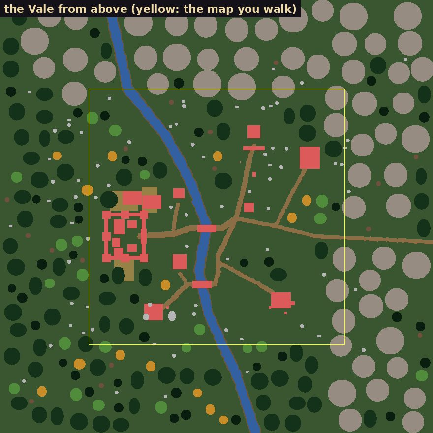

*The overland from above, the walked map in yellow. Grey discs: mountains. Dark green: groves and pines. Light
green: oaks. Orange: autumn trees. Red: buildings and sites. Brown: roads.*

**Scores** (out of 10, at phone size): trees **5**, mountains **3**, roads **5**, the river **5**.

## What's wrong (ranked)

### 1. The mountains are hills on a grid, smaller than the keep

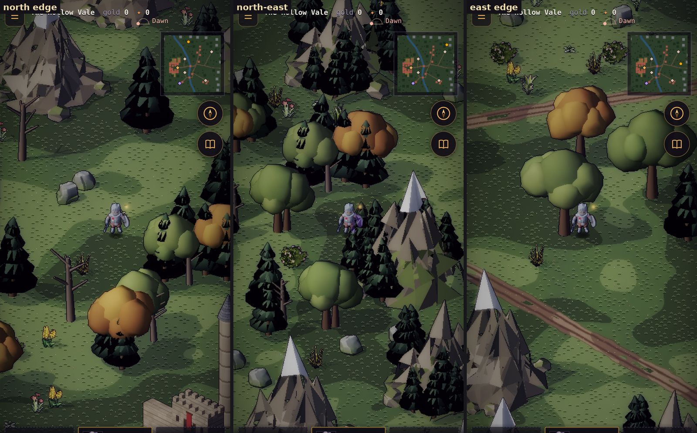

- **They're small.** The tallest mountain sprite is 257 px. Wickham Keep is 310 px, Thornwick's temple 271 px.
  A mountain stands about 1.5 oaks high (oak: 168 px) and 4.5 figures. Beside the keep they read as rock piles,
  not a range that closes the valley.
- **They're on a lattice.** They're scattered on a 15-tile grid with jitter. Nearest-neighbour spacing averages
  29 tiles with a coefficient of variation of **0.10**, so they're nearly evenly spaced. From above it's polka
  dots; in the game, a row of separate cones. There's no ridge, no foothills and no big peak among small ones:
  all five variants are 200–257 px.
- **They sit on the meadow.** 11 mountains stand inside or on the edge of the walked map, straight on the grass
  beside oaks and flowers, one beside the east road. Nothing rises toward them: no scree, no rocks, no pines.
- **The faces are crumpled.** Each crag is a cone with its vertices jittered by a third of its radius
  (`faceted`, `rad * 0.32`), then shaded face by face with a random ±10–25 %. At our size that's a crinkle of
  tiny light and dark triangles, like crumpled paper. It's busier than anything else on screen, and nothing
  like the buildings' clean planes.
- **The snow is a dunce cap.** Snow goes on every face above 58 % of the height, so the top crag comes out as a
  smooth white cone tip.

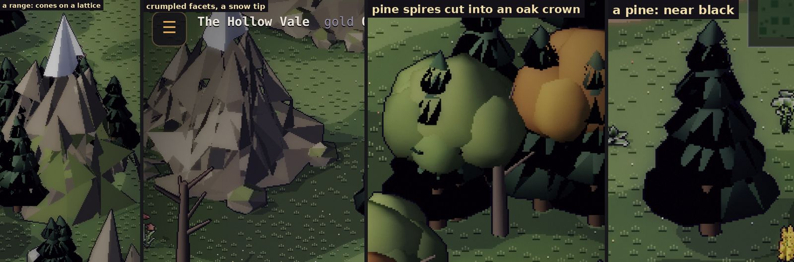

### 2. The pines are black holes, and the groves have pines cut into their oaks

- **Near black.** A pine's mean albedo luminance is **11** (saturation 0.09). An oak's is 53, a grove's 43,
  and the grass's three tones 33–58. Every pine reads as a black hole in the meadow: a silhouette with no lit side.
- **Pines through the crowns.** A grove bakes 5–8 trees in one sprite, within 0.62 units of its centre. A pine
  set inside an oak's crown pokes its dark tiers *through* the crown. At our size the oak wears black gashes,
  and every grove shows them (the third crop above).

### 3. There's no forest in the Vale, and a lumber camp without one

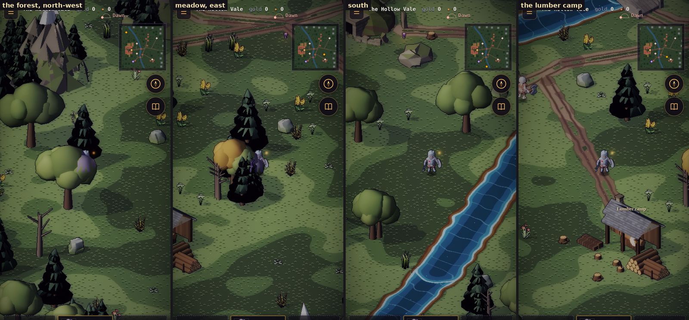

- **Few trees where you walk.** 167 trees on the overland, but only **42** stand on the walked map (17 of them
  groves). The rest are the edge ring. Only **13 %** of the map lies within 8 tiles of a tree, so most frames are
  open grass with one or two trees.
- **No woods.** The forest mask (`fbm > 0.58`) seldom reaches inside the map. The north-west, where a wood
  should hide the barrows road, is three trees and some grass.
- **The Lumber camp stands in open meadow,** felling nothing.
- **Rocks everywhere.** The kit's rocks are scattered at 5 % on every meadow cell: 40 on the map, evenly
  spread. They're the meadow's most common object, so a stone reads as noise, not a place.

### 4. The roads are polylines with hard corners and rail-track ruts

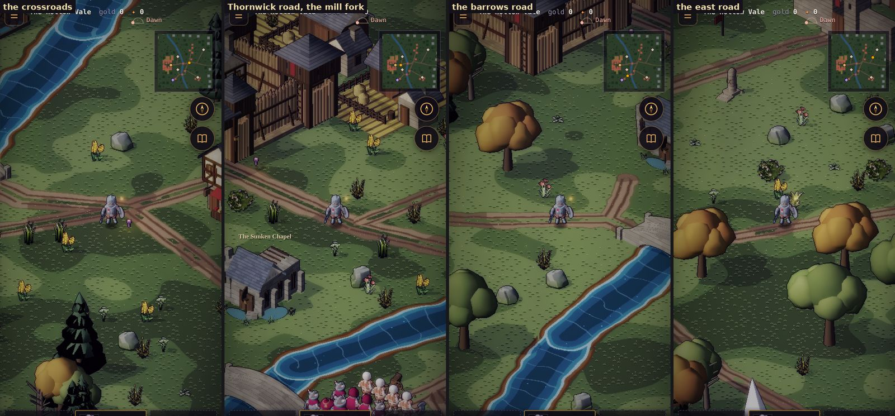

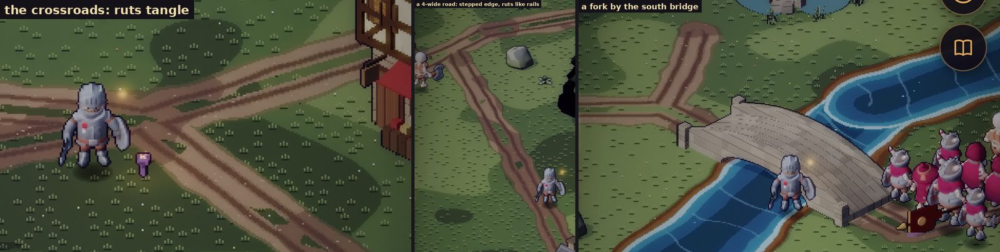

- **Hard corners.** Each road is a straight polyline painted by distance to the nearest segment, so every vertex
  is a sharp elbow. Turns measured: Thornwick road 15°/18°/36°, the barrows road 25°/13°/**77°**/47°. Wagons
  don't turn like that.
- **The ruts read as rails.** Each rut is a dark line plus a half-tone line beside it. At our size that's two
  stripes per wheel, four per road, like a railway.
- **The ruts break at every bend.** Where the nearest point is a segment's end, the painter drops the ruts (the
  `cap` fix, which stopped them curling into rings). Every bend and join now shows a bare patch with the ruts
  cut off.
- **Joins tangle.** Where two roads meet, each road's ruts run on to the join, so they cross in a hash (the
  crossroads, the mill fork, the fork by the south bridge).
- **Stepped edges.** On the 4-wide roads the edge wobble (±0.7 tile) is a third of the half-width. The diagonal
  edge comes out as a staircase of one-pixel steps, chewed by the wobble.
- **No hierarchy.** The king's road east and a cart track to the mill are both dirt with ruts, 4–6 wide.
  Nothing tells you which way is the main road.

### 5. The river is a painted canal, and the mill isn't on it

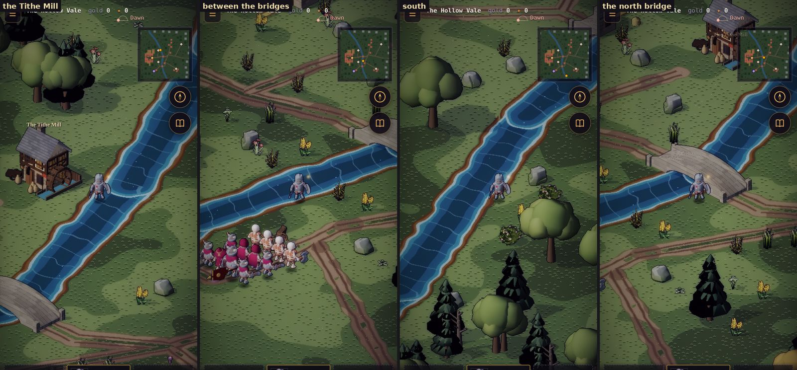

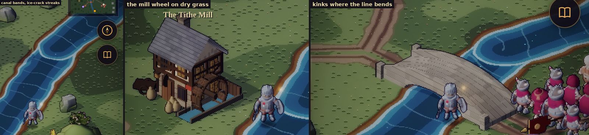

- **Straight runs, kinks.** The river is 8 straight segments of 45–92 tiles, turning 7–30° at each vertex, with
  a small wobble (±1.1 tiles at a short wavelength). At the vertices the banks show notches; between them the
  river runs ruler-straight.
- **One width.** It's 9 wide everywhere: measured across, 8–13 tiles, and that spread is only the angle of the
  run. There are no pools, narrows, ford or bars.
- **Canal bands.** The depth is three tones at fixed fractions of the half-width (0.4, 0.75, 0.9), so three
  stripes run exactly parallel to the banks. Then comes a pale foam line, then a 1.2-tile mud band, the same the
  whole way. It reads as a water slide.
- **Ice cracks.** The flow streaks run on `along × 0.22 + lat × 0.07`, so they cross the river in bands. With
  the noise they draw a cell pattern, like ice or paving, not water moving downstream.
- **Bare banks.** No reeds, stones, ferns or bushes grow along the river on the overland (the undergrowth
  dresses the stream's banks only in the town).
- **The Tithe Mill turns on dry grass.** Its wheel is **10 tiles** from the nearest water, beside a small blue
  trough in its own sprite. A watermill is the one building that has to touch the river.

### Also noticed (out of scope)

- The grass's three low-frequency tones have hard thresholds. At phone size they draw big camouflage blotches
  that compete with everything placed on them.
- The HUD's sky dial reads "Dawn" with `?dev&tod=day`: the light is held but the clock isn't. That's harmless,
  but confusing in captures.

## Proposals

Each is a pure function of the seed, like the rest of `outdoor.js`. Anything placed gets its own stream, so
the sites, the town and the undergrowth don't move.

### Mountains

- **M1. Ranges, not cones.**
  - A ridge spine per edge (a polyline along the north and the east, past the walked map).
  - Peaks placed along it in three sizes: foothill ×1, shoulder ×1.6, peak ×2.4. The big ones go on the
    spine, the small ones toward the valley.
  - The tallest stands about **twice the keep** (600+ px).
  - Massif sprites: two or three peaks baked as one, like the groves, so a range reads as one shape.
- **M2. Clean planes.**
  - Jitter at a tenth of the radius, not a third, and fewer, larger faces.
  - Shade in three bands by facing (lit, side, shadow), as the buildings are, instead of a random tint per
    face.
  - A snowline that follows the facets (faces above it facing up), with a ragged edge, instead of a white
    tip.
- **M3. Foothills.**
  - Between the meadow and the range: scree, the barrows' grey rocks, pines and dead trees, thickening toward
    the slopes.
  - No mountain inside the walked map. The edge belt starts at its border.

### Trees

- **T1. Pines lit:** mean luminance from 11 to about 30, with a lit side, so the darkest tree is still a tree
  (a bake grade in `env.json`, re-baked).
- **T2. Groves without collisions:** place a grove's trees with a minimum spacing by crown radius, pines at
  the back, and re-bake the six groves.
- **T3. Woods in the Vale:**
  - Two or three woods inside the walked map, each a dense core of groves with singles at its edge:
    - the north-west, hiding the barrows road;
    - round the lumber camp, which then stands at a wood's edge;
    - the slopes below the north range.
  - Elsewhere, meadow trees in clumps of 2–4 by fields, roads and the river, not one by one.
  - **Targets:** 25–35 % of the map within 8 tiles of a tree (now 13 %); 40+ groves on the map (now 17).
  - Every sightline wedge kept.
- **T4. Rocks where rock is:** most at the foothills, the barrows and the river's bars; the meadow rate cut
  from 5 % to about 1 %.

### Roads

- **R1. Smooth the roads.**
  - Round every vertex with an arc (or two Chaikin passes) whose radius is at least twice the road's width,
    before `buildIndex`.
  - Bends then have no segment ends, so the ruts run through them and the `cap` gaps go.
- **R2. One groove per wheel:** a single soft darker band per rut (drop the half-tone line). Within a road's
  width of a join, the ruts fade to packed earth, so joins don't hash.
- **R3. Junction aprons:** a packed-earth disc of radius `hw + 1` at each join and fork.
- **R4. A hierarchy:**
  - The east road and Thornwick–crossroads–keep stay rutted and 6 wide.
  - The spurs to the mill, the chapel and the camp become 3-wide tracks: one worn band, no ruts.
- **R5. Softer edges:** a half-tile worn-grass verge with a dithered edge, and the edge wobble scaled to the
  width (±0.3 on a 4-wide road), so diagonals step evenly instead of chewing.

### The river

- **W1. A river's shape:**
  - A smoothed spline through the same points.
  - A slow meander (a wavelength of 40–60 tiles, ±4 tiles).
  - A width that breathes from 7 to 14 tiles, with a pool below the mill and a narrows by the south bridge.
- **W2. Water, not stripes:**
  - Depth by distance from the bank with low-frequency noise (no fixed bands).
  - The flow streaks along the current, as thin broken dashes (mostly `along`).
  - The foam only where the water meets the bridge piers and stones.
- **W3. Banks:**
  - A bank width that varies from 0.5 to 2.5 tiles, with gravel bars on the inside of bends.
  - The undergrowth's stream-bank dressing extended to the overland: reeds, ferns, bushes, stones, and a few
    rocks in the water.
- **W4. The mill on its water:** a mill-race, a narrow second channel from the river to the wheel and back
  (`o.rivers` already takes several), or the mill moved 8 tiles east onto the bank. *Recommended:* the race,
  which keeps the site, its door and its quest spots where they are.

## What it would take

- **Sim** (`src/sim/outdoor.js`):
  - R1, R3, R4 and R5 (paths and widths), W1 and W4 (the river and the race), M1 and M3 (the ridge and the
    foothill belt), T3 and T4 (masks and clumps).
  - The roads and the river change walkability. So:
    - `test/road.test.mjs`, `travel.test.mjs`, `sites.test.mjs` and `journey.test.mjs` re-run;
    - every site's way in and arrival re-checked;
    - the smoke test's overland replay re-recorded, if its hash moves.
- **Renderer** (`src/render/outdoorpaint.js`): R2, R5, W2 and W3's bank shading.
- **Bake** (`tools/actor-lab/buildkit.js`, `env.json`):
  - M1 and M2: new mountain massifs, the largest sprites in the atlas. About 3 massifs at ~650 × 520 in place
    of 5 at ~270 × 240: about **+0.7 MP**, roughly +40 % on the environment atlas. Baking them at half
    resolution and drawing them ×2 would halve that; at that distance it barely shows.
  - T1 and T2: a grade, and a grove re-bake.
- **Tests:**
  - every road vertex's turn under 25° after smoothing;
  - no mountain inside the walked map;
  - tree cover inside the targets;
  - the mill's wheel within a tile of water;
  - the sightlines kept (the existing wedge rules).
- **Captures:** the same 19 frames before and after, and the map from above.

## Order

1. **The cheap, high-impact fixes:** T1 (pines lit), T2 (groves), R1–R3 (smooth roads, single ruts, aprons),
   W2 (water shading), W4 (the mill-race). One change to the bake, one to the painter and one to the layout.
2. **The landscape:** M1–M3 (ranges, planes, foothills), T3–T4 (woods, rocks), W1 and W3 (the river's shape
   and banks), R4–R5 (hierarchy, edges).

## Decisions

1. **The order:** both phases (*recommended*), or phase 1 only for now?
2. **Mountain size:** about twice the keep's height, at about +40 % atlas, or half-resolution massifs at about
   +20 %? *Recommended:* half resolution.
3. **The mill:** a mill-race (*recommended*), or move the mill onto the bank?
4. **Tracks:** make the mill, chapel and camp spurs narrow tracks without ruts (*recommended*), or keep every
   road the same?

## Decided

The recommendations, 2026-10-03:
1. **Both phases.**
2. **Half-resolution massifs,** drawn ×2.
3. **A mill-race.**
4. **Tracks** for the mill, chapel and camp spurs.

## Shipped

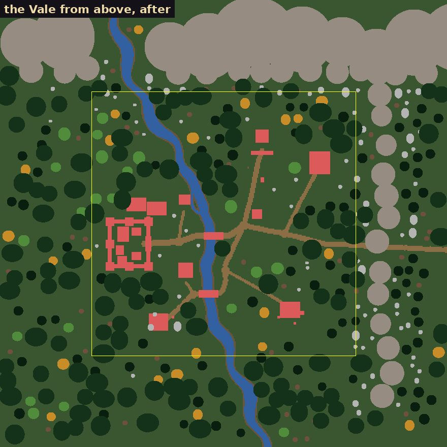

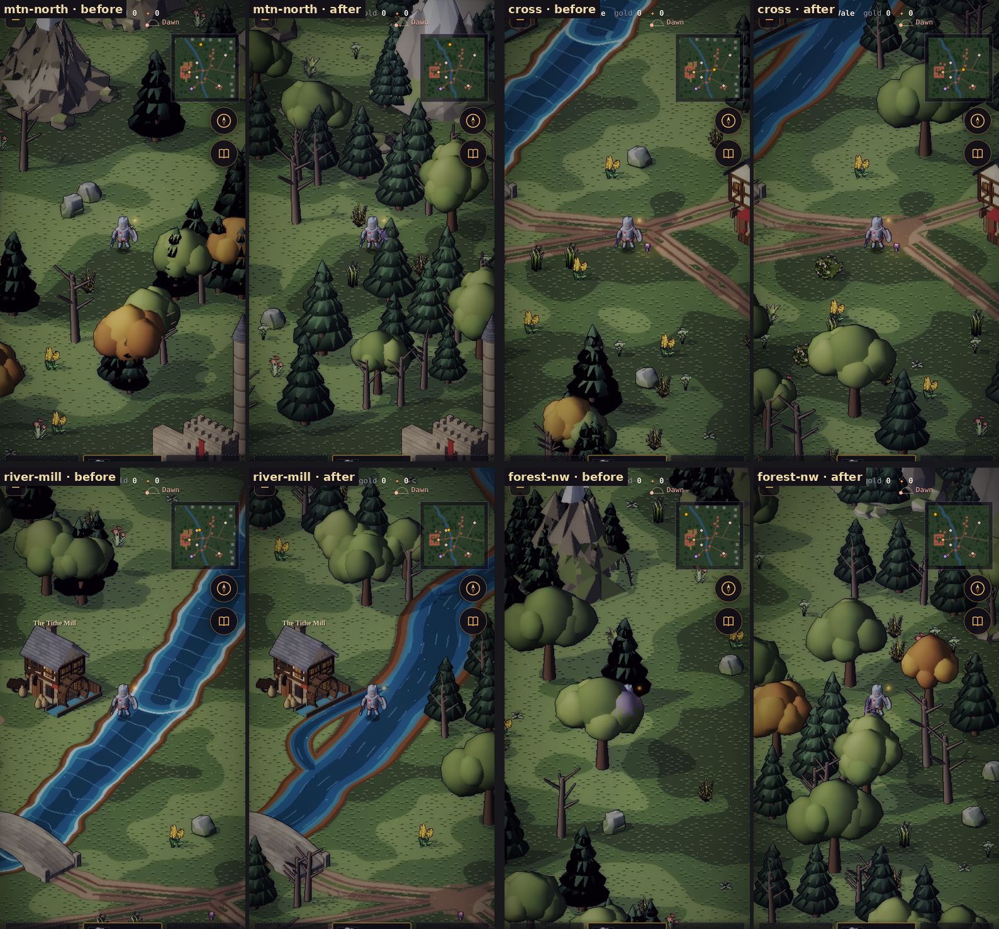

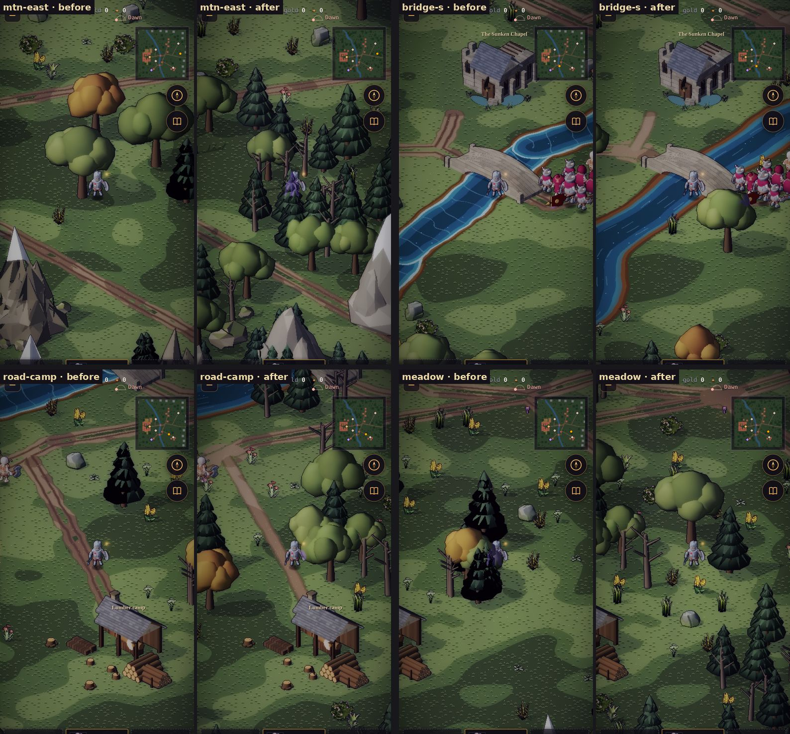

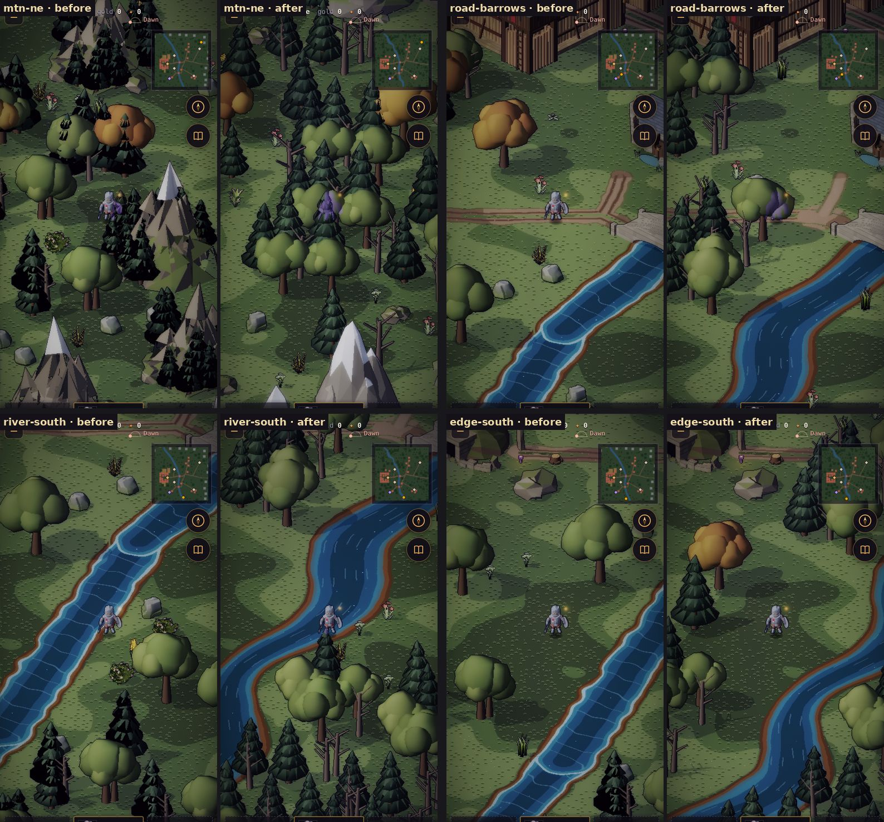

*Each pair: before on the left, after on the right, the same spot at the same light. In the river frames the hero
stands on the water only because the capture put him there.*

### What was found on the way

**The pines' black was a bug, not a grade.**
- `foliage()` (`tools/actor-lab/buildkit.js`) shades each vertex by its height in the crown. It jittered the
  vertices *after* measuring the crown's lowest point, so a vertex jittered below it gave `pow(negative, 0.8)`,
  which is NaN, and that vertex baked black.
- In a pine's drooping tiers that was every tier's lower ring. In the groves it was the pines inside them.
- With `t` clamped, the same colours come out green.

### What changed

- **Trees** (`buildkit.js`, re-baked):
  - The NaN fix above.
  - Grove trees keep their crowns' room (no tree inside another), with the pines toward the back.
- **Mountains** (`buildkit.js`, `env.json`):
  - **Crags:** an icosahedron stretched up and tapered to a point, sunk into the ground (not a cone), jittered
    a tenth of its radius (not a third), tinted a few per cent per face (not ±10–25 %).
  - **Snow:** a ragged snowline that follows the facets.
  - **Massifs:** three, `mountain_massif_A`–`C`, each a great peak among smaller ones, with pines on the low
    slopes.
  - **Half resolution:** baked with `up: 2` (`envlab.js` renders them at half the pixels per unit). The
    renderer scales them ×2 when it slices them (`envSprite`); the depth key stays in tiles.
- **The layout** (`src/sim/outdoor.js`), each part on its own stream:
  - **The north range:** massifs on a spine past the map's edge, overlapping, with shoulders before them and a
    gorge where the river comes out.
  - **The east:** lower mountains further out. An east range twice the keep's height would stand between the
    camera and the Vale.
  - **Foothills:** a belt of the barrows' grey rocks, pines, groves and dead trees.
  - **Woods:**
    - six of them: the north-west, the slopes below the range in two places, round the lumber camp, the
      barrows' far side, and below the mine;
    - groves overlap in a wood's core, and singles thin out at its edge;
    - the old forest mask on top;
    - meadow trees in clumps of 2–4;
    - rocks on the meadow at 1 %.
  - **Undergrowth** now also grows along the river's banks.
  - **Roads:**
    - filleted (`fillet`: an arc at every corner, radius at least twice the width);
    - a road that leaves another starts on it as smoothed, with an apron at the join (`o.aprons`);
    - the three spurs are 3-wide `track`s;
    - the edge wobble is scaled to the width.
  - **The river:**
    - a spline through the old course (`chaikin`), with a 52-tile meander of ±4 and a width breathing from 6
      to 12 (`meander`);
    - both held where they were within 12–36 tiles of the bridges and the mill;
    - every point carries its width;
    - the nearest segment paints a pixel (with 3-tile segments, the first one in reach drew arcs);
    - banks from 0.5 to 2.5 tiles wide.
  - **The mill-race:** a 2.6-wide channel off the river, under the wheel on the mill's +x side, and back.
  - **The barrows road's ranks** stand on the road as it's drawn (`road.js` `xAt`).
- **The painter** (`src/render/outdoorpaint.js`):
  - **Roads:** one soft groove per wheel; a half-tile verge of worn grass dithered into the meadow; a track is
    one worn band; aprons and bends are packed earth.
  - **The river:** depth by distance from the bank with slow noise, no fixed bands; thin broken dashes along the
    current; lighter shallows at the edge, with no foam line.

### Measured

| | Before | After |
|---|---|---|
| Pine sprites: mean albedo luminance (pine_1 / pine_3) | 11.4 / 7.2 | 24.6 / 32.6 |
| Pine sprites: pixels baked black | 55 % / 77 % | 0 % / 0 % |
| Groves: pixels baked black (grove_1 / grove_2) | 19 % / 22 % | 0 % / 0 % |
| Tallest mountain, drawn height (Wickham Keep: 310 px) | 257 px | 630 px |
| Mountains touching the walked map | 11 | 0 |
| Trees on the walked map / groves among them | 42 / 17 | 112 / 49 |
| Walked map within 8 tiles of a tree | 13 % | 30.6 % |
| The kit's rocks on the walked map | 40 | 22 |
| Sharpest road turn at a vertex | 77° | 15° |
| The Tithe Mill's wheel to water | 10 tiles | 0.2 |
| River width, measured across | 8–13 tiles | 6–19 tiles (12 at most along its normal; the rest is the angle of the run) |
| Environment atlas | 2048 × 825, 2.10 MB | 2048 × 1035, 2.50 MB (+19 %; the massifs at half resolution) |

The town atlases came out of the re-bake byte-identical.

**Not done:** gravel bars on the inside of the river's bends, and stones in the water (W3). The varied banks and
the bank undergrowth carry most of it; both can come later.

**Tests:** `test/overland.test.mjs`:
- every road turn under 25°, the joins' aprons, the three tracks;
- no mountain on the walked map, and a great massif in the range;
- tree cover 25–35 % with 40+ groves, and few rocks on the meadow;
- both bridges over water with their ramps on land, and the mill wheel within a tile of water;
- no road under the river except at a bridge, and every arrival reachable from the gate.

The road, travel, sites and town tests pass unchanged.
