# Art critic pass 11 — toward the reference: plan and scores

**Status: Implemented (2026-10-03), 11a–11m.** **The owner's direction (2026-10-03): keep the game's dusky, gloomy
colour tones; the reference is for the detail in the art assets: trees, buildings, vegetation.** So 11m put the
light, the grade and every palette back to the game's own, and kept all the detail. The rubric below scores detail
only; light and colour are no longer measured against the reference.

The owner gave a reference to score against: a frame of a commercial mobile builder's art, a hand-finished 3D
village in autumn. It's another studio's work, so it stays out of the repo: it's kept in the scratch tree, used
only to measure and to look at, and described here in words. The aim is not to copy it but to score close to it
on the things it does well: buildings, vegetation, ground, light and characters.

## What the reference does

- **Light:** a warm low sun from the upper left. Lit tops are near white-gold, there are deep contact shadows
  at every base, and the scene is high-key. There's no murk, and no vignette swallowing the frame.
- **Palette:**
  - an autumn harmony: ochre-green grass, gold and orange foliage, terracotta roofs, cream plaster;
  - small saturated **blue** accents (shutters, banners, a tent) against the warm mass;
  - every material has three or four tones, lit to shadow.
- **Buildings:**
  - big readable silhouettes: round stone towers under conical roofs, a steep main roof, dormers, an
    overhanging timbered storey;
  - every roof shows its individual tiles or shingles, each a slightly different tone;
  - stone walls show their courses;
  - window frames and shutters are picked out;
  - every base is dressed: vines, barrels, crates, flowers.
- **Vegetation:**
  - **Crowns:** made of many leaf clusters, each lit on top and dark beneath, with white **birch** trunks.
  - **Wheat:** fields as volumes of stalks, not flat stripes.
  - **Small plants:** hay, pumpkins, bushes, and flower dots (purple, white) everywhere.
- **Ground:** almost none is left bare. Grass is softly varied, paths are warm dirt with soft edges, and low
  stone walls and fences run between them.
- **Characters:**
  - small beside the buildings: a figure is about an eighth of a house's height (ours: about a third);
  - chunky, with big heads and bright clothes;
  - busy at work: carrying, tending, talking;
  - with **animals** among them (cows).
- **Density:** something on almost every tile, layered in depth.

## Measured (the same pixel metrics on both)

`metrics.py` (scratch): each frame scaled to 600 px wide; the reference's crop is its playfield between the
logo and the ad card; ours is the playfield between the HUD and the party cards.

| | Reference | Our town (4 frames) | Our Vale (4 frames) |
|---|---|---|---|
| Mean luminance | **0.40** | 0.26–0.29 | 0.24–0.28 |
| Highlights (95th percentile) | **0.72** | 0.46–0.54 | 0.44–0.46 |
| Contrast (luminance s.d.) | **0.18** | 0.12–0.16 | 0.11–0.13 |
| Mean saturation | **0.49** | 0.29–0.39 | 0.33–0.42 |
| Colourfulness (Hasler–Süsstrunk) | **0.23** | 0.10–0.14 | 0.09–0.16 |
| Warmth (mean R − B) | **0.25** | 0.03–0.06 | 0.00–0.06 |
| Edge density (detail) | **4.6** | 3.1–5.4 | 2.2–2.7 |

Read plainly:
- Our town has the reference's **detail** already, in the square.
- Both of our scenes are about a third **darker**, with highlights that never get above mid-grey.
- They're **half as colourful**, and **neutral where the reference is warm**.
- The Vale has half the reference's detail.

## The rubric (1–10; the reference anchors the top)

| Area | Reference | Us, now |
|---|---|---|
| Light and colour | 9 | 3 |
| Shadow and depth (contact shadows, lit tops) | 9 | 4 |
| Buildings (silhouette, materials, dressing) | 9 | 5.5 |
| Trees and plants | 9 | 4.5 |
| Ground | 8 | 5 |
| Characters | 8 | 5 |
| Life and density | 9 | 4 |
| **Overall** | **8.7** | **4.4** |

**Target: 7.5 or better overall, no area under 6.** Measured targets on the Vale and the town:
- luminance ≥ 0.36;
- highlights ≥ 0.65;
- saturation ≥ 0.45;
- colourfulness ≥ 0.18;
- warmth ≥ 0.15;
- edge density ≥ 4 on the Vale.

## What stays

- **The pipeline:** baked sprites in a pixel-art deferred renderer at our native scale. We can match the
  reference's light, palette, materials and density, but not the pixel count of a hand-finished 3D render.
- **Figure size** (56 px): the game is played with a thumb on a phone, and the party has to read in a fight. A
  smaller crowd of townsfolk is a later question.

## The iterations (each measured, scored, committed)

1. **Pass 11a: light and colour.**
   - A brighter, warmer **day** (sun up and golden, ambient warmer, with a sky-blue fill).
   - A lighter vignette.
   - Grass and dirt palettes warmer and brighter, with the hard-edged camouflage blotches softened.
   - Bake gains up and desaturation off for trees, rocks and buildings.
   - Thornwick's roofs warm terracotta and its plaster cream, with blue shutter accents.
   - Expected: luminance, warmth, colourfulness and saturation to target.
2. **Pass 11b: shadow and depth.**
   - Contact darkening at every base (sprites and actors).
   - Day shadows less lifted.
   - A lit-top highlight from the normals in the light pass.
3. **Pass 11c: buildings.**
   - Tiled and shingled roofs, procedural in `buildkit.js`: rows of tiles, each its own tone.
   - Coursed stone, lighter window frames, shutters, banners.
   - A round tower with a conical shingle roof on the temple.
   - Base dressing: barrels, crates, flower boxes, vines.
4. **Pass 11d: trees, plants and ground.**
   - Leaf-cluster crowns with stepped light per cluster.
   - A birch, and more autumn gold and orange in the Vale's mix.
   - Wheat fields as stalk volumes.
   - Hay, pumpkins and denser flowers.
   - Grass as soft noise with warm sunlit patches.
5. **Pass 11e: life.**
   - Townsfolk at work with things in hand.
   - **Animals** (cows, sheep, chickens). These need a CC0 animal pack, Quaternius' animated animals, like
     the nature pack: the owner fetches it.

After each iteration: the town and Vale frames re-captured at the same spots, the metrics re-run, the rubric
re-scored, and a before/after sheet added below.

## Iteration 11a: light and colour (shipped 2026-10-03)

*Reverted in 11m, at the owner's direction: the game keeps its own light and grade. The grass's smooth tone blend stays.*

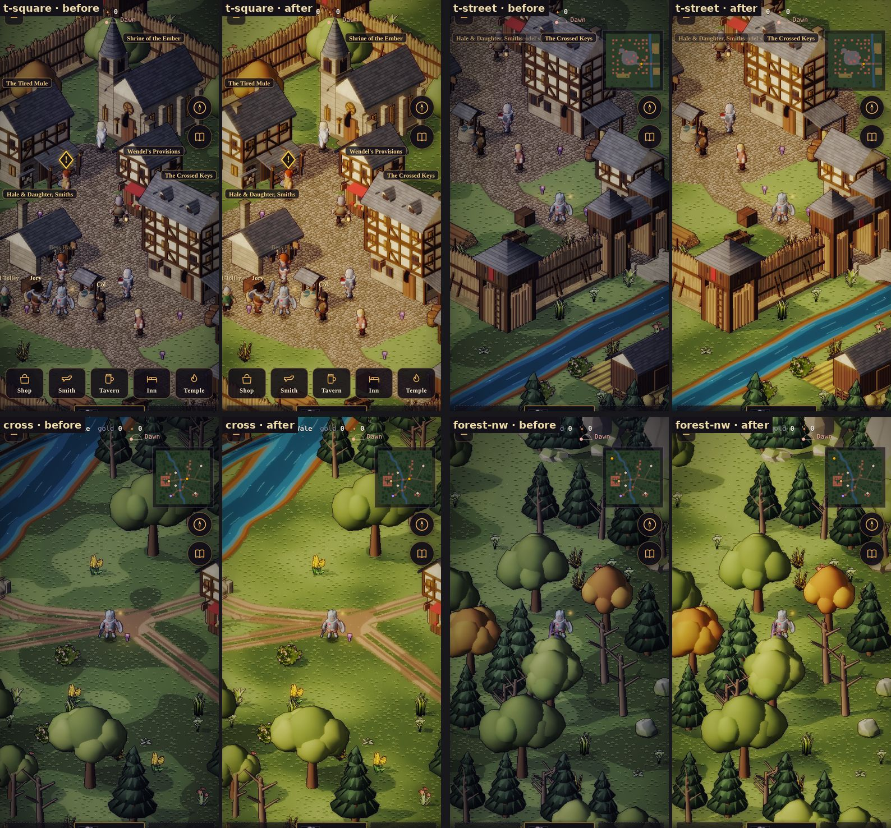

**What changed** (`src/render/daylight.js`, `renderer.js`, `outdoorpaint.js`):
- **Day:** a warm high sun, from [1.02, 0.94, 0.80] to [1.62, 1.38, 1.02], and a warm ambient, from
  [0.44, 0.45, 0.50] to [0.62, 0.57, 0.50]. Shadows lift less (0.45 → 0.3), so they read.
- **The grade is the sky's:** the vignette (`vig`), the drifting violet haze (`haze`) and a new saturation
  grade (`sat`) now come with the time of day:
  - day: 0.32 / 0 / 1.28;
  - dawn: 0.5 / 0.5 / 1.12;
  - dusk: 0.6 / 0.6 / 1.1, keeping its old fixed light;
  - night, and the dungeons: 0.85 / 1 / 1.
- **Grass:** its three tones blend smoothly by the noise, with a little dither. Hard thresholds drew camouflage
  blotches, and in the brighter day they read before anything placed on them.

**Measured** (the same four frames):

| | Reference | Before | 11a |
|---|---|---|---|
| Luminance | 0.40 | 0.24–0.29 | **0.37–0.44** |
| Highlights (p95) | 0.72 | 0.46–0.54 | 0.62–0.69 |
| Contrast (s.d.) | 0.18 | 0.11–0.16 | 0.14–0.19 |
| Saturation | 0.49 | 0.29–0.42 | **0.46–0.60** |
| Colourfulness | 0.23 | 0.09–0.16 | **0.19–0.25** |
| Warmth | 0.25 | 0.00–0.06 | **0.21–0.25** |
| Edge density, Vale / town | 4.6 | 2.4–2.6 / 3.8–5.4 | 2.8–3.3 / 4.3–5.7 |

**Score:**
- Light and colour, 3 → **7**: the lit tops still stop short of the reference's near-white gold.
- Ground, 5 → **5.5**: the blotches are gone; the grass is still a touch lime against the reference's ochre.
- Shadow, 4 → **4.5**: tree shadows now read on the brighter grass.
- **Overall, 4.4 → 5.1.**

**Next:** 11b, shadow and depth.

## Iteration 11b: shadow and depth (shipped 2026-10-03)

*The lift on faces squarely to the sun and the deeper day shadows were reverted in 11m. The contact shade stays.*

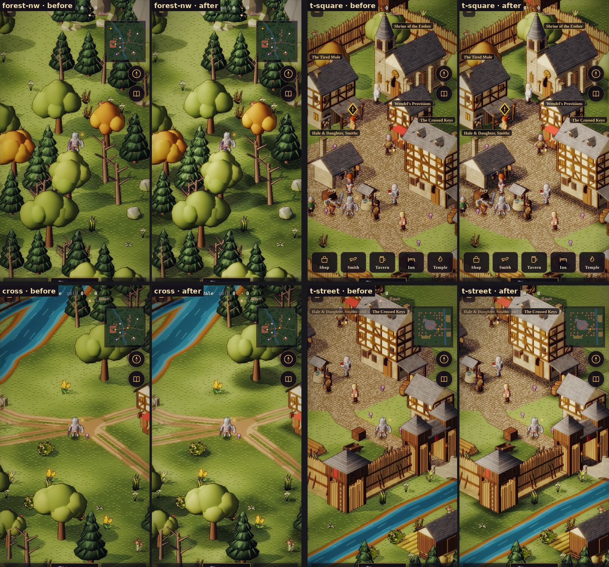

**What changed:**
- **Contact shade** (`outdoorpaint.js` `aoField`): a field at half a tile, from every placed thing's footprint.
  - Under a crown (an ellipse) and round a building, rock or bush (its footprint), the ground darkens: by up to
    42 % under trees, 55 % at a building's base and 25 % at small things.
  - The shade is gone 2.2 tiles out.
  - It's built once a scene and kept off the sim's world (a `WeakMap`).
- **A lift on faces squarely to the sun** (the light pass: + 0.55 × (N·L)⁴), so lit tops go toward white-gold.
- **Cast shadows** lift less by day (0.3 → 0.18).

**Measured** (11a → 11b): highlights 0.62–0.69 → **0.65–0.73** (reference 0.72); contrast 0.14–0.19 →
**0.16–0.21** (0.18); luminance 0.37–0.44 → 0.37–0.45. Saturation, colourfulness and warmth are unchanged.

**Score:**
- Shadow and depth, 4.5 → **6**: things sit on the ground now. The reference's crisp cast shadows under every
  figure and prop are still finer than ours.
- Light and colour, 7 → **7.5**.
- **Overall, 5.1 → 5.4.**

**Next:** 11c, buildings.

## Iteration 11c: buildings (shipped 2026-10-03)

*Colours reverted in 11m (terracotta, cream, blue shutters, the brighter bake). The tiled roof's shapes stay, laid in the old slate.*

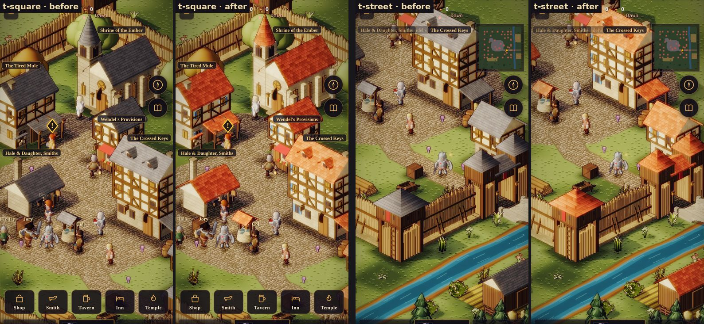

**What changed** (`tools/actor-lab/buildkit.js`, `town.json`; re-baked):
- **Clay-tile roofs:** a new `tile` texture. Rounded tiles in staggered courses, each its own tone (0.66–1.22),
  with a lit lip, a shaded flank and a shadow line under each course.
- **Thornwick's palette:**
  - terracotta tile (#8a4130) in place of blue-grey slate;
  - cream limewash (#d9c9a6);
  - warmer field stone;
  - **blue shutters** (#3b679c), the reference's accent against the warm mass. Every style can set `shutter`
    now; the other towns keep their wood.
- **Thornwick's bake:** gain 0.7 → 0.78, desaturation 0.12 → 0.02, a near-neutral tint. The palisade's
  watchtowers and gate take the tile too.

**Measured** (the town's three frames, 11b → 11c): colourfulness 0.19–0.25 → **0.25–0.30** (reference 0.23),
warmth 0.20–0.22 → **0.22–0.27** (0.25), highlights 0.69–0.73 → 0.70–0.79 (0.72), luminance 0.42–0.44 →
0.42–0.45.

**Score:**
- Buildings, 5.5 → **7**: warm tiled roofs, cream walls and blue shutters read as a lived-in village. Still
  short of the reference: round towers under conical roofs, dormers, and dressed bases (11e).
- Light and colour, 7.5 → **8**.
- **Overall, 5.4 → 5.7.**

**Next:** 11d, trees, plants and ground.

## Iteration 11d: trees, plants and ground (shipped 2026-10-03)

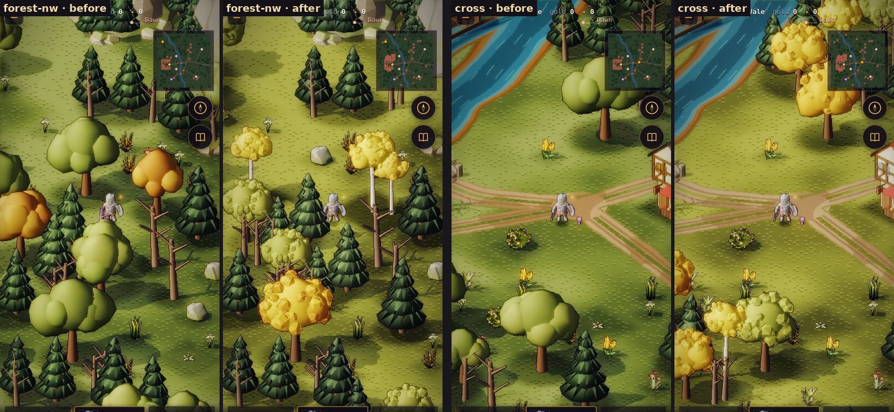

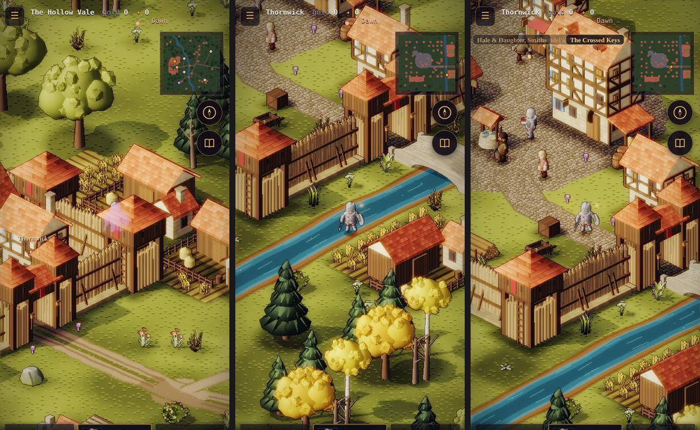

**What changed:**
- **Leaf-cluster crowns** (`buildkit.js` `leafCrown`):
  - A few smooth lobes keep the mass. About 30 faceted clumps sit over its skin: icosahedra with one flat
    normal a face, toned from a dark underside to a lit crown.
  - The leaves move toward the reference's harmony: olive toward gold, amber autumn.
- **Birches** (`birch_1`–`3`, and one broadleaf in five in the groves): slim pale trunks with dark marks and a
  gold crown, as a pair.
- **Wheat on the fields** (`wheat_1`–`3`, `outdoor.js` `wheat`):
  - Tufts of stalks with their ears stand in rows on the furrows' crests, walked through.
  - They're on their own stream, placed before the undergrowth.
  - 64 tufts on the Vale, 120 in Thornwick.
- **The Vale's fields:** pass 10's road rewrite had dropped them; they're restored, with a test that they stay.
- **Grass:** olive toward ochre. Under the warm day the old olive-grey read lime.
- **The day's saturation grade** eased (1.28 → 1.12): with warm leaves and grass it overshot (0.62–0.69).

**Measured** (six frames, Vale and town; reference in brackets):
- luminance 0.41–0.49 (0.40);
- saturation 0.47–0.61 (0.49);
- colourfulness 0.22–0.29 (0.23);
- warmth 0.25–0.32 (0.25);
- highlights 0.68–0.79 (0.72);
- edge density: the Vale's woods 3.5 → **4.1** (4.6); the crossroads 3.0 (open meadow by design).

**Score:**
- Trees and plants, 4.5 → **7**: leafy, faceted, autumn-lit crowns, white birches, standing wheat. The
  reference's hay, pumpkins and flower dots are still missing.
- Ground, 5.5 → **6.5**.
- **Overall, 5.7 → 6.2.**

**Next:** 11e, life: dressed bases, people at work, and animals (a CC0 animal pack, which the owner fetches).

## Iteration 11e: life (shipped 2026-10-03)

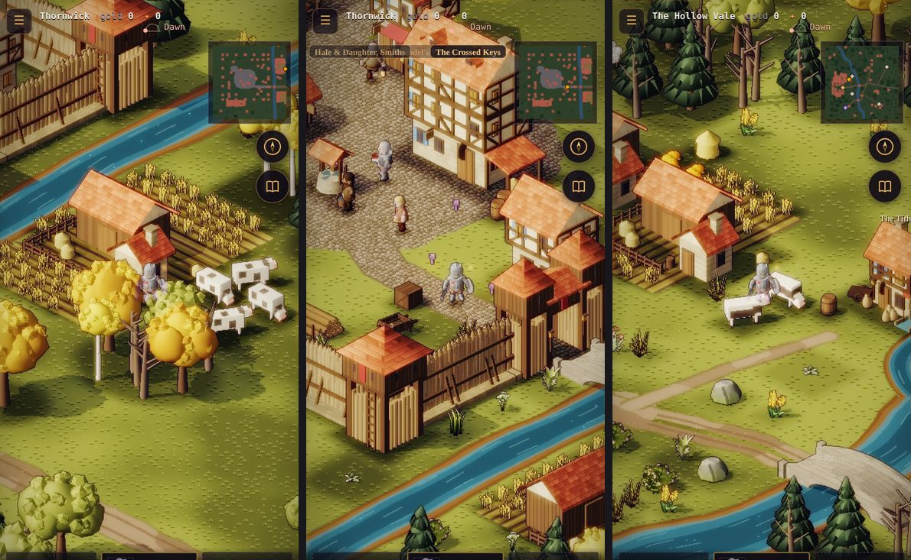

**What changed:**
- **The farmyard**, built in code (`buildkit.js`) and baked:
  - grazing and watchful **cows** (`cow_1`–`3`, black patches over the back);
  - fleecy **sheep** (`sheep_1`–`2`);
  - a few **hens** (`hens_1`);
  - **pumpkins**, round **hay bales** and a thatched **stack** (`pumpkins_1`, `hay_1`–`2`);
  - a flowering **planter** (`planter_1`).
- **Placing them** (`outdoor.js` `herd`, `dress`, on stream 4417, before the wheat and the undergrowth, so
  nothing earlier moves):
  - herds by Thornwick's farms and the Vale's;
  - hay at the mill;
  - a thing or two at the foot of every house's camera-facing walls: barrels, crates, sacks, planters,
    pumpkins, hay, a bucket. Never in the square.
- **The animals stand still:** they graze or look about. Animated herds would need a CC0 animal pack, a later
  decision.

**Score:**
- Life and density, 4 → **6**: farms with herds and hay, doorsteps with barrels and flowers. The reference's
  crowd at work (ten or more people a frame) is still ours to add: unnamed villagers need new baked actors.
- Characters, 5 → **5.5**: the warm light lifts the cast; nothing else changed.
- **Overall, 6.2 → 6.6.**

## Iteration 11g, part one: a round tower and dormers (shipped 2026-10-03)

**What changed** (`buildkit.js`, re-baked): the temple gained a round bell tower under a conical tile roof, the
reference's strongest silhouette; the larger houses gained tiled dormers on the camera-facing roof.

**Score:** Buildings, 7 → **7.5**. **Overall, 6.6 → 6.7.**

## Iteration 11f: the crowd (shipped 2026-10-03)

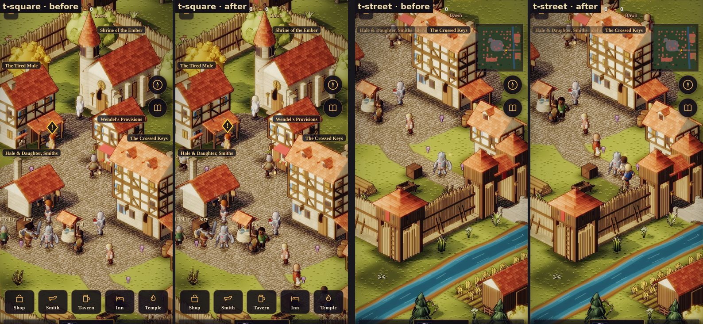

**What changed:**
- **Four villagers** (`variants.json` VL1–VL4, `bake.json` `npc_villager_1`–`4`), recoloured from the KayKit
  bodies with the face kit's presets:
  - a farmhand in blue;
  - a market wife in red with a basket;
  - a drover in green, hooded;
  - a miller in cream and blue.
- **The crowd** (`renderer.js` `crowdOf`, `stepCrowd`): eight of them stroll between open spots on the square
  and the high street, wait a while and go on. Each walk is checked clear first.
  - It's presentation only. The sim knows nothing of them; they're never tapped, saved or replayed.
  - Their walk is the renderer's own seeded generator, so the sim's streams are untouched.
- **They hide behind walls.** A named person shows through a wall as a violet x-ray, so you can find them. A
  passer-by doesn't: the first captures showed violet ghosts in every alley. `stamp` now takes an occlude-only
  test (2) for them.

**Measured** (the square and the high street, before → after):
- people in town: the nine named townsfolk, plus **eight** passers-by;
- luminance, saturation, colourfulness and warmth move by less than 0.01;
- edge density 5.71 → 5.77 and 4.44 → 4.48.

**Score:**
- Life and density, 6 → **6.5**: the square is busy, as the reference's is. Our crowd walks and waits, though;
  the reference's people work (carry, hammer, tend).
- Characters, 5.5 → **6**: the villagers' plain blue, red, green and cream sit well against the warm town. The
  cast's figures are still smaller and less crisp than the reference's.
- **Overall, 6.7 → 6.8.**

## Iteration 11h: figures cast shadows (shipped 2026-10-03)

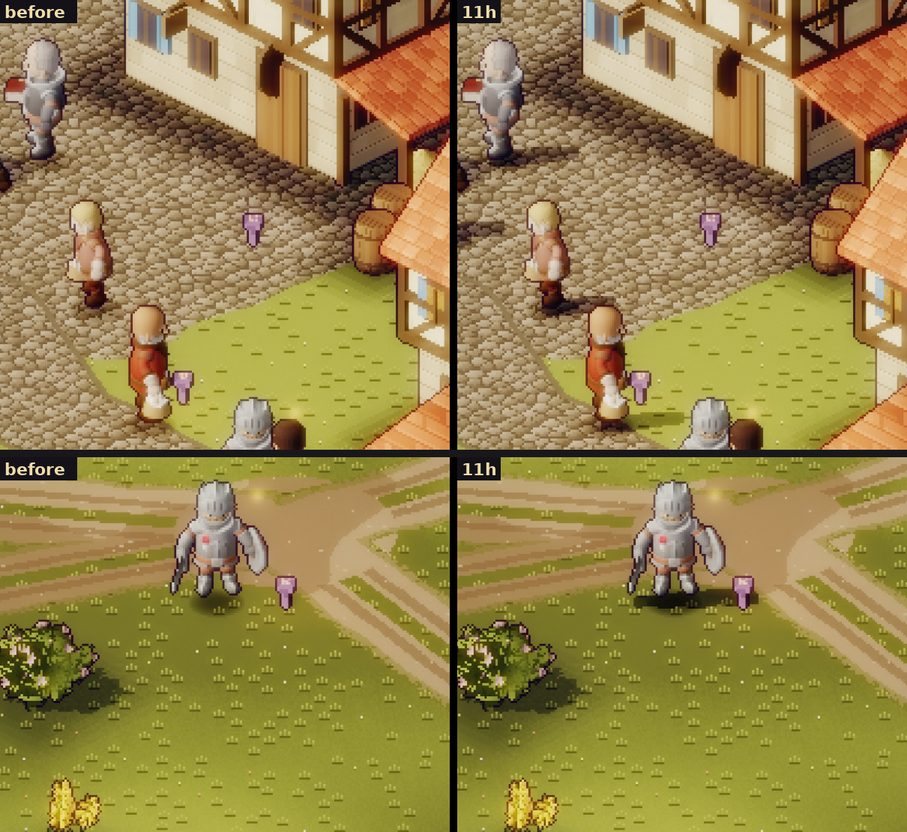

**What changed** (`renderer.js` `castShadow`):
- **Every figure casts its silhouette on the ground**: party, townsfolk, passers-by and foes, outdoors (no sun
  underground).
  - It falls along the baked sun's line, as the trees' and buildings' shadows do: 0.55 px right and 0.08 px up
    for each pixel of height. The trees' run to 0.80; cut short, it stays by its figure.
  - It's thickened two pixels each way for the body's depth. A flat silhouette laid down was a one-pixel sliver.
- **Marked as a baked shadow** (ALB alpha 254), so the time of day lifts it the same way, and a figure standing in
  a tree's shadow never darkens twice.
  - It's deeper than the bake's (× 0.36–0.48 against 0.52). At 0.52 it came out only 15–23 % darker after the
    light pass, a smudge on the cobbles.
- The Fallen and the dissolving cast none.

**Measured:**
- The knight's shadow at the crossroads: luminance 84 → **38**. The bush beside him reads 57, its contact shade
  stacked on the cast.
- Frame metrics move by less than 0.005 (luminance 0.452 → 0.448 on the square).

**Score:**
- Shadow and depth, 6 → **7**: figures stand on the ground in the same light as the trees, as the reference's do.
  The reference's soft shade under eaves and awnings is still richer than ours.
- **Overall, 6.8 → 6.9.**

## Iteration 11i: figures skip the lit-top lift (shipped 2026-10-03)

**What changed:** 11b's lift on faces squarely to the sun also hit the figures, whose baked normals face it. Actor
pixels now take the plain sun term.

**Measured:**
- The steel knight's p95 luminance 199 → 189.
- A red villager's tunic renders (143, 61, 36), a saturated red.

So exposure was not why the cast reads pale. That comes from the white-clad townsfolk and pale skin: a matter of
the cast's palette, not the light. No score change.

## Iteration 11j: Thornwick greens (shipped 2026-10-03)

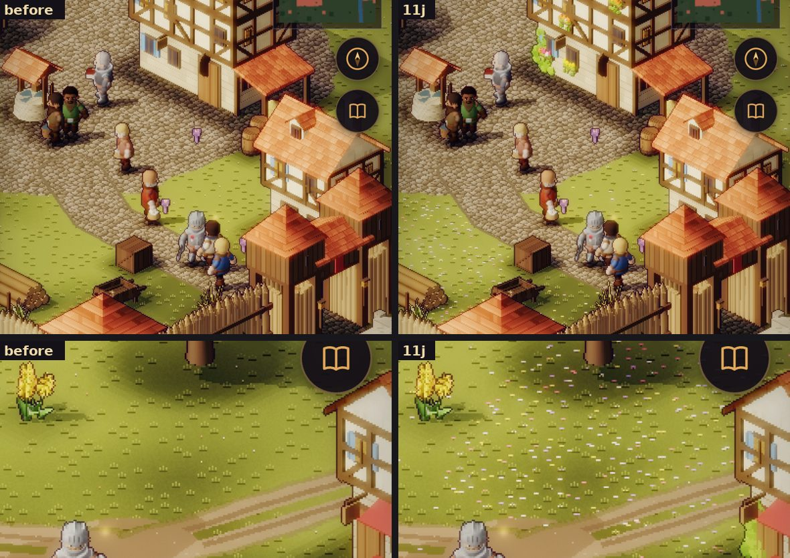

The reference packs flowers and ivy against its walls and dots its meadows with blooms. The square stays clear,
as the nature-pack decision has it: nothing is placed on it.

**What changed:**
- **Flower boxes and ivy, baked into Thornwick's buildings** (`buildkit.js` `flowerBox`, `ivy`; the Vale style's
  `dress`):
  - about half the camera-facing windows carry a box of leaves and blooms, mostly one colour, trailing over the
    front;
  - half the ground storeys' camera-facing faces have ivy climbing from a corner, thinning as it rises.
  - They're on their own stream (`frnd`), so no window's light changes.
  - They're tagged `dress`, so no footprint grows: `envfoot.js` is unchanged and nothing in the sim moves.
  - The other regions' towns are untouched.
- **Meadow flowers** (`outdoorpaint.js` `grass`):
  - dense in patches (a low-frequency field, half the tiles there) and sparse elsewhere (5 %);
  - up to two a tile, each a lit centre between two darker petals;
  - in brighter yellow, white, pink and violet. They had been four muted single pixels on 6 % of tiles.

**Measured** (edge density, reference 4.6): the square 5.77 → 5.83, the high street 4.48 → 4.59, the crossroads
3.02 → 3.20, the woods 4.08 → 4.14. Luminance, saturation and warmth move by less than 0.01.

**Score:**
- Buildings, 7.5 → **8**: flower boxes and ivy break the walls up, as the reference's do.
- Ground, 6.5 → **7**: the meadows flower.
- **Overall, 6.9 → 7.1.**

## Iteration 11g, part two: walled and fenced fields (shipped 2026-10-03)

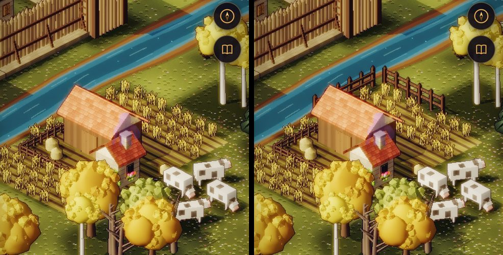

**What changed:**
- **A knee-high dry-stone wall** (`buildkit.js` `drywall`, `drywall_0` / `_90`, re-baked):
  - rough courses of field stone, each its own size, tone and tilt, under a row of laid cap stones;
  - beside the rail fence (`fence_0` / `_90`), which had been baked but never placed. The fence takes 11c's warmer
    grade.
- **Each field's back edges** (north and west, which the camera sees past the crop) get 12-tile runs, in
  `outdoor.js` `bound`:
  - Thornwick's fields are fenced; the Vale's alternate wall and fence.
  - A run is left out wherever it would cross a road, the water or anything placed. The front edges stay open, so
    a field never walls a road off.
  - The runs are placed after the herds and before the wheat, which grows round them, and they take no draws.
- **Counts:** four runs in Thornwick, two in the Vale. The Vale's fields are hemmed in by the town's walls and
  the farms.
- **Test:** `test/overland.test.mjs`. The fields keep their runs, every run stands on grass or field, and the Vale
  has its dry-stone wall.

**Score:**
- Life and density, 6.5 → **7**: the farms read as worked land, fenced, with herds and hay.
- **Overall, 7.1 → 7.1** (7.14).

## Iteration 11k: the cast (shipped 2026-10-03)

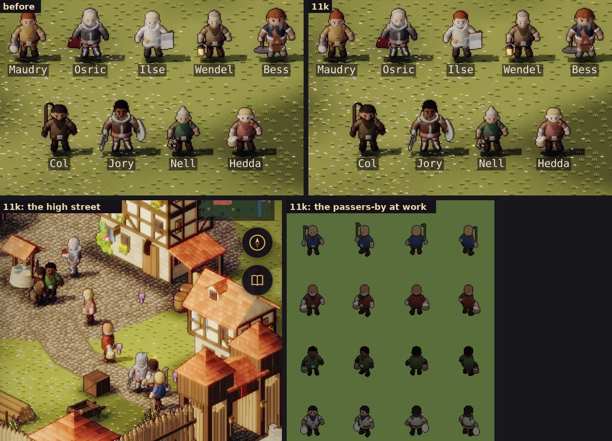

**What changed** (`tools/actor-lab/props.js`, `variants.json`, `faces.json`; re-baked):
- **The passers-by carry their work**, as the reference's villagers do:
  - the farmhand a hoe over his shoulder;
  - the drover a pail;
  - the miller a sack of flour;
  - the market wife her basket, as before.
  - The three new props are built in code like the rest, and carried as Col's whip and Hedda's basket are.
- **Sister Ilse no longer reads as a ghost.** She was chalk white from hair to hem. Canon gives the Grey Sisters
  off-white vestments (world doc §4), so she keeps them, but:
  - in unbleached linen (#d6c9a8) rather than chalk;
  - with a slate-blue hood and cape;
  - with auburn hair in place of flax (her hair isn't canon).

**Score:**
- Characters, 6 → **6.5**: everyone in the square has a trade in hand. Our figures are still smaller and softer
  than the reference's, and they don't work in place (hoe, hammer, carry); that needs new clips.
- **Overall, 7.1 → 7.2** (7.21).

## Iteration 11l: trees among the houses (shipped 2026-10-03)

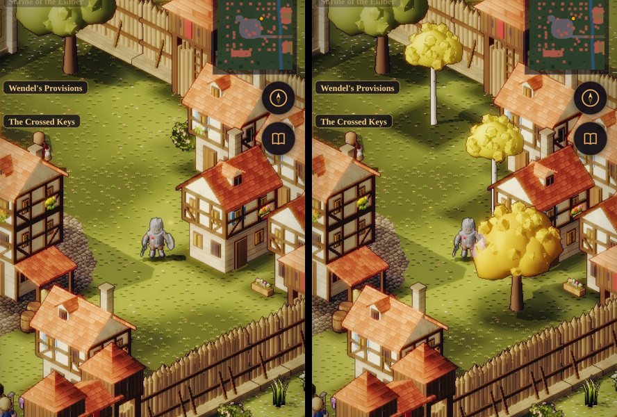

**What changed** (`outdoor.js` `buildTown`): the reference's village stands among its trees; ours stood in a
clearing, with its trees outside the walls.
- Five trees grow among the houses of the back quarters: three birches and two autumn broadleaves, north of the
  temple, between the north houses, and in the west quarter.
- They stand up-screen of the square and never on it, so they frame the services and hide nobody. South of the
  square was left bare: a crown there would cover people in the hub.
- A spot is left bare if anything is there. All five stand in every region's town.

**Tests:**
- the town tests (25), unchanged;
- the browser suite's x-ray check: no named person is drawn behind anything at any part of the day (all 0 %).

**Score:**
- Trees and plants, 7 → **7.5**: walking the quarters, the houses stand among gold and white trees. The square's
  own frame changes little.
- **Overall, 7.2 → 7.3** (7.29).

## Iteration 11m: the dusk kept, the detail kept (shipped 2026-10-03)

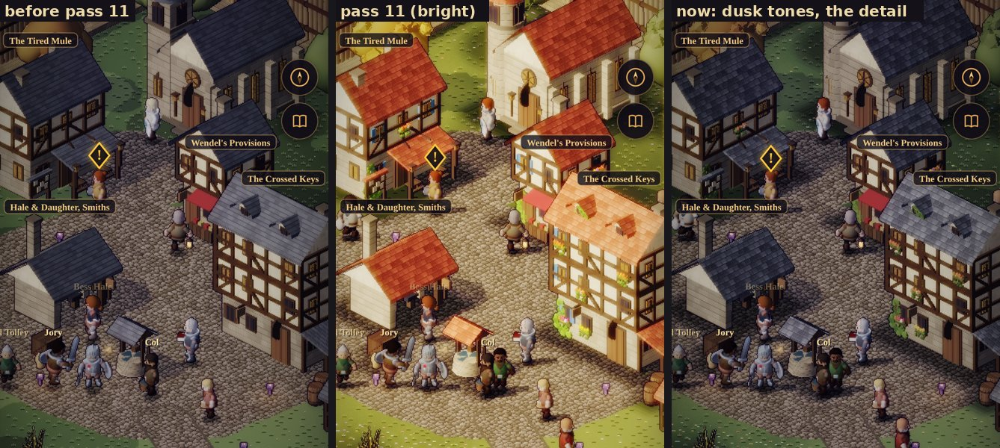

The owner: keep the dusky, gloomy tones; the reference is for the detail in the art assets.

**Put back to the game's own:**
- **Every part of the day's light** (`daylight.js`): the pre-11 sun, ambient and shadow lift.
  - The grade is the old fixed one: vignette 0.85, the full violet haze, no saturation grade.
  - The `vig`, `haze` and `sat` fields stay, set to those values, so a later look can still change them.
- **The light pass:** no lift on faces squarely to the sun (11b, and 11i's exemption for figures with it).
- **Palettes:**
  - the dusk meadow's grass;
  - the meadow flowers' muted colours (the patches stay);
  - the trees' olive-grey leaves and dull amber autumn, the birches in a muted gold;
  - the flower boxes and ivy in darker, duller tones.
- **Thornwick's bake:** `town.json` is byte for byte its pre-11 self (gain 0.7, desaturation 0.12, the warm tint).
  The style's limewash and stone are A's again, with no blue shutters.
- **Pass 11's new props and beasts** take the old prop grade (gain 0.72, desaturation 0.1, the same tint).

**Kept, all detail:**
- the tiled roofs' shapes (rounded tiles, each its own tone, a lit lip), now laid in the old slate blue-grey;
- dormers and the round bell tower;
- flower boxes and ivy;
- leaf-cluster crowns and birches;
- standing wheat, the farmyard's beasts, hay and pumpkins, and dressed doorsteps;
- field walls and fences;
- the trees among the houses;
- meadow flower patches;
- the crowd and its tools;
- contact shade, and figures' cast shadows.

**Measured** (the square and the high street; before pass 11 → 11l → now):

| | Before | 11l | Now |
|---|---|---|---|
| Luminance | 0.279 / 0.267 | 0.447 / 0.435 | **0.263 / 0.244** |
| Warmth (R − B) | 0.059 / 0.043 | 0.254 / 0.249 | **0.054 / 0.036** |
| Saturation | 0.288 / 0.362 | 0.477 / 0.568 | **0.290 / 0.358** |
| Edge density (detail) | 5.40 / 3.78 | 5.84 / 4.70 | **5.38 / 3.91** |

The tone is back where it was, a shade darker for the contact shade and cast shadows. The detail stays: the high
street's edge density 3.78 → 3.91. On the square the dark slate roofs hide some of the tiles' contrast that the
terracotta showed.

## Iteration 11n: Thornwick's brook on the Vale; no tree on a road (shipped 2026-10-03)

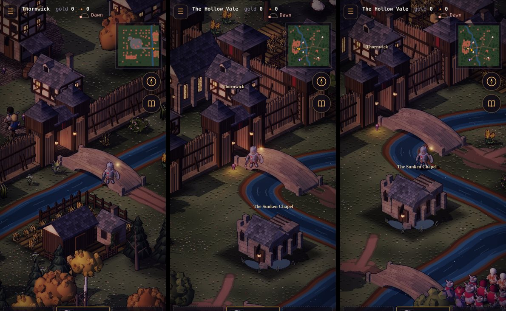

The owner, from a phone at dusk: approaching Thornwick and then entering it, the river and bridge don't agree.
- **Before:** the town scene has a 6-tile stream 12 tiles past its east gate, under an arched bridge 13.5 tiles
  out. The Vale showed the same gate on open meadow.
- **Now** (`outdoor.js` `buildOverland`):
  - The Vale has **Thornwick's brook** at the same place, under the same bridge (`bridge_90`, 13.5 tiles from the
    gate).
  - It leaves the river above the Tithe Mill, runs down past the farm and under the road, then east above the
    Sunken Chapel and back into the river.
  - You arrive on the Vale past the bridge, as you do in the town.

**No tree on a road** (the owner).
- **Before:** inside a wood's core, groves were allowed to overlap by 5 tiles so their crowns close up. That let a
  grove's crown spread over a road edge in a few seeds (3 in 6 seeds).
- **Now** (`offRoad`):
  - No crown (the ellipse in its footprint) may cover road or plaza. A crown may still lean over the river.
  - A grove that would cover a road steps 4 tiles aside (fixed steps, no draws) rather than vanish: 41 groves on
    the map against 42.
- **Test:** `test/overland.test.mjs` checks every tree's crown, in six seeds, on the Vale and in Thornwick.

## Iteration 11o: the beasts, critic pass (shipped 2026-10-03)

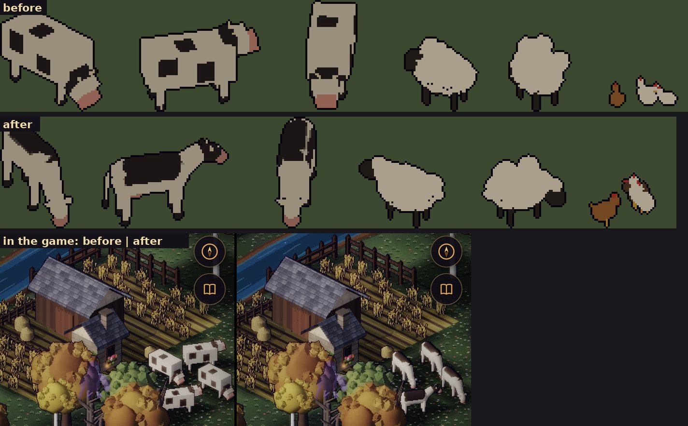

The owner: the animals are too blocky.

**The critique** (the bake at ×5, and in the game at day and dusk):
- **The cows were bricks:** a box body with square patches stuck on proud of the hide, a cube head straight on the
  body with no neck, and posts for legs. Head-on, a cow was a block.
- **The sheep's fleece read well, but not the rest:** a black cube of a head and posts for legs.
- **The hens were a few facets each,** too small to read as birds.

**What changed** (`buildkit.js`; re-baked):
- **Cows:**
  - a barrel of a body (a capsule, a little deeper than wide) with hips and an udder, and a neck to a tapered head;
  - a pink muzzle, ears out to the side, small curved horns, and on some a dark head with a white blaze;
  - tapered legs on dark hooves, and a tail hanging to a tassel.
  - **The patches are painted into the hide:** a texture of blobs, each a few overlapping ellipses so its edge is
    irregular. Three sit along the spine, which the camera sees most, and four round the flanks. Colouring
    vertices or faces smeared the patches, or striped them along the capsule's long faces.
- **Sheep:** a finer fleece of curls, a larger dark wedge of a face with ears and a woolly topknot, thin legs, and
  a tail.
- **Hens:** teardrop bodies with a cocked tail, a head with comb, beak and wattle, and legs; some pecking; a
  quarter larger.
- **Herds that never placed:**
  - Thornwick's sheep pasture lay in the forest ring, so no sheep ever stood there. They now graze between the
    north field and the road: 5 sheep.
  - The Vale's cow pasture never placed a cow, and the new brook runs through it. The cows now graze on open grass
    between the mill track and the river: 4 cows.
  - The fields' walls are now placed before the herds, which graze round them.

## Where it stands, and what's next

Scored on detail only (the owner's direction); light and colour are the game's own and no longer measured against
the reference.

| Area | Reference | Start | Now |
|---|---|---|---|
| Light and colour | — | — | the game's dusk, kept |
| Shadow and depth | 9 | 4 | 6.5 |
| Buildings | 9 | 5.5 | 7.5 |
| Trees and plants | 9 | 4.5 | 7.5 |
| Ground | 8 | 5 | 7 |
| Characters | 8 | 5 | 6.5 |
| Life and density | 9 | 4 | 7 |
| **Overall (detail)** | **8.7** | **4.7** | **7.0** |

Every area is 6.5 or better. What's left, by what it would buy, all of it detail:
- **Characters (6.5 → 7.5): work in place.** The reference's villagers hoe, hammer and carry; ours walk and wait
  with their tools in hand. Short work loops (hoe, hammer, sweep, carry) mean new clips in the actor bake for the
  KayKit bodies. It's the largest remaining gain, and a bake and animation change, so it's the owner's call.
- **Shadow (7 → 7.5): shade under eaves and awnings.** The reference's roofs throw a soft band of shade down the
  wall below them; ours light walls evenly to the eaves. It's a bake-side occlusion term in `envlab.js`.
- **Ground (7):** worn earth round doors and the well, where feet go.
