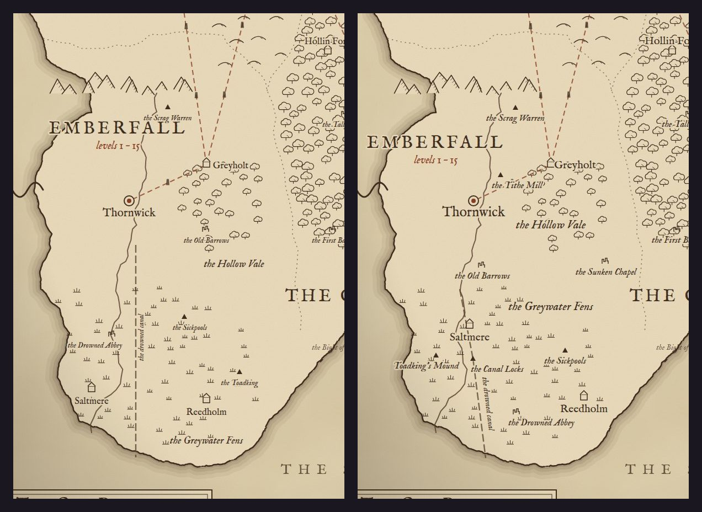
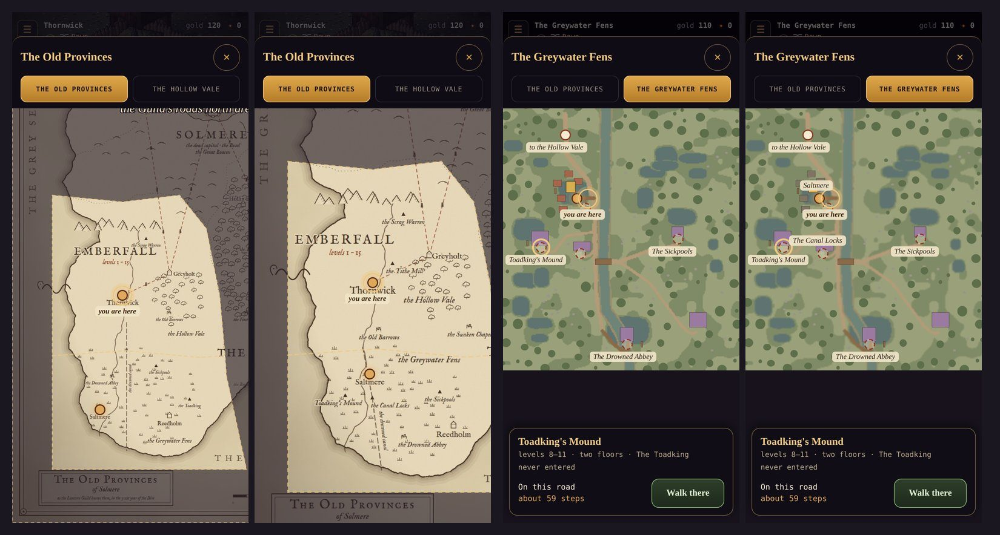
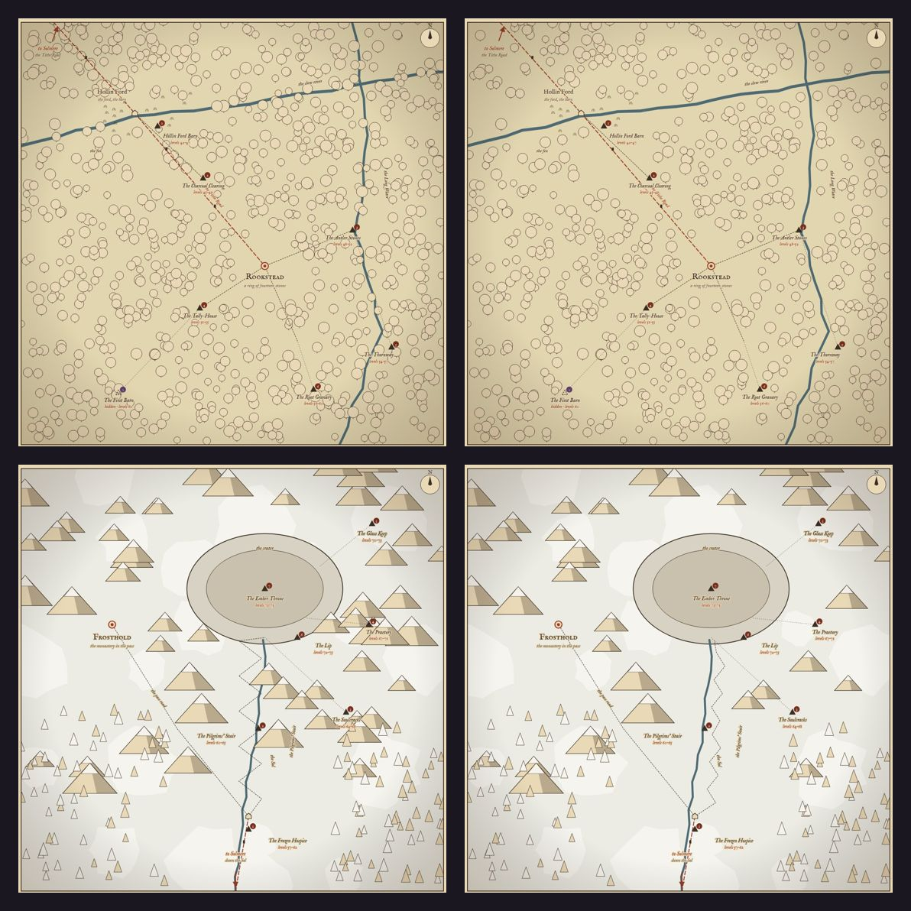
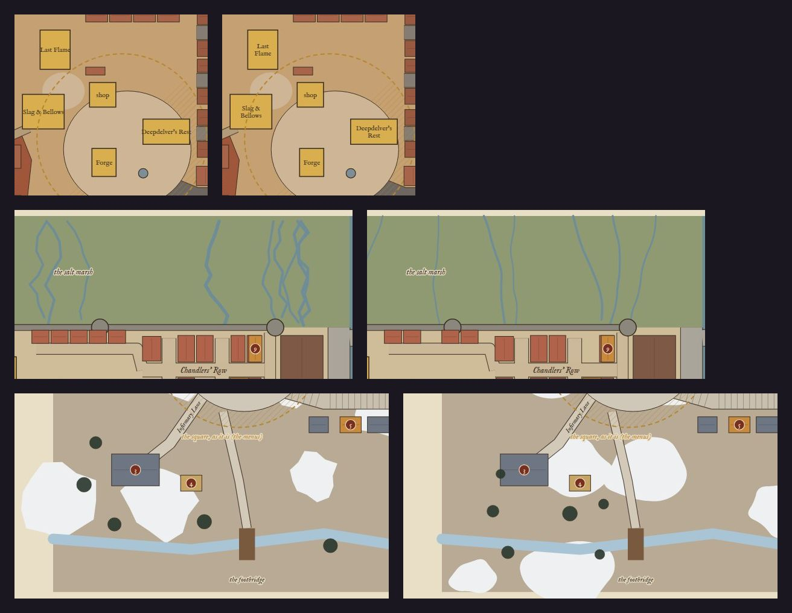

# Art critic pass 12: the maps

**Implemented (2026-10-10).** The owner: *"Run an art critic pass on all the maps."*

Every map the project draws was looked at as a player would see it, as a reader of the docs would, and against the game
itself. The pass also covers the in-game World map that uses them (`src/ui/worldmap.js`).

The maps:

| Map | Drawn by | Where it's seen |
|---|---|---|
| The Old Provinces wall map | `tools/worldmap/draw.mjs` | `docs/img/world/old-provinces.jpg`; **in the game**, the World map's first tab |
| The five region overlands (the Reach, Solmere, the Tidemark, the Greenwood, the Heights) | `tools/worldmap/overlands.mjs` | `docs/img/world/overland-*.jpg` (proposal sheets) |
| The five street plans (Ashgate, Tollhaven, the Lamphall, Rookstead, Frosthold) | `tools/worldmap/streets.mjs` | `docs/img/towns/streets-*.jpg` (proposal sheets) |
| Thornwick's map, and the shipped scenes' bare minimaps | `tools/worldmap/minimap.mjs` | `docs/img/towns/`; **in the game**, the World map's land tab (`assets/maps/`) |
| The region towns at one scale | `tools/worldmap/towns.mjs` | `docs/img/towns/town-plans.jpg` (a decided proposal's sheet) |

The dusky, gloomy tones were kept (the owner's standing direction). No palette moved except the Fens' houses.

## What was wrong

Ranked by how much each one hurts.

1. **The wall map's Emberfall wasn't the game's.**
   - The Fens were drawn upside down:
     - Saltmere at the far southern shore and the Drowned Abbey to its north;
     - in the game, Saltmere is the first thing south of the Vale's canal road, and the Abbey is the Fens' far south.
   - The Old Barrows stood east of Thornwick; the game puts them south.
   - Three open sites weren't on the map at all: the Tithe Mill, the Sunken Chapel and the Canal Locks.
   - The World map now shows this map in play, so a player could follow it the wrong way.
2. **In play, the wall map's words were too small to read.**
   - At the 1.7× zoom the World map shipped with, a site's name came out at **7.7 px** on a 390-wide phone, and a
     town's at 9.4–11.6 px.
   - The rule is 11 px and over (AGENTS.md, UI).
3. **The overlands' scattered marks covered their own words, roads and rivers.**
   - The Greenwood's oaks stood in the slow river and on the Tithe Road, and pressed against the names.
   - The Heights' peaks sat on the Soulcracks' and the Praetory's names, and on the crater's rim.
   - The Reach's slag rocks were confetti through the labels (one on the dead volcano's flank). Its hand-placed hills
     sat on the Ninth Vault's name.
   - The Pilgrims' Stair zigzagged back and forth across the Sol ten times.
4. **Plain errors on the overlands.**
   - The Tidemark's Gullwick stood in the sea, past the coast.
   - The Tidemark's coast was a ruled sawtooth.
   - Solmere's Mere and its mud flats were two perfect ellipses, a diagram rather than a lake.
5. **Names ran out of their buildings on the street plans.**
   - "Deepdelver's Rest", "Slag & Bellows", "Sisters' Hospice", "Frozen Flagon" and "The Paid Toll" were each wider
     than their house.
6. **Marks that read as something else on the street plans.**
   - Tollhaven's salt-marsh creeks were lightning bolts.
   - Frosthold's snow was torn paper (thirteen-sided polygons).
   - The Cinderworks were three black circles in a box: a stove's top.
7. **The World map's land tab dropped names.** A name that would cover another was skipped, so the Fens tab showed
   no Saltmere, no Canal Locks and no Mere Tower.
8. **The minimaps.**
   - Pools and squares had tile-stepped edges.
   - The Fens' stilt houses were the Vale's red brick.

## What changed

### The wall map (1, 2)

*Before (left): the Fens upside down, Saltmere at the southern shore, the Barrows east, three sites missing. After
(right): every open site where the game puts it, the canal from the Vale's road through the Locks to the sea, and
larger words.*

- **Emberfall from the game.** `src/ui/wallmap.js` gains `EMBERFALL`: each overland's tiles to the map's units, north
  up.
  - The Vale's transform lands Thornwick on its place.
  - The Fens' transform makes the Fens' road north meet the Vale's road south.
  - `draw.mjs` builds both overlands with the sim (`createOutdoor`) and draws every open site at its exit. A ruin is
    drawn for the Barrows, the Chapel and the Abbey; a site mark for the rest.
  - Hidden sites stay off the map, as on the World map (the Ninth Milestone, Wickham Keep and the Undercroft). The
    Mere Tower stays in Solmere's Mere, where Wenna's punt goes.
  - Saltmere and Reedholm moved with them (`PLACES`), so the World map's pins moved too.
  - `test/worldmap.test.mjs` holds both towns to their overlands, and the two roads to meet.
- **The words:**

  | Words | Before | After |
  |---|---|---|
  | towns | 21 / 17 | 25 / 20 |
  | sites | 14 | 17 |
  | rivers | 14 | 17 |
  | the Vale and the Fens | 19 | 22 |

  - The World map opens the wall map at least **800 px** wide (two-thirds of its own size), not 1.7× the sheet.
  - In play at 390 px:

    | Words | Before | After |
    |---|---|---|
    | a site's name | 7.7 px | **11.3 px** |
    | a town's name | 9.4–11.6 px | **13.3–16.7 px** |
    | the fog's words | 20–22 px | **24–27 px** |

  - At 360 px the same 800 px floor holds them.

### The World map in play (2, 7)

*Pairs, before and after, 390 × 844 on the manual clock: the Old Provinces tab opened in Thornwick, and the Fens tab
with Toadking's Mound picked.*

- A name on the land tab tries four spots before it's dropped: below its pin, above, right, then left.
- On the Fens tab, dropped names went from **3 to 1**. Saltmere and the Canal Locks are back. The Mere Tower's name
  still gives way: its pin is under "you are here" on Saltmere's boardwalk.

### The overlands (3, 4)

*Top: the Greenwood, before and after: the river, the road and every name clear of the oaks. Bottom: the Heights,
before and after: no peak on a name or on the crater's rim, and the Stair climbing beside the Sol.*

- **The keep-out.** `overlands.mjs` drops a scattered mark (a tree, hill, peak, rock, reed tuft or ruin) wherever it
  would cover one of these:
  - a word's box, turned with the word;
  - a place;
  - a road, a river or an exit arrow.

  A region can add its own keep-out (the crater's rim, the volcano's flank). The Reach's hand-placed hills yield the
  same way.
- **The marks kept off:**

  | Region | Kept off | Of |
  |---|---|---|
  | The Reach | 16 | 68 |
  | Solmere | 7 | 40 |
  | The Tidemark | 5 | 69 |
  | The Greenwood | 136 | 863 |
  | The Heights | 17 | 173 |

- **The Stair** now zigzags in short flights a few tiles east of the Sol, and doesn't cross it.
- **The Tidemark's coast** is drawn through a Chaikin curve. Gullwick moved onto the beach.
- **The Mere and its flats** are hand-drawn shores (a ragged ring, smoothed), not ellipses.

### The street plans (5, 6)

*Before and after, three rows:*
1. *Ashgate's square, its names fitted.*
2. *Tollhaven's salt marsh, its creeks meandering.*
3. *Frosthold, its snow in drifts.*

- A service's name is fitted to its building: one line, then two, then smaller, down to 9 px.
- The creeks meander (a drift that carries over from step to step, smoothed) and are thinner.
- Snow lies in smooth drifts.
- The Cinderworks are a furnace hall under a roof, with three stacks and their smoke.

### The minimaps (8)

- The ground is drawn a second time through a blur of half a tile, over itself.
  - Pools and the boardwalks lose their stairs; the map's edges stay whole.
  - Thornwick's square keeps its steps: they're the town's own tiles, and the map draws what the game walks.
- The Fens' houses are grey thatch.
- The pins in `assets/maps/*.json` are unchanged (the test checks them against the sim).

## Scores

The axes, each out of 10:
- **truth:** agrees with the game and canon;
- **legible:** reads at the size it's seen;
- **craft:** drawn, not ruled;
- **clutter:** marks don't fight words.

They're judged by eye except where a number is given above.

| Map | Truth | Legible | Craft | Clutter |
|---|---|---|---|---|
| Wall map (as the World map shows it) | 4 → **9** | 4 → **8** | 8 → 8 | 7 → **8** |
| The Reach | 8 → 8 | 7 → 7 | 6 → 6 | 4 → **7** |
| Solmere | 8 → 8 | 7 → 7 | 4 → **6** | 7 → 7 |
| The Tidemark | 6 → **8** | 7 → 7 | 4 → **6** | 7 → 7 |
| The Greenwood | 8 → 8 | 6 → **8** | 6 → 6 | 3 → **8** |
| The Heights | 7 → **8** | 6 → **8** | 6 → 6 | 4 → **8** |
| Street plans | 8 → 8 | 6 → **8** | 6 → **7** | 7 → 7 |
| Minimaps (land tab) | 9 → 9 | 6 → **8** | 6 → **7** | 7 → 7 |

## Left as they are

- **The region towns sheet** (`town-plans.jpg`, `towns.mjs`):
  - The panels are dark, its smallest labels are about 8 px at the doc's size, and every town fills only a third of
    its panel.
  - It's a decided proposal's comparison sheet, read on a desk, and its point is one scale for every town. That's why
    the towns are small.
  - It would need redrawing only if it's shown to players.
- **A site's pin on the land tab** stands on its way in (the exit the game walks into), a few tiles in front of the
  building's block. They're two marks for one place, but the pin is where Walk there goes.
- **The overland and street-plan sheets stay proposals.** Their style (flat fills on parchment) differs from the wall
  map's engraving on purpose: they're plans to build from, not maps a player sees. Each region's in-game map will come
  from `minimap.mjs` once it's built, as Thornwick's and the Fens' do.
