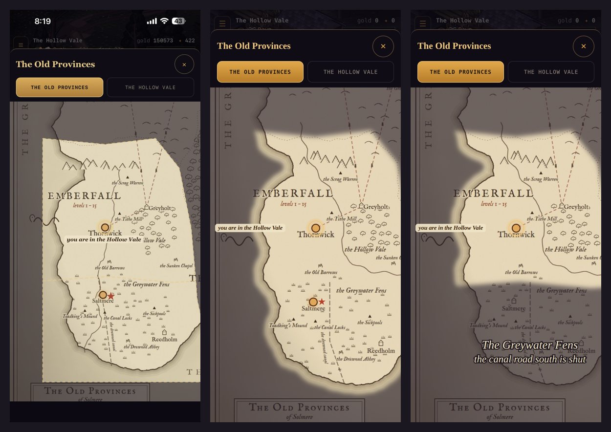
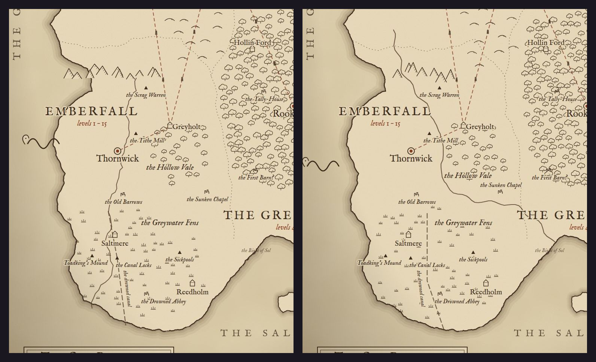

# Art critic pass 13: the wall map in play

**Implemented (2026-10-10).** The owner sent a phone screenshot of the World map's Old Provinces tab, out on the
Vale with the Fens open: *"Do another critic pass on the main world map. Note the mountain range overlapping the
sea."* It follows [pass 12](./art-critic-pass-12.md). The drawing is `tools/worldmap/draw.mjs`; the World map that
shows it is `src/ui/worldmap.js`.

*Left: the owner's screenshot. Middle: the same state after this pass (390 × 844, the manual clock). Right: a new
game, with the Fens not open yet.*

## What was wrong

Ranked by how much each one hurts.

1. **The Vale's north range ran out over the Grey Sea.** `range()` lays its peaks along a line, and that line started
   west of the coast's notch, so the first peaks of the range above Emberfall stood in the water.
2. **The lit land was a die-cut box.**
   - The fog's cut-out was the Vale's and the Fens' polygons: ruled edges across land and sea alike.
   - The Grey Sea off Thornwick was lit in a straight-edged slab, and so was the map's foot under the Fens.
   - A dashed gold line was drawn round every polygon, so it ran between the Vale and the Fens, across open land.
3. **"you are in the Hollow Vale" covered the map's own words.** Below Thornwick's pin, it sat over "Thornwick" and
   "the Hollow Vale".
4. **The water wasn't the game's.**
   - The Vale's river was drawn by hand, west of Thornwick, down to Saltmere.
   - In the game, the river runs east of the town and out through the south-east.
   - The canal was a ruled line from the Vale's road.
5. **The sea-serpent swam across the coast**, its body on the land at Emberfall's west shore.
6. **The Greenwood's oaks crossed Emberfall's border**, so its trees stood at the lit land's eastern edge.
7. **Small:** the Sunken Chapel's name sat on the new river, and the shut Fens' line ran off the right of the screen.

## What changed

*Before (left) and after (right) at the drawing's own size:*
- *the range on land, starting east of the notch;*
- *the Vale's river from the game, east of Thornwick and out to the Bight of Sol;*
- *the canal from the game, from the Fens' edge to the sea;*
- *the serpent out at sea;*
- *the Greenwood's edge clear of the border.*

- **Peaks only on land** (`draw.mjs onLand`): a peak stands only where both ends of its foot, and 6 units past them,
  are inside the coast. **7 peaks** were in the sea; none is now. The rule holds for every range on the map, not just
  this one.
- **The water from the game.** The Vale's river and the Fens' drowned canal are each land's widest river, drawn
  through `wallmap.js EMBERFALL` as the sites are (pass 12).
  - They're clipped to the coast, so the Vale's river reaches the Bight of Sol and the canal reaches the sea.
  - The canal starts at the Fens' edge, where the Vale's road south meets it.
  - The hand-drawn river is gone.
- **The fog lifts to the shore** (`worldmap.js fogSvg`).
  - `draw.mjs` writes the coast it drew to `assets/maps/old-provinces.json` (896 points, 9.7 KB).
  - The fog is a mask: the open lands, clipped to the coast plus 28 units of sea (the shore's own ripple-lines),
    blurred 7 units at the edge.
  - The lit land follows its coast. Where an open land meets a shut one (the Vale and the Fens, or Emberfall and the
    Greenwood), the edge is soft.
  - There's no dashed stroke, so no line crosses between two open lands.
  - Until the coast loads, the lands as drawn are used.
- **"You are here" goes west of its pin on the wall map.** That's open land or sea for Emberfall's towns. The map
  writes each town's name below its mark and its sites' names round it.
  - The map opens scrolled so the whole tag is in view.
  - On the land tab, names keep going below their pins.
- **The serpent** is 37 units further out, clear of the coast.
- **The Greenwood's scatter** keeps 20–26 units east of Emberfall's border.
- **The Sunken Chapel's name** sits above its mark.
- **The shut Fens' words** are 36/31 units (were 40/36), centred 28 units west, so the line fits a 390-wide phone.
  At the World map's two-thirds size they're 24 / 21 px.

## Measured

| | Before | After |
|---|---|---|
| Peaks in the sea, whole map | 7 | 0 |
| Lines crossing open land (fog stroke) | the Vale–Fens split, ~520 units | 0 |
| Lit sea off Emberfall | a slab to the polygons' edge (up to 80 units off the west shore) | 28 units, feathered |
| "you are here" over the map's words | 2 names (Thornwick, the Hollow Vale) | 0 |
| Emberfall's water from the game | 0 of 2 | 2 of 2 |
