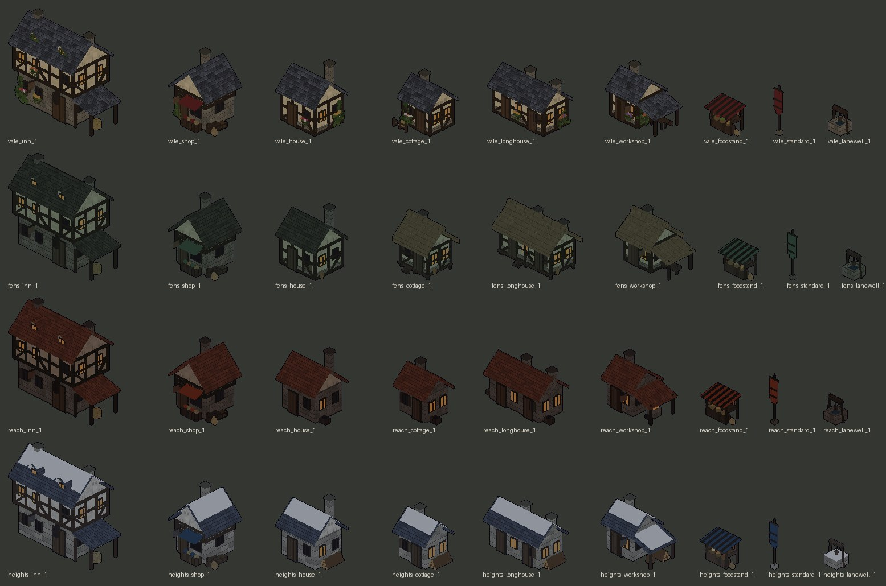
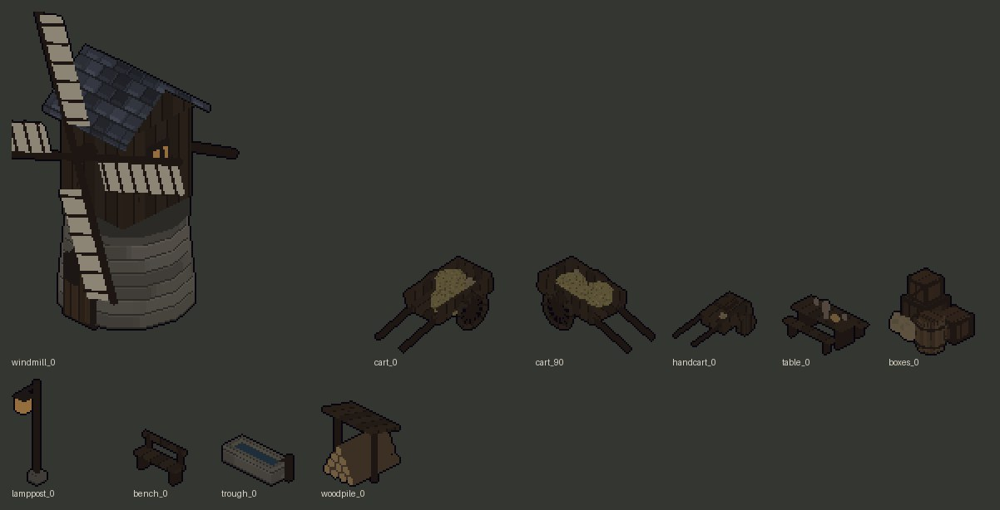
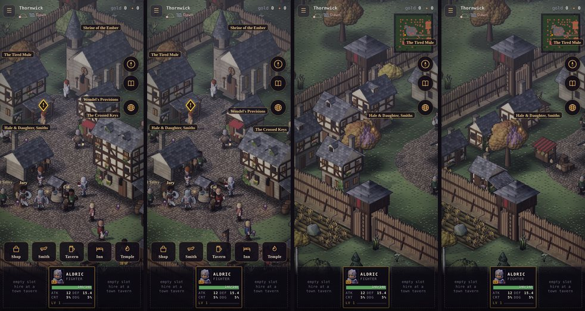
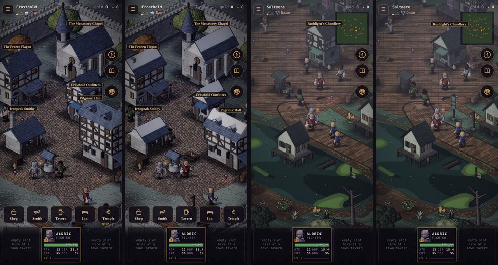
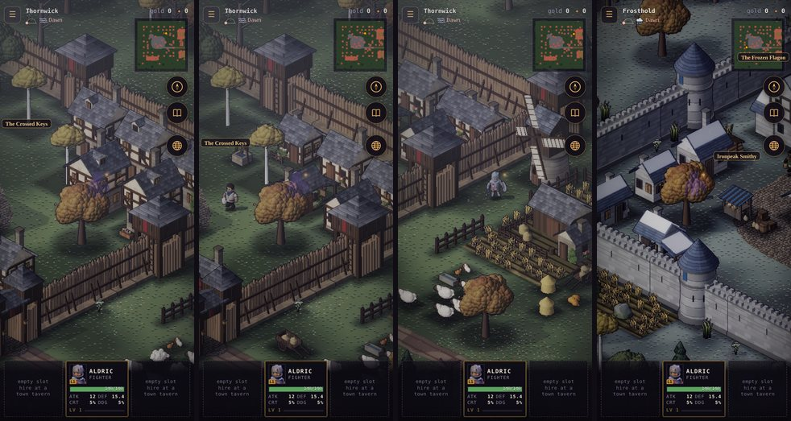

# Art critic pass 14: the town set

**Implemented (2026-10-10).** The owner: *"Create a set of town building assets, each with a style fitting the town
aesthetic. Also build out new common assets like a well, windmill, carts, tables, banners, boxes, open food stand,
etc. Do a critic pass on all these created assets then add them to the town layouts. Make sure placement makes
sense and is not in the way. Inns should be 2 story, homes and shops one story."* It follows
[pass 13](./art-critic-pass-13.md).

Everything is built in code (`tools/actor-lab/buildkit.js`) and baked with `node tools/actor-lab/bake-env.cjs`:
- the region pieces are in `town.json`, one atlas per region;
- the common things are in `env.json`, in the shared atlas.

The dusky, gloomy tones were kept.

## The set

*Rows, top to bottom: the Vale, the Fens, the Reach, the Heights. Albedo at bake size, unlit.*

### How tall

- **Inns are two storeys**, with the rooms upstairs under two dormers. The inn had three storeys before.
- **Homes and shops are one storey.**
  - The house lost its second storey and its dormer. In the Vale and the Fens its walls are framed limewash on a
    stone plinth; in the Reach and the Heights they are the region's stone.
  - The shop is one storey under a deep roof, with a band of framing over the shopfront.
- The tavern and the temple are unchanged.

| Roof top (tiles above the ground) | Before | After |
|---|---|---|
| Inn | 18.7 | **14.7** |
| Shop | 13.4 | **10.1** |
| House | 14.8 | **10.8** |
| Cottage / longhouse / workshop | (new) | 7.7–8.8 |
| Tavern | 15.1 | 15.1 |
| Temple | 23.5 | 23.5 |

### Three more homes, in each region's dress

- A **cottage**: the smallest home, with a door, two windows and a chimney.
- A **longhouse**: long and low, with two doors and two chimneys (two households under one roof).
- A **workshop** with its trade out under a lean-to on its open side:
  - a carpenter's bench and planks in the Vale;
  - a punt upturned on trestles in the Fens;
  - a forge with a glowing coal, and an anvil, in the Reach;
  - a chopping block and a log stack in the Heights.

Each region dresses its homes its own way (`regional()`):

| Region | Walls | Roof | At the door |
|---|---|---|---|
| The Vale | limewash and oak on a plinth, flower boxes, ivy | clay-dark slate | a garden rail, a little hay |
| The Fens | grey plaster on **short piles** (a hand's breadth out of the wet, two steps up) | **reed thatch** with a ridge roll | a net hung to dry, an eel basket |
| The Reach | soot-dark brick | rust tile | a coal bin and its heap, soot up the chimney wall |
| The Heights | thick pale stone | blue slate **under snow** | split logs stacked under the eaves |

Each comes in both turns (`x`: door on +x), so a home can face the lane it stands on.

### The common things

*Windmill, ox-cart (both turns), handcart, trestle table, crates, lamp post, bench, trough, woodpile.*

- **In each region's colours** (`town.json`):
  - the food stall (a striped awning, three baskets of the region's food, things hung at the back);
  - the standard (the region's banner on a pole with a stone foot);
  - the lane well (a stone curb, an A-frame and a winch).
- **Shared** (`env.json`): the windmill, the cart, the handcart, the table, the crates, the lamp post, the bench,
  the trough and the woodpile.
- **The windmill's sails and tail-pole are `dress`**, so its footprint is only the round-house it stands on.

## What was wrong (the boards)

Ranked by how much each one hurts.

1. **Snow fell twice on the Heights' new homes.** The roof laid its snow, and the region's touches laid another,
   which showed as a ragged double edge.
2. **The Heights' inn, shop, tavern and temple had bare slate**, beside homes under snow. Now every gable in the
   Heights carries snow (`roofOver`), and a home gets only one layer.
3. **The trough's water was inside a solid block.** From above it read as a grey slab. It's now four walls and a
   floor round water you can see.
4. **The cart's shafts were a rake**: 0.42 long at a steep angle, longer than the cart. They're now 0.28, resting
   on the ground.
5. **The windmill hardly stood over the homes** (10.4 tiles against a cottage's 7.9 and the inn's 14.7). A mill is the landmark of its fields, so it's now 1.35× (top 10.4
   → 14.0 tiles).
6. **The Fens' thatch was the brightest thing on their board** (`#7a7048`, olive). It's now greyer and darker
   (`#635c44`), the Fens' damp.
7. **The lamp post's lantern was a dot.** It's now 0.06 × 0.08, a third bigger.
8. **Unused bakes** were dropped: a second cottage, a turned stall, a turned table and a turned bench were baked
   but not placed.

## Placement

*390 × 844, the manual clock, before and after:*
1. *the square: the shop and the houses one storey, the inn two, the inn's table by the well;*
2. *the west quarter: a cottage, the food stall and crates at the square's edge.*

*Frosthold: snow on every roof. Saltmere: the Fens' colours and a lamp where the boardwalk comes in.*

*Thornwick's north quarter, before and after (a cottage, a longhouse, the workshop and the lane well). Then the
Vale's windmill by the north field, with the trough among the sheep, and Frosthold's west quarter.*

### Where things go

The same in Thornwick, Ashgate and Frosthold (`src/sim/outdoor.js buildTown`):

| Thing | Where | Why there |
|---|---|---|
| The town's colours | either side of the high street, inside the gate | what an arrival walks in under |
| Lamps | down the high street's south side | the braziers light the north side |
| Food stall, crates | the square's south-west edge, beside the smithy | a market corner, clear of every door's walk |
| Table | out in front of the inn, by the well | the inn spills out |
| Bench | on the temple's forecourt | |
| Handcart | by the shop | |
| Lane well | in the north quarter | the back lanes' own water |
| Woodpile | at a west-quarter home | |
| Carts, trough | outside: one cart off the road by the gate, one at the farm, the trough by the hens | |
| Windmill | by the north field | **the Vale only** |

The town's ten homes were ten houses. They are now:
- 4 houses (the high street's, and three in the quarters);
- 2 cottages;
- 2 longhouses;
- 2 workshops.

The new homes get doorstep things (`dress`) as the houses do.

**Saltmere** is all water, boardwalk and deck, so it gets less:
- on the peat, a cottage at the square's head behind the chandlery, a boat-builder's workshop by the north mere, and
  a longhouse in the north-west;
- on the deck, an eel-stall, a table by the Drowned Eel, crates by the chandlery and a handcart;
- the Fens' colours and a lamp where the boardwalk comes in.

The first try put the workshop south of the square, so its door faced the water. The camera sees only a
building's south and east faces, so a home can't stand south of what it opens onto. The test caught it.

### Not in the way (`test/town.test.mjs`, every region)

- **In every town:** cottage, longhouse, workshop, stall, standard, lamp, table, crates and handcart. **In every
  walled town:** lane well, cart, trough, woodpile and bench. **The windmill:** only in the Vale.
- **Off the roads:** no footprint tile is within a road's half-width of its line.
- **Out of the way:** nothing in the town set comes within **2 tiles** of the straight walk from either arrival in
  the square (where you wake, and the temple's) to any service's door.
- **Every door walked to:** from where you wake, a flood over walkable tiles reaches the tile in front of every
  service's door and every home's door.

| Placed | Thornwick | Ashgate | Frosthold | Saltmere |
|---|---|---|---|---|
| Homes from the set | 6 | 6 | 6 | 3 |
| Common things | 15 | 14 | 14 | 6 |

## Measured

| | Before | After |
|---|---|---|
| Storeys: inn / shop / house | 3 / 2 / 2 | **2 / 1 / 1** |
| Home kinds in a town | 1 (house) | **4** |
| Common town things | 0 | **13 kinds** |
| Heights roofs under snow | 0 of 8 service and home kinds | **all** |
| Town-set pieces within 2 tiles of a door's walk | n/a | **0** |
| Doors not walkable from the square | n/a | **0** |
| `env` atlas | 2048 × 1204 | 2048 × 1231 |
| A walled region's town atlas | 2048 × 669–671 | 2048 × 620–624 (the lower roofs pack tighter) |
| The Fens' town atlas | 2048 × 854 | 2048 × 925 |

## Left as they are

- **The inn's plaque** in Thornwick and Frosthold now sits at the right edge of the frame, over the inn's roof. The
  inn's top is 4 tiles lower, so its plaque falls below the buttons' band, and the band's nudge no longer moves it
  in. It stays whole on screen, and clear of the globe button.
- **The Fens' cottage, longhouse and workshop stand only in Saltmere.** The Fens have no walled town, and Reedholm
  is the Sisters' house, not a village (world doc).
- **The props are the Vale's wood** (`env.json` bakes them in the Vale's style). Their timber reads the same in
  every region, and a region's own touches are on its stall, standard and lane well.
