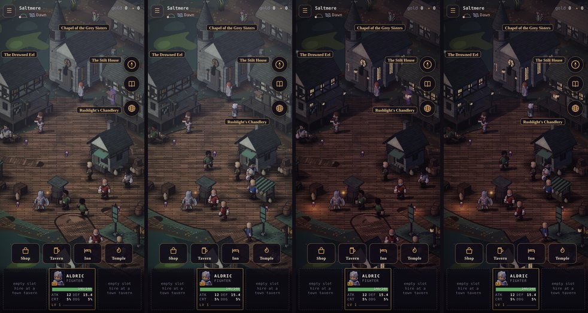
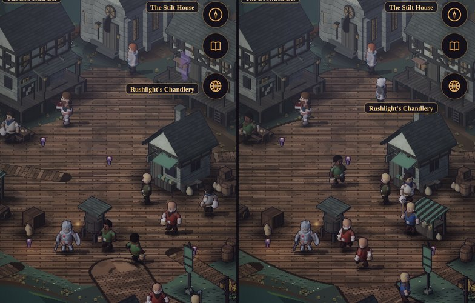

# Art critic pass 15: Saltmere's square

**Implemented (2026-10-10).** The owner: *"Run an art critic pass on Saltmere's square."* It follows
[pass 14](./art-critic-pass-14.md), which placed the town set in Saltmere.

The square was looked at as a player sees it on arriving: the home screen, 390 × 844, on the manual clock, at dawn,
day, dusk and night (`?scene=town&region=fens`). The dusky, gloomy tones were kept.

*Pairs, before and after: by day, then at dusk.*

## What was wrong

Ranked by how much each one hurts.

1. **Rushlight's Chandlery's plaque hung over the Stilt House.**
   - Pass 14 brought the chandlery down to one storey (its roof top from 13.4 tiles to 10.1).
   - Its plaque stayed at 13.4, a storey above the roof, where it sat on the Stilt House behind.
   - The square's menu named the wrong building.
2. **Mother Agnes was a ghost.**
   - Her spot (the chapel + [14, 4]) lay in the Stilt House's footprint, so she stood behind it.
   - The renderer drew her through the walls as a purple x-ray figure, on the home screen, every time.
3. **The boardwalks ran across the square.**
   - The square is one deck, but six boardwalks begin inside it, and the canal road's boardwalk ends in it.
   - A boardwalk's planks lie over everything, so each one laid its own strip of planks across the square at its own
     angle.
   - The canal road's boardwalk left its rounded end on the square like a rug.
   - Measured: **717 of 7,421** points of the square were painted as a boardwalk (9.7 %).
4. **The deck's edge wobbled** like a cobbled square's: a superellipse with noise, and no rim. A deck on piles is
   built; its edge is straight and has a beam along it.
5. **The eel-stall stood off the home screen**, 28 tiles left of the frame's middle (the frame holds ±22). The middle
   of the deck was bare boards.

*Before (left): the chandlery's plaque on the Stilt House, Mother Agnes drawn through its wall, a boardwalk's
planks across the deck's left side. After (right): the plaque on the chandlery's roof, Mother Agnes on the chapel's
deck, the square one floor, the eel-stall by the chandlery.*

## What changed

- **The chandlery's plaque is on its roof** (`WAY_SIGN_TOP.shop` 13.4 → 10.1, `src/sim/outdoor.js`).
  - Its top moved from 288 to 320 CSS px; the other three plaques are where they were.
  - The walled towns' plaques are unchanged (pass 14's set heights).
  - Saltmere's is the one plaque that names a different building if it stays put.
- **Mother Agnes stands on the chapel's deck** (`src/sim/npcs.js`: the chapel + [12, 15]), where the forecourt
  meets the square. She's still "by the chapel" (world doc §3.2). Measured x-ray at each spot tried:

  | Spot (the chapel +) | Drawn as x-ray |
  |---|---|
  | [14, 4] (before) | 100 % |
  | [12, 12] | 9 % |
  | [10, 14] | 9 % |
  | [9, 15] | 59 % |
  | **[12, 15]** | **0 %** |

- **The square is one floor** (`groundAt`, `src/sim/outdoor.js`).
  - Inside a deck square the square's deck is the floor, and a boardwalk lays its planks only outside.
  - The rim stays off a boardwalk's mouth.
  - Where two decks join (the square and the chapel's forecourt), the rim runs only where both end.
  - Points painted as a boardwalk on the square: **717 → 0**.
  - The ground's kind is DECK either way, so walking, footsteps and the replay are unchanged (`SMOKE_OK`).
- **The deck has a built edge.**
  - A deck square's edge has no noise.
  - The painter draws the stringer beam round it (`outdoorpaint.js deck`: the square's outermost band, as on the boardwalks'
    edges).
- **The eel-stall stands by the chandlery**, on the square's east side at (75, 60). It's 15 tiles right of the
  frame's middle, clear of every door's walk and of the boardwalk east.

## Tests

- **`test/town.test.mjs`:** Saltmere's square is one deck:
  - no point of it painted as a boardwalk (fails without the fix: 717);
  - no rim across a boardwalk's mouth;
  - the eel-stall inside the home screen's frame.
  - Pass 14's placement test still holds: off the roads, 2+ tiles from every door's walk, every door walked to.
- **The browser suite (15d1):** on Saltmere's home screen, as you wake:
  - each of Saltmere's people is drawn at most 5 % as x-ray;
  - each can be found under a tap.
  - Without the fix, Mother Agnes is 100 % x-ray.

## Measured

| | Before | After |
|---|---|---|
| Points of the square painted as a boardwalk | 717 of 7,421 | **0** |
| Mother Agnes drawn as x-ray on the home screen | 100 % | **0 %** |
| The chandlery's plaque | 288 px, a storey above its roof, on the Stilt House | **320 px, on its roof** |
| The eel-stall from the frame's middle (x − y) | −28 (off screen) | **+15** |
| The deck's edge | noise, no rim | **built, a beam round it** |

## Left as they are

- **The Stilt House stands half under the compass, journal and map buttons.** The square's frame and the services'
  places are held by tests (every door in the frame, 8+ tiles apart). Its plaque and door are clear of the buttons.
- **The water's pale-green patches** behind the chapel (the marsh's open ground) read as duckweed.
- **The cistern** stays small and dark. It's a rainwater cistern, the waystation's well: nobody drinks the fen (`buildWaystation`).
- **The night** is dark, with a little light from the braziers and the lamp. That's the owner's standing direction:
  dusky and gloomy.
