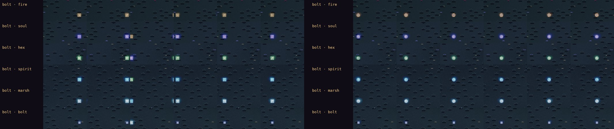

# Art critic pass 16: the whole set, through the review views

**Implemented (2026-10-10).** The first pass made with [the art review](./art-review.md), the views built for the
owner's ask: *"…a bespoke in game rendering view of all game assets and character and enemy NPCs to easily critic
review game art. Same for FX and animations. Use these to more quickly and reliably review and improve game art."*

Every view was captured on the manual clock:
- `env` (all five atlases, 236 sprites over 20 pages) and `props` (40 variants) at dusk;
- `fx` (37 cells) at night at zoom 2, 30 frames at 12 fps, with its strips;
- `icons` (42) and `faces` (22).

The dusky, gloomy tones were kept.

## What was wrong, and what was done

Ranked by how much each one hurts.

1. **The floating numbers, the banners and the camera's jolt ran on the wall clock** (fixed).
   - The renderer draws on its own clock: the frame's `now`. That clock runs slow under `?dev&slow` and is stepped by
     hand under `?dev&manual`.
   - The numbers over a fight, the hit flash, the camera's jolt and the quest marks' bob read `performance.now()`.
     Every banner (wave, boss, level up, defeat) set its end on the wall clock and was checked against the frame's.
   - So on the manual clock the numbers died early or at random: the effects' strips caught them in 2 of 15 frames.
     Stepping 20 s of frames left **0** numbers up. A banner's length depended on when the page had loaded.
   - Now everything timed on screen reads the render clock (`renderer.js clock()`). The same 20 s leave **1–2**
     numbers up, every run (one every 600 ms, each living 900 ms). The wall clock is left only for the bake budget
     and the profiler.
2. **Bolts were square tiles** (fixed).
   - `boltSprite`'s disc test, radius 2.9 in a 7 × 7 grid, took the whole 5 × 5 square and four nubs. At zoom 2 every
     spell in flight read as a little square tile.
   - Now it's a rounded orb (radius 2.5), with a core lifted 60 % toward white.
3. **The fire bolt read a dull tan at night** (fixed).
   - Its albedo is orange, but only its core glowed, in ember (`EGLOW.ember`). Under the night's blue light the rim
     went tan, so it read as a pebble beside the soul, hex and spirit bolts' halos.
   - Now the whole orb glows lava (`GLOW_ID` 5), and it reads as fire.

*`strips.png`, the six bolt rows, before (left) and after (right).*

### In the views themselves

Using them found three faults in the tools, fixed before the pass went on:
- **`faces` listed every foe as "no face, no figure"** (41 empty cards). Foes never sit in a window, and the rogue's
  ranged looks are the renderer's alone. It now lists the 22 a window shows, and the browser test fails if any of them
  lacks a face or a figure.
- **Tall grids captured only their first screen.** `icons` and `faces` scroll inside a fixed box, and a full-page
  shot doesn't see past it. The capture now grows the window to the grid.
- **At zoom 2 the effects ran off the window**, so the marsh-lights and the weapons were blank. The capture now makes
  the window as tall as the grid.

## Left as they are

- **A plain hit's sparks are faint**: a few pale specks, there for two frames. Heavy hits and crits read. A plain hit
  is the most common thing on screen, and it's the right one to be quiet.
- **The crossbow's bolt is a 3-pixel square.** At its speed it reads as a dot in flight.
- **The chest is three times a barrel** (zoom 3, `props`), and bones and sacks are a few pale pixels at zoom 1. The
  chest is the thing a player looks for in a room; the bones and sacks are dressing.
- **Two icons are louder than the rest of the bag**: the tome (magenta) and the rogue's hood (bright green, with a face
  in it). They're KayKit's own colours. A grade for icons would be an `icons.cjs` change and a re-bake.
- **At night every figure goes the same blue-violet.** That's the night's grade, the mood, and the rings and names
  still tell the party from the foes.

## Tests

- **Browser §15c2:**
  - every view lists everything it should, with no page error, and none of the faces, figures or icons is missing;
  - the numbers keep the render clock: after 20 s of manual frames, 1–2 are up. On the wall clock it was 0.
