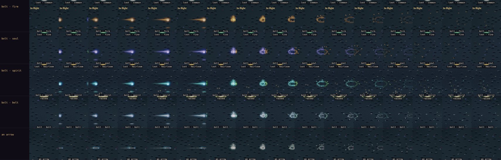
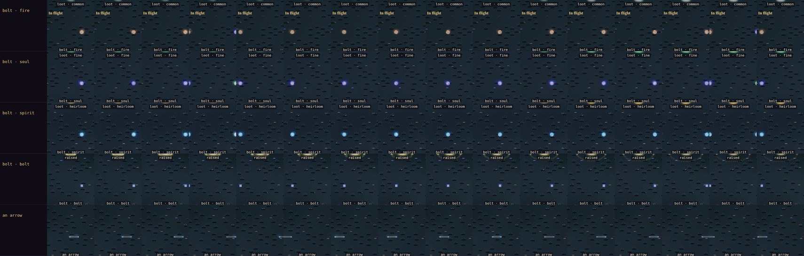
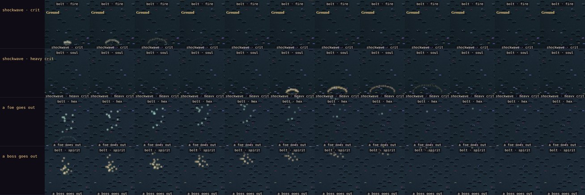

# Art critic pass 17: effects with an ARPG's weight, and ranged fights at twice the reach

**Implemented (2026-10-10).** The owner: *"Ranged combat is too close, double the current target range. And fx should
be a bit more dynamic visually like an arpg."*

The reach is a rule (GDD §5 v1.47, `src/sim/battle.js`): every shooter's reach doubled, shots twice as fast. This pass
covers how it looks. Everything was measured in the art review's effects view ([art-review.md](./art-review.md):
`node tools/capture/stage.mjs --show fx --tod night --zoom 2`, its `strips.png`). The dusky, gloomy tones were kept:
every new effect is light in the emissive plane, in the colour of what made it, and fades fast.

## What was flat

1. **A bolt was a sprite and nothing else.** A firebolt, a hex or a crossbow quarrel crossed the room as a small orb,
   with no trail, no light on the floor and nothing where it landed. The hit's sparks (the same for a sword cut) were
   all there was.
2. **Heavy blows and crits landed on nothing.** A heavy blow jolted the camera; a crit had a few more sparks. Nothing
   touched the ground.
3. **A foe went out quietly.** It dissolved, and that was all.

## What was done (`src/render/fx.js`, `src/render/renderer.js`)

- **Bolts streak and light the floor** (`fx.trail`). The renderer keeps each bolt's last seven points (a `WeakMap` on
  the sim's projectile, presentation only). It draws:
  - a tapering streak of the bolt's colour through them;
  - a halo round the head;
  - an ellipse of the same light on the floor under it, the way a carried flame lights the ground.

  An arrow is a thin pale streak only. At 26 tiles a second (v1.47) the streak is about three tiles long.
- **A bolt bursts where it lands** (`fx.burst`). The renderer notices a bolt gone since the last frame and bursts it
  at its last point:
  - a flash;
  - a ring thrown out round the struck at chest height;
  - sparks in the bolt's colour (a firebolt sheds embers that fall).

  Arrows and quarrels burst at a little over half the size.
- **Heavy blows and crits thump the ground** (`fx.shock`): a ring runs out over the floor from the struck's feet, in
  the blow's spark colour. It's bigger for a heavy crit.
- **A foe's light goes up as it falls** (`fx.soul`): a flash, a ring at its feet, and ten motes of its colour rising
  off where it stood (sixteen for an elite or a boss).
- Every effect reads the render clock, so a capture on the manual clock shows it the same every run.

*After: a firebolt, a soul bolt, a spirit bolt, a crossbow quarrel and an arrow fly four tiles at the game's speed and
land, every frame at 30 fps, at night at zoom 2 (`--fps 30`).*

*Before: the same bolts, sprites only (the old review cell drifted them across the cell, slower than the game).*

*New: a crit's and a heavy crit's shockwave, and a foe and a boss going out (every second frame at 30 fps).*

## Measured

On the effects' strips (36 frames at 12 fps, at night at zoom 2). A pixel counts in a frame when it's 40 over its own
darkest value across the frames, so the grass and the names don't count.

| | Before: the peak frame's lit pixels | After |
|---|---|---|
| Firebolt | 175 | 624 |
| Soul bolt | 159 | 767 |
| Hex bolt | 181 | 789 |
| Spirit bolt | 175 | 883 |
| Marsh-light bolt | 197 | 912 |
| Crossbow quarrel | 125 | 738 |
| A crit's shockwave | — | 1,252 a loop |
| A heavy crit's | — | 2,154 |
| A foe going out | — | 5,147 |
| A boss going out | — | 6,984 |

- A bolt's peak frame lights 3.5–6 times what it did: its burst and its trail.
- **Cost:** the renderer's CPU a frame in a level-9 room at Wickham Keep (390 × 844, the manual clock, 360 frames, two
  runs each): median 1.4 ms before and 1.5 ms after; the 95th percentile 4–6 ms either way.

## In the review

The effects view (`show=fx`) now:
- flies its bolts at the game's speed and lands them, through the game's own path (`stageApi.bolt`);
- has four new cells: a crit's and a heavy crit's shockwave, a foe and a boss going out.

## Left as they are

- **Bolts light only the floor under them.** Real light would need more than the lighting shader's three point-light
  slots, and a change there wants a phone to test on (AGENTS.md: rendering). The painted floor glow reads as light
  in the captures.
- **An arrow's burst is the same white ring as a quarrel's.** A thud of dust might suit it better; it's small and fast
  enough not to jar.
