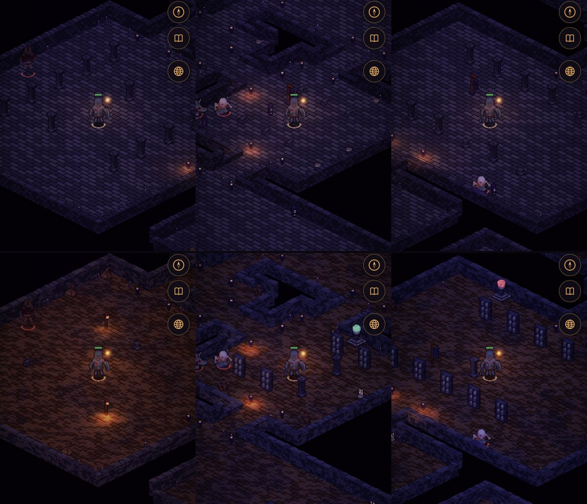
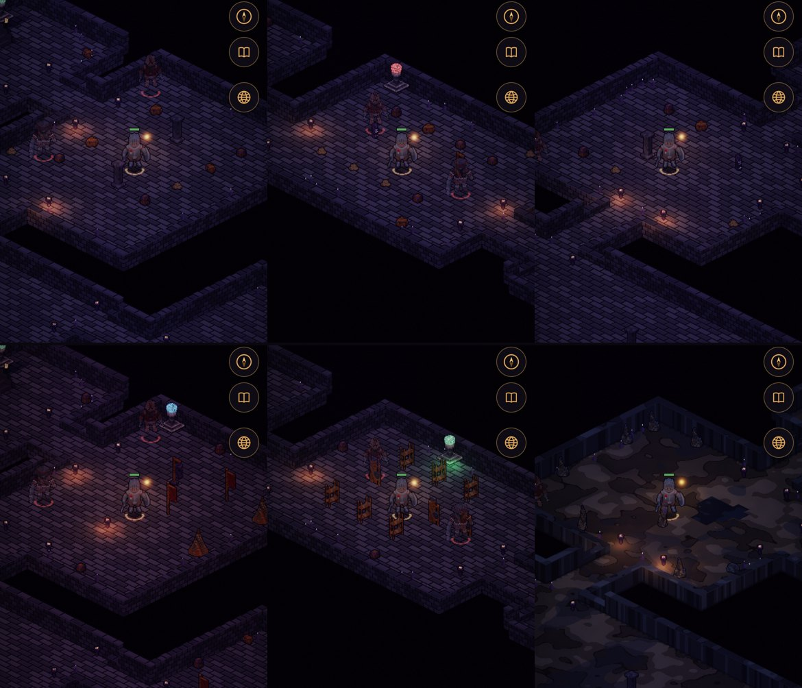
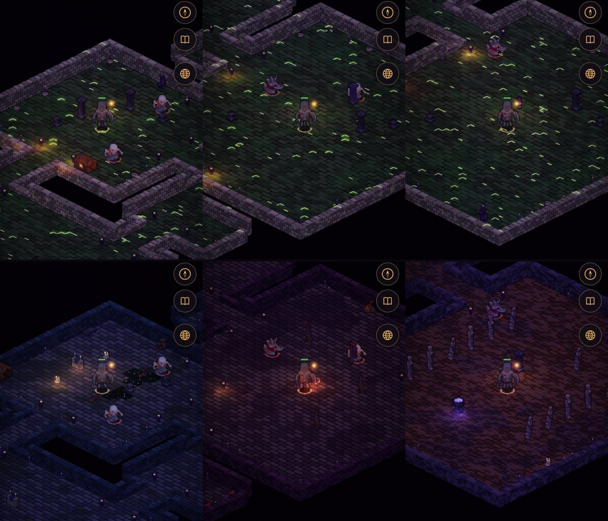
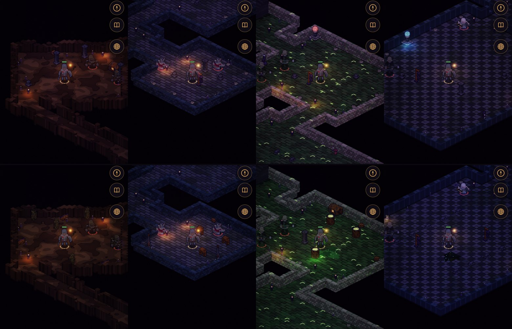

# Art critic pass 18: each dungeon dressed for its place

**Implemented (2026-10-10).** The owner: *"each dungeon should be custom designed for its location in terms of
decorations and art, NPCs and a special boss for each. Eg a crypt should look visually like a crypt or a cave should
look like a cave (pools, stalactites, some boulders). Build off what we have"*, then *"Art, build props in code"*.
This is phase 2 of [one dungeon a level](./dungeons-per-map-proposal.md). Phase 1 gave every dungeon its band and
its bosses; this pass gives every floor its own look. The dusky, gloomy tones were kept.

## What was wrong

1. **Eighteen floors shared four sets of furniture.** A floor was dressed by its foes' family:
   - the Redhand's crates, barrels and bedrolls furnished seven floors, from the Barrow Mouth to the Toadking's Mound;
   - the Ashbound's spires, monoliths and totems furnished five;
   - the chapel's pews and sarcophagi furnished the other six.

   A crypt, a fort's bailey and a cave under it looked alike.
2. **No cave looked like a cave.** No pools, no stalagmites, no boulders, though the owner named all three.
3. **The Sunken Chapel wore the Sickpools' green** on all three floors, a borrowed look (mean brightness 27–28,
   against 14–23 on every other Vale floor).
4. **Nobody stood at a way in.** The world doc gives each of the Vale's dungeons someone at its door; the game had none.

## What was done

**Dressing kits** (`src/sim/world.js DRESS`; `sites.js dress`, floor by floor). Each kit names four things:
- its rooms' layouts (one is drawn for each fighting room);
- the decor it stands against the walls;
- the obstacles it stands out on the floor;
- its pools.

The light's tint is the renderer's (`KIT_TINT`). Floors with no kit (the Mere Tower, the secret sites) are dressed as
before.

| Dungeon | Floor 1 | Floor 2 | Floor 3 |
|---|---|---|---|
| The Old Barrows | *dig*: spoil heaps with picks, lantern posts, a grave broken open; warm | *gallery*: burial niche shelves down both walls, urns, candles; the legion's cold blue | *muster*: weapon racks, the legion's standards; colder |
| Wickham Keep | *bailey*: bell tents, the Company's red banners, a cookfire, stores | *barracks*: two-tier bunks down the walls, racks | *cellar*: a cave, stalagmites, boulders, scaffolding, black still pools |
| The Sunken Chapel | *nave*: pews, the altar, fallen saints, candles, standing water | *the Cult's cut*: a binding circle in the cinders, chain posts, braziers, spoil | *binding*: the bound standing in rows, chains, the violet font |
| Toadking's Mound | *mound*: boats hauled up and turned over, reeds, mud pools | | |
| The Canal Locks | *locks*: windlasses, chains, standing water | | *vats*: the Cult's tubs, lit sick green, sick pools |
| The Drowned Abbey | *abbey*: pews, the altar, saints, candles, black pools | | |

*(A blank cell is the floor before's kit.)*

**Built in code** (`src/render/gsprite.js`, voxels like the rest; the art review's `show=props` lists them).
Twenty-three new props:
- spoil, a lantern post, a niche shelf, urns, candles, a weapon rack, the legion's standard, the Redhand's banner;
- a bell tent, a bunk, scaffolding, a stalagmite, a boulder;
- an altar, a fallen saint, a chain post, a binding circle, one of the bound, the font;
- a boat, reeds, a windlass, a vat.

The lantern, candles, altar, binding circle, font and vat give light.

**Pools** (`world.pools`): shallow standing water painted on the floor, walkable. The rule of no impassable pools in
rooms (v1.29) stands. They're on their own random stream, so nothing else on a floor moved for them. Each kit names
its water:
- the cave's: black and still, a new *still* pool;
- the nave's and the abbey's: bog;
- the Mound's: mud;
- Vat Seven's: sick.

**Floors:** the crypt and cave tile variants, the cave in rock (the *cavern* style). Two new themes: the chapel's
*nave* and the Cult's *cinder*.

**The light:** each kit tints the dungeon's ambient (the shader's own mix, scaled 0.78–1.16 a channel). That's never
brighter, only colder or warmer.

**The keepers** (`npcs.js`, `found` with `entrance`; Ink, baked looks with faces). They stand at their dungeon's way
in, three tiles or more from where you arrive:
- **Tobin Hask**, the sexton, with his lantern and his book;
- **Ned Fallow**, the miller, held for a ransom nobody's paid;
- **Hester Lowe**, the beekeeper, in the chapel's porch.

Each names the floors, and has a word for when their dungeon's boss has fallen.

*The Old Barrows, the same rooms on the same seed, before (top) and after: the dig, the Long Gallery, the Muster Hall.*

*Wickham Keep: the bailey, the barracks, the cave.*

*The Sunken Chapel: the nave, the Cult's cut, the binding crypt.*

*The Fens: Toadking's Mound, the lock halls, Vat Seven, the Drowned Abbey.*

## Measured

On the same rooms (by id) on the same seed, before (526eeb8) and after, 390 × 844 at DPR 2 on the manual clock:

| | Before | After |
|---|---|---|
| Distinct furniture sets across the 18 band floors | 4 (the Mound's was the Redhand's without the gibbet) | 13 (each Vale dungeon's three floors all differ) |
| Furniture kinds a floor shows (3 seeds; braziers, chests, shrines and stairs aside) | 7–9 | 6–10, two to five of them its kit's own |
| Mean brightness of the frame, Barrows / Keep / Fens | 19.9–22.5 / 14.5–19.5 / 11.7–27.1 | 20.7–22.7 / 14.2–19.1 / 11.6–26.7 (within 2.3) |
| Mean brightness, the Sunken Chapel | 27.0–28.1 | 17.0–20.8: its own drowned stone, not the Sickpools' green |

**Balance:** the contract's room visits are measured on the Barrows' second floor, which is now the gallery kit. The
smoke gates all pass. A few: no healer at level 6, 16 and 12 waves, down; party XP 351 a minute against a lone
hero's 387; the right party at 3/6/9 held 24, 17 and 13 waves.

## Found on the way, and fixed

- **Props were knee-high.** A voxel is about a pixel and a hero stands about 56 tall. The first tent (12 tall), niche
  shelf (18) and bunk (13) read as crates in the game. They're built to a hero's height now (tent 34, shelf 38, rack
  40, the bound 46), still on about a tile's footprint, the one tile each blocks.
- **The tent read as a ladder.** An A-frame's voxel slope stair-steps into stripes. It's a bell tent on a centre pole
  now, a cone, which shades as one surface (as the stalagmites do).
- **The altar was a blue box.** The cloth covered it. It's pale stone now, with the cloth on top and down the front.
- **The Cult's cut glowed in every joint.** It borrowed the lava floor first. Its own cinder floor has no glow; its
  light is its braziers and its circle.
- **A keeper stood where you arrive.** Entrance NPCs stood at the middle of the entrance room, on the spawn tile.
  They keep three tiles off it now (test).

## Left as they are

- **The Quartermaster shares the Standard's body and red scarf** (phase 1). His blade and keys tell them apart; his
  own colours want the skeleton's texture swatched, which the lab doesn't do for skeletons yet.
- **Walls aren't dressed.** Niches, banners and torches are free-standing props against the walls, not drawn on the
  wall faces. Wall dressing is a renderer change and wants a phone to test on (AGENTS.md: rendering).
- **Pools are silent.** Footsteps in the shallows sound like the floor around them.
- **Ned Fallow stays held.** Freeing him (and the Mill working again, world doc §3.1) is a story beat for later.

## Tests

- `test/dress.test.mjs`:
  - every band floor has its kit and shows its own furniture (two seeds);
  - a floor with no kit is as before, and every kit prop is built;
  - pools are walkable and deterministic;
  - a binding circle never blocks;
  - each keeper stands in his dungeon's entrance room, clear of the spawn, and answers;
  - each keeper is at his own dungeon only.
- `test/ways.test.mjs` counts each kit's own obstacles.
- `test/cleric.test.mjs` takes Turn Undead to an Ashbound floor (the Barrows' first floor is the Redhand's now).
- `test/lamps.test.mjs`'s cage that breaks in the lull is the near one, as it meant.
- Browser: the Stage lists 68.
