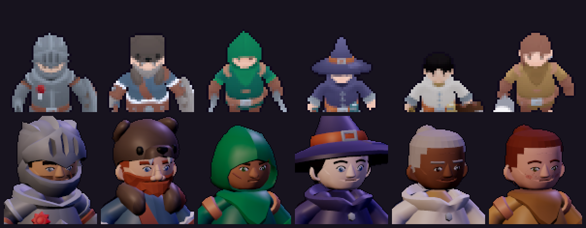
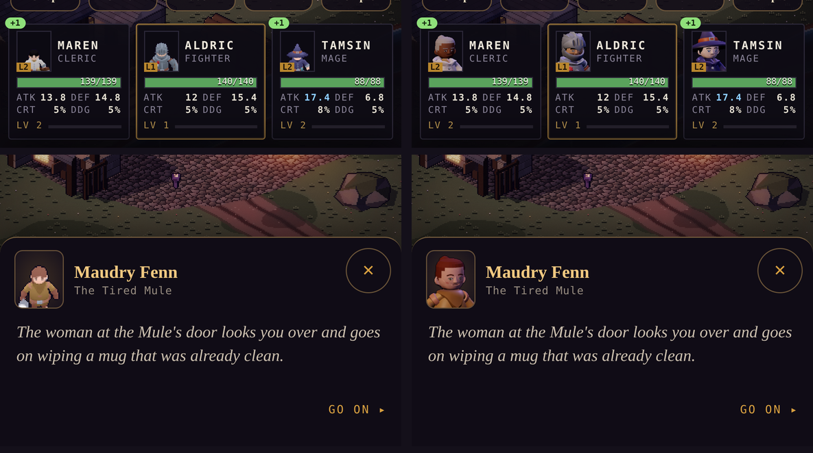
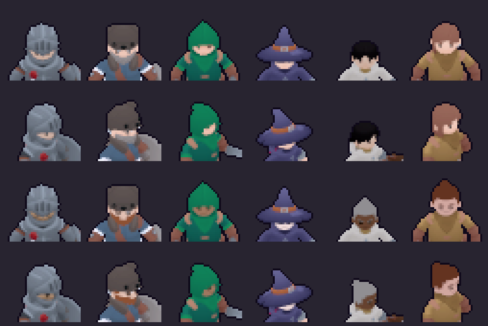
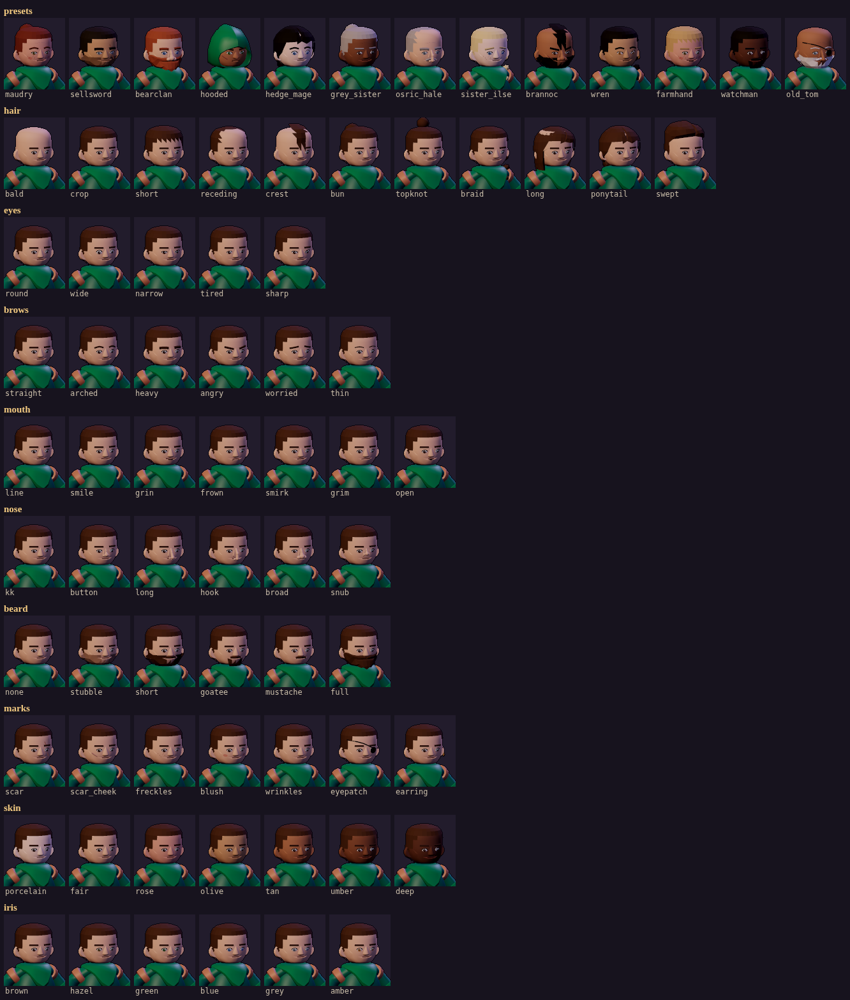
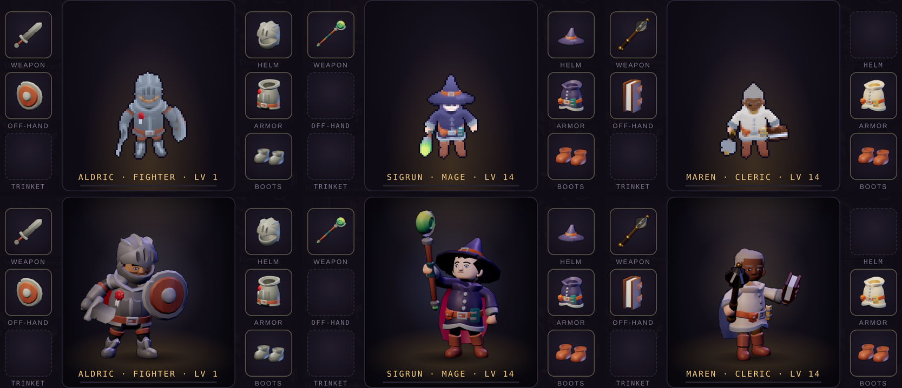

# Art critic pass 4 — faces

This pass had three goals:
- review character faces specifically;
- give them a better look and more fidelity;
- make faces modular, so that each person can be given their own face from parts.

It covers every human figure: the five hero looks and the first named NPC, Maudry Fenn. The
Ashbound keep their skulls. It follows `art-critic-pass-3.md`.

## What was wrong

*Top: the portraits the windows showed (party cards, the sheet, the party screen, dialogue).
Bottom: the new baked portraits. Knight, barbarian, rogue, mage, cleric, Maudry.*

1. **Everyone had the same face.** KayKit builds a human head as one mesh coloured by
   swatches of an 8 × 4 texture:
   - eyes: two dark blobs;
   - brows: in the hair swatch;
   - nose and mouth: in the skin.

   Every model has the same eyes (132–138 triangles, identical positions). The cleric was
   the Mage with the Mage's hair, and Maudry was the Rogue with the Rogue's.
2. **Portraits had no faces.** The windows cropped a 44 × 52 px window out of the 56 px
   in-world atlas. That window held the whole upper body, the head was about 11 px tall, the
   eyes were one pixel each and there was no mouth. The crop was then brightened ×1.9 and
   scaled up with nearest-neighbour.
3. **Nothing about a face was data.** Hair colour, skin tone and beard came only with the
   KayKit model you picked.

## How it was measured

- **Portraits:** the UI's old crop and the new bake, side by side at 2×.
- **In world:** head crops from the atlases at 5×, front (row 2) and three-quarter (row 1).
  These crops include the grade and outline the renderer receives. The shots below are
  1:1 phone captures (390 × 844, DPR 3).
- **Before:** served from a worktree of the previous commit.
- **Range:** every option was rendered with `node tools/actor-lab/faces.cjs`.

## Before → after

| Measure | Before | After |
|---|---|---|
| Distinct human faces | 1 (every model shares it) | 6 shipped + 7 more presets |
| Face options | none | 11 hair styles, 5 eyes, 6 brows, 7 mouths, 6 noses, 6 facial hair, 7 marks (combinable), 7 skin tones, 11 hair colours, 6 iris colours |
| Head height in a window portrait | ~11 px (a crop of the 56 px sprite) | 67 px (96 × 112 lit bake) |
| Eye in a window portrait | 1 px dark dot | white, iris, pupil, catchlight, lash (~6 px wide) |
| Mouth in a window portrait | none | expression line and lower lip |
| Portrait assets | none (atlas crop) | 6 × `<actor>.face.png`, 108 KB in total |
| In-world atlas size (the 6 actors) | 7.89 MB | 7.76 MB |

*Rows 1–2: before (front, three-quarter). Rows 3–4: after.*

## What changed

### The face kit (`tools/actor-lab/faces.js`)

- **Heads taken apart.** Each KayKit head is split by swatch tile into skin, hair (with
  brows and beards), eyes, trinkets and hood.
- **A bald skull.** No KayKit head is whole under its hair or beard. The kit stitches one
  from two heads:
  - the Knight's face below the hairline;
  - the Barbarian's head everywhere except under his beard.

  The two overlap across the seam so no crack shows. KayKit's inset mouth wedge caught the
  key light as a pale sliver, so the kit colours it as the lower lip.
- **Parts placed on the skin.** Every part is placed on the skull's surface, found by a ray
  from the front:
  - **eyes:** 5 styles by width, height and tilt, with lash line, lid fold and lower line;
  - **brows:** 6 shapes and weights;
  - **mouths:** 7 expressions;
  - **marks:** scar, cheek scar, freckles, blush, wrinkles, eyepatch, earring.
- **Noses.** KayKit's own nose is the default. Five others (button, long, hook, broad,
  snub) replace it: the kit cuts the old nose out and fills the hole with a patch shaped to
  the face on either side.
- **Hair.** Most styles are shells grown off the skull above a hairline: crop, short,
  receding, crest, bun, topknot, braid. Growth is a function of position, so the shell has
  no cracks. Long, ponytail and swept reuse KayKit's own hair meshes, and "full" reuses the
  Barbarian's beard; all are recoloured. Stubble, short and goatee are shells off the jaw.
- **Fit.** All parts are rigid meshes under the head bone, so the clips, the heroic head
  scale, helmets and hats carry them unchanged. A hooded head (`skull: "own"`) keeps its
  own face and hood and takes new features.
- **Faces are data.** Faces live in `tools/actor-lab/faces.json` as presets, named by a
  variant's `face` knob. `OPTIONS` lists every choice.
- **Two builds of each face.**
  - **Atlas (`far`):** keeps what survives at 56 px — skin, hair, beard, brows, dot eyes and
    a thin mouth. White eyes read as a stare and lidded ones as a smudge, and marks became
    noise, so both are dropped. The bake's despeckle pass erased one-pixel eyes, so the dots
    are drawn a little larger.
  - **Portrait:** everything.

### The faces shipped

| Actor | Preset | The face |
|---|---|---|
| `hero_knight` | `sellsword` | olive skin, soot crop, heavy brows, narrow grey eyes, grim mouth, stubble, a scar |
| `hero_barbarian` | `bearclan` | fair skin, copper hair and full beard, heavy brows, broad nose |
| `hero_rogue` | `hooded` | the hood kept; tan skin, sharp green eyes, angry brows, a smirk, a cheek scar |
| `hero_mage` | `hedge_mage` | porcelain skin, black ponytail, arched brows, wide blue eyes |
| `hero_cleric` | `grey_sister` | umber skin, grey bun, tired eyes, a smile, lines |
| `npc_maudry` | `maudry` | rose skin, auburn bun, arched brows, narrow hazel eyes, a smirk, freckles, lines, blush |

Presets ready for the next named NPCs and townsfolk: `osric_hale`, `sister_ilse`,
`brannoc`, `wren`, `farmhand`, `watchman`, `old_tom`. These are art only; the world doc
remains the canon.

### Portraits (`renderPortrait` in `lab.js`, `bake.cjs`)

- **What it renders.** Head and shoulders at 96 × 112, lit, from the same build as the
  atlas, so it is the same person.
- **Framing.** The figure is turned 22° (three-quarter view) and the camera sits 8° above
  eye level. The head fills 60 % of the frame.
- **Lighting.** A warm key from front left, a cool fill and a violet rim.
- **Finish.** Supersampled 4×, a light grade that keeps faces warmer than the world's grim
  pass, and the same 1 px ink outline as the atlas.
- **Which actors.** `bake.json` marks them with `portrait: true`.
- **Commands.** `node bake.cjs --portraits` re-bakes only the portraits.

### The windows

- `actorart.drawPortrait` draws `<actor>.face.png` smoothly into a 96 × 112 canvas at any
  CSS size. An actor without a portrait falls back to the old atlas crop.
- The party cards, sheet tabs, party screen and dialogue window all use it. The party cards
  keep one painted canvas per actor and copy it, so the frequent re-renders don't flash.

## Scores (faces)

Scores are one critic's judgement from captures; no blind comparison has been run.

| Track | Before | After | Gate (8.5) |
|---|---|---|---|
| Faces in the windows | 3.5 | **7.8** | not met |
| Faces in the world (56 px) | 6.0 | **6.6** | not met |
| Face customisation (the kit) | 1.0 | **7.5** | not met |

## Still wrong (ranked)

1. **The player can't choose a face yet.**
   - The kit is a baking tool, and each face needs its own atlas (1.2–1.7 MB each).
   - Next step: character creation offers 3 to 4 baked presets per look. Later, bake the
     head as a separate layer composited at runtime, so any combination works without a
     full atlas each.
2. **Noses are still KayKit-sized** on most faces. The replacement noses are smaller and
   more varied, but they could use a second shape pass, and noses should scale with head
   width.
3. **Skin is a flat colour.** KayKit's skin swatch has a gradient; the kit's skin is lit but
   untextured. A gentle cheek-to-jaw gradient would add warmth.
4. **The hooded rogue's tan face goes dark** under the green hood in the world. That reads
   as shadow, not a face. Either lift the value for hooded heads, or use a lighter tone.
5. **The mage's hat is cropped** at the top of its portrait. Portraits of tall hats could
   frame lower.

## Verification

- **Tests:** `npm run check` passes, with 74 unit tests including `test/faces.test.mjs`
  (presets exist, portraits are baked at 96 × 112, every playable look and named NPC has
  one), SMOKE_OK and RENDER_SMOKE_OK. `npm run test:browser` prints BROWSER_OK.
- **Captures:** the images above; the phone captures had no page errors.
- **Weapon anchors:** unchanged apart from ±1 px rounding. The mug anchors were re-baked
  with the atlases.

## Follow-up: the character window

The character window (the gear sheet) still showed the 56 px sprite, scaled 2× with hard pixel
edges, facing the camera, brightened, with the faces two dark dots. Two changes:

1. **A lit, posed figure** (`renderFigure` in `lab.js`, `<actor>.fig.png`).
   - **The render:** the whole figure at 352 × 408, drawn at 176 × 204 CSS (2×, crisp on
     phones). It uses the portraits' lighting, grade and outline, and the full faces.
   - **Pose:** each actor has one, set in `bake.json`:

     | Actor | Pose |
     |---|---|
     | Knight, barbarian | shield guard (`Blocking`) |
     | Rogue | blade ready (`2H_Melee_Idle`) |
     | Mage | staff raised, turned −30° so the staff stays clear of her face (`Spellcast_Raise`) |
     | Cleric | mace up, book open (`Spellcasting`) |
     | Maudry | lifting her mug (`Use_Item`) |

   - **Framing:** from the rest pose, so a raised staff doesn't shrink the figure and every
     figure's feet stand on the same line.
   - **Size:** six figures, 436 KB in total, loaded only when the window opens. An actor
     without one falls back to the old sprite (`drawCharacter` in `actorart.js`).
2. **Staging** (CSS in `sheet.js`). The figure stands on a small stage:
   - a warm spotlight from above;
   - the class's colour glowing softly behind (`classColor`, the class-icon colours);
   - a pool of light on the floor;
   - a contact shadow under the feet;
   - an inset vignette.

| Measure | Before | After |
|---|---|---|
| The figure's source | a 56 px sprite frame, 2× nearest-neighbour | a 352 × 408 lit render |
| Faces in the window | 2 dark pixels | full kit faces (eyes, brows, mouth) |
| Pose | standing idle, facing the camera | per class, three-quarter view |
| Staging | flat gradient | spotlight, class glow, floor light, ground shadow, vignette |

**Score (the character window):** 5.0 → **8.0** (one critic, from captures). Still to do:
- the figure doesn't show equipped gear; it needs layered weapons, or live 3D;
- the knight's helmet still hides most of his face.
