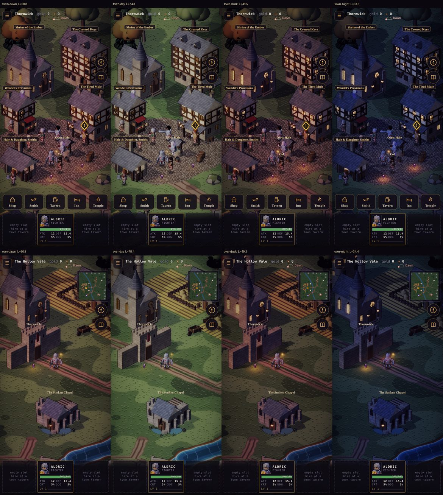
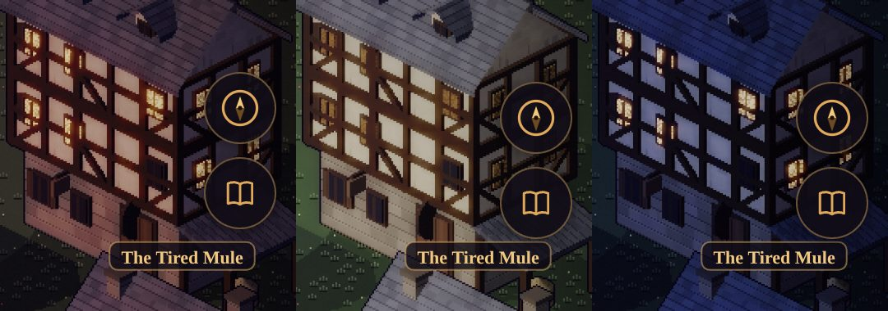
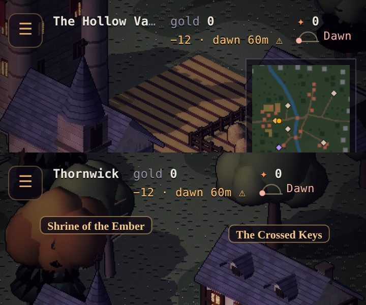

# Art critic pass 5 — the time of day

This pass gives the town and the overland a day that you can see. It had two goals:
- light the four parts of the sim's day (dawn, day, dusk and night) differently;
- show the time of day on the HUD, in a small sky dial under the embers that never overlaps
  anything else on screen.

The game had one fixed outdoor look, a low amber dusk. Dusk keeps that look exactly. The other three
parts are new. Design: GDD §10.1 (v1.10). Code: `src/render/daylight.js`, `src/render/renderer.js` and
`src/ui/hud.js`. It follows `art-critic-pass-4.md`.

## What was wrong

1. **It was always dusk.** The sim has kept a clock since the townsfolk's routines (four parts, each
   a quarter of the day), and the sellswords' wage comes at dawn, but nothing on screen showed it. The
   light-pass uniforms were constants: sun `[0.78, 0.55, 0.40]`, ambient `[0.31, 0.29, 0.44]`.
2. **The sun can't move.** Building, tree and rock shadows are baked at one low angle from the upper
   left (`bake-env.cjs`). A day that moved the sun would need a rebake per hour, and the shadows would
   disagree with the light in between. The day changes the light's colour and strength, and how deep
   the baked shadows are, but not its direction.
3. **Lit windows were glow plus paint.** A window's emissive was marked like any flickering ember, and
   its baked albedo is the warm lamplight behind it. Turning the glow down by day left the paint, so
   the windows still read as lit at noon.
4. **The HUD row was already full.** With a sellsword's wage line under the gold, the row wrapped at
   390 px: "The Hollow / Vale", a two-line wage line, and the ☰ button squeezed to 20 px wide.

## How it was measured

- **Shots:** 390 × 844 portrait, DPR 2, on the manual clock (`?dev&manual`), after 90 frames. Each
  part was held with `?dev&tod=dawn|day|dusk|night` (localhost only; it holds the light, not the
  sim's clock).
- **Luminance (L):** the mean of the world band (12–75 % of the screen height, under the HUD and
  above the cards), 0–255.
- **Before:** served from a worktree of the previous commit.
- **Frame time:** 240 manual frames at 60 Hz, timed in the page (SwiftShader, so only relative).

## What changed

*Top row: Thornwick. Bottom row: the Hollow Vale. Left to right: dawn, day, dusk, night.*

| | Sun | Ambient | Windows | Lamps | Hero's light | Bloom | Shadow lift | L town | L Vale |
|---|---|---|---|---|---|---|---|---|---|
| Before (any time) | `0.78 0.55 0.40` | `0.31 0.29 0.44` | ×1 | ×1 | ×1 | ×1 | 0 | 48.5 | 49.2 |
| **Dawn** | `0.98 0.70 0.58` rose-gold | `0.34 0.34 0.44` | ×0.45 | ×0.65 | ×0.8 | ×0.9 | 0.2 | 58.8 | 60.8 |
| **Day** | `1.02 0.94 0.80` warm white | `0.44 0.45 0.50` | ×0.12 | ×0.3 | ×0.55 | ×0.7 | 0.45 | 74.3 | 78.4 |
| **Dusk** | `0.78 0.55 0.40` (as before) | `0.31 0.29 0.44` | ×1 | ×1 | ×1 | ×1 | 0 | **48.5** | **49.2** |
| **Night** | `0.30 0.37 0.58` moonlight | `0.23 0.24 0.38` | ×1.3 | ×1.4 | ×1.45 | ×1.2 | 0.15 | 34.5 | 34.4 |

- **Dusk is unchanged.** Its luminance matches the old build to the decimal in both scenes. The only
  differing pixels (0.2 % of the frame) are a strolling townsperson and the ember flicker, which runs
  on the page's clock.
- **Night is moody but playable.** It sits at 46 % of day's luminance in town and 44 % on the Vale,
  against the agreed ~45 %. A first pass at 39 % was under that, so the moon and the ambient went up. The lit windows, the lamps (×1.4)
  and the hero's light (×1.45) carry the scene, and the moonlight keeps the roofs and the ground
  readable.
- **Dawn is not a dim dusk.** A first pass (violet sun `0.86 0.60 0.58`) read as dusk at a lower
  level. The sun was warmed toward rose-gold and the ambient made less violet.
- **Day lifts the shadows.** `stampShadow` now marks a baked ground-shadow pixel (ALB alpha 254). By
  day the light pass lifts it 45 % toward the unshadowed ground, so the dusk-length shadows read as
  soft noon shade instead of evening.
- **Windows go dark by day.** A window pixel's emissive is marked with EMI alpha 254. The light pass
  scales its glow (×0.12 by day, ×1.3 by night) and, below ×1, darkens its glass to as little as
  32 % of the baked lamplight.

*The Tired Mule. Left: before (always lit). Middle: by day (dark glass). Right: by night.*

- **Blends:** each part holds its look and blends into the next over two minutes of play, centred
  on the boundary, so the dial's word turns at the same second the townsfolk move. A test steps
  through a whole day a second at a time: no value moves more than smoothstep's steepest slope
  allows.
- **The title** always shows dusk. Leaving it eases to the clock's look over 1.5 s.
- **Dungeons** keep their own light: L 14.2 at day, at night and before.

## The sky dial

- **What it is:** a half arc with the sun on it from dawn to the end of dusk and a crescent moon
  through the night, and always the part's word (Dawn · Day · Dusk · Night) in its colour, at 11 px.
  It never relies on the colour alone.
- **Tap it** (44 × 44 px): it says when the next part comes, when dawn comes and what the wages are
  then, for example *"Night · dawn in 2 min · wages 225 gold at dawn"*.
- **The row fits on a phone.**
  - Columns no longer shrink, so the ☰ button stays 34 px.
  - On a phone (under 480 px) the EMBERFALL wordmark leaves the in-game HUD. It stays on the title
    and on wider screens.
  - Only the place name can give way, with an ellipsis. At 360 px with a wage showing,
    "The Hollow Vale" shortens; at 390 px it fits in full.
- **Nothing overlaps.** The browser test (`test/browser/run.mjs` §12) checks 360, 390, 430 and 768 px
  in town, on the Vale and in a fight. Each case has a wage due, 99,999 embers, Weakened and a
  tracked quest. The dial's box must not meet:
  - any visible element (the wage line, the Weakened chip, the toast it raised itself, the quest
    tracker, the compass, the Journal, the service bar, the party cards);
  - anything drawn under the HUD row: the dial must end inside the row, which the minimap, the
    room pill and the labels are laid out below.

  All 12 layouts pass. Moving the dial 70 px left made the test fail on the wage line, so it can
  fail.

## Cost

- **Frame time:** median 2.2–2.4 ms before and after, in town and on the Vale. p90 is unchanged
  (the town's bake bursts dominate it).
- **Per frame:** the day is a few uniforms and two branches in the light shader, with no rebake and
  no allocation (`skyAt` writes into the renderer's own object).

## Not done

- **The sun's direction** stays fixed (see above). Moving it means baking shadows per angle.
- **Night is cosmetic.** As agreed, nothing in play changes by the time of day: no spawns, foes or
  numbers. The sim never reads the light.
