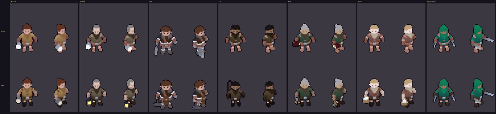
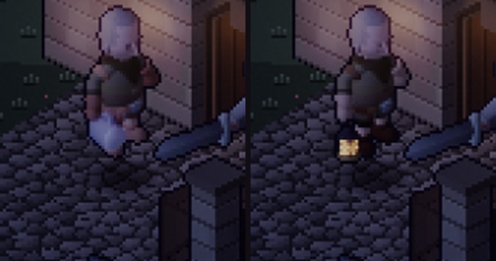
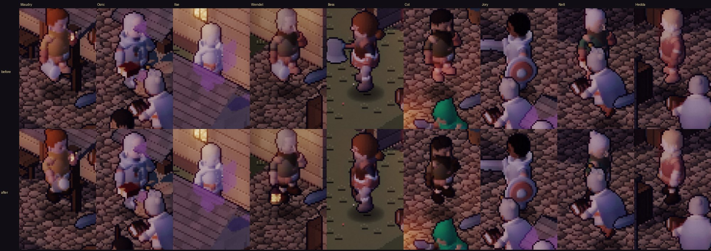
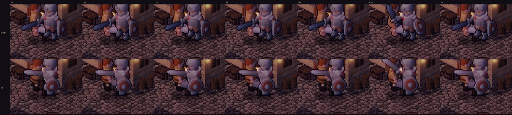

# Art critic pass 6 — the people

This pass reviews the player characters and the NPCs in the world, and aims for more refined
visuals and animation. It covers the five hero looks, Brannoc, and Thornwick's nine named
townsfolk. The Redhand and the robes are touched only where they share a fix (their walk stride).
It follows `art-critic-pass-5.md`.

## How it was measured

- **Captures.** 390 × 844 portrait, DPR 2, on the manual clock (`?dev&manual`), at dusk and night
  (`?dev&tod=`). The HUD and the place labels are hidden for the crops.
  - **Each townsperson:** the hero stands 6.5 tiles to their east, so they turn three-quarters
    toward the camera.
  - **The conversation:** the hero stands beside Maudry, the companions are sent off, and the
    conversation is filmed every 0.5 s.
  - **Before:** a worktree of the previous commit (107a65c), with the same scripts.
- **Atlases.**
  - Idle cells at 4× (front and three-quarter views), lifted ×1.9 so the unlit albedo reads like
    lit.
  - Per clip: the pixels that change between consecutive frames (mean and max), to measure how
    smooth each clip is.
- **Walk stride.** Measured from the figures' own feet, two ways:
  - **Pixels:** in the atlas, the planted foot's backward slide, frame to frame.
  - **Geometry:** in the bake, the lowest skinned vertex of each leg (see *Animation*).

## What was wrong

*Each pair: front and three-quarter idle cells. Top: before. Bottom: after.*

1. **Townsfolk looked half-dressed.** Five of the nine townsfolk use KayKit's Rogue body. Its
   trousers, boots, gloves and leather pads are tan-orange swatches, (7,1), (3,2), (5,2), (5,0) and
   (6,0), close to the skin swatch (0,0). After the world grade, Maudry, Wendel, Col, Nell and Hedda
   read as bare-legged, with skin-coloured blotches on their shoulders. So did the rogue hero (all
   five rogue looks).
2. **Nobody carried their trade, and some carried the wrong thing.** The world doc (§5) gives
   each townsperson a trade. The figures showed:
   - Bess, the smith, held a barbarian's war axe.
   - Wendel, who sells rope, bread and lamp oil, held Maudry's mug.
   - Col the carter, Nell of the Crossed Keys and Hedda the egg-seller held nothing, or a book.
   - Maudry's pewter mug read as a white blob (pale pewter, a large dome of foam).
   - Her mustard dress stopped at the hips, over pink legs.
3. **Townsfolk skated.** Their walk (`Walking_A`) was stepped at the party's *run* stride, 4.5
   tiles a cycle. Their own feet cover about 2.2. The legs cycled at half the rate the body moved,
   so the feet slid forward about 50 % of the time. The Redhand and the robes (also `Walking_A`)
   had the same fault in fights.
4. **The square moved in lockstep.** Every townsperson was drawn with the same idle seed (0.61)
   and the same gesture schedule (first at 4 s, then an interval hashed only from the gesture
   count). All nine breathed on the same frame and gestured at the same moments.
5. **Six of nine townsfolk had no gestures at all,** only idle and walk. Only Maudry, Osric and
   Ilse had the fidget and look clips the renderer asks for.
6. **Gestures were rushed.**
   - `Interact` (1.3 s in the source) played in 0.78 s: 1.67× too fast.
   - `Use_Item` (1.12 s of it) played in 0.75 s: 1.49× too fast.

   This was true for the heroes too.
7. **Conversations were wooden.** Talking to someone changed nothing in the world. If you were
   already beside them, the hero kept facing wherever he had been walking, often away from them.
   They didn't greet you or gesture while they talked.

## What changed

### Visuals (bake: `tools/actor-lab`)

- **Dressed.** New swatch repaints in `variants.json`:
  - **The rogue hero (all five looks):** dark trousers, dark leather boots, gloves and pads.
  - **Each Rogue-body townsperson:** trousers, boots, hands and pads of their own.
    - Maudry's dress is mustard down to her boots.
    - Hedda's rust skirt goes to her boots.
    - Col wears carter's gauntlets.

  Nobody reads as bare-legged now.
- **Their trade in their hands.** New code-built props in `props.js`, from the world doc (v1.14
  records them):

  | Who | Carries |
  |---|---|
  | Wendel | A hooded iron lantern. Its glass writes to the emissive plane (glow id 3), so it glows at dusk and night. |
  | Bess Hale | A cross-peen smith's hammer, and a leather apron (`wear: { hips: 'apron' }`). |
  | Col | A carter's whip, carried upright. |
  | Nell Tolley | A ring of long iron and brass keys. |
  | Hedda | A willow basket of eggs. |
  | Maudry | The same mug, in darker pewter, with less foam. |

- **Carried things hang plumb.** KayKit's idle holds the hand slot forward, so a rigid prop stuck
  out like a pole. A prop marked `userData.hang` is turned, every sampled pose, to point straight
  down from the grip, keeping the figure's yaw (`plumb()` in `lab.js`). The lantern swings with
  the arm, stays upright, and doesn't poke through the body.

*Wendel at night. Left: before (the mug's white blob, pink legs). Right: after (the lantern lit,
dressed).*

*In the square at dusk, at 2.4× (each turned toward a hero standing to their east).*

### Animation

- **No more skating.**
  - **The bake measures each walk's stride** (`strideOf` in `lab.js`) and writes it to the atlas
    JSON.
    - **Contact point:** the lowest skinned vertex of each leg. The ankle bone lifts while the
      sole is down.
    - **Fit:** each stretch where the contact stays within 5 cm of the floor gets a least-squares
      slope. The stride is their length-weighted mean.
    - **No value** when the stretches disagree by more than 30 %: the Ashbound's shuffle, and the
      Knight body's walk (Osric, Jory, Garrow).
  - **The renderer** uses the measured stride for townsfolk and human foes, falling back to 2.2.
    It keeps 4.5 for the party's run, as pass 3 measured it. The run has a flight phase, and its
    fit swings from 3.3 to 4.9 with the contact band, so it is left alone.
- **Out of lockstep.** Each townsperson's idle phase and gesture rhythm now come from a hash of
  their id. Their first gestures spread from 2.7 to 6.9 s, and their intervals from 7 to 13 s.
- **Everyone gestures.** All nine townsfolk now have fidget and look clips, chosen to suit them:
  - Bess's fidget is a hammer swing (`1H_Melee_Attack_Chop` with the hammer).
  - Hedda's is stooping to her basket (`PickUp`).
  - The rest use `Interact` and `Use_Item`.
- **Gestures at their own speed.** For heroes and townsfolk:
  - fidget: 10 frames at 8 fps, 1.25 s against `Interact`'s 1.3 s;
  - look: 8 frames at 7 fps, 1.14 s against `Use_Item`'s 1.12 s.

  The extra frames also make each step smaller (see the table).
- **Conversations.**
  - **The NPC:** greets you as the talk opens (a gesture), faces you throughout, and gestures
    every 2.8–5.2 s while it lasts.
  - **The hero:** stands and turns to them, even when the talk opens with no walk.
  - **How:** the renderer listens for the sim's `dialogue` and `talkEnded` events. No sim
    change: presentation only, so replays are untouched.

*Talking to Maudry, every 0.5–1 s from the moment it opens. Before: the hero keeps facing the
camera. After: he has turned to her.*

## Before → after

| Measure | Before | After |
|---|---|---|
| Townsfolk who read as bare-legged | 5 of 9 (plus the rogue hero) | 0 |
| Townsfolk carrying their trade (world doc §5) | 1 (Osric's ledger) | 7, plus Maudry's mug, Osric's ledger, Ilse's book and Jory's sword |
| Townsfolk walk stride used, against their feet | 4.5 tiles against ~2.2: the feet slid about 50 % | measured per figure, 1.97–2.33 |
| Human foes' walk stride (Redhand, robes) | 4.5 against ~2.2 | measured, 1.98–2.33 |
| Townsfolk with gestures | 3 of 9 | 9 of 9 |
| Distinct idle phases in the square | 1 (all nine on one frame) | 5 of the 8 idle frames in use at once |
| First gestures | all at 4.0 s | 2.7–6.9 s |
| Gesture playback against the source clip | `Interact` 1.67×, `Use_Item` 1.49× | 1.04×, 0.98× |
| Pixels changed per gesture step (knight, fidget / look) | 598 / 460 | 457 / 380 (−24 % / −17 %) |
| Hero faces the person they talk to | no | yes (browser test) |

## Cost

- **Atlases.** The 19 rebaked actors grew:
  - heroes: +5 frames each (79 → 84; the knight's strip is 6952 → 7392 px wide);
  - Maudry, Osric and Ilse: +5 frames each (31 → 36);
  - the six other townsfolk: double (18 → 36).

  Every actor atlas together goes from 39.2 to 45.7 MB of PNG (+17 %). It's the biggest cost of
  this pass, and the first thing to trim if download size matters: the townsfolk's look clip
  could go.
- **Per frame:** no change. It's the same stamping, plus one `find` while you're talking.

## Scores (characters and animation track)

Scores are one critic's judgement from captures; no blind comparison has been run.

| Track | Pass 3 | Pass 6 | Gate (8.5) |
|---|---|---|---|
| Characters & animation | 7.8 | **8.3** | not met |

## Still wrong (ranked)

1. **The conversation framing overlaps.** The sim's "beside" spot is one tile level on screen,
   about 16 px, so at this zoom the hero half-covers the person he's talking to. Two tiles apart,
   or the hero a step back, would show both.
2. **The townsfolk share two bodies.** Five of them are the Rogue body and two the Knight's, with
   the same build and height. The body mock-up (`docs/body-mockup.md`) is the way to give them
   builds.
3. **Their amble is slow-legged.** Townsfolk walk at 1.6 tiles/s on a 2.2-tile stride, 78 % of
   the clip's own cadence. The feet are planted now, but the step reads unhurried. A shorter-stride
   clip, or a slightly faster amble (a sim change), would fix it.
4. **The hero's ±½ px shimmer** while the camera glides (from pass 3) remains.
5. **Osric, Jory and Garrow (the Knight body) have no measured stride.** Their walk's fit
   disagrees with itself, so they use the 2.2 fallback.

## Verification

- **Checks:** `npm run check` (typecheck, lint, content, 220 tests, SMOKE_OK, RENDER_SMOKE_OK).
- **Browser tests:** `npm run test:browser` passes (BROWSER_OK), with two new checks in §6:
  - while talking to Maudry, the hero's drawn octant is the one toward her;
  - when the talk opens with the hero already beside her and facing away (south), he turns to
    her (northwest).
- **No page errors** in any capture.
