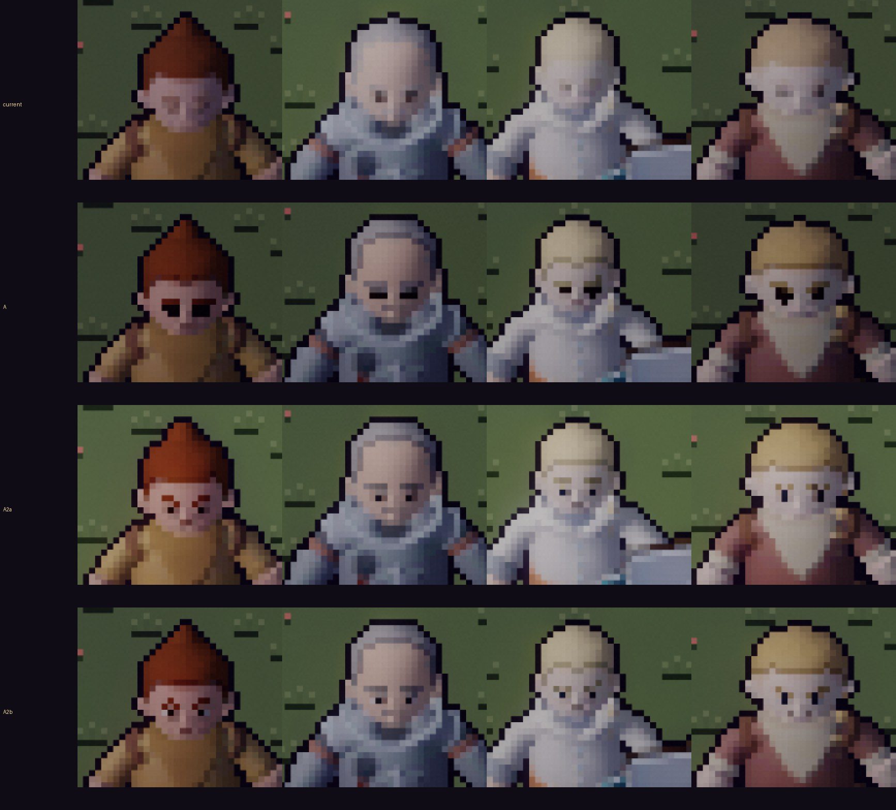
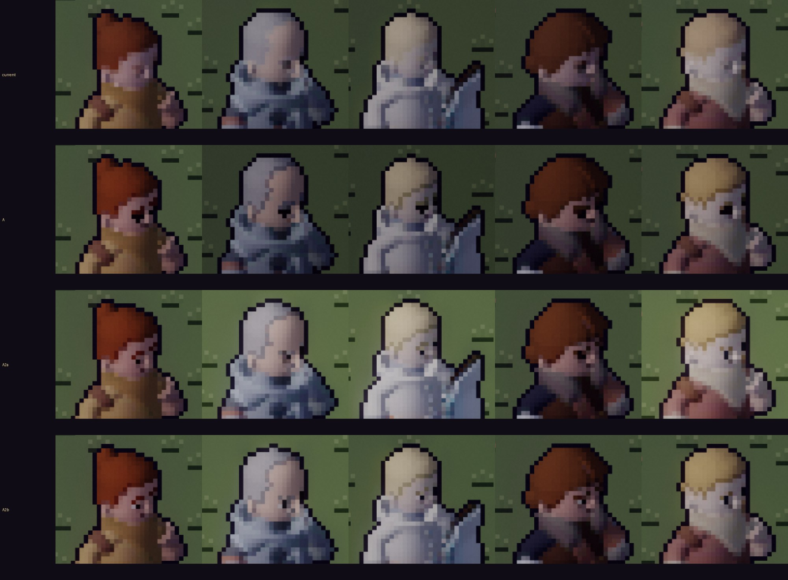
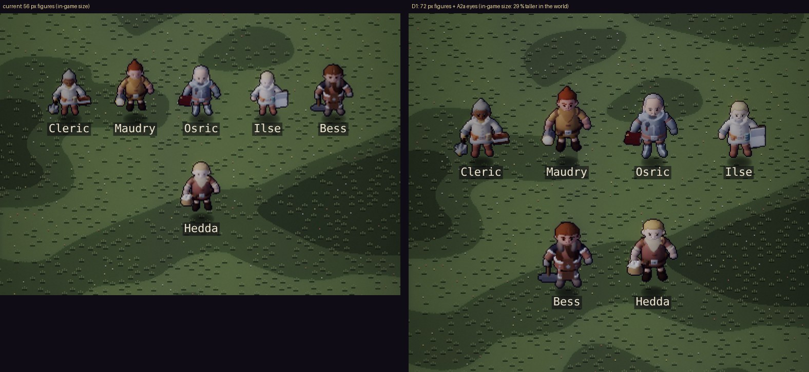
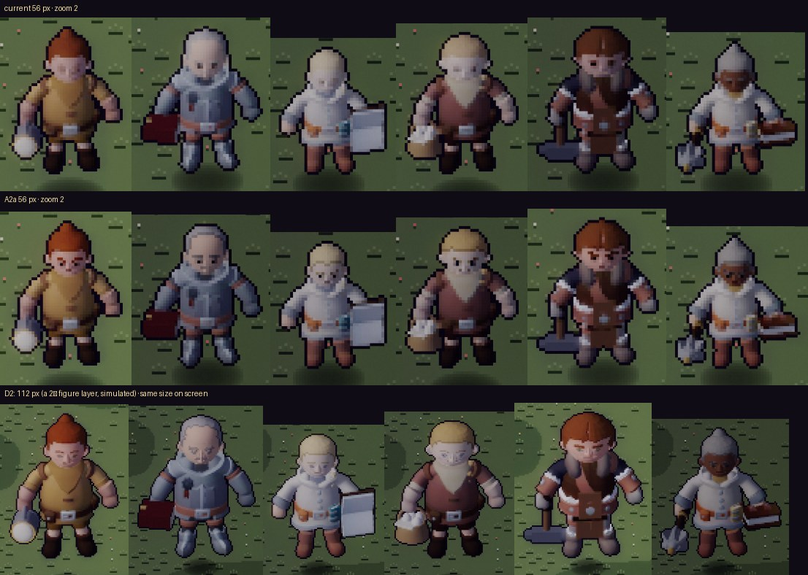
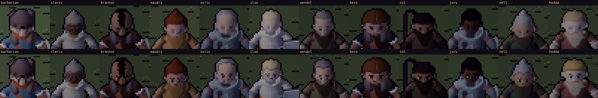
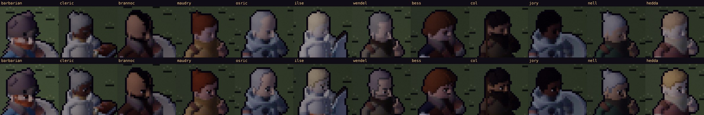
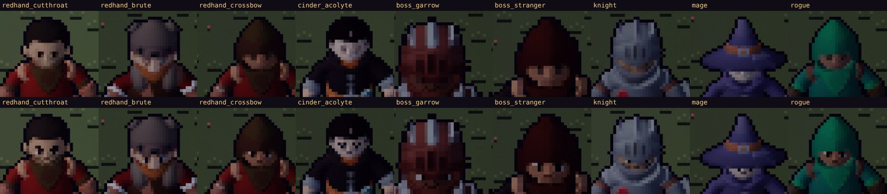
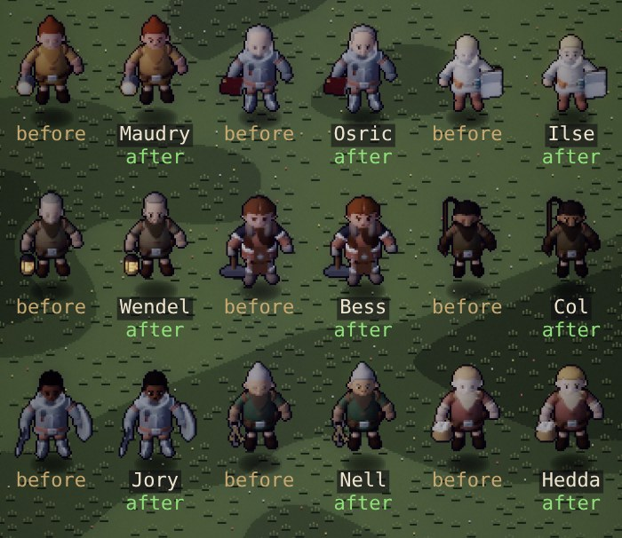

# Art critic pass 7 — eyes, and more pixels (A2, D)

This pass follows the face options in `face-fidelity-proposal.md`, where the feedback was that the eyes
in A didn't look good. It:
- critiques those eyes;
- builds **A2**, a pixel-art eye, in two variants;
- prototypes **D**, more pixels per figure, both ways: bigger figures (D1) and a twice-resolution
  figure layer (D2).

Everything was judged on the Stage (`?dev&scene=stage`). **A2b + B shipped the same day**, with
whites in both views and the brows toned and capped: see *Shipped* at the end. D stays a lab knob.

## How it was measured

- **Faces:** the Stage at zoom 3 (one in-game pixel = 3 × 3), by day, front (dir 2) and three-quarter
  (dir 1), idle frame 0. Twelve people: Barbarian, Cleric, Brannoc and Thornwick's nine.
- **Pixel counts:** from the bake's own geometry (`BAKE_PROTO=…,stats`):
  - eye heights in pixels;
  - feature coverage per pixel.
- **D:** each figure alone on the Stage, cropped to its drawn box.
  - **D1:** 72 px, shown at in-game size.
  - **D2:** 112 px at zoom 1 beside 56 px at zoom 2, the same size on screen. That's what a
    figure layer at twice the native resolution would show.
- **Size:** atlas PNG sizes for the same actors.

## The eyes in A — what's wrong

A keeps any pixel where an eye, brow or mouth covers 3 of its 16 sub-samples. Faces got eyes, but:

1. **Too big.** The atlas eye is a dark dot plus a lash arc. Snapping everything they touch gives
   each eye 2 × 2 or 2 × 3 pixels, a quarter of an 8-pixel face. They read as goggles or
   sunglasses (Maudry, Hedda, Col).
2. **Black holes.** The colour is the lash's near-black (#1c120e), so the eye has no colour of its
   own, and nothing reads as alive.
3. **Brows fuse with the eyes.** With no skin row between, brow and eye make one dark band
   (Osric, Wendel).
4. **Left and right differ.** One eye covers 2 pixels and the other 3, depending on how the face
   lands on the grid.
5. **No mouth,** on most faces.

*Front, zoom 3, enlarged ×2. Rows: current · A · A2a · A2b.*

## A2 — a pixel-art eye

A2 places the features from the geometry, by pixel-art rules, instead of keeping whatever they touch
(`pixelFace` in `tools/actor-lab/lab.js`):

| Rule | What it does |
|---|---|
| **Each eye exactly 1 px wide** | The pixel the eye covers most |
| **2 px tall only when both eyes earn it** | Both eyes must cover two rows well, so a pair always matches. **9 of 12 faces get 1 × 1 eyes, 3 get 1 × 2.** |
| **Iris-tinted dark, not black** | The face's iris colour, 55 % toward near-black: a brown, blue or green eye stays that colour |
| **Brows a single row, never touching the eye** | The topmost covered pixel of each column, with a row of skin kept between it and the eye |
| **Mouth at most 2 px** | Only when both eyes show (a face turned away has none) |
| **A2b: the white** | A light pixel on the outer side of each eye, when the face is wide enough (eyes ≥ 3 px apart) and that pixel is skin |

Same atlas sizes (+1 % PNG for the 12 actors), no runtime cost.

*Three-quarter, the way people face you in the square. Rows: current · A · A2a · A2b.*

**What works:**
- Every face reads as a face at in-game size: two dots, a brow line, often a mouth.
- The eyes have colour: Ilse's and Hedda's read blue, Maudry's brown.
- Brows and eyes no longer fuse.

**What's still wrong (ranked):**
1. **In three-quarter view, one eye carries the face,** because the far eye is hidden behind the
   nose. On pale skin (Osric) a single dark-grey pixel nearly vanishes. **A2b's white fixes
   this:** Bess's and Hedda's eye reads at once. In front view the white matters less and can
   look like a sideways glance (Maudry).
2. **Saturated brows read as marks.** Maudry's auburn brow, beside the eye in three-quarter, looks
   like a red slash or scar. Brows should be toned a step toward the skin, and shorter (at most 2 px)
   in three-quarter.
3. **Expression is luck.** Whether a brow sits flat or angles is where the geometry lands. Bess and
   Maudry can look cross. Brow shape could follow the face preset (`brows: angry | worried | …`)
   by rule, not by sampling.
4. **Mouths appear on about half the faces.** A 1–2 px mouth under a beard or in shadow is lost,
   which is acceptable at this size.

**Verdict:** A2b, with the brow toning, is the eye to ship: the white only in three-quarter, or
everywhere if the front glance is liked. It's the best at in-game size, at no cost.

## D — more pixels per figure

*D1: the same six at in-game size. Left: today's 56 px. Right: 72 px figures (bake `BAKE_PX=72`), A2a
eyes.*

**D1, bigger figures (72 px):**
- Figures stand 29 % taller in the world: about 2 more pixels for each face feature and a clearer
  silhouette.
- Every figure is bigger against doors, chests and rooms. The world would need its scale revisited,
  or the camera to zoom out (VIEW_TILES) to keep the framing, which hands the pixels back.
- **Cost:** atlases +47 % (the six actors' albedo 3.8 → 5.6 MB), and a rebake of everyone.

*D2, at the same size on screen. Rows: today's 56 px at zoom 2 · A2a at zoom 2 · 112 px at zoom 1
with the portrait-quality face (eyes with whites, irises, brows, noses, beards).*

**D2, a twice-resolution figure layer (112 px drawn at today's size):**
- Fidelity jumps to portrait level: real eyes, noses, mouths and beard texture. It's the only option
  where faces have *expression*.
- **It's a different art direction.** Figures become smooth and detailed on a chunky pixel world:
  they'd look pasted on unless the world goes the same way.
- **Cost:**
  - **Atlases about 3.2×:** the six actors' albedo 3.8 → 12 MB, so the cast's ~46 MB would grow to
    ~145 MB. A hero atlas would be 14,700 px wide, over iOS Safari's 16.7 M-pixel canvas limit.
  - **The renderer needs a second, finer figure layer** (stamping, depth and light at twice the
    native resolution), the biggest change since Emberlit.
- **Simulated here:** a 112 px atlas on the existing renderer at zoom 1 beside 56 px at zoom 2. Faces
  and silhouettes match what a real layer would show; the light would be finer.

## Bug found on the way

At 72 and 112 px the atlas cell is an odd width (113, 175). The bake wrote the foot anchor as half a
pixel (`ax: 56.5`), and the renderer's buffer index went fractional: the figure stamped as garbage
(a green glow). The bake now floors it (`Math.floor(W / 2)`). It's the same for the shipped 88 px
cells, and a default bake is still byte-identical.

## Scores (faces in the world)

Scores are one critic's judgement from captures; no blind comparison has been run.

| | Faces read at in-game size | Eyes look good | Cost |
|---|---|---|---|
| Current | 3 / 10 | — (none) | — |
| A | 6 | 3 (goggles) | none |
| **A2a** | 7 | 6.5 | none |
| **A2b** | **7.5** | **7** (+ brow toning: 7.5) | none |
| D1 + A2 | 8 | 7.5 | +47 % atlases; world scale |
| D2 | 9 | 9 | ~3.2× atlases, a renderer layer, a style change |

## Recommendation

1. **Ship A2b + B (the face grade and hairline), with the brows toned and capped:**
   - the white beside each eye in three-quarter (front optional);
   - brows a step toward skin, at most 2 px in three-quarter.

   It's free, and it fixes what players see.
2. **Leave D1 unless the figures should be bigger anyway.** It's a game-scale decision, not a faces
   fix.
3. **D2 is a direction, not a tweak.** Worth a separate look only if the whole game moves to finer
   pixels.

## Shipped: A2b + B (2026-10-02)

The default bake is now `eyes2,grade` (`tools/actor-lab/lab.js`); `BAKE_PROTO=off` bakes faces as
before. Every actor with a face preset was rebaked: the 9 hero atlases (the 5 rogue weapons
included), Brannoc, Thornwick's 9, the Redhand 3, the acolyte, Garrow and the Stranger. That's 25 albedo
atlases.

**What changed from the A2b prototype:**

| | Prototype (pass 7) | Shipped |
|---|---|---|
| **Whites** | Only when both eyes showed, at least 3 px apart. The side was assumed: left eye left, right eye right. | **Both views.** Each eye's outer side comes from the geometry: away from the other eye and a little back along the face, projected to the screen. So a lone three-quarter eye gets its white on the ear side. Still only on a skin pixel. |
| **Brows** | Every column the brow covered, in its own colour | **Only over an eye:** with two eyes, the eye's column and one either side; with one eye, its column and the outer one (2 px). With no eye, no brow. **Toned:** 35 % toward a darkened skin (skin × 0.6). Maudry's auburn now reads as a brow, not a red slash. |
| **Actors without a face** | Rendered the part pass anyway | Skip it. The skeletons and the Standard are untouched, not rebaked. |

*Front (dir 2), idle, by day, zoom 3. Top: before. Bottom: shipped.*

*Three-quarter (dir 1): one eye carries the face, and it now has its white.*

*The Redhand, the acolyte, the bosses, and the knight, mage and rogue. Faces in a hood's shadow now have
eyes. The knight's visor and Garrow's helm hide theirs, as before.*

*At true in-game size (zoom 1, DPR 2), from `tools/capture/stage.mjs --group town --cmp <HEAD
worktree>`.*

**Measured** (idle cell, the twelve faces, `BAKE_PROTO=eyes2,grade,stats`):

| | Front (dir 2) | Three-quarter (dir 1) |
|---|---|---|
| Eyes | 12 of 12 faces two eyes: 9 are 1 × 1, 3 are 1 × 2 (Osric, Col, Jory) | 12 of 12 two eyes (the far one is a pixel at the nose). Hedda's are 1 × 2. |
| Whites | 2 on every face | 1 on every face (the near eye; the far eye's outer pixel isn't skin) |
| Feature pixels (eyes, brows, mouth) | 5–10, median 8.5 | 5–9, median 7 |

- **Atlas sizes:** the 25 albedo PNGs went from 24.75 MB to 24.81 MB (+0.26 %).
  - Normals, glow masks, portraits and figures are byte-identical.
  - So is every JSON, except Bess's (below).
- **Runtime:** no change. The faces are in the atlas.

**Found on the way (not fixed here):** Bess's weapon anchors differ between a full bake and
`bake.cjs --anchors`. HEAD's lab does the same, so this commit didn't cause it. The committed anchors
came from `--anchors` and are kept. Bess doesn't fight, so nothing draws from them yet.
