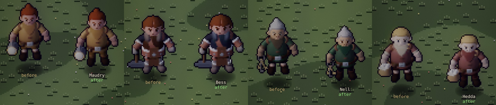
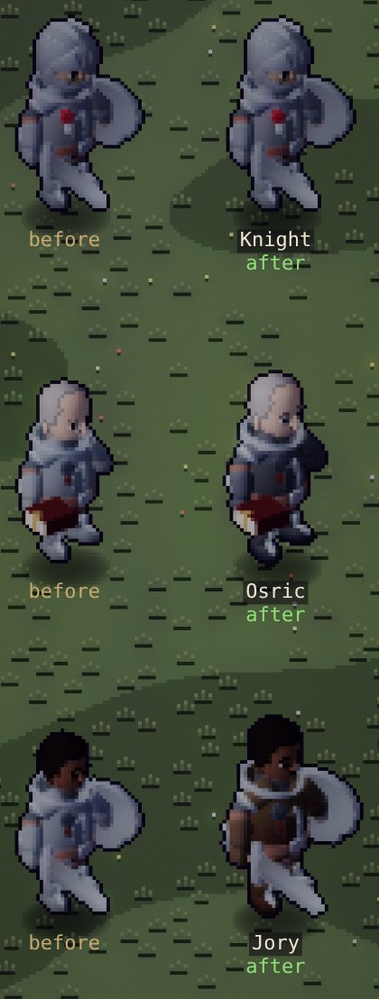
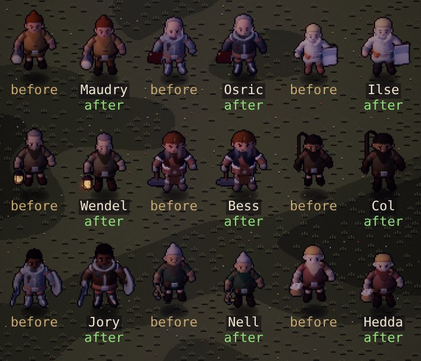
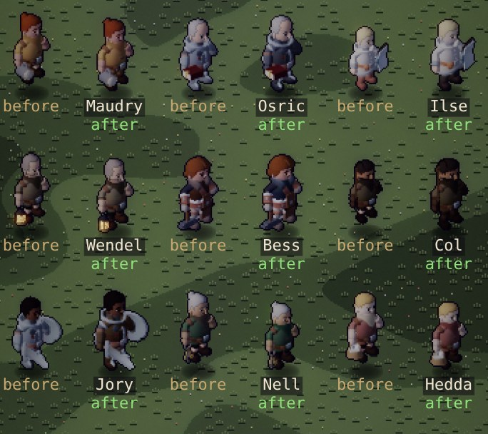
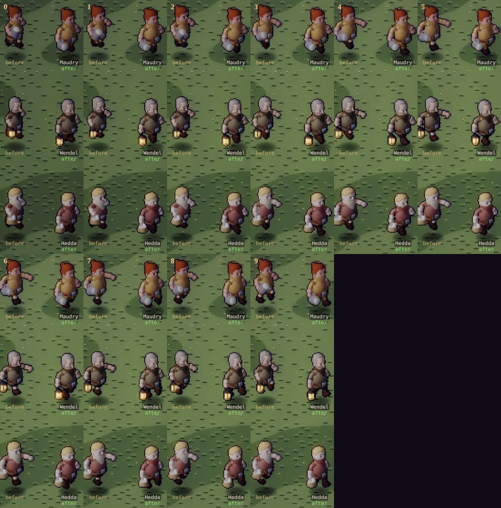
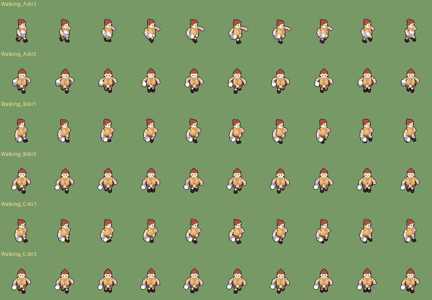
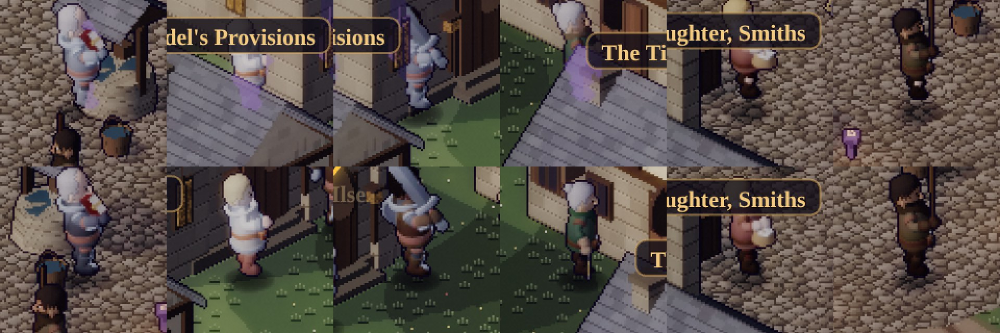

# Art critic pass 8 — Thornwick's people

This pass reviews the NPCs: Thornwick's nine named people and Brannoc. It follows pass 6 (which
dressed them, gave them their trades and fixed their stride) and pass 7 (their faces). It looks at
them two ways: lined up on the Stage, and where they actually stand in the square, at every part of
the day.

## How it was measured

- **The Stage** (`?dev&scene=stage`): every townsperson by day and at dusk, at in-game size and at
  zoom 2–3. Each figure stands beside its twin from a worktree of the previous commit (`cmp`).
- **The square**: the town on the manual clock (`?dev&manual`, DPR 2, 390 × 844). Each person is
  placed on their spot for each of the four parts of the day, with the hero standing 4 tiles to
  their right on screen.
- **How hidden each person is**: a new dev-only stat in the renderer, `globalThis.__xray[id]`. It
  is the share of a person's figure that fails the depth test, and so is drawn as the purple x-ray
  silhouette behind a building, roof or the well.
- **A visibility map**: a probe figure stood on every walkable tile near the problem spots, and the
  stat was read for each. New spots were picked from it.
- **Swatches**: each body's figure rendered with one swatch of the kit's 8 × 4 palette painted
  magenta at a time, to find which part of the body each swatch paints.
- **Atlases**:
  - the front idle cell's drawn height;
  - each walk frame's width (three-quarter and back three-quarter views);
  - the walk stride the bake measures.

## What was wrong (ranked)

*Front view, zoom 3, by day: Maudry, Bess, Nell, Hedda. In each pair, before is left and after is right.*

1. **Three of the five women read as bearded men.**
   - **The Rogue body:** its neck scarf (swatch `(1,1)`) hangs from the chin as a triangle. Its
     colour was close to a hair colour:
     - Hedda's was cream, so she read as an old man with a white beard;
     - Nell's was brown.
   - **Bess (the Barbarian body):** her fur collar `(7,0)` framed her jaw in grey. Under her chin,
     her shirt `(0,1)` was the same chestnut as her hair.
   - **Maudry:** her mustard bib only just reads as a collar.

   Canon (world doc §5) has Maudry, Bess, Nell, Hedda and Ilse as women.
2. **Four people stood behind buildings.** They were drawn as purple x-ray ghosts, measured with
   the hero aside, the worst part of the day for each:

   | Who | Hidden | Where |
   |---|---|---|
   | Nell Tolley | **44 %**, three parts of the day | Behind the Tired Mule's roof (her spot by the Crossed Keys) |
   | Jory | **38 %**, by day and by night | Beside the shrine's door, under Wendel's roof |
   | Sister Ilse | **26 %**, all day | Behind Wendel's roof |
   | Osric Hale | **10 %**, all day | *Inside* the well: its roof cut across his face |

   The square is authored so that the temple stands directly behind Wendel's shop on screen, and
   the Crossed Keys behind the Mule. A spot "beside" the back row lands behind the middle row's
   roofs.
3. **The hero arrived on top of Col.** A new game, or walking in from the road, puts you about
   24 px from Col's daytime spot on screen, so the two figures overlap. A party wiped in the
   barrows wakes before the shrine, next to Nell's dawn spot.
4. **The Watch wore the hero's armour.** Osric and Jory are KayKit's Knight body in its bright white
   plate, the same as the knight hero's. In the square there were three shining knights, and two of
   them were Lord Pellam's "underpaid militia" (world doc §4).
5. **Everyone was about one size, and the differences were accidents.** The bake fits each figure,
   props and all, to 56 px. Something held high shrinks the person under it:
   - Ilse (her open book) was the smallest, at 46 px;
   - Col (his upright whip) was next, at 47;
   - everyone else was 50–53.

   Canon says nothing about heights, and the figures said nothing either.
6. **The amble reached.** `Walking_A` swings the free arm up to horizontal: at three-quarter view a
   townsperson seems to reach for something every step. The widest walk frame was 37–46 px,
   against an idle of about 38. Its 2.2-tile stride also made the 1.6 tiles/s amble slow-legged:
   the clip ran at 69–81 % of its own cadence (pass 6, still wrong #3). On the Knight body
   (Osric, Jory) the stride couldn't even be measured (pass 6, #5).
7. **Small:**
   - On the Rogue body the knee patches `(0,0)` were never repainted, so five townsfolk had pale
     knees.
   - Ilse's shoes and shins read pink, as if bare.

## What changed

### Their clothes (bake: `tools/actor-lab/variants.json`)

| Who | Change |
|---|---|
| Hedda | Neck scarf `(1,1)`: cream → a wine shawl, darker than her rose dress |
| Nell Tolley | Neck scarf `(1,1)`: brown → her green bodice, darker |
| Bess Hale | Fur collar `(7,0)` → a blue-grey neckerchief; shirt `(0,1)`: chestnut → slate, under the leather apron |
| Osric Hale | Plate `(3,0)`: white → dull iron |
| Jory | Plate `(3,0)`: white → boiled leather |
| Maudry, Wendel, Col, Nell, Hedda | Knee patches `(0,0)` → their own legwear |
| Sister Ilse | Shoes `(3,2)` → dark leather (her off-white habit is canon and stays) |

The world doc (v1.15) records the Watch's kit: "Osric wears dull iron that was never polished for
anyone, and Jory, who is young, wears boiled leather".

*The knight hero (unchanged), Osric and Jory, three-quarter view, zoom 2.*

### Their sizes (bake: `lab.js` `fitPpu`, `variants.json` `height`)

A variant with a `height` is fitted by its body alone, to 56 px × `height`. Held things (sword,
shield, book, mug, a `hold` prop) are left out of the fit. Variants without one, the heroes and
foes, bake exactly as before.

The heights follow canon (world doc v1.15: Jory is the tallest in the square, Hedda and Nell the
smallest, Brannoc taller than any of them):

| | Hedda | Nell | Ilse | Wendel | Maudry | Col | Osric | Bess | Jory | Brannoc |
|---|---|---|---|---|---|---|---|---|---|---|
| `height` | 0.86 | 0.85 | 0.92 | 0.93 | 0.92 | 0.92 | 0.97 | 0.98 | 1.02 | 1.06 |
| Drawn height, before (px) | 50 | 52 | 46 | 50 | 52 | 47 | 52 | 53 | 52 | 57 |
| Drawn height, after (px) | 48 | 50 | 51 | 52 | 53 | 54 | 54 | 54 | 56 | 61 |

*(Drawn height includes hair, hoods and anything above the head, so it isn't exactly 56 × `height`.)*

*The nine at in-game size, at dusk: each before beside its after.*

*The same by day, three-quarter view.*

### Their walk (bake: `bake.json`)

- **The eight unarmed townsfolk walk with `Walking_B`:** a compact amble with the arms low.
- **Jory keeps `Walking_A`.** With a sword in hand, `Walking_B` and `Walking_C` both hold the blade
  straight out to the side for the whole cycle, pointed at whoever is next to him. A swinging
  march suits the Watch's one man with a sword.
- Brannoc's walk is the party's run, unchanged.

| | Widest walk frame (px) | Measured stride (tiles a cycle) | Cadence at 1.6 tiles/s |
|---|---|---|---|
| Before (`Walking_A`) | 37–46 | 1.97–2.33; Osric none | 69–81 % |
| After (`Walking_B`) | 31–45 | 1.70–2.06; **Osric measured** (2.06) | 78–94 % |

Per person, widest frame before → after: Maudry 46 → 41, Wendel 40 → 33, Bess 45 → 38, Nell 40 → 31,
Hedda 43 → 34, Ilse 44 → 39, Col 37 → 33. Osric stays at 45; he's wider now.

*Maudry, Wendel and Hedda walking in place, three-quarter view, ten frames. Before: the arm swings
up to horizontal at frames 4–7.*

*`Walking_A`, `B` and `C` on Maudry, three-quarter and front views (unlit albedo, lifted).*

### Where they stand (sim: `src/sim/npcs.js`)

- **Seven spots moved** to tiles the visibility map shows clear:

  | Who | Spot | Now |
  |---|---|---|
  | Osric | `hub [6, -1]` | In front of the well, not in it |
  | Jory, by day | `hub [-1, 2]` | Beside Osric: "a table by the square's well, a ledger and Jory" (world doc §5) |
  | Ilse | `temple [8, 2]` | By the shrine's door, clear of Wendel's roof |
  | Jory, by night | `temple [8, -4]` | By the shrine's door, clear of Wendel's roof |
  | Nell | `inn [-1, 5]` | Clear of the Mule's roof |
  | Nell, at dawn | `hub [-14, -4]` | Across the square, clear of the shrine arrival |
  | Bess, at night | `tavern [-2, 8]` | Kept clear when the others moved (it slid 18 % under the Mule's eaves) |
- **Nobody stands where you arrive.** Every spot and stroll now keeps apart (the existing `apart`
  rule) from the town's arrival points: the road, the overland gate and the shrine.
- **What stays the same:**
  - Positions are runtime and never saved, so there's no save change.
  - Placement is still a pure function of the town. `smoke-test.mjs` replays and `npm run check`
    pass unchanged.

*Top: before. Bottom: after. Osric (in the well → in front of it), Ilse and Jory (behind Wendel's
roof → by the shrine's door), Nell (behind the Mule → clear), Hedda (unchanged) and Col (moved clear of
where the hero arrives).*

## Before → after

| Measure | Before | After |
|---|---|---|
| Women who read as bearded | 3 of 5 (Hedda, Nell, Bess) | 0 |
| Most hidden person, at any part of the day | Nell 44 %, Jory 38 %, Ilse 26 %, Osric 10 % | 3 % (Maudry, Col) |
| Townsfolk on an arrival point | Col (about 24 px from the hero at arrival) | none |
| Townsfolk in the hero's plate | 2 (Osric, Jory) | 0 |
| Drawn heights | 46–53 px, by accident | 48–56 px in canon order, Brannoc 61 |
| Widest walk frame (the 8 on `Walking_B`) | 37–46 px | 31–45 px |
| Amble cadence against the clip's own | 69–81 % | 78–94 % (Jory 73 %) |
| Townsfolk with a measured stride | 7 of 9 | 8 of 9 |
| Pale knees, pink shins | 6 people | 0 |

## Cost

- **Atlases.** The rebaked files (nine townsfolk and Brannoc: albedo, normals, a glow mask, five
  portraits and the figures) grew 16.3 → 17.6 MB (+7.9 %). The figures are bigger, so they have
  more pixels. All actor atlases together: 74.3 → 75.6 MB (+1.7 %).
- **Per frame:** no change. The `__xray` stat is one counter in `stamp`, written only when the dev
  global is set.
- **Sim:** seven spot offsets and one rule (arrivals count as taken). There's no save or replay change.

## Scores (characters and animation track)

Scores are one critic's judgement from captures; no blind comparison has been run.

| Track | Pass 6 | Pass 8 | Gate (8.5) |
|---|---|---|---|
| Characters & animation | 8.3 | **8.6** | met |

## Still wrong (ranked)

1. **Strolls aren't checked.** Only the spots are guaranteed in view. A townsperson strolling up to
   3 tiles from a spot can still step half behind an eave for a few seconds (Nell by the Crossed
   Keys, Jory by the shrine). Fixing it needs the visibility map in the sim, which would mean
   building heights in `envfoot.js`.
2. **Osric's Watch post has no table.** Canon puts "a table by the square's well, a ledger" there.
   That's a prop (`bake-env`), not a person.
3. **Still two builds.** The heights now differ, but five townsfolk share the Rogue body's
   proportions. The body mock-up (`docs/body-mockup.md`) remains the way to give them builds.
4. **Jory has no measured stride.** The Knight body's `Walking_A` fit disagrees with itself, so he
   uses the 2.2 fallback.
5. **From pass 6:** the conversation framing (the hero half-covers the person he's talking to) and
   the hero's ±½ px shimmer.

## Verification

- **Checks:** `npm run check` passes: typecheck, lint (the same 16 warnings as before), content, 225
  tests, SMOKE_OK and RENDER_SMOKE_OK.
- **Browser tests:** `npm run test:browser` passes (BROWSER_OK), with a new check, **§15d**. At each
  of the four parts of the day, with everyone on that part's spot and the hero aside, nobody is
  drawn more than 5 % as x-ray. It measures 0–3 % now.
  - The same measurement, taken before the spots moved, gave the 44 / 38 / 26 / 10 % above.
  - On the previous commit the check fails: that renderer has no stat, so it reads every person as
    hidden.
- **No page errors** in any capture.
