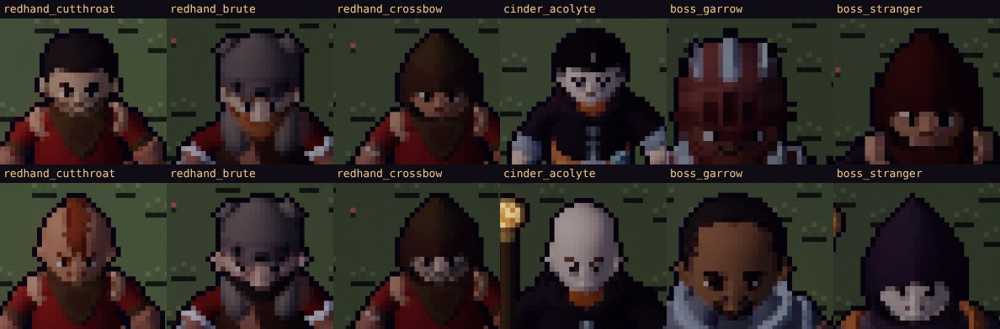
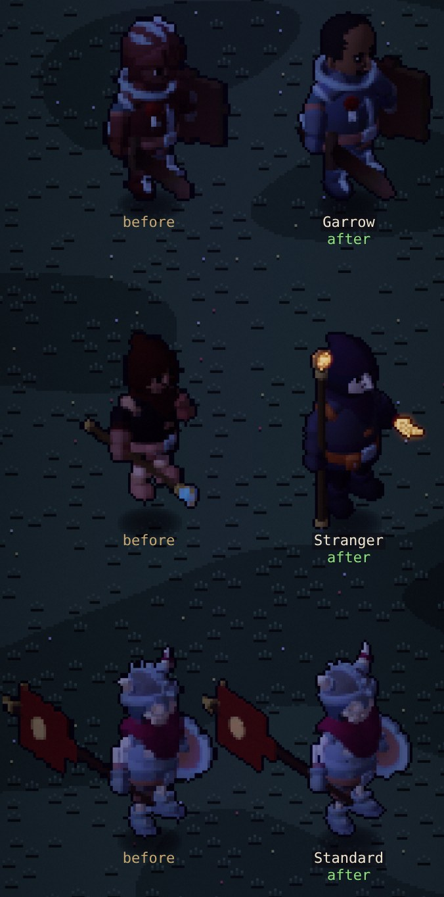
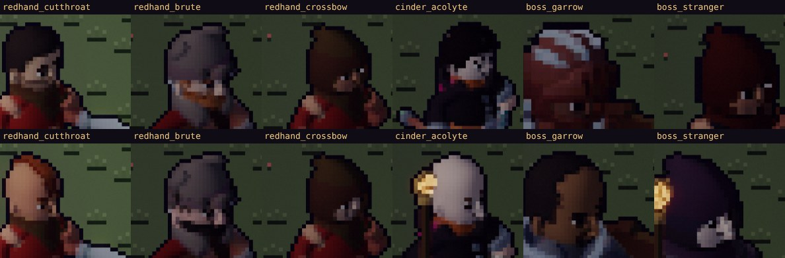
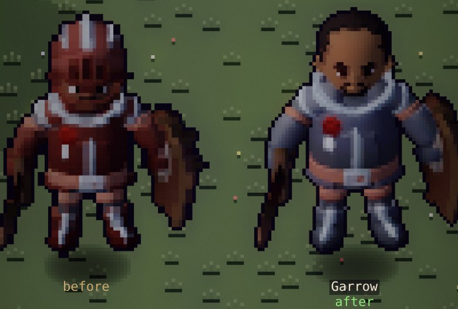
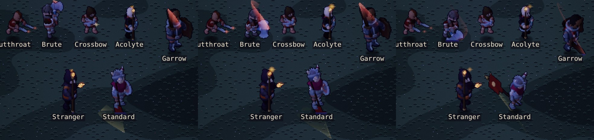
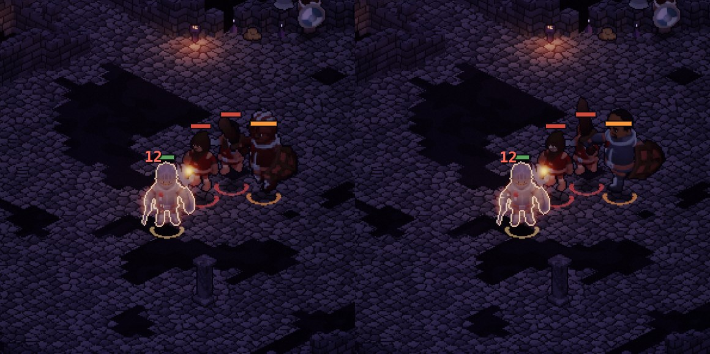
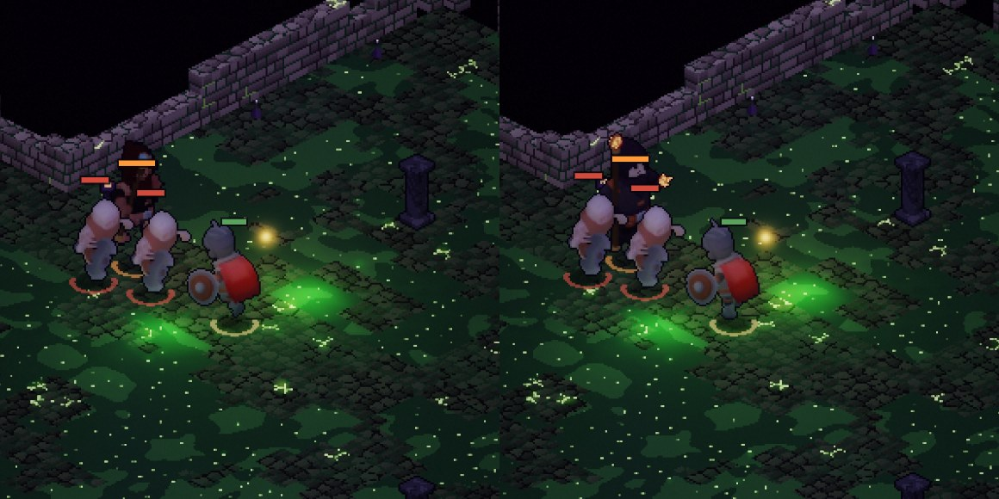
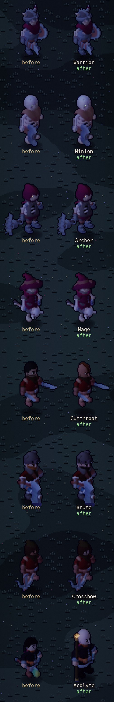

# Art critic pass 9 — the foes: faces, bosses and blows

This pass reviews the enemies:
- **The Redhand Company:** the cutthroat, the brute and the crossbowman.
- **The Cinder Cult:** the acolyte.
- **The bosses:** Captain Garrow, the Robed Stranger and the Standard of the Third Legion.
- **The Ashbound:** looked over too, but needed no change.

It follows pass 7 (the face kit at in-game size) and pass 8 (the townsfolk).

## How it was measured

- **The Stage** (`?dev&scene=stage`): foes and bosses by day and by night, zoom 1–3, idle and attack
  clips. Each figure stands beside its twin from a worktree of the previous commit (`cmp`).
- **Heads**: the human foes and bosses at zoom 3, front and three-quarter, beside the heroes whose faces
  they borrowed.
- **In the dungeon**:
  - a Redhand room in the Tithe Mill;
  - Garrow's hall at Wickham Keep;
  - the Robed Stranger's hall in the Sunken Chapel.

  The party was levelled up so the fight runs a few seconds.
- **Atlases**: each actor's front idle cell, measured for its mean albedo luminance and its drawn
  height. The boss loading path was checked for how it scales.
- **Code**: which atlases have a weapon effect style (`fx.js` `FX_STYLES`), and which style a foe's
  blow finds for its sparks.

## What was wrong (ranked)

*Front, zoom 3, by day. Top: before. Bottom: after.*

1. **No foe had a face of its own.** Every one wore a hero's preset, recoloured:

   | Foe | Face it wore | Also worn by |
   |---|---|---|
   | Cutthroat | `sellsword` | the knight hero |
   | Brute | `bearclan` | the barbarian hero: the same hat, beard and body, so only the shirt told them apart |
   | Crossbowman | `hooded` | all five hooded rogue looks, and the Robed Stranger |
   | Acolyte | `hedge_mage` | the mage hero: a young face with a ponytail, for a zealot |
   | Robed Stranger | `hooded` | the rogue hero and the crossbowman: a boss in the same face |
   | Captain Garrow | `watchman` | nobody, but no one ever saw it: his helmet's visor covered it |
2. **The bosses were the darkest figures in the game.**
   - Garrow was red-brown from helmet to boots. In his own torchlit hall he was a dark red shape on
     a dark purple floor, hard to tell from his men.
   - The Robed Stranger wore the Redhand's dark red, with nothing of the Cult about him (canon:
     a Cinder Cult acolyte who dies with an ember-shard in his fist).
   - Mean albedo luminance (front idle cell):

     | Garrow | Stranger | Their men | The heroes |
     |---|---|---|---|
     | 33.5 | 31.3 | 40–51 | about 50 |
3. **The bosses were nearest-neighbour upscaled at load.** Their atlases were baked at 56 px like
   everyone's, and the renderer stretched each cell ×1.3. So 3 of every 10 pixel rows and columns
   were drawn twice:
   - the outline came out 1 or 2 px thick;
   - faces and trims came out blocky, beside crisp men.

   The weapon anchors and foot point in the atlas JSON weren't scaled with them. Any effect drawn
   from them would have landed at 1/1.3 of the blade, so a weapon effect for a boss couldn't have
   worked.
4. **The Redhand, the Cult and the bosses swung with nothing drawn.** Only the heroes and the
   Ashbound had a weapon effect style. Seven of the eleven foe looks attacked with no trail, glint,
   muzzle flash or cast shimmer. Their blows also raised the default sparks, because the spark
   lookup only knew Ashbound kinds (`'skeleton_' + kind`).
5. **Two staves held head-down.** The acolyte (KayKit's staff) and the Stranger (our prop) carried
   their staves orb-to-the-floor in the rest pose, so their casts flashed at their feet. The
   acolyte's open shins also read pink, as Ilse's had (pass 8).

*Night, zoom 2: Garrow, the Robed Stranger, the Standard. Each pair is before, then after.*

## What changed

### Faces (bake: `tools/actor-lab/faces.json`, `variants.json`)

Six new presets. Each face is built to read at 1–2 pixels a feature:

| Foe | Face |
|---|---|
| Cutthroat | An auburn crest (a mohawk), a hooked nose, a mustache, a cheek scar and an earring; amber eyes |
| Brute | A soot-black full beard under the hat (the barbarian hero's is copper), a broad nose, a frown, a scar; a thick face |
| Crossbowman | His own face under the hood: fair, tired, stubbled, lined |
| Acolyte | Shaven-headed (world doc v1.16), pale, wide amber eyes, a long nose, lined |
| Captain Garrow | Bareheaded: umber skin, dark receding hair, a goatee, a scar, a gold earring ("that was someone else's", world doc v1.16), sharp amber eyes |
| The Robed Stranger | A pale, thin face in his own hood: straight brows, narrow amber eyes, a long nose |

The test (`test/foes.test.mjs`) checks that no foe wears a hero's face and no two kinds of foe share one.

*Three-quarter view, the way they come at you.*

### The bosses (bake and canon)

- **Captain Garrow** takes off his helmet: "he wants to be recognised when he collects" (world doc
  v1.16). His plate is steel over the Company's red, where it was red-brown all over.
- **The Robed Stranger** wears the Cult's charcoal. The Company's red is gone.
  - Ember shows on his straps and belt.
  - In his free hand he carries the **ember-shard**, a new lit prop (`props.js` `shard`): the one
    canon says he dies holding.
  - His staff's orb is ember now, not a cold blue, and it's lit too.
- **The Standard** is unchanged, apart from being baked tall.

### The bosses baked tall (bake: `bake.json` `px`, `bake.cjs`; renderer: `loadActorAtlas`)

- **The bake.** A `bake.json` actor may have its own `px`; `bake.cjs` reopens the lab at that height.
  The three bosses bake at 73 px (56 × 1.3) in 114 × 133 cells, fitted by their bodies alone
  (`height: 1`). A raised staff or banner doesn't shrink them.
- **The renderer.** `loadActorAtlas` now upscales an atlas only by what its bake falls short of
  (`scale × 88 / cw`), so the new boss atlases load 1:1.
- **Older atlases** (the Stage's twin from an older checkout) are still upscaled, and their foot
  point and weapon anchors are now scaled with them.

*Before: every third row and column doubled, the outline 1–2 px. After: one pixel is one pixel, and a
face.*

### Blows (renderer: `src/render/fx.js`)

- **Styles.** Every foe look now has a weapon effect style from the existing primitives:

  | Who | Effect |
  |---|---|
  | Redhand blades (cutthroat, brute, Garrow) | arcs and stabs in the Company's red |
  | The crossbowman | a muzzle flash |
  | The acolyte and the Stranger | an ember cast shimmer; the Stranger's heavy cast in fire |
  | The Standard | a gold arc |
- **Sparks.** `styleOfSrc` takes the renderer's kind → atlas table, so every foe's blow raises its
  own sparks.

*Three frames of the attack clip at night, in-game size. Red arcs (brute, Garrow), the cutthroat's
glint, the crossbow's flash, ember casts (acolyte, Stranger), the Standard's gold arc.*

### Staves held upright (bake: `lab.js` `plumb`, `props.js`)

- A prop marked `hang: 'up'` is stood on end every sampled pose, the way pass 6 hung lanterns plumb.
- The prop staff is marked so. The acolyte now carries it in place of KayKit's.
- Both staves stand with their lit ember orb above the hand, where the casts now flash.
- The acolyte's shins are dark leather.

### In the dungeon

*Wickham Keep, Garrow's hall. Before: a dark red shape among his men. After: steel, bareheaded and
taller than them.*

*The Sunken Chapel. Before: a red hood behind the diggers. After: charcoal, with the lit orb above him
and the shard in his hand.*

*Every foe at night, zoom 2, each before beside its after. The Ashbound are unchanged.*

## Before → after

| Measure | Before | After |
|---|---|---|
| Foe kinds with a face of their own | 0 of 6 (5 borrowed a hero's; Garrow's was hidden) | 6 of 6 |
| Faces shared between foe kinds | 1 (the crossbowman's, with the Stranger) | 0 |
| Bosses drawn without a nearest-neighbour upscale | 0 of 3 | 3 of 3 |
| Boss drawn height | 52–55 px × 1.3 (68–72 on screen, blocky) | 72 px, native |
| Garrow's mean albedo luminance | 33.5 (the darkest boss) | 39.0 |
| Foe looks with weapon effects | 4 of 11 (the Ashbound) | 11 of 11 |
| Foe kinds whose blows raise their own sparks | 4 of 11 | 11 of 11 |
| Staves held head-down | 2 | 0 |

The Stranger stays dark on purpose: 31.5, against 31.3 before. He's charcoal now, not dark red, and his
light is the ember-shard and the orb on the emissive plane, which no luminance number counts.

## Cost

- **Atlases.**
  - The seven rebaked foes: 16.2 → 21.4 MB (+32 %). Most of it is the bosses' 1.69× pixels.
  - Two new glow masks: the acolyte's and the Stranger's.
  - All actor atlases together: 75.6 → 80.8 MB (+6.9 %).
- **Memory in play:** unchanged. The bosses were already upscaled to this size at load.
- **Per frame:** seven more figures draw weapon effects, with the same primitives the heroes use.

## Scores (characters and animation track)

Scores are one critic's judgement from captures; no blind comparison has been run.

| Track | Pass 8 | Pass 9 | Gate (8.5) |
|---|---|---|---|
| Characters & animation | 8.6 | **8.8** | met |

## Still wrong (ranked)

1. **The brute still shares the barbarian hero's hat and body.** His face and beard differ now, but
   at in-game size the silhouette is the hero's in a red shirt. A different hat or a hood (a kit
   swap) would settle it.
2. **The Redhand have no mark of the Company.** They wear red, but there's no red hand anywhere: a
   painted palm on a shield or a tabard would carry the name.
3. **The Ashbound minion's skull** reads as a large white ball from the front. It's KayKit's
   proportions, and the heroic head scale isn't applied to skeletons.
4. **The Stranger** is still the darkest figure in the game. He reads by his light (the orb and the
   shard), which works in the chapel's dark. In a lit room he'd be a silhouette with two embers.

## Verification

- **Checks:** `npm run check` passes:
  - typecheck;
  - lint (the same 16 warnings as before);
  - content;
  - all tests, including the new `test/foes.test.mjs` (three tests). Its effects-and-sparks test
    fails without the `fx.js` change;
  - SMOKE_OK and RENDER_SMOKE_OK.
- **Browser tests:** `npm run test:browser` passes (BROWSER_OK). The Stage check (§15c) still has the
  whole cast of 30 loaded with nothing overlapping, the bosses now at their native size.
- **No page errors** in any capture.
