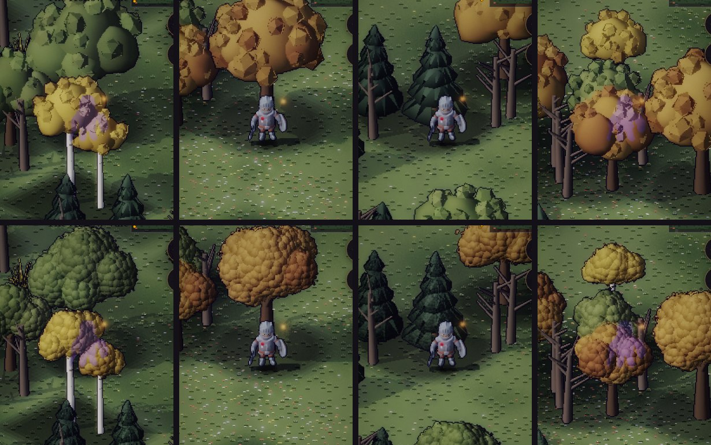
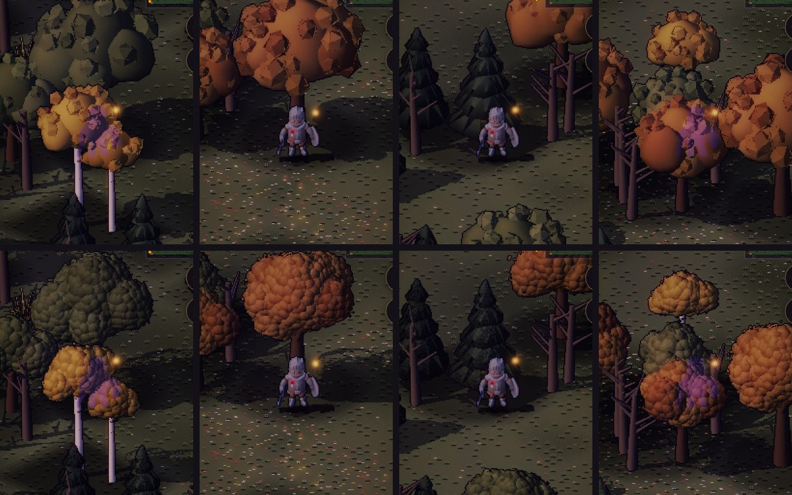
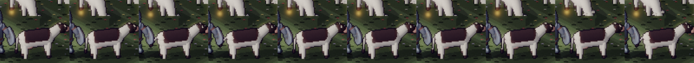

# Art critic: the trees' lumps, and the cows at their ease

**Current, 2026-10-04.** The owner asked for two things. On the trees: "Take another critic pass at our trees, they
look like they have odd lumps. What about removing the lumps and adding a leaf like shader?" On the cows: "Cows need
an idle movement."

## The trees

### What was wrong

Pass 11d had built each broadleaf crown from two kinds of shape, scored against a commercial reference: "many small
leaf clumps, each lit on top and dark beneath":
- a few smooth lobes for the crown's mass;
- about 30 faceted icosahedra stuck on their skin.

In the bake's normal map the icosahedra are flat-shaded gems. Lit in game, every facet is one flat plate, and the
crown reads as a bag of cut stones on a balloon. Those are the lumps.

Measured on the baked sprites (`env.alb` and `env.nrm`; "facet plates" is the share of the crown in runs of one exact
normal of 8 px or more):

| | Facet plates | Leaf detail (3 px high-pass, lit) | Outline (edge px / √area) |
|---|---|---|---|
| Broadleaves before (oak ×4, autumn ×3, birch ×2) | **38.0 %** | 8.71 | 4.88 |
| Broadleaves after | **0.7 %** | 10.10 | 5.19 |
| Pines before | 0.0 % | 3.1–4.2 | 4.1–4.2 |
| Pines after | 0.0 % | 4.4–5.7 | 4.1–4.2 |

### What changed

**The lumps are gone.**
- The icosahedra are still built, but unseen. That way the seed's draws stay where they were, and so does each tree's
  footprint. `src/sim/envfoot.js` is byte-for-byte unchanged, so the world is laid out exactly as before.
- When they were simply dropped, the footprints shrank and the Vale's trees moved, because the sim places the world
  by those footprints.

**The crowns' lobes carry a leaf pattern**, worked out per pixel in the bake (`tools/actor-lab/envlab.js`,
`leafPass`). The pattern is computed in world space, so the albedo, normal, depth-key and shadow passes all agree. It
works at two scales, because one scale alone failed twice:
- with dark edges on every cell, it read as **scales**;
- with thin dark lines along the cell edges, it read as **cracked mud**.

The two scales:
- **Clusters** (Worley cells of 0.075 world units, about 8 px):
  - each one's normal is bulged out from its centre, so it lights on its sun side;
  - its underside is darker in the albedo: the shade one cluster casts on the next.
- **Leaves** (cells of 0.028, about 3 px): a tone each (±10 %) and a slight tilt of the normal. They add texture, not
  tiles.

**The outline breaks into leaves.**
- Toward the rim, where the surface turns away from the camera, whole leaves and the gaps between clusters are cut
  out.
- Front faces only, so a cut shows what's behind (another lobe, or the ground), never the lobe's own inside.
- Lone pixels left by a cut are dropped before the ink outline, which would otherwise ring them into specks.

**Pines** take a finer, flatter version of the pattern (cells squashed in y), so a tier reads as layered needles.
- They have no rim cuts. Cut, the tiers' clean stepped outline frayed into a blur, and that outline is what makes a
  pine.
- Their cones draw both sides, because the jittered cones turn a few faces away.

**The dusk is kept.**
- Mean scene brightness: −2.7 % by day, −3.2 % at dusk.
- Contrast: 35.8 → 35.2 by day, 25.8 → 24.7 at dusk.
- The crowns cover about a fifth fewer pixels (oak_1: 12,946 → 10,184), since the icosahedra stood proud of the
  lobes and the rim is now cut.

**What changed in the atlas:** 27 sprites, all of them trees or things carrying trees:
- pine ×6, oak ×4, autumn ×3, birch ×3, grove ×6;
- the three wooded mountains and two massifs.

Nothing else moved. The bake is deterministic: a rebake before any change reproduced the committed atlases exactly.

## The cows

### What was wrong

The cows were baked into the static ground with the fences and the hay, so they stood like statues.

### What changed

**Three idle frames per cow**, baked beside it (`env.json`: `cow_1~tl`, `~tr`, `~hd`; `buildkit.js` `cowMesh(r, v,
pose)`):
- `~tl` and `~tr`: the tail swished to one side or the other;
- `~hd`: the head moved. A grazing cow lifts hers to chew; one looking about turns hers.

A pose never draws from the seed, so a frame is the same cow. The frames are left out of `envfoot.js`.

**In the renderer** (`src/render/beasts.js`, `renderer.js`):
- A cow with frames leaves the static bake, all but its ground shadow, and is stamped each frame like a figure. It is
  depth-tested, has no ring, and can't be tapped.
- Each cow keeps a timeline of its own:
  - a cycle of 5–11 s;
  - a swish of the tail (there and back, twice, 0.2 s a frame) on most cycles;
  - the head moved for 1.5–3.5 s on about half of them.
- The herd is never in step. It's presentation only: the render clock, and a hash of where each cow stands.

**Measured** on the manual clock, at 0.8 s samples by one cow: its pixels changed in 12 of 29 samples, by 12–85 px,
in a repeat of about 5.6 s (its own cycle).
- `test/beasts.test.mjs`: each cow stands 60–95 % of the time and shows all three frames. The herd moves out of step
  in more than 20 of 120 moments. Every cow has its frames, and none of them reach the sim's footprints.

## Next

- **Sheep and hens** could take the same three frames (a fleece's shake, a hen's peck). It's the same path:
  `env.json` poses and the frames' suffixes.
- **A breeze in the crowns:** two baked sway frames per tree, played like the cows'. It would cost static-bake
  savings on every tree on screen, so it should be measured first.
