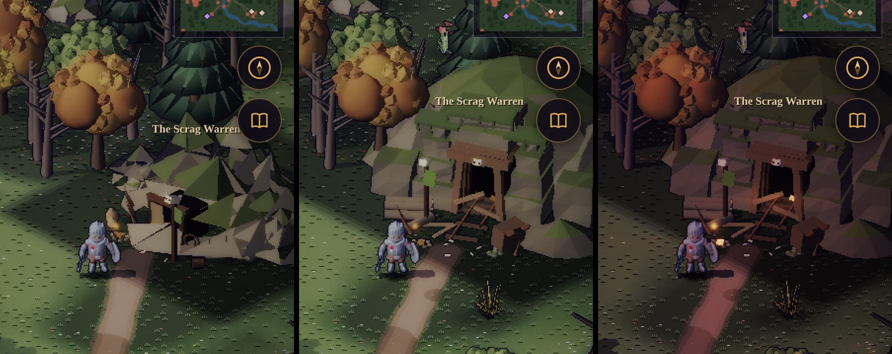
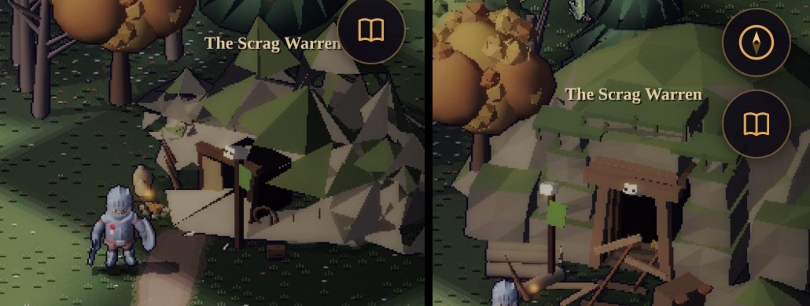

# Art critic pass — the Scrag Warren's door

The owner, 2026-10-03, with a phone screenshot of the party on the track below it: *"The entrance to the scrag
warren looks bad, take a strong art critic pass. It should look like an old mine entrance."* Canon followed
(world doc v1.19a, §3.1): the warren's door is an old lead adit, worked out and boarded up long before the
Vale's memory, which the goblins took and dug on from.

## How it was measured

- **In the Vale:** the hero placed on the track below the door, on the manual clock, 390 × 844 at DPR 2, by
  day and at dusk. The framing matches the owner's screenshot.
- **The sprite:** its cell cut from `assets/env/env.alb.png` and shown ×3–4 on a flat ground colour, beside the
  Deepdelve mine's (the Vale's other mine).
- **The geometry:** a node check of three r169's `ConeGeometry` and of the seam keys in `faceted()`
  (buildkit.js), counting the edges only one triangle uses.
- **The world:** the trees standing in front of the door, for three seeds; the tree-cover gate
  (`test/overland.test.mjs`); and a walk from the warren's arrival spot to its exit zone over the blocked grid.

## What was wrong (ranked)

1. **It wasn't a mine, or a door.** The mouth was a black box (0.36 × 0.30 units) set beside a heap of cones.
   It was seen side-on, with its top and flank showing as flat dark planes, so it read as a shed or a doghouse.
   It stood 0.36 units tall where a person is 0.5, so the party were taller than the way in. Two thin posts and
   a lintel made a gallows, not a portal.
2. **The sky showed through the rock.** The crags had holes: triangles of the ground colour inside their
   outline. The Deepdelve mine's crags had them too. The cause is three r169's `CylinderGeometry`: it tests
   `radiusTop > 0` for every row of a cone's side, not only the top row. A cone of two or more height
   segments therefore loses one triangle of every side quad, which is 24 of 48 edges open on an 8-segment
   cone. A smaller fault: `faceted()` keyed a seam vertex `-0.000` apart from its twin at `0.000`, so the two
   took different jitters.
3. **The hill was a crumple, not a hill.** It was eleven cones jittered by a third of their radius: crumpled
   paper, grey-green like the grass round it. There was no face for anything to be cut into.
4. **It faced the wrong way.** The mouth looked down model +z, 45° off the camera and away from the track's
   last leg. The track ended to one side of it.
5. **No mine vocabulary.** It had no timber set, no rails, no spoil heap and no ore tub. It had no depth: there
   was nothing inside the hole. The goblin dressing (stakes, a totem, a fire pit) was all it had.

## What changed

**The model** (`tools/actor-lab/buildkit.js`, `warren`), turned 0.45 rad to face down the track:

- **The hill:** a low faceted dome for the range's shoulder, with turf on its gentle faces and rock on its steep
  ones, and two lower shoulders either side. It sits behind the cut, so nothing pokes through the tunnel.
- **The cut:** a face cut square into the hill in rough-hewn courses, each a shade apart with a hair's gap.
  The wings are lower and set back. Turf lies on the lip, with tufts hanging over.
- **The adit:**
  - The portal is 0.46 wide and 0.62 high, a head taller than a person.
  - A timber set: two battered posts and a cap, the left post sagging under it, four lagging boards over it.
  - The tunnel goes back past two more sets, each darker, to a black end, with a goblin fire deep inside.
  - Two boards of the old boarding still hang across a corner; the rest lie in front.
  - A horse skull is nailed to the cap.
- **The works:** rusted rails on rotten sleepers, a few missing, the right rail bent up where it broke off. The
  ore tub lies on its side with its ore spilled. The spoil heap is tipped off the right and grassed over at the
  top. A stack of old pit props stands against the cut, one rolled off.
- **The goblins:** the totem (horse skull, green rag), three stakes, the fire pit and bones, kept smaller than
  the mine.
- **The bake:** `env.json` gain 0.56 → 0.62.

**Holes:** `solidCone()` builds a cone as a cylinder with a pin-point top, so every side quad keeps both of its
triangles. The warren's hills and spoil use it, and so do the Deepdelve mine's crags and heap, whose holes are
gone. `faceted()` now welds the vertices at one place and gives them the first offset drawn there. The draws keep
their order, so no other rock changes shape: 90 of 92 env sprites bake to the same size and footprint, and only
the mine and the warren change.

**The world** (`src/sim/outdoor.js`):

- The track's end, the exit zone and the arrival spot moved in front of the turned portal.
- The trees' clear cone in front of the door is 40 × 26, up from 36 × 22. The adit's spoil and wreckage reach
  wider than the old hole did, and a tree's crown had come to stand over the spoil heap.
- Tree cover stays at the gate: 25.0 %; it was 24.9 % at 40 × 30.
- On seeds 1, 12345 and 3096714577: 28 of 28 exit cells are free and reachable on foot from the arrival spot,
  and no tree stands in the cone.

## Not done

- The Deepdelve mine looks much as before (its holes are fixed). It is a working mine, and the warren is now
  the Vale's old one.
- Pines use `ConeGeometry` of 2 height segments through `foliage()`, so they have the same missing triangles.
  Their layered crowns hide it. Fixing it would reshape every pine, so it is left for a landscape pass.
