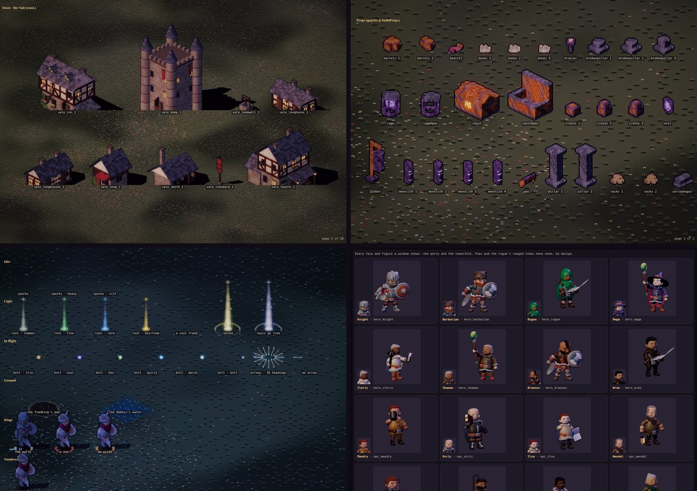
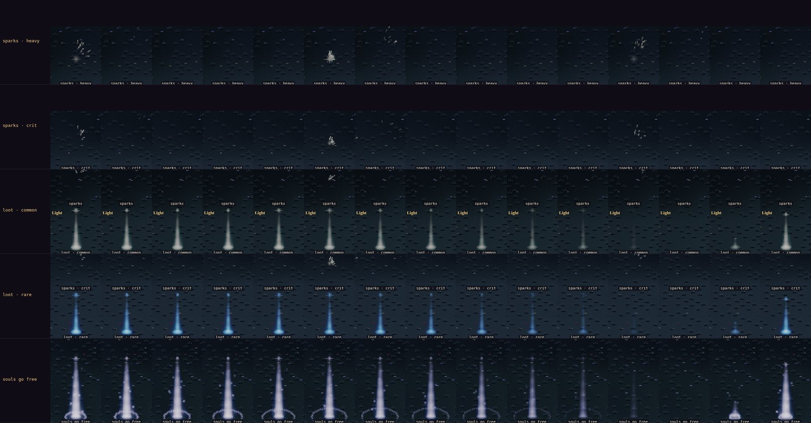
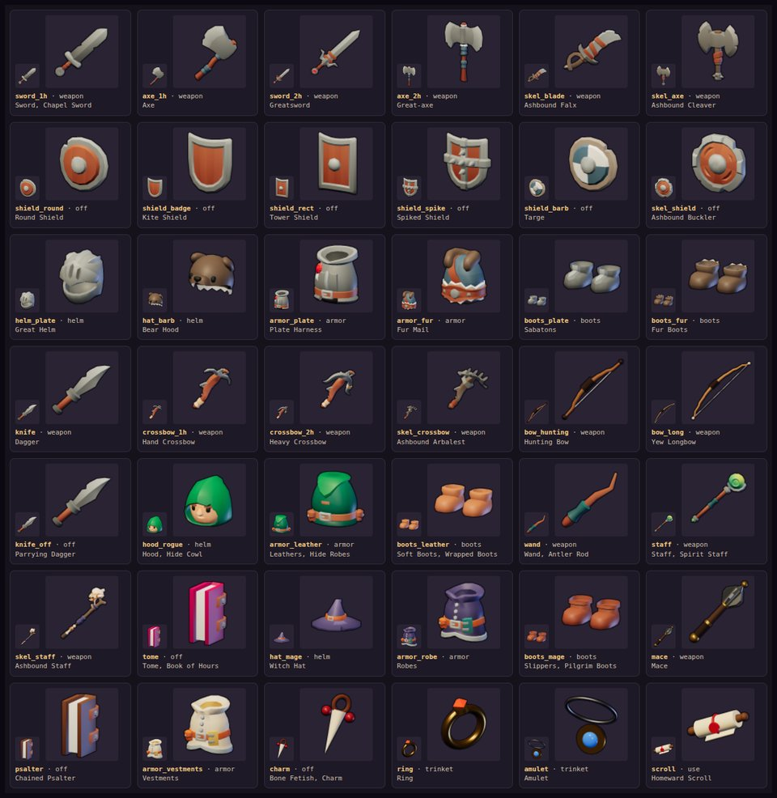

# The art review: every piece of the game's art, drawn the way the game draws it

**Current (2026-10-10).** The owner: *"Make sure you have a bespoke in game rendering view of all game assets and
character and enemy NPCs to easily critic review game art. Same for FX and animations. Use these to more quickly and
reliably review and improve game art."* The first pass made with it is [pass 16](./art-critic-pass-16.md).

The [Stage](./character-stage-proposal.md) already lined up the cast. The review adds a view for everything else,
on the same dev-only page (`?dev&scene=stage`, localhost only), through the same renderer:



*Clockwise from the top left: `show=env` (the Vale's town set, page 2 of 20), `show=props` at zoom 3, the portraits
(`show=faces`), and the effects at night at zoom 2 (`show=fx`).*

## The views

| `show=` | What it lists | Drawn by |
|---|---|---|
| `cast` (as before) | The party, the townsfolk, the foes, the bosses, the wardens: any clip, any facing (`group=`, `clip=`, `dir=`) | The renderer: figures stamped, lit, outlined, bloomed |
| `env` | Every baked environment sprite (`assets/env`): the town sets of the four regions, trees, rocks and mountains, undergrowth, fields and farm, fences, sites and roads, props. Grouped by family, paginated, an idle loop where a sprite has frames (`id~n`). `set=env`, `town-vale`, `town-fens`, `town-reach`, `town-heights` or `all` | The renderer, as world sprites |
| `props` | Every prop the renderer puts on a floor (`gsprite.js buildProps`), every variant: braziers, chests, shrines, pillars, cages, the dungeons' furniture | The renderer |
| `fx` | Every effect, each in its own cell, firing on a loop: hit sparks (plain, heavy, crit), the light columns (loot by rarity, a soul freed, the raising, souls going free), bolts of every kind flying at the game's speed with their trails and bursts (pass 17), arrows at all 16 headings, shockwaves, a foe and a boss going out, the bosses' mud and water, the team rings, the floating numbers over a foe, the marsh-lights, and twelve weapon styles' swings, casts and shots | The renderer's own `fx.js` primitives, depth-tested, in the emissive plane |
| `icons` | Every item icon (`assets/items`), at the bag's size (40 px) and three times it, with its slot and every item that uses it | The UI's own `` |
| `faces` | Every portrait and character-window figure a window shows (`<actor>.face.png`, `.fig.png`): the party and the townsfolk | The UI's own ``, at the UI's sizes |

Every view takes `tod=dawn|day|dusk|night` (or `0..1`), `floor=grass|cobble`, `zoom=1|2|3` and `match=` (a
substring of the id or name). The panel at the top changes any of them, and `env` and `props` page with `‹ page` and
`page ›`. Its controls are 44 px tall.

```
http://localhost:8080/?dev&scene=stage&show=env&set=town-fens&tod=dusk
http://localhost:8080/?dev&scene=stage&show=fx&tod=night&zoom=2&match=bolt
http://localhost:8080/?dev&manual&scene=stage&show=props&zoom=3
```

### Notes

- **Foes have no portrait, by design.** No window shows a foe. The rogue's ranged looks (`hero_rogue_bow` and the
  rest) are the renderer's alone: a window shows `hero_rogue`. So `faces` lists the party and the townsfolk, and the
  browser test fails if any of them is missing a face or a figure.
- **Effects are timed on the render clock.** On `?dev&manual` a capture is the same pixels every run. Pass 16 found
  the floating numbers, the banners and the camera's jolt on the wall clock (below), and moved them.

## Captures (`tools/capture/stage.mjs`)

```bash
node tools/capture/stage.mjs --show env --set all --page all       # every page: page-NN.png
node tools/capture/stage.mjs --show props --zoom 3                 # page-01.png
node tools/capture/stage.mjs --show fx --tod night --zoom 2        # frame-NN.png, loop.html, strips.png
node tools/capture/stage.mjs --show icons                          # sheet.png, the whole grid
node tools/capture/stage.mjs --show faces                          # sheet.png
```

- Into `tools/capture/out/<show>[-set][-match]` (`--out` to change it). Nothing there is committed.
- The review's views default to 1280 × 900 at DPR 1 (a software GPU at DPR 2 timed out). `--size` and `--dpr` change
  them.
- **`strips.png` (effects):** a row for each effect, its cell through every frame. One frame of the page catches most
  effects between firings; a strip shows each one's whole life side by side, so a column of light that fades too
  early or a spark too faint to see is plain at a glance.
- When the effects' grid at zoom 2–3 runs past the window, the capture makes the window taller.
- `icons` and `faces` grow the window to the grid and take it in one still.



*From `strips.png`: heavy and crit sparks, a common and a rare loot column, and souls going free, every other frame at
12 fps, at night at zoom 2. The tile above each row's name shows a little of the row above.*



*`show=icons`.*

## How a critic pass uses it

1. Capture every view at the light the pass is about (dusk is the game's mood; night is where glows show).
2. Look at the sheets at in-game scale first (zoom 1, a 390 px wide window is the phone), then zoom 3 for detail.
3. Fix in the bake config or the lab code (never the baked outputs), or in the renderer, and capture again with the
   same flags to get the after.
4. For a before, serve a `git worktree` of the previous commit and capture from it, or run the cast with `--cmp`.

## Code

- `src/dev/review.js`: the views (`createReview`), the panel and the labels.
- `src/dev/stage.js`: `createStage` hands any `show=` other than `cast` to the review; `makeAnim` is the playback the
  two share.
- `src/render/renderer.js`:
  - `setStage` takes `frame` (draws added each frame: sprites, bolts, arrows, numbers, effects), `afterFx` (effects
    that draw after the particles, the marsh-lights), `hazard` (a ground hazard to paint) and `rings`;
  - `stageLoad` (the town atlases), `envIds` (an atlas's sprite ids), `propKinds`, `floatCount`.
- `tools/capture/stage.mjs`: `--show`, `--set`, `--page`, `--match`, `--dpr`; `strips.png`.
- Test: browser §15c2. Each view opens with no page error and lists everything it should: every base sprite of every
  environment atlas across its pages, every prop variant, every effect, every icon, a face and a figure for everyone a
  window shows, none missing. The numbers keep the render clock.
