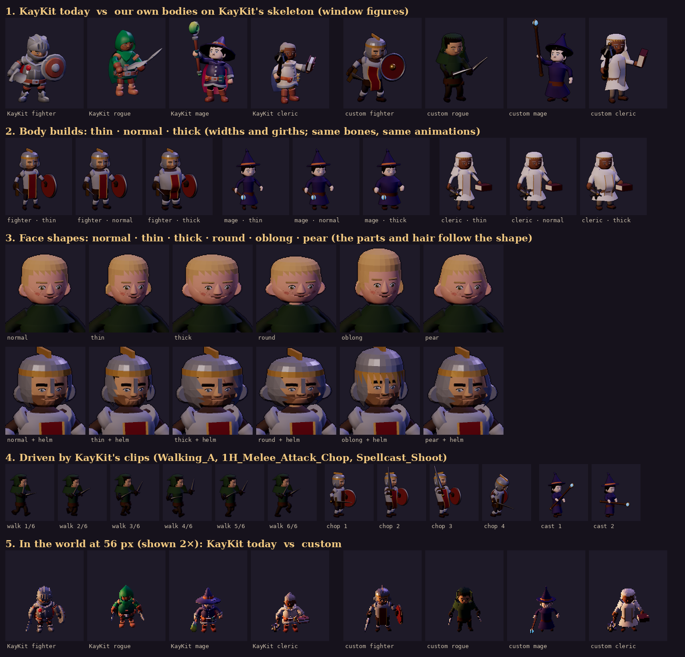

# Body mock-up — our own characters on KayKit's skeleton

**Mock-up, 2026-09-29. Not shipped:** no game atlas uses it yet. It's the evidence for the
parked [character customisation proposal](./character-customization-proposal.md), which has
the options, the recommendation and what to decide.

This mock-up answers one question: what would the main classes look like if we kept only
KayKit's skeleton and animation clips, and built everything visible ourselves? And can body
and face shapes vary?

*Sections:*
1. *KayKit today vs our own bodies, as the character window shows them.*
2. *Body builds.*
3. *Face shapes, bare-headed and under a helm.*
4. *KayKit's clips driving the new bodies.*
5. *Both at in-world size.*

## How it's built (`tools/actor-lab/body.js`)

- **The KayKit meshes are hidden,** the heads and gear included. What remains is KayKit's
  skeleton (the same bones and bind pose) and its 76–95 clips.
- **Bodies are built in code and skinned to that skeleton:**
  - torso, neck, arms, hands, legs and feet are low-poly tubes;
  - each ring of vertices is weighted to its bone and blended across the joint, so elbows,
    knees and hips bend;
  - every KayKit clip drives them unchanged: walk, attack and cast are shown in section 4.
- **Builds** (thin · normal · thick) change widths and girths only. Bone lengths are
  untouched, so the animations still fit. Thick adds a belly at the front only.
- **Clothes.** The body's own colours are the clothes, as they are in KayKit. Each class
  adds layers over them:
  - **Fighter:** breastplate, pauldrons, vambraces, greaves, a tabard with brass trim, a cape.
  - **Rogue:** a mantle, a belt with pouches, a hood with a cowl.
  - **Mage:** a robe whose skirt follows each thigh, and a wizard's hat.
  - **Cleric:** vestments with a gold-trimmed tabard, and a coif with a wimple.
- **Heads** are the face kit (`faces.js`), which gains **face shapes**: normal, thin, thick,
  round, oblong and pear.
  - A shape deforms the skull as a whole.
  - Every part (eyes, brows, nose, mouth, marks) is placed on the deformed skull, and hair
    and beards grow from it.
  - **Headgear** (helm, hood, coif) is grown from the same shaped skull, so it fits every
    face shape; the hat sizes itself from the head's width.
- **Weapons** are ours too (`props.js`: sword, round shield, dagger, staff, book, mace).
  They sit in the hand slots the same way KayKit's weapons do, so the clips carry them.

## What it shows

- **The approach works.** KayKit's skeleton and clips drive our bodies without fitting
  work: the same poses as today, walking, the chop and the cast all play.
- **Body builds and face shapes are just settings.** Any combination with any outfit and
  headgear costs nothing extra to make. Helmets and hoods follow the head's shape.
- **The look is ours, but rougher than KayKit's.**
  - KayKit's figures have sculpted cloth and armour folds, bevelled edges and a colour
    gradient in every swatch.
  - The mock-up is tubes and shells in flat colours.
  - At 56 px in the world (section 5) the gap is small. In the character window it's clear.
- **Rough spots:**
  - hair shows at the helm's front edge on the oblong face;
  - a thick build under a robe changes little;
  - the rogue reads dark in the world;
  - the weapons are simple.

## What it would take to ship (not started)

1. **An art pass on the parts,** to reach KayKit's finish:
   - bevelled plates and trims;
   - cloth folds (a few extra rings with offsets);
   - swatch gradients (vertex colours top to bottom);
   - a second pass on each class's silhouette, done as critic passes like the faces.
2. **Outfits from items.** Each item base names its layers (a breastplate, a robe, a hood),
   so the figure wears what the character equips. That's the gear-on-figure question,
   answered by the live 3D view proposed for the character window.
3. **The appearance in the save.** A durable member field holding build, face shape and
   face parts. It's validated at creation, and it's cosmetic only.
4. **Atlases.** Bake the heroes and townsfolk from it, or bake a character's sprite sheet
   on the device from the live view.
