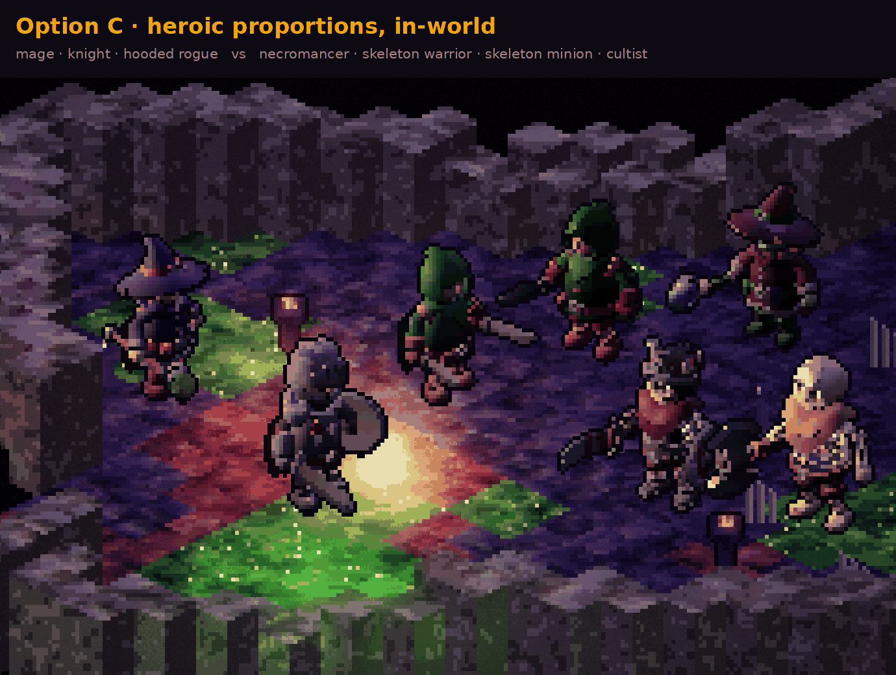
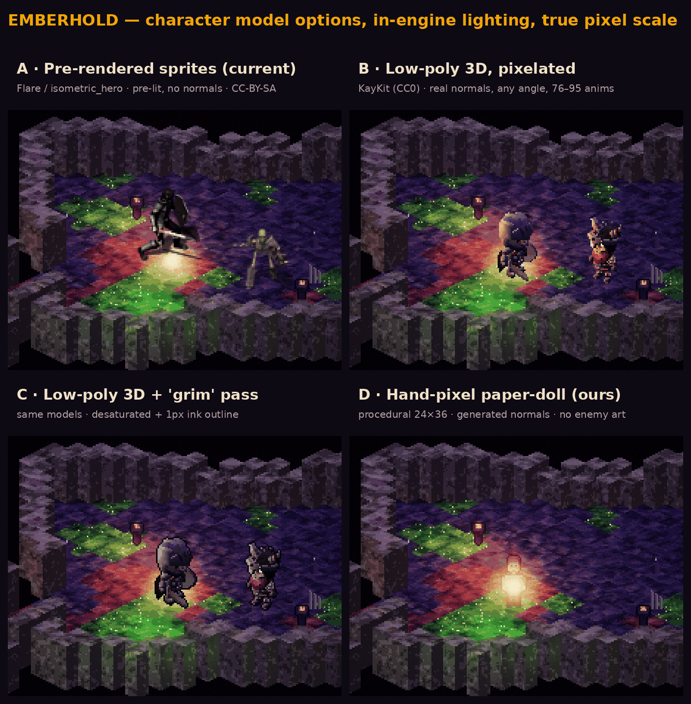
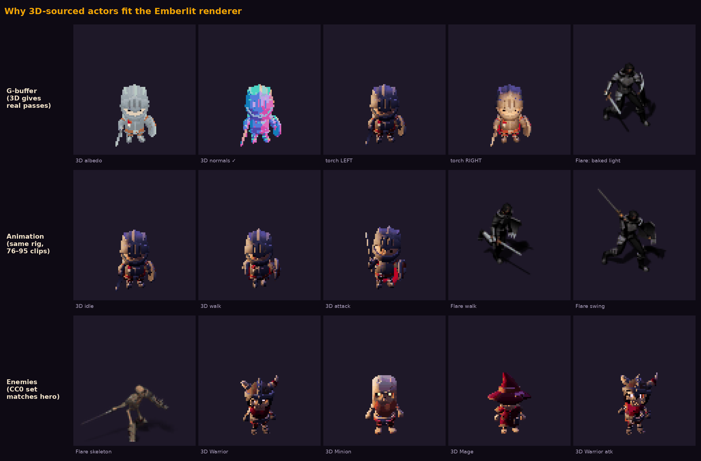
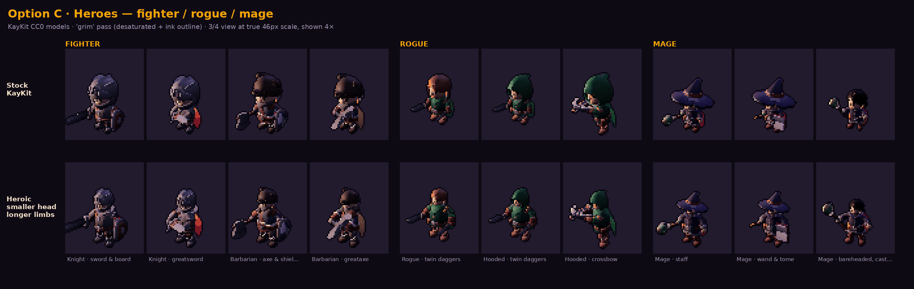
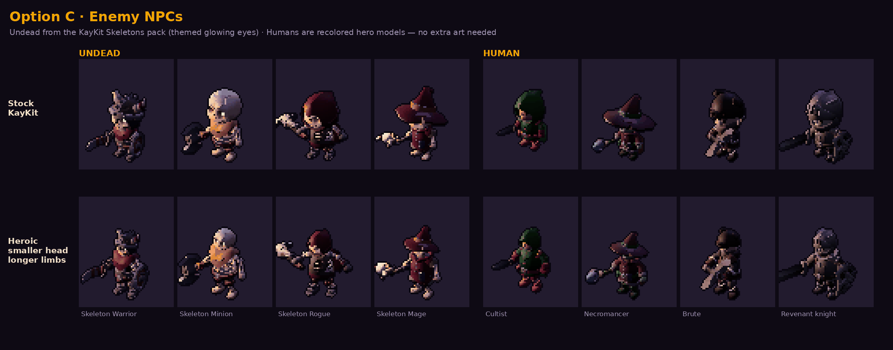

# Character direction — Option C, heroic proportions

**Decided 2026-09-27.** Heroes and enemies come from **KayKit CC0 low-poly 3D models**,
rendered at native pixel size in Emberhold's exact iso camera, with **heroic
proportions** (smaller head, longer limbs) and a **'grim' pass** (desaturated, 1 px ink
outline). This supersedes the pre-rendered Flare / `isometric_hero` sprites from the
hero POC (`874e2e5`). Look-dev tooling: [`tools/actor-lab/`](../tools/actor-lab/README.md).

## Why

The Emberlit renderer is **deferred with per-pixel normals**: actors are lit as surfaces,
not pasted on top. That turns the choice of art source into a technical decision.

| | A · pre-rendered sprites (Flare / isometric_hero) | **C · KayKit 3D, heroic + grim** |
|---|---|---|
| Lighting | Lighting baked into the art; can't answer our torch | **Real normals** — torch wraps the figure as it moves |
| Facing | 8 fixed directions | Any angle (bake 8 or 16, or render live later) |
| Animation | ~10 clips | **76–95 clips** on one shared rig (attacks, Hit, Block, Dodge, Death, Spellcast; undead Awaken/Spawn/Resurrect) |
| Loadouts | One composited kit per bake | Weapons, shields, helmets, capes are toggleable meshes → loot changes the silhouette |
| Enemies | One skeleton | Four matching undead + recolored humans on the same rig |
| License | CC BY-SA 3.0 (share-alike) / unconfirmed | **CC0** — no attribution, no share-alike |

Stock KayKit (**option B**) won every technical axis but its chibi big-head style read
toy-like against the Dreadforge/Emberlit mood. The heroic pass keeps the pipeline and
fixes the proportions. **D** (our hand-drawn paper-doll) was too small and flat, and had no enemy art.

## Roster explored

- **Fighter** — Knight · sword & board, Knight · greatsword, Barbarian · axe & shield, Barbarian · greataxe
- **Rogue** — twin daggers, hooded · twin daggers, hooded · crossbow
- **Mage** — staff, wand & tome, bareheaded · casting

- **Undead** (KayKit Skeletons) — Warrior, Minion, Rogue, Mage, each with its own glowing-eye tint
  (violet, poison green, ember, ice blue). The eyes are a separate mesh, so they feed the emissive buffer.
- **Human NPCs** (recolored hero models, no new art) — Cultist, Necromancer, Brute, Revenant knight.

## The heroic pass

The head bone scales to **0.62×**. Joints are pushed outward so limbs lengthen without
thickening: spine ×1.20, chest ×1.18, neck ×1.10, knee→ankle ×1.50, ankle→foot ×1.45,
elbow→wrist ×1.30. It applies after every pose sample, so all clips keep working. The
values were tuned by eye; they live in `HEROIC` in `tools/actor-lab/lab.js`.

**Grim pass:** 42 % desaturation, cool tint (×0.92 / 0.87 / 1.0), 1 px outline in
`#08050e`. Pixels brighter than 225 (eyes, orbs) stay hot.

## Integration plan (next)

1. **Bake, don't render live (yet).** Extend the lab to write G-buffer atlases — albedo,
   **normal**, emissive — per direction × frame. These drop straight into the existing
   `stamp()` actor path in `renderer.js` (the path the hero POC uses), so actors get
   real normals with almost no engine change.
2. Replace the Flare skeleton and the `isometric_hero` knight. That retires the
   CC BY-SA and unconfirmed-license assets from `assets/`.
3. Later, optionally: render skinned meshes live into the G-buffer for smooth rotation
   and animation blending.

## Open decisions

- **Actor size.** 46 px matches the POC; loadout details (wand vs staff) read better at
  **56–64 px**. It's a scale constant.
- **Starting loadouts** for fighter / rogue / mage.
- **Recolors** are CSS-filter look-dev; ship them as exact palette-swatch remaps.
- The heroic values may want per-class tweaks (e.g. Barbarian bulkier, Rogue lankier).
