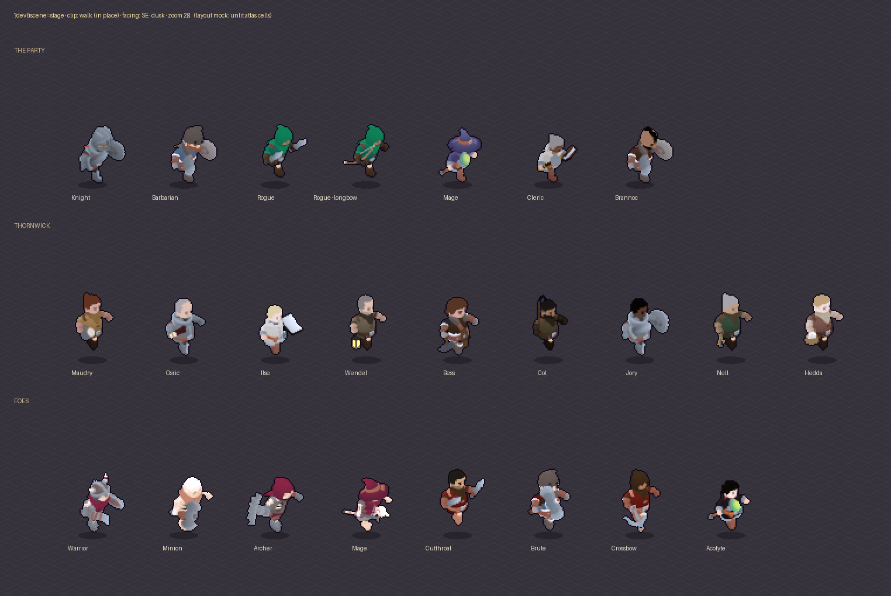

# The Stage — a lineup page for clean character captures (proposal)

**Proposal, 2026-10-02. Not built.** This answers: is there a better way to get clean in-game shots
of the players and NPCs? It proposes a separate page that draws them in lines, animated in place,
none overlapping, through the real renderer.

*A layout mock only, built from unlit atlas cells. The real page draws through Emberlit: lit,
outlined and upscaled exactly as in play.*

## Why

Every critic pass so far has worked around the same problems:

| Way | What it gives | What goes wrong |
|---|---|---|
| In-game captures on the manual clock (passes 3–6) | The real look: lighting, grade, outline, upscale | The world gets in the way. The hero stands in front of the person you're shooting, companions walk into the frame, labels and roofs (x-ray) cover them. Townsfolk wander and turn away. Pass 6 needed four re-framings to get one clean row. |
| Atlas sheets (`front.py`, pass 6) | Every clip, every facing, clean | Unlit albedo, lifted ×1.9 by guess. Not what the player sees. |
| actor-lab boards (`render.cjs`, `compose.py`) | Clean lineups, before the bake | A different light and pipeline from the game's. Good for look-dev, not for judging the result. |

What's missing is the in-game look without the in-game clutter.

## The proposal: `?dev&scene=stage`

A preview scene like `?scene=town`. It's **dev-only and localhost-only** (AGENTS.md: dev hooks
stay local), never saves, and never touches the sim's rules.

**What you see.** A plain lit floor, with characters standing in labelled rows:
- **The party:** every hero look, and each rogue weapon.
- **Thornwick:** the nine townsfolk, and Brannoc.
- **Foes:** the Ashbound, the Redhand, the robes.
- **Bosses:** at their 1.3× scale.

Each figure has its own cell, spaced from its atlas bounds, so nothing overlaps: about 4 per row
on a phone, about 12 on a laptop. Names sit under the feet, never on the figures.

**Animated in place.** Everyone plays a chosen clip and stays on their spot:
- **Walk:** stride-synced as in play. The animator gets a virtual distance; the figure doesn't
  move.
- **Swings, hits and death:** loop with a pause between plays, so one-shots repeat.
- **Weapon effects:** trails, glints and casts draw from the anchors, as in a fight.

**Controls.** URL parameters, for captures that come out the same every time, plus a small
panel:

| Param | Values | What it does |
|---|---|---|
| `group` | `party` `town` `foes` `bosses` `all` · or a list of actor ids | Who's on stage |
| `clip` | `idle` `walk` `attack` `attack2` `heavy` `hit` `death` `fidget` `look` `sit` `spawn` | What they play (an actor without that clip plays idle) |
| `dir` | `0`–`7`, `turn` (a turntable, a facing a second), `all` (each actor in 8 facings, one row each) | Facing |
| `tod` / `light` | `dawn` `day` `dusk` `night` · `town` `dungeon` | The outdoor day (pass 5's light) or a torchlit dungeon floor |
| `floor` | `cobble` `grass` `flag` `plain` | Ground; `plain` is a flat mid-grey, for cut-outs |
| `zoom` | `1` (in-game) `2` `3` | Integer zoom of the same native frame, still pixel-exact |
| `cmp` | a folder, e.g. `/before/` | **Before and after:** each figure stands beside the same actor from another checkout's atlases |

`cmp` is what the critic passes need most. Serve a worktree of the previous commit under
`/before/` and every figure gets a twin on the left: the same clip, facing, frame and light.

**Clock.** With `?dev&manual` you step frames (`__frame(ms)`), so a contact sheet of a clip is the
same pixels on every run.

**Capture tool.** `node tools/capture/stage.mjs [group] [clip] [dir] [--cmp dir]` serves the page,
steps the manual clock, and writes:
- a still per frame;
- a contact sheet (actors × frames);
- an animated GIF or WebP of the loop.

It's the script each critic pass has rewritten by hand.

## How it would be built

- **`src/dev/stage.js`** (new): builds a flat floor world (one walled room, lit for the chosen
  `light`) and a stage list of actors and cells. It feeds the renderer the same draws it makes
  for the party and townsfolk. Presentation only: its per-figure state lives in a `WeakMap`, as
  the renderer's does.
- **`renderer.js`:** a `stage` draw source beside party, NPCs and enemies. It takes positions
  from the stage, not the sim, and a virtual walk distance. No new GL pass; it uses the same
  stamping, lighting and upscale.
- **`main.js`:** `scene=stage` only with `?dev` on localhost; otherwise the scene is refused.
- **Tests:**
  - a browser test opens the stage with `group=all`, waits for every atlas, and checks no two
    figures' drawn boxes meet;
  - a manual-clock run gives identical pixels twice.
- **Docs:** this page becomes **Implemented**, with the AGENTS.md command line.

Rough size: about 250 lines of page and renderer hook, about 100 of capture tool, plus the test.
It's one session's work, with no sim, save or balance change.

## Later, if you want it in the game

The same stage could become a player-facing **"Faces of the Vale"** page in the Journal:
- everyone you've met, turning slowly, with their portrait and a line about them;
- foes you've beaten, bestiary-style.

Content and rules for that (who appears when) belong in the GDD and the world doc first.
The dev page is the first step either way.

## Decision needed

1. **Build the dev Stage as above?** (Recommended.) It turns the art critic captures into one
   command, with the true in-game look and a before/after twin.
2. **Also plan the player-facing gallery?** It would need a GDD entry; not proposed for now.
