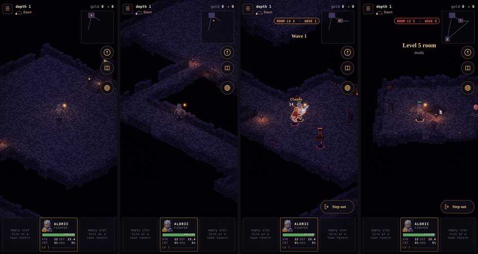
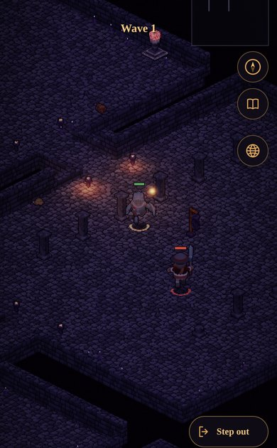

# Proposal: the halls layout (a dungeon as a building)

**Proposed (2026-10-10), for the owner's decision.** The owner: *"Let's design an alternate dungeon layout. The
current one is organic with angled walls and rooms. Propose an alternate that is more like traditional rectangular
rooms as a part of a building with straight and short hallways. Like a traditional isometric dungeon layout."*

This proposes a second layout, **halls**, beside today's (here called **caverns**). A site would pick one. There's a
working prototype, and every picture below of it in the game is the game's own systems running on the prototype's
floor: dressing, stairs, room levels, waves and the renderer, nothing mocked up. The game itself is unchanged.


*The same three seeds and six rooms, top-down at one scale.*
- *Top, today: shapes scattered in the dark, joined by corridors up to 300 tiles long.*
- *Bottom, proposed: one building of rectangular rooms on a grid, every join a short straight hall.*
- *Key: E is the entrance, D the descent room. Sand is a corridor or hall. On the walls, dark is full height and
  light is a cut-down stub (see the walls, below).*

## Today: the caverns (`src/sim/level.js generateLevel`)

- **Rooms:** 6–8 arenas, 40–62 tiles across. They're rectangles, ovals, diamonds and L's, scattered over a 320-tile
  square of void.
- **Corridors:** 6 wide, two straight legs each, from centre to centre. They're often long: 66–90 tiles a join on
  average, and up to 300.
- **Walls:** a ring round every floor, weathered. Whole stretches have fallen away to the abyss, and the rest stand
  at uneven heights.
- **The look:** platforms carved out of the dark. It suits a barrow, a warren or a pit; it doesn't look like a keep,
  a chapel or an abbey.

## The proposal: the halls


*Wickham Keep's first floor on the prototype, 390 × 844, the manual clock. Left to right:*
1. *the entrance, with the stair up against its west wall;*
2. *the hall out of it;*
3. *the first fighting room, wave 1 on;*
4. *the descent room.*

*Today's floor at the same four places:*



### The rules (`tools/dungeon/halls.mjs`)

1. **One building on a grid of bays.**
   - Every column of the grid has one width and every row one depth, so the walls run straight through the whole
     building and rooms line up like rooms in a plan.
   - A bay is 40–62 tiles across: the GDD's arena size (§3.1), unchanged.
   - The grid has a bay or three more than the floor has rooms (2 × 2 to 3 × 2 for four rooms, 3 × 2 to 3 × 3 for
     six, up to 4 × 3 for eight). The empty bays are dark, so a building comes out an L, a T, a U, an S or a block.
2. **Every room is a rectangle that fills its bay.** No ovals or diamonds. The variety comes from the bays' sizes
   and the building's shape.
3. **Rooms join by short straight halls.**
   - A hall runs across the gap between two neighbouring bays, perpendicular to their walls: 6 wide, as today's
     corridors, and **8 or 12 long**.
   - A hall leaves near the middle of its wall (within the middle 60 %). It never turns.
   - The joins are a spanning tree from the entrance's bay, then one or two loops. Neighbours not joined keep a
     blank wall.
   - **Not bare doorways:** a hall is the safe ground a party steps back into out of a fight (GDD §3.1). A doorway
     2 tiles deep would put the party straight into the next room's fight. The first prototype tried that, and the
     numbers showed it.
4. **The walls are cut away toward the camera** (the classic isometric cutaway).
   - Every floor is ringed by a one-tile wall. The camera looks from +x+y, so a wall with floor up-screen of it
     would hide that floor: a full-height wall (5 levels at 6 px each) hides about 7.5 units of x + y behind it.
   - **A wall with floor up-screen within 8 units is cut to a knee-high stub** (`FLOOR_Z + 2`). That's still
     above the climb rule, so it's still a wall to walk into.
   - Everything else stands full height: the building's back walls, and the far (north and west) wall of every
     room.
   - So you see into every room, and you see the building's height where it doesn't hide anything.
   - Room floor hidden behind a wall drops from about 11 % to about 4 %, and what's left is the stubs' own
     footprint.
5. **The entrance is the top-left bay, and the descent room the bay farthest from it.**
   - The stair up goes against the entrance's north or west wall, as today (`world.js placeStairsUp`). Every halls
     entrance has both.
   - The stairwell down (6 × 6) fits in any room.
6. **The same shape as today's level object** (`cells`, `rooms`, `edges`, `spawn`, `entrance`, `descentRoom`). So
   `world.js` dresses, ranks, stairs and fights it unchanged, as the captures show.



*A fighting room: a rectangle with a colonnade dressing, its north and west walls full height, its south and east
walls cut to stubs. The next room shows past the stub, across the dark between bays.*

### Measured (`node tools/dungeon/plans.mjs`, 24 seeds each)

| Over 24 seeds | Caverns (today) | Halls (proposed) |
|---|---|---|
| **Six rooms** (Wickham Keep, the Chapel, the Locks) | | |
| Tiles walked from the entrance to the descent room | 351 | **197** |
| Corridor length a join (tiles) | 73 | **10** |
| Corridor share of the floor | 18 % | **2 %** |
| Span of the level (tiles) | 280 | **179** |
| Room floor hidden behind a wall from the camera | 11.2 % | **3.8 %** |
| **Four rooms** (the Abbey, the Undercroft) | | |
| Tiles walked from the entrance to the descent room | 317 | **133** |
| Corridor length a join (tiles) | 90 | **10** |
| Room floor hidden behind a wall from the camera | 11.1 % | **3.8 %** |
| **The Old Barrows** (6–8 rooms) | | |
| Tiles walked from the entrance to the descent room | 369 | **236** |
| Corridor length a join (tiles) | 66 | **10** |
| Room floor hidden behind a wall from the camera | 11.1 % | **3.8 %** |

On Wickham Keep's first floor in the game, from the entrance to the first fighting room: **133 tiles, 78 of them
corridor**, against **60 tiles, 8 of them hall**.

## What stays the same (the GDD's contract, §3)

- Rooms are arenas 40–62 tiles across, and a floor has the site's room count.
- The ways between rooms are 6 wide and safe. Foes are leashed to their room.
- The entrance is a sanctuary. A stone stair against its back wall leads up.
- The descent room holds the floor's boss and the stairwell down.
- Room levels by walking distance from the entrance; waves, tides and caps; the dressing themes (colonnade,
  crypt, nave, storehouse, camp); chests and shrines; the minimap with its rooms and joins.
- Everything is a pure function of the seed: the prototype draws from its own mulberry32 stream and
  `sim/detmath`.

## What changes in play

- **Much less walking.** A floor's walk from the entrance to the descent room drops by 36–58 %: from 351 tiles
  to 197 on a six-room floor, and from 317 to 133 on a four-room one.
  - More of an hour is spent fighting, so XP and loot **an hour** rise somewhat, while a fight itself is unchanged.
  - The headless farm (`tools/balance/loot.mjs`) needs a run on the halls before any site moves.
  - The room-level harness (`roomlv.mjs`) isn't affected: it measures one room.
- **The next room is in view.** A stub wall doesn't stop the eye: you see the room you're about to walk into.
  That's part of the traditional look, and its foes don't exist until you cross the doorway.
- **Retreat is short.** A hall is 8–12 tiles, so stepping out of a fight is a few steps, not a long walk back. It
  holds a party of four (6 × 8 at least).
- **A visit in progress** would see different floors if its site changes layout. The change would bump
  `SAVE_VERSION`; the migration ends a visit that's under way on a site that changed, putting you at the site's door.

## Which sites (the owner's call)

The halls suit what was built; the caverns suit what was dug or grown. Recommended:

| Site | Recommended | Why |
|---|---|---|
| The Tithe Mill | **halls** | a mill and its stores |
| Wickham Keep | **halls** | a keep: the clearest case |
| The Sunken Chapel | **halls** | a chapel and its undercroft (a nave in every room theme already) |
| The Canal Locks | **halls** | the lock-keepers' halls (its theme is already "Lock Halls") |
| The Drowned Abbey | **halls** | an abbey, three floors of it |
| The Reedholm Undercroft | **halls** | the copy-room under the priory |
| The Ninth Milestone | halls? | an old imperial stop. Built, but one floor of four rooms and a vault: either works |
| The Mere Tower | halls? | two rooms a landing. A tower's floors would suit two bays, but its waves are its own system |
| The Old Barrows | **caverns** | barrows dug into the hill, going down without end: the abyss look is theirs |
| The Scrag Warren | **caverns** | goblin tunnels |
| Toadking's Mound | **caverns** | an island of mud and stolen boats |
| The Sickpools | **caverns** | pools and the harvest |

## What it would take

**Slice 1: the sim.**
- Move the prototype into `src/sim/` (`halls.js`, `// @ts-check`). `generateLevel` takes `opts.layout`, and
  `sites.js` gets a `layout` field (default `'caverns'`, so nothing moves unless a site asks).
- Tests:
  - every room 40–62 across and joined;
  - every hall 6 wide, 8–12 long and straight;
  - the ring closed, and the stub rule;
  - the stairs fitting, and ranks by walk;
  - determinism and the smoke replay.
- `SAVE_VERSION` and the migration.

**Slice 2: the art.** The caverns' walls are rubble, weathered on purpose; a building wants:
- dressed stone in courses;
- a lintel or an arch where a hall leaves a full-height wall;
- a broken-off top on a stub, so it reads as cut away, not as a low wall someone built;
- flagstones in the rooms and a runner down the halls;
- the void between bays kept black.

These are renderer and bake work (`emberlit-tdd.md`), measured with captures as the passes do.

**Slice 3: the passes.**
- A critic pass in the game on two sites (Wickham Keep, the Abbey).
- The headless farm before and after.
- GDD §3.1 (the two layouts), and the sites in the world doc if any canon changes (none is proposed).

## Decisions wanted

1. **Go ahead with halls as a second layout?** And the sites in the table above?
2. **Hall length:** 8–12 (as prototyped), or longer (12–16) for more room to retreat?
3. **A great hall for the boss:** let the descent room span two bays (up to about 110 × 60) on the halls sites? That's
   grander, but a bigger arena changes the boss fights, so it would need the boss harness (`boss.mjs`) first.
4. **The cutaway:** stubs (as prototyped), or walls that fade only where the party is behind them (more of the
   building's height, more renderer work)?

## Tools

```bash
node tools/dungeon/plans.mjs [seeds]                 # caverns vs halls top-down at one scale → docs/img/dungeon/plans.png, and the numbers
node tools/dungeon/capture.mjs [site] [out]          # both layouts in the game (needs npm run serve): entrance, hall, room, descent
```
