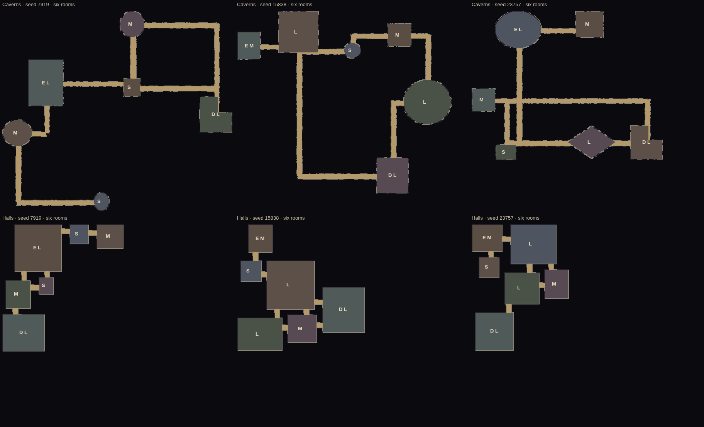
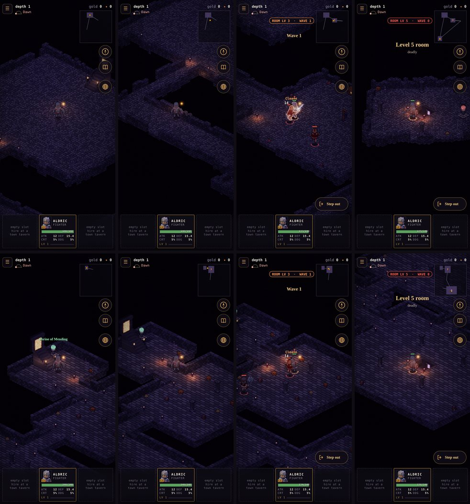
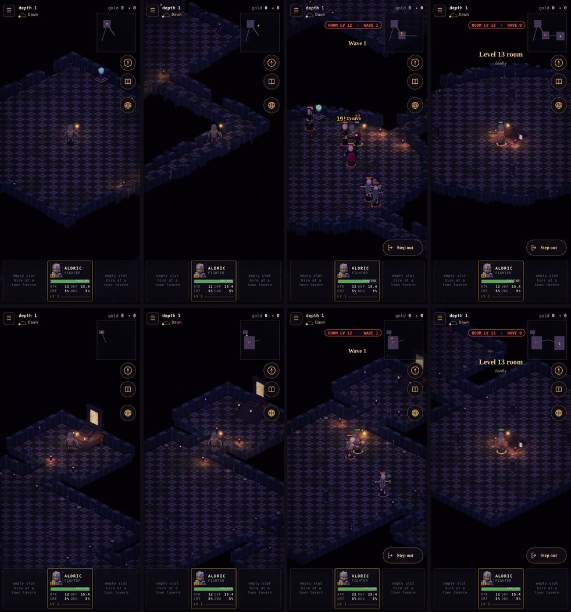
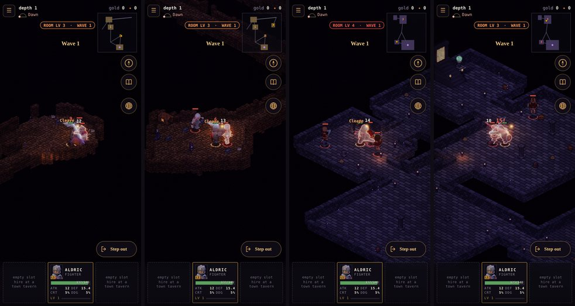

# The halls layout, and rooms in three sizes

**Implemented (2026-10-10).** Proposed the same day and decided by the owner:
- the ask: *"Let's design an alternate dungeon layout… more like traditional rectangular rooms as a part of a building
  with straight and short hallways. Like a traditional isometric dungeon layout."*
- the decision: *"Go with recommendation. But both halls and the cavern style rooms should generally come in 3 sizes,
  small, medium and large with large being what you currently have designed."*

The files:
- `src/sim/halls.js` (the halls) and `src/sim/level.js` (sizes, the layout switch, the caverns);
- `src/sim/sites.js` (`layout`) and `src/sim/battle.js` (`SIZE_CAP`);
- `src/render/renderer.js` (the halls' stone), `src/persist/save.js` (v30);
- `test/layout.test.mjs`, `tools/dungeon/`. GDD §3.1 v1.46.

*`node tools/dungeon/plans.mjs`: the same three seeds, six rooms, top-down at one scale.*
- *E is the entrance, D the descent room; S, M and L each room's size.*
- *Sand is a corridor or hall.*
- *On the walls, dark is full height, and light is a stub cut down toward the camera.*

## Two layouts

A site picks one (`sites.js layout`):

| Layout | What it looks like | Sites |
|---|---|---|
| **Halls** (new) | One building of rectangular rooms, joined by short straight halls | The Tithe Mill, Wickham Keep, the Sunken Chapel, the Ninth Milestone, the Canal Locks, the Drowned Abbey, the Mere Tower, the Reedholm Undercroft: what was built |
| **Caverns** (as before) | Rooms of any shape scattered in the abyss, corridors between, the walls weathered | The Old Barrows, the Scrag Warren, Toadking's Mound, the Sickpools: what was dug or grew |

### The halls (`src/sim/halls.js`)

- **Rows of rooms, the building's wings, west to east.**
  - Each room settles just below whatever already stands over it (skyline packing), so a join down is never a long
    hall past a shallow room. A row starts a few tiles in or out of the one above, so a building comes out stepped,
    an L or a T.
- **Every room a rectangle**, of its size (below).
- **Every join a straight hall, 6 wide and 8–12 long.**
  - It runs between two rooms that face each other across 10+ tiles of wall, near the middle of what they share,
    with nothing else in the way.
  - It's never a bare doorway: a hall is the safe ground a party steps back into out of a fight (GDD §3.1).
  - The joins are a spanning tree from the entrance, then a loop or two. A floor that can't be joined by halls of
    14 or less takes the shortest longer one. Over 160 test floors, 95 % of halls are 14 or less and every room is
    joined.
- **The walls are cut away toward the camera**, the classic isometric cutaway.
  - A full-height wall hides about 7.5 units of x + y behind it. So a wall with floor up-screen within 8 units is a
    knee-high stub (`FLOOR_Z + 2`, still a wall to walk into).
  - The rest stand full height: the building's back walls, and every room's north and west walls.
- **The stair up** is built against the entrance's north or west wall, both of which always stand (the entrance is
  the first room of the first row). **The descent room** is the last room of the last row.
- **The look:** a halls site whose theme has no style of its own is dressed stone, flagstone floors and ashlar walls
  in courses (`renderer.js styleOf`). The Abbey keeps its temple checker, and the Locks were flagstone already.

*Wickham Keep's first floor, before (top) and after (bottom), at 390 × 844 on the manual clock (`node
tools/dungeon/capture.mjs wickham_keep`). Left to right:*
1. *the entrance with its stair up;*
2. *the corridor or hall out of it;*
3. *the first fighting room, wave 1 on;*
4. *the descent room.*

*From the entrance to the first fight it was 133 tiles, 78 of them corridor. Now it's 42, 8 of them hall.*

*The Drowned Abbey's first floor, before (top) and after (bottom), in its temple checker: 144 tiles to the first
fight, 87 of them corridor; now 65, 8 of them hall.*

### Rooms in three sizes (`src/sim/level.js ROOM_SIZES`)

| Size | Tiles across, each way |
|---|---|
| Small | 18–26 |
| Medium | 28–38 |
| Large | 40–62: the GDD's arena, as every room was |

- **A floor's descent room, its boss's hall, is always large**, so the boss fights are as they were.
- **The other rooms come from a bag of the three, shuffled** (`sizesFor`), so a floor of four or more has some of each.
  A six-room floor averages 1.5 small, 1.8 medium and 2.7 large (with the descent room).
- **In the caverns, sizes don't move anything.**
  - They're decided on their own stream after the rooms are placed. A room shrinks about its own middle, so every
    room and corridor stands where it did, and a large room is exactly the room it was.
  - A small diamond would be a pinch, so it's an oval.
  - The entrance is never small: corridors cross it, and a small oval had no stretch of back wall left for the stair
    up. Its north and west walls always stand now, too.
- **In the halls, each room is built at its size.**

*Left to right: a cavern's small room and medium room (the Old Barrows), then a hall's (Wickham Keep), each with its
fight on.*

## Measured

### The floors (`node tools/dungeon/plans.mjs`, 24 seeds)

| Six rooms | Caverns before | Caverns | Halls |
|---|---|---|---|
| Tiles walked from the entrance to the descent room | 351 | 351 | **176** |
| Corridor or hall a join (tiles) | 73 | 86 | **11** |
| The longest unbroken run of corridor or hall | — | 270 | **14** |
| Corridor share of the floor | 18 % | 30 % | **4 %** |
| Room floor hidden behind a wall from the camera | 11.2 % | 13.5 % | **4.4 %** |

- The caverns' walk is the same: the rooms stand where they did.
- Their corridors run a little further into the smaller rooms, and the floor has less room in it, so corridors take
  a bigger share.
- Four-room floors (the Abbey, the Undercroft, the Milestone) walk 319 → **121** in the halls.

### The fights (`node tools/balance/roomlv.mjs … --size`, 300 s, three seeds)

At first a small room sent the full wave and was the hardest: the right party at level 9 held 9.3 waves there, where
the contract wants 10+. Sending one fewer at every level made it the easiest instead: 33 waves at level 3 against 24
in a large room.

So **a small room holds four foes at once at most** (`battle.js SIZE_CAP`). That's the wave's five from level 8 on;
below that the wave is four or fewer and unchanged. Medium and large rooms take the full wave.

Waves the right party (fighter, rogue, cleric) holds in a same-level room, averaged over three seeds ("before" is the
first room of the old floors, all large):

| Level | Before | Large | Medium | Small |
|---|---|---|---|---|
| 3 | 23.3 | 24.3 | 26.3 | 27.3 |
| 6 | 16.3 | 16.7 | 17.3 | 15.0 |
| 9 | 13.0 | 13.3 | **10.7** | 15.0 |
| 12 | 12.0 | 13.0 | **10.3** | 15.0 |
| 15 | 11.7 | 11.3 | 11.3 | 14.7 |

- The smoke test's contract fights in a large room, and its numbers are unchanged.
- **Medium rooms at levels 9 and 12 sit at the contract's edge.** Over five seeds: 10–11 waves at 9; at 12, 7 to 13
  (one seed fell at 7). That's the one knob left open (below).

### Play (`node tools/balance/loot.mjs`, the Old Barrows, levels 3, 6 and 9, one hour each)

Over the seed pairs that could be compared (two runs aren't usable: one before-run stalled at 4 waves, and the
level-9 seed-99 pair timed out):
- waves fought an hour rose about 7 % (219 → 234), from the smaller rooms' quicker fights;
- drops an hour were about the same (commons 5.3 → 6.1, Fines 1.0 → 1.1);
- one before-run on the level-9 farm wiped 6 times; none of the after-runs did.

## Saves (v30)

A dungeon's floors are new, so a visit under way can't be read back onto them: opened chests, the fog, the other
floors and where you stood are all keyed by tiles. A v29 save in a dungeon starts the visit again on the site's first
floor, in its entrance (`save.js visitFor`). A save anywhere else keeps its place.

## Tests

- **`test/layout.test.mjs`:**
  - both layouts: sizes in range, the descent room large, a floor of four or more has all three sizes, a cavern
    entrance never small;
  - every room joined, the same floor from the same seed;
  - caverns' rooms where they were;
  - halls: whole rectangles, straight halls 6 wide, at least 8 long and 95 % at 14 or less;
  - the stub rule;
  - each site on its layout, the stair up standing;
  - a small room's wave capped at four.
- **`test/save.test.mjs`:** v29 → v30.
- **`test/shaman.test.mjs`:** its fights are now in a large room, and its Hex check gathers the foes into a knot; it
  had leaned on a lucky clump.
- **`smoke-test.mjs`:** the contract in a large room. **`tools/balance/roomlv.mjs --size`**.

## Left as they are

- **Medium rooms at levels 9–12** hold 10–11 waves against a large room's 13. They're inside the contract on average,
  at its edge on a bad seed. If they should match the large rooms, the knob is `SIZE_CAP` (medium at four from level
  10, say), measured the same way.
- **Lintels and arches** where a hall leaves a full-height wall, and a broken top on the stubs, aren't drawn. The
  terrain is height columns with no bridging pieces; they'd want a baked piece each (`bake-env.cjs`). The stubs read as
  cut away in the captures.
- **A great hall** (a boss room spanning two rooms' space) wasn't taken up: the boss fights are measured in large
  rooms as they are.
