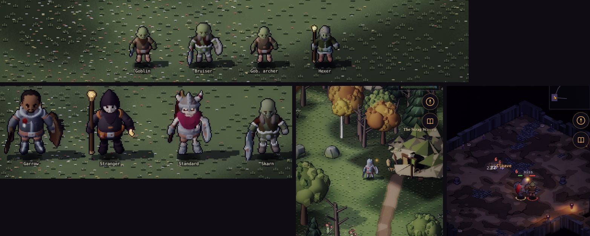
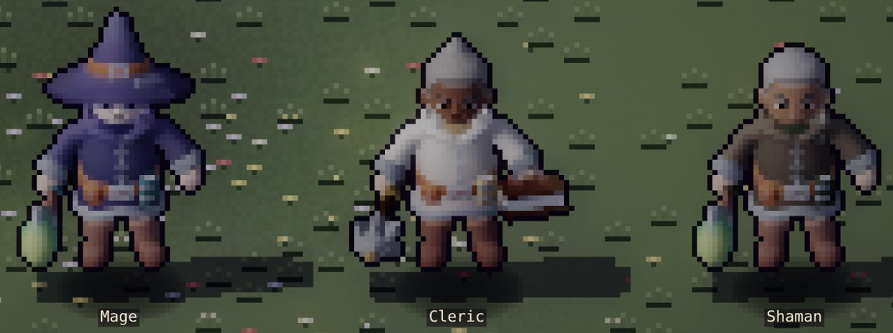
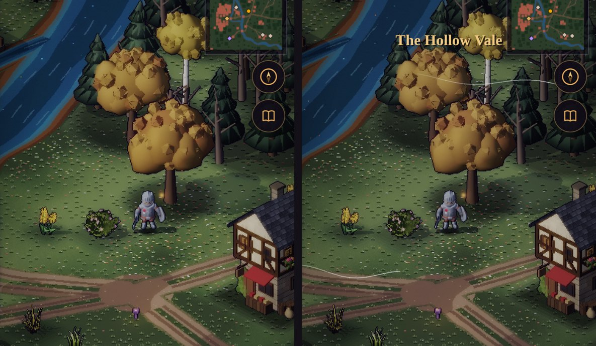
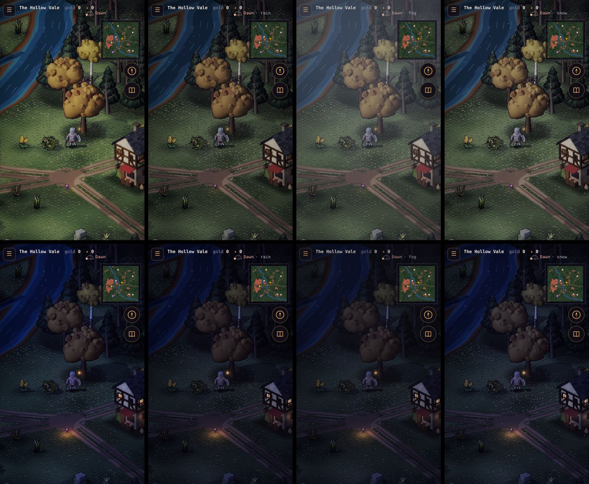
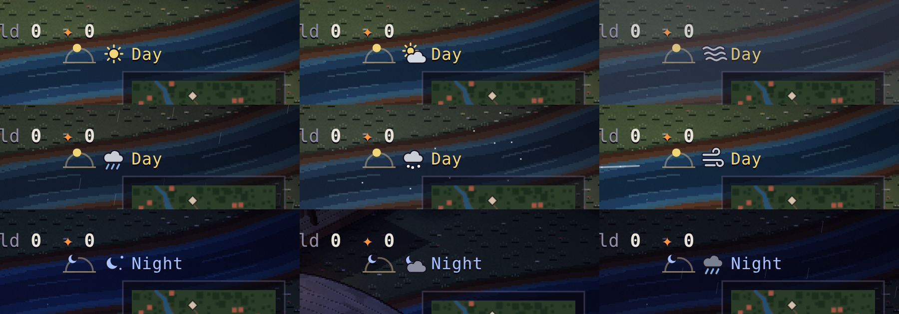
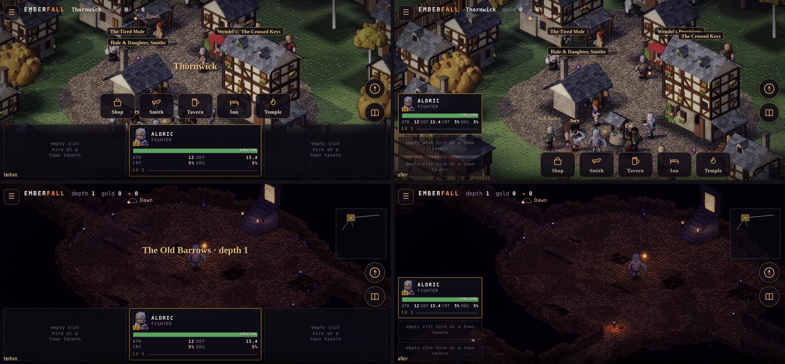
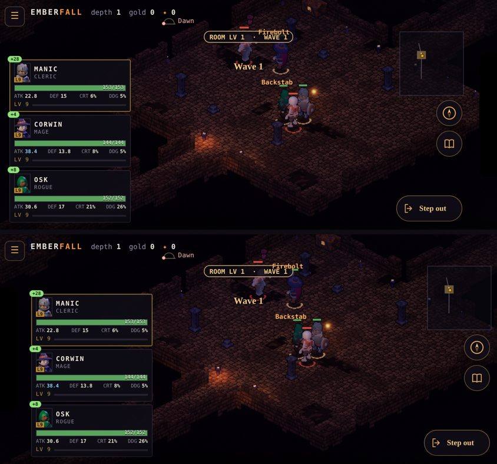

# Emberfall — Game Design Document

**v1.38 · 2026-10-05 · Plan of record for game design.** v1.38 (§7, §6.3): much slower levels: each level takes 15 % longer than the last, from 20 minutes for level 2 (level 30 in ~126 h of fighting, was ~8 h); expeditions pay a share of active play's XP a minute. v1.37 (§10, §6.2): Saltmere has an inn, the Stilt House (rest, the bench, expeditions); no two in a company share a name. v1.36 (§17): the ground hazard, and the Fens' bosses: the Toadking's mud, Brother Teague's cage, the Drowned Choir's Vespers, the Abbess Below's bells. v1.35 (§17, §10.1): only an elite harvester drops a cage, and the party breaks a cage near it on its own after 3 s with no foe standing; the top bar is two lines, the shrines' boons and Weakened on a third while lit. v1.34 (§17): the Mere Tower's wardens leave their heirlooms, once a bracket, for a class in the party. v1.33 (§6.3): expeditions: send a benched companion on the Guild's road work for 15 min, an hour or four; back with XP, gold and maybe a find. v1.32 (§12): offline progress is in: the time away (up to 4 h) is played through on the same sim behind a progress screen, then summed up. v1.31 (§17): the Mere Tower is in, ahead of Solmere: Wenna's punt from Saltmere from level 12, waves compounding 6 % from a level-9 room, a warden every tenth, no XP, a satchel banked at each landing. v1.30 (§3.6, §8): shrines of three kinds (green mends, red +25 % ATK and blue +25 % DEF for 2 minutes); every company carries one Homeward Scroll. v1.29 (§3.7): no impassable pools in rooms; one or two pillars, monoliths or gibbets out on the floor instead. v1.28 (§17): lamps, cages and the count are in. v1.27 (§9): each town's board posts its own land's jobs; Saltmere's the Fens'. v1.26 (§10): no stream or bridge before Thornwick's gate, on the Vale or in the town. v1.25 (§3): the Fens' own fill the Fens' sites, each mirroring an Ashbound role. v1.24 (§10): a waystation's bar shows its two services, and the sim refuses the ones it lacks by name. v1.23 (§17) brings in **the Old Provinces**, decided by the owner: six regions to a cap of 75, one town each, numbers that compound before any band past 30, skill tiers and a loadout, lamps and the count, the Bowl, the Mere Tower and the Great Beacon (canon in world doc v1.20). v1.22 (§10.1): the weather's icon beside the sky dial, the icon alone, with the word in the dial's tap; clear spells are sunny or partly sunny. v1.21 (§10.1): the wind shows as long, thin gust lines that come and go; the birds, the owl and the dungeon drips are single calls at least 10 s apart; and every kind of sound, the music too, has its own volume slider. v1.20 adds **weather** (§10.1): rain, fog, snow and wind in spells of 20 minutes or more, on the Vale and in the towns, set by the seed and the clock. It's quiet on the screen (mostly the light) and has its own sound. v1.19 opens the **Scrag Warren** (§3, levels 2–5, two floors) under the north range: the hill goblins (skirmisher, bruiser, archer, hexer), and Old Skarn, whose drum brings two more goblins out of the tunnels every 10 s while he stands. Hedda's side quest *Hens Under the Hill* sends you to him. v1.19 also adds a fifth class, the **Shaman** (§5; the hedge-callers, world doc §4): a ranged support with a stacking Spirit Drain that mends the party as it ticks, a party heal over time with an ATK lift (Ancestors' Breath, Col's trial *Old Roads*), and Hex on a knot of foes. It's playable at creation and sits last at every tavern's table. v1.18 sets down the owner's **key pillars** (§1): level-gated skills learned from quests, optional companions worth 5–25 % each, waves that pay for their danger, online and offline grinding on the same rules (with premium windows), the main story apart from side quests, play styles from party make-up, and single-player now with shared spaces later. §12's offline rules follow them. v1.17 adds the one thing the shop sells besides gear: the **Homeward Scroll** (§8), 300 gold or rare loot, read once to stand on the nearest town's square; still no draughts. v1.16 cuts dropped gold (a kill's, a chest's) to 70 % (§8), quest and board rewards unchanged; and those who shoot hold a stand-off (§5, *Bows and crossbows*). v1.15 lays out the towns (§10;
docs/town-layout-proposal.md). Each town is walled: a timber palisade in Thornwick, stone in the later
regions. Its one gate stands on the road where it crosses a stream, and a high street leads up to the
square. Every service's entrance faces the well, so their places in the square change once. On the
approach road the camera leads toward the gate.

v1.14 asks before a shrine is used (§3.6):
touching one opens a card that says what its blessing would do, with Use or Close.

v1.13 opens the forge and the shop (§8, §11):
smith upgrades +1…+5, reforging a trait and salvage at Hale & Daughter's; Wendel's sells the day's
plain gear at your level, buys what you won't use and lets you buy it back. **No draughts**: what keeps
a party standing is who's in it. Elites now drop 1 cinder and bosses 5, so the forge has a second
source besides salvage.

v1.12 settles the words (dialogue critic
pass 1, world doc v1.13): a companion dead until raised is **Slain** (it was Fallen; the code keeps
`fallen`), a lost room's party is **beaten**, the ✦ salvage currency is **cinders** (it was
Embers), and the HUD's Weakened tag shows the minutes left.

v1.11 makes a new companion a time
investment as well as a gold one (§6): a tavern hire, or Brannoc, joins at **half your level, rounded
up**, and learns the rest at your side. Changing companions now costs levels, so you think about it.

v1.10 makes an in-game day an hour of play
(it was 24 minutes) and shows it (§10.1): dawn, day, dusk and night light the town and the overland
differently, and a small sky dial under the cinders tells you which it is. The wage is still paid once
a dawn, the same amount; so are the board, the tavern's roster and the temple's free raise.

v1.9 makes companions a choice and a gold
sink (§6.2): Lantern Guild ranks, a signing fee and a dawn wage, rolled perks for theorycrafting,
loyalty, and the tavern's Ask around and Retrain. It also makes the old tavern traits real.

v1.8 gives the rogue bows and lets its
bows and crossbows shoot (§5, *Bows and crossbows*; §8): a rogue holding one fights from range
instead of closing in.

v1.7 triples the XP a level takes (§7): 300 × L^1.6, so each level is three times the play.

v1.6 caps the tide (§3.3): waves climb to a
top, then fall back and climb again, so a party strong enough for the top can farm a room as long
as it likes.

v1.5 rebalances fights (§7.1): the room sets
the wave, not the party; waves rise with a tide; lulls are a breath, not a full recovery; gear
carries a real share of your power; companions share XP. A lone hero beats level-1 foes but can't
farm them, and same-level rooms from level 4 want the right party in gear at your level.

v1.4 puts the Lantern Guild's board up
(§9): five templates, a new board each in-game day, three jobs held at once.

v1.3 gives every dungeon floor a stair up, one floor at a time, and a site remembers its floors
for the visit (§3.1).

v1.2 adds:
- attributes and stat points (§4.1);
- skills and stances (§5.1);
- character creation and origins (§6.1);
- death and resurrection (§3.6);
- special loot sources (§8);
- hero quests, discovery and the Journal (§9);
- the multiplayer phases (§12).

The build order moved to [development-plan.md](./development-plan.md) and the tech stack to
[architecture.md](./architecture.md). All narrative text is pre-written: there is no
runtime text generation. v1.1 added room-based battles with respawning waves (§3). This supersedes the *game design*
sections of [emberhold-design.md](./emberhold-design.md) (the Necesse-style survival/colony
sandbox is retired). It does **not** supersede the technical architecture (headless
deterministic sim, seed-plus-diff saves, iso renderer), which this design is built on. The
world, story and factions are in [emberfall-world.md](./emberfall-world.md). The art
prototype of record is the current build: Emberlit renderer, cobble tiles with material
variants, and 56 px KayKit actors (see [character-direction.md](./character-direction.md) and
[tile-styles.md](./tile-styles.md)).

> **Working title change:** *Emberhold* → **Emberfall**. The build still says EMBERHOLD; the
> rename is a separate small change.

---

## 1. Vision

**One-liner:** a classic D&D-paperback adventure in a forgotten backwater. You lead a party of
three through towns, overland roads, keeps and dungeons. Battles fight themselves; you choose
the quests, the party, the gear and the tactics.

**Pillars**
1. **Explore.** A fogged overland of small towns and dangerous sites; every dungeon floor
   reveals itself room by room.
2. **Battle, automatically.** Walk into a room with enemies and the party fights on its own.
   Enemies keep respawning until you leave or fall. You steer (position, focus, stance, when
   to leave) but never micro. Readable on a phone at arm's length.
3. **Grow by grinding.** Enemies scale region by region. Progress comes from repeat quests,
   deeper floors and slowly earned gear. The grind is the game, so it must feel good.
4. **Loot is rare and matters.** Few drops, all class-specific, each a visible upgrade on the
   figure itself.
5. **The world holds together.** Every quest, place and enemy comes from one narrative. History
   is discovered in fragments, never lectured.
6. **Plays anywhere.** One thumb, portrait, fully offline. The party keeps adventuring while
   you're away. Multiplayer comes later, on the same deterministic sim.

**Key pillars (the owner, v1.18).** What every feature is checked against:
1. **Skills are earned.** Each skill unlocks at a level and is learned from a quest (the class trials,
   §5.1), never bought. Level gates when; the quest is how.
2. **Companions help; they aren't required.** A lone hero can play the whole game. Each companion
   adds roughly **5 % to 25 %** to the party's combat strength: a green Hand at the bottom, a
   **Beacon** at full loyalty at the top (§6.2). The contract tests hold this band.
3. **Waves that pay for their danger.** A dungeon room's foes come in waves, each a little harder
   than the last (the tide, §3.3), and each pays a little more. Staying is a wager; walking out is
   always allowed.
4. **Grind online and offline, on the same rules.** Offline is the same sim: the same XP, loot and
   wages, and the same risk. A party can be beaten offline, so don't leave it in a room it can't
   hold (§12).
5. **The main story stands apart from side quests.** Chapter quests are the main story: they read
   as such everywhere (★, gold, listed first). Errands, bounties, trials, companions' chains and
   board jobs are side quests (§9).
6. **Many ways to play, from the party.** Who you bring is the strategy: a healer or none, bows or
   blades, two front-liners or one (§5, §7.1).
7. **Single player now; shared places later.** Every region plays alone. Later, a large city where
   players gather: an Arena, social maps and raid dungeons, a party-up system, and global, guild and
   local chat (§12).
8. **Premium is time and room, never power.**
   - Longer **offline windows**: 4 hours free, then 8, 24 or 36 hours.
   - Up to **two extra main-character slots** (§6.1).
   - Nothing that changes a fight.

**Audience and session:** mobile players who like D&D flavour, autobattlers and idle
progression. Sessions of 3–15 minutes: one quest, a town visit, or a single dungeon floor.

---

## 2. Core loops

| Loop | Length | Beats |
|---|---|---|
| **Room** | 30 s – many min | Enter a room with NPCs → autobattle → wave cleared → a breath → the next wave, a little tougher (the tide) → walk out to recover, or the room wins (§3, §7.1). |
| **Quest** | 3–15 min | Town board → pick a mini-quest → travel overland → site (1–5 floors) → objective → return and turn in. |
| **Growth** | days–weeks | Level up, upgrade gear at the smith, hire or find better companions, raise regional renown → unlock the next act and region → harder enemies → grind again. |
| **Offline** | hours | Leave the party farming a room you've held; results are computed on return (§12). |

---

## 3. Rooms and autobattle

### 3.1 Moving through a map
Every site map (the current dungeon levels) is a set of **defined rooms** linked by
**corridors**. You move in two ways:
- **Virtual stick:** touch anywhere and drag (the floating joystick in the build today).
- **Tap to move:** tap a spot, a doorway or a room on the minimap, and the party walks there by
  the shortest path. Tapping a chest, shrine or the stairs (anywhere on it as drawn, lid and orb included: the
  tap is matched against its sprite, not the floor tile under the finger) walks there and uses it.

The party follows the leader in formation. **Corridors are always safe**: nothing spawns or
fights there. The **entrance room** is a safe sanctuary. On **every floor**, a stone stair
against its back wall leads back up, one floor at a time: on a site's first floor it leads out
to the surface; deeper, it climbs to the floor above, arriving in the corridor just outside that
floor's descent room (never inside it). The **descent room** holds the floor's boss and the
stairs down, which go one floor deeper, arriving at the foot of that floor's stair up. The stairs
down are a stone stairwell 6 tiles by 6 cut into the descent room's floor, a brazier either side
of its top step, the flight going down to an arch lit violet (2026-09-30; before, a small marker
on one tile: `docs/stairs-down-before-after.png`). Nothing walks over it; any tile of it takes
you down from its rim. No stair
skips a floor. A site remembers every floor you've been on for the visit (chests opened, growths
cut, the map uncovered), so going up and down can't refill them; leaving the site ends the visit.

**Room size.** Rooms are arenas: 40–62 tiles across (about 1.6–2.5 screens wide at the
current zoom), with open shapes (rect, oval, diamond, L) so a party of three can spread out,
kite and retreat against waves. Corridors are 6 tiles wide, so the party walks abreast.
A level has 6–8 rooms.

### 3.2 The room battle
- **Entering a room with NPCs starts an autobattle** as soon as the party crosses the doorway.
  Every unit acts on its own through a deterministic AI in the 20 Hz sim.
- **NPCs keep respawning.** When a wave is down there's a short lull (about 4 s), then the next
  wave spawns at the room's spawn points, away from the party. Waves come from the room's spawn
  table (enemy family, level and size).
- **The battle continues until the party leaves the room or dies.** There's no victory
  screen. Each wave of a visit rises with the tide (§3.3) up to a cap, then falls back and climbs
  again. A visit ends when you walk out through a doorway (corridors restore you) or when the
  room wins. A party that can hold the top can farm a room for as long as it likes.
- **Enemies are leashed to their room.** They never follow into corridors. When the party
  leaves, the room's survivors fade out and the room resets. It repopulates next time you enter.
- **Rooms show their threat** before you commit: level, enemy family and a skull rating appear
  on the minimap and over the doorway.

### 3.3 Room levels and waves (risk vs reward)
**Every room has a fixed level.** Within one visit the waves rise with the **tide**: each wave is
6 % tougher (HP and ATK) than the one before, up to a **cap** (v1.6). The wave after the top is
back at the start ("the room falls back"), and the climb begins again. So the top is what a party
must hold to farm a room indefinitely; anything weaker is worn down on the climb.

| Room | Step | Cap | Waves to the top |
|---|---|---|---|
| Ordinary room | +6 % a wave | +100 % | 18 (wave 18 at +100 %, wave 19 back at +0 %) |
| Special: a floor's stairs-down hall | +6 % a wave | +150 % | 26 |

The profiles are data (`TIDES` in `sim/battle.js`); a room can name one with `tide`, and the
stairs-down hall uses `hall` by default. The steps are fixed, not rolled.

Levels rise as you **advance deeper**:

- **Deeper rooms are harder.** Rooms are ranked by walking distance from the entrance, and
  every two rooms further in is one level harder. The descent room is always the hardest on
  its floor.
- **Deeper floors are harder.** Each floor down starts where the one above left off:

  room level = 1 + 3 × floor + ⌊rank ÷ 2⌋

  So floor 1 runs from level 1 to 4, floor 2 from 4 to 7, and so on. The entrance room is a
  safe sanctuary (level 0).
- **Every site has its own band (M5, `src/sim/sites.js`):** room level = the site's base + its
  levels a floor × floor + ⌊rank ÷ 2⌋. The Tithe Mill runs 1–3 on one floor, Wickham Keep 3–6 on
  two, the Scrag Warren 2–5 on two (v1.19), the Sunken Chapel 5–8 on two, the Ninth Milestone is 8 throughout; the Old Barrows keep
  the formula above and go on down. A site's last floor ends in its hall, with no stairs down.
- **Bosses (M5):** a floor's stairs-down hall can hold its site's boss (`sites.js`), who opens
  the fight with an escort; once it falls, the hall goes quiet for the visit. Each has one
  signature mechanic: Captain Garrow (Wickham Keep) calls two of his men at 2/3 and 1/3 HP and takes
  half damage while they stand; the Robed Stranger (the Sunken Chapel) raises the last foe slain
  every 12 s; the Standard of the Third Legion (the Old Barrows' third floor, optional and
  repeatable) halves the damage taken by the Ashbound within 4 tiles of it; Old Skarn (the Scrag Warren's
  second floor, repeatable, v1.19) drums while he stands, and every 10 s two goblins (a skirmisher and an archer)
  come out at the hall's far side, never more than four of his up at once: the fight is a race to him.
   A story boss falls
  once; a boss's first fall leaves its heirloom, and every fall a Fine or better item. The HUD shows
  a boss's name and health under the room pill, with a shield while it's guarded.
- **Who fights** is the site's family (M5, `battle.js` FAMILIES): the Ashbound in the barrows; the
  Redhand Company (cutthroat, brute, crossbowman; their elite a Sergeant) in the Tithe Mill and
  Wickham Keep, with the Ashbound they dug up on the Keep's second floor; the Ashbound and Cinder
  acolytes in the Sunken Chapel; the hill goblins in the Scrag Warren (v1.19: skirmisher, bruiser,
  archer, hexer; their elite a bruiser); (v1.25, M8) in the Fens, the Toadking's men at the Mound (fen ghoul,
  reed-cutter, fowler, bog-witch; their elite the reeve, a reed-cutter), the bound lock-men and then the Cult's harvest at the
  Locks (minion, harvester, Ashbound rogue, acolyte), the harvest at the Sickpools (fen ghoul, harvester, Ashbound rogue,
  bog-witch) and the drowned clergy at the Abbey (brother, harvester, Ashbound rogue, cantor); the Fens' elite is a
  harvester. Each Redhand, goblin or Fens archetype mirrors an Ashbound role's strength, so a
  room's difficulty is its level whoever fills it; bandits carry more coin. Turn Undead reaches only
  the Ashbound.
- **Enemy stats** = archetype base × (1 + 0.14 × (level − 1)) for HP and DEF, and
  × (1 + 0.12 × (level − 1)) for ATK; above level 3, × (1 + 0.05 × (level − 3)) more (the
  premium for the party and gear a same-level room expects, §7.1); × the tide. XP and gold per
  kill scale with the room's level, so deeper rooms pay more.
- **The room sets the wave size, not the party (v1.5):** 2 foes to room level 3, then
  1 + ⌊level ÷ 2⌋ (3 at 4–5, 4 at 6–7, 5 at 8–9 …), up to 7. Archers and skeleton mages
  make up to a third of a wave, and at least one in every second wave. Every fifth wave an
  **elite** takes one slot.
- **The lull is 4 s,** a breath: regen runs at 1.5× (5× in corridors and towns). Downed
  companions get back up at 25 % HP when a wave is cleared.
- **Rooms show their threat** before you commit. Each discovered room's level is on the
  minimap, coloured against your level:

  | Room vs your level | Colour | Reads as |
  |---|---|---|
  | at or below | gold | even match |
  | +1 | amber | a step up |
  | +2 | orange | dangerous |
  | +3 or more | red | deadly |

  Entering a room shows its level.
- **Bosses don't respawn with waves.** A floor's boss spawns once per visit to the site (or
  once per day in the post-game Undervaults).

The grind decision is **how deep to push**. Farm a room at your level safely and
indefinitely, or step into a deeper room for better XP and gold at real risk.

### 3.4 What the player controls (one thumb)
- **Position** (stick or tap): move the leader within the room. The party re-forms around
  them, so you can pull enemies, step round a pillar, or reach a chest. Stop steering and the
  leader **autobattles** after half a second: it chases and strikes on its own, routing
  around pillars and pools. It never walks out of the room by itself.
- **Leave** (walk out a doorway): the only way to end a battle alive. Getting out *is* the
  retreat, so movement matters most when things go wrong.
- **Focus** (tap an enemy): the party prioritises that target until it dies.
- **Stance** (toggle): *Aggressive* (chase, spend MP freely), *Balanced*, or *Defensive*
  (hold formation, save MP for heals and shields).
- **No potions** (v1.13; once planned as an auto toggle): the shop sells no draughts. Healing
  in a fight is the cleric's, so the party's make-up matters.

### 3.5 AI and formation
Each unit picks a target by role: the front line takes the nearest threat, the rogue the
lowest HP or the back line, and the mage clusters. Abilities cast when MP and conditions allow
(§5). Attack intervals are class-fixed: fighter 1.3 s, rogue 0.9 s, mage 1.6 s. Enemies use
archetype AI: Ashbound mages raise and buff, and Cult necromancers resurrect. Formation is
front (fighter), mid (rogue) and back (mage): foes reach for the front line first, counting
the rogue 1 tile and the mage 2.5 tiles further away than they are (shipped at M3). The mage
backs off from anything within 3.2 tiles (melee foes reach 2.8–3). A full party of three
faces the same wave a lone hero would (v1.5): companions are added strength. The lull is only a
breath (§3.3), so healing and sustain decide how long a party can stay.

### 3.6 Death, resurrection and defeat
**States:** Healthy → **Downed** (0 HP in battle) → **Slain** (dead) → resurrected.

- **Downed:** if the wave is cleared, Downed members rise in the lull at 20 % HP.
- **Downed → Slain** happens when a member is downed a **second time in the same room
  visit** — counted in waves back to back: standing through one cleared wave forgets the
  earlier down — or when the party **leaves the
  room** with them still Downed.
- **Slain:**
  - the member follows as a ghost: no fighting, no XP;
  - they can be resurrected at a **Temple** (25 gold × level; free once a day for heroes at
    level 5 or lower), at a site **Shrine** (one use each), or with a rare **Phoenix Ember**.
    A level-20 Cleric's *Lifeline* keeps one ally a room visit from going down at all.
- **The hero** stays Downed, never Slain, while any companion stands.
- **The lull** is 4 s at 1.5× regen, and the room doesn't wait (v1.5; it had waited until
  everyone was back over 60 %, which let a room be held forever).
- **Temple:** an in-game day is an hour of play (§10.1). **Shrine:** with nobody Slain it
  restores the party instead (HP and MP, everyone standing). **A touch asks first (v1.14):** a card
  says what its blessing would do now: it raises the first of the slain (by name) at half health,
  or mends everyone standing, with each one's HP and MP. It notes it's one use, and offers **Use**
  or **Close**. Close leaves it lit for later; so does a touch with nobody Slain and everyone whole,
  where Use is off and says why. A fight's chase doesn't close the card: Use walks back to the
  shrine and uses it there. The sim checks the use (`useShrine`): unspent, in reach, needed
  (`src/ui/shrine.js`, `src/sim/core.js`). It always says what it did. A fragment written on it is read at the first touch either
  way. On screen (`src/render/gsprite.js` voxShrine), a shrine stands as tall as a hero: a stepped
  plinth, a pillar and a big aqua orb, against a far wall so no wall hides it. An unused one carries
  the word *Shrine*, with what it does underneath as you come near. A spent one stays, its orb dark
  stone. **Three kinds (v1.30; the owner, 2026-10-04),** by the orb, named on screen and on the card (never the
  colour alone): a **green** *Shrine of Mending* does all of the above; a **red** *Shrine of Might* gives the whole
  party **+25 % ATK for 2 minutes**; a **blue** *Shrine of Warding* **+25 % DEF for 2 minutes**. A shrine's kind is
  its tile's, by the floor's seed (about 40 % green, 30 % red, 30 % blue), so the same shrine is the same colour
  every visit. A boon runs on the game's clock, in a fight or out, on any floor; the HUD shows it with the time left,
  it's saved (v20), and another of the same kind sets it back to 2 minutes rather than stacking. A red or blue one is
  worth using whole, so its Use is off only with nobody standing (`src/sim/shrines.js`). **Inn rest:** 5 gold × your
  level; full HP and MP, and lifts Weakened.
- **Wipe:** if everyone is down, the party wakes at the region town's **Temple**:
  - everyone is restored to 30 % HP and Slain status is cleared;
  - you lose **25 % of carried gold** (gold banks when you visit a town);
  - everyone is **Weakened** (−10 % stats) until they rest at the inn or 10 minutes pass;
  - you keep your XP and gear;
  - (v1.7) before the town, a **defeat screen** says where the party fell (site, floor, room level,
    wave), who struck the last blow, how long it held and what was left standing, and what the wipe
    costs. *Wake at the Shrine* goes on to the Temple (`src/ui/defeat.js`).
- There is no permadeath; *Hardcore* is an opt-in at creation (later).

Details are in [development-plan.md §2.10](./development-plan.md).

### 3.7 Readability
At the current zoom (25 tiles across) figures are about 54 pt tall. Each unit shows HP/MP pips
overhead, floating damage numbers, a crit flash and a dodge "miss". A small room banner shows
the room's level and the wave number. (v1.29) Every floor tile of a room walks: the hazard pools (lava, poison, ice,
water, pits) that were cut into rooms, impassable and spreading with depth, made a room too hard to cross (the owner,
2026-10-04). Instead one or two standing obstacles stand out on each fighting room's open floor, sparingly, with open
ground all round: a pillar taller than the walls, a monolith, or an empty gibbet-cage on its post. The ground hazard to
come (M8.6) is a separate rule: ground you can walk, at a cost. Before / after (a stone room, then a green one): `docs/img/rooms-open.jpg`.

---

## 4. Stats

| Stat | Meaning | Rule |
|---|---|---|
| **HP** | Hit points | 0 = the unit falls. |
| **MP** | Mana | Spent on abilities. Basic attacks are free. |
| **ATK** | Attack power | Raw damage = ATK × ability power (basic attack = 1.0). Covers weapons and spells. |
| **DEF** | Defence | Mitigation = DEF ÷ (DEF + 25 + 5 × attacker level). About 30 % at even gear; better armour pushes it up. |
| **CRIT** | Critical-hit chance % | A crit deals ×1.75 damage. Cap 60 %. |
| **DODGE** | Dodge chance % | Avoids a hit entirely. Rolled before crit. Cap 50 %. |
| **HP regen** | HP per second | As listed at level 1, growing in step with max HP. **×5 out of battle** (corridors, the overland, towns), ×1.5 in a room's lulls; full heal at shrines and inns. |
| **MP regen** | MP per second | Same rules as HP regen. |

Damage per hit = max(1, ATK × power × (1 − mitigation)) × (crit ? 1.75 : 1), unless dodged.
Everything rolls from the seeded sim RNG, so a battle is reproducible from its inputs (this
enables offline results, replays and multiplayer validation).

### 4.1 Attributes and stat points
Four attributes feed the derived stats above:

| Attribute | Feeds | Per point (starting values, tuned by the balance harness) |
|---|---|---|
| **Might** | ATK | +0.4 ATK |
| **Grit** | HP, DEF | +3.5 HP, +0.3 DEF |
| **Finesse** | CRIT, DODGE | +0.25 % CRIT, +0.2 % DODGE |
| **Focus** | MP, MP regen, ability power | +2.5 MP, +0.03 MP/s, +0.5 % ability power |

- **Points:** each level-up grants **3 points**. Class growth per level stays automatic: the
  class-table growth minus what the recommended build adds (fighter 7 HP, 2 MP, 1.6 ATK,
  1.4 DEF; rogue 6.5 / 3 / 1.8 / 0.9; mage 8 / 3 / 2.0 / 0.8).
- **Recommended build** (one level's points): fighter Grit, Might, Grit; rogue Might,
  Finesse, Grit; mage Focus, Might, Focus. It reproduces the class-table HP, MP, ATK and DEF
  exactly; its CRIT, DODGE, MP regen and ability power are the build's own edge. Choice adds
  variety, not power creep. Unspent points aren't stored: they follow from your level.
- **Companions** auto-allocate by class template, or you manage them yourself.
- **Respec** at the temple: the first is free, then 20 gold × level.
- **Gear** adds on top (§8). A fresh character in the class kit has exactly the class-table
  numbers.

---

## 5. Classes

Five classes. Each has **base stats at level 1**, **growth per level**, three abilities
(unlocked at levels 1, 6 and 12) and a passive at level 20. The Cleric joined at M3 (sourced
from the Grey Sisters, world doc §4): playable at creation and hireable at every tavern. The
**Shaman** joined at v1.19 (the Vale's hedge-callers, world doc §4), the same way.

| | **Fighter** | **Rogue** | **Mage** | **Cleric** | **Shaman** (v1.19) |
|---|---|---|---|---|---|
| Role | Front line, tank | Burst, crits, evasion | Ranged spells, area damage, shields | Support: heals, blessings, the bane of the dead | Ranged support: drains over time, heals over time, hexes; strongest in a long fight |
| HP | 140 (+14/lvl) | 100 (+10) | 80 (+8) | 125 (+12) | 98 (+9.5) |
| MP | 20 (+2) | 30 (+3) | 80 (+8) | 50 (+5) | 58 (+6) |
| ATK | 12 (+2.0) | 13 (+2.2) | 14 (+2.4) | 11 (+1.8) | 12.5 (+2.0) |
| DEF | 14 (+2.0) | 8 (+1.2) | 6 (+0.8) | 12 (+1.8) | 7 (+1.2) |
| CRIT | 5 % | **15 %** | 8 % | 5 % | 6 % |
| DODGE | 5 % | **15 %** | 5 % | 5 % | 6 % |
| HP regen | **2.0 /s** | 1.2 /s | 0.8 /s | 1.6 /s | 1.3 /s |
| MP regen | 0.5 /s | 0.8 /s | **2.0 /s** | 1.5 /s | 1.7 /s |
| Class bonus | +10 % DEF while carrying a shield | Crits from behind the target deal +25 % | Spells deal +20 % to a foe with two or more others within 2 tiles | Heals are +20 % stronger | A spirit bolt at range (6 tiles, every 1.5 s); stands off like the mage |
| Abilities | **Cleave** (10 MP: 1.3× to target and adjacent) · **Shield Wall** (20 MP: +50 % DEF for 6 s, taunt) · **Second Wind** (25 MP: heal 25 % HP) | **Backstab** (10 MP: 1.6×, +25 % crit) · **Smoke Step** (15 MP: +30 % dodge for 5 s, drop aggro) · **Venom** (20 MP: poison over time) | **Firebolt** (12 MP: 1.8×) · **Frost Nova** (30 MP: 0.8× area, slow) · **Arcane Ward** (25 MP: shield an ally for 30 % of their max HP) | **Mend** (12 MP: heal the most hurt ally 22 % of max HP) · **Bless** (25 MP: the party +15 % ATK and DEF for 8 s) · **Turn Undead** (30 MP: 1.6× to every Ashbound within 3 tiles) | **Spirit Drain** (9 MP: 0.7×, then a drain of 0.12× ATK a second for 8 s that stacks to 5; each tick mends the most hurt ally for half of it) · **Ancestors' Breath** (22 MP: the party gets 5 % of max HP back a second and +10 % ATK for 6 s) · **Hex** (22 MP: the foes within 3.5 tiles of the thickest knot, or a lone boss or elite, −20 % ATK and DEF for 8 s) |
| Passive (20) | *Iron Hide*: +10 % DEF, double HP regen below 30 % HP | *Opportunist*: crits restore 5 MP | *Kindled Mind*: +25 % MP regen | *Lifeline*: once a room visit, an ally who would be Downed holds on at 1 HP | *Old Ways*: Spirit Drain stacks to 8, and each tick gives back 1 MP |
| Model (KayKit) | Knight / Barbarian | Rogue / Rogue Hooded | Mage | Mage, bareheaded, in off-white vestments with a grey stole, a flanged mace (our own model) and a chained psalter | Mage, bareheaded with a grey braid, in undyed wool and hide with a moss cape and a staff hung with bones |

The class bonuses sit on top of the class table: a fighter in the class kit (with its round
shield) has 15.4 DEF. The cleric's kit is a mace, a chained psalter, vestments and pilgrim boots.
It carries the same stats as the fighter-style kit it replaced (sword, kite shield, plate and
sabatons), so the class's numbers are unchanged; only its look is different. The cleric can also
wear the fighter's sword, shields, great helm, plate and sabatons, and has two more items of its
own (Chapel Sword, Book of Hours). Recommended build: Grit, Focus, Grit.

**The Shaman (v1.19).** The kit is a Spirit Staff, Hide Robes and Wrapped Boots, with an Antler Rod, a Bone Fetish
and a Hide Cowl to find. Recommended build: Focus, Grit, Might. Their gear drops the way all gear does (the owner,
2026-10-03): 80 % of drops are for the party's classes, the rest for any of the five. A fighter + rogue
+ cleric party now sees 3.3 % shaman pieces and can wear 93.3 % of what drops (95.9 % with four classes);
a party with a shaman sees 25.3 % (21.9 % before). How much drops is unchanged. A shaman
sellsword sits last at every tavern's table and can carry *Devout*, *Field Medic* or their own *Deep Drinker*
(Spirit Drain lasts 2 s longer).
- **What they're for.** A party's healer and a boss's undoing. The drain is slow to build and mends as it goes,
  so the longer the fight, the more it does. Measured (`roomlv.mjs` 300 s at the room's level, fighter + rogue
  + shaman, hires 1,4, 3 seeds; trials done):
  - level 6: held all three runs (17 / 15 / 16 waves; the cleric's party 16 / 15);
  - level 9: held all three runs (14 / 14 / 13 waves; the cleric's 13 held / 13 beaten).
  Its troughs are lower (heals over time, not on the spot), and its bosses fall faster (`boss.mjs --healer
  shaman`, 4 seeds against the cleric's 3):
  | Boss | Shaman's party | Cleric's party |
  |---|---|---|
  | Garrow (Wickham Keep, L6) | 44–52 s | 55–61 s |
  | Old Skarn (the Scrag Warren, L5) | 70–78 s, a down or two | 93–108 s |
  | The Robed Stranger (the Sunken Chapel, L8) | 47–61 s | 52–78 s |
  | The Standard (the Old Barrows, L9) | 63–107 s | 80–101 s |
- **Alone** (the contract): at level 1 a lone shaman lasts 4–8 waves (the mage 4–7); at level 6, 1–2.

**Bows and crossbows (v1.8).** A rogue fights with what they hold. Daggers close in, as
before. A rogue holding a bow or crossbow shoots from range. Like the mage, they back off from
whatever comes at them and fight at the mage's run speed (6.4). Backstab, Venom and the
crits-from-behind bonus all still apply, as shots.

**The stand-off (2026-10-03).** Everyone who shoots (a mage, a rogue with a bow or crossbow,
and the hero in autobattle when it's one of those) keeps min(5, its range − 0.5) tiles from
every foe.
- Inside that, it steps away from the press, each foe pushing by how near it is, and round a
  wall if one's behind.
- It still takes a ready shot while nothing is within 3.4 tiles.
- Cornered, it stands and shoots.
- Outside the stand-off, it closes to its range and shoots.

Before this, they backed off only once a foe was within 3.0–3.2 tiles, and melee reaches
2.8–3. At level 6 a bow rogue spent 26–29 % of a fight within 3.5 tiles of a foe, and a mage
companion 18 %. Now they spend 2–4 % and 1 % (`roomlv`-style runs, fighter + bow rogue +
cleric or mage). Their reach is unchanged.

| Weapon | Hands | Shot every | Reach | ATK (base + per level) | Notes |
|---|---|---|---|---|---|
| Dagger (+ parrying dagger) | 1 (+1) | 0.9 s | melee | 0.9 + 0.32 (+0.5 + 0.15) | the class kit |
| Hunting Bow | 2 | 0.95 s | 5 tiles | 1.4 + 0.5, CRIT | quick and light (a poacher's bow) |
| Yew Longbow | 2 | 1.1 s | 6.5 tiles | 1.8 + 0.6, CRIT | Greyholt work |
| Hand Crossbow | 1 | 1.05 s | 5 tiles | 1.1 + 0.36 | keeps the parrying dagger |
| Heavy Crossbow, Ashbound Arbalest | 2 | 1.35 s | 6 tiles | 1.8 + 0.62 / 1.7 + 0.6 | hits hardest, slowest |

The trade is reach for the front line. Measured with `roomlv.mjs --rogue <weapon>` (4 seeds,
5 minutes, fighter + rogue + cleric in the class kit at the room's level):
- **Waves held:**
  - level 3: every weapon 22–23 waves;
  - level 6: 15.5–16 waves (dagger 15.8);
  - level 9: 12.2–13.5 waves (dagger 13.5).
- **Party defeats:** at level 9 one run in four is a defeat with each bow or crossbow; with the
  dagger, none.
- **Damage:** the bow rogue deals as much as the dagger rogue (level 9: 6,522 against 5,927).
  But the melee foes it no longer stands among go for the cleric, who takes twice the hits.
- **Alone, the ranged rogue is about level with the mage** (§7.1 class notes):
  - level 1: bows last 13–17 waves (the mage 14), crossbows 4–13;
  - level 6: 1–3 waves in all but one run (one hunting-bow run lasted 6; the mage 2–4).
  - Neither farms forever.

**Future class** (sourced from the Grey Sisters in the world doc):
- **Healer**: pure support. *Renew* (heal over time), *Purge* (cleanse poison and slow), and
  *Sanctuary* (a party-wide heal). *Lifeline* became the Cleric's passive.

Both slot in with the same stat block and ability format. No system changes are needed.

### 5.1 Skills, ranks and stances
- **Unlocks:**
  - the level-1 ability comes at creation;
  - the level-6 and level-12 abilities unlock through **class trials**, short quests (§9).
    (M5) The level-6 trials are the company's, not the hero's: a trial is offered when anyone of
    that class in the party or on the bench is level 6+, and once done every member of the class
    knows the ability, companions hired later included. Teachers: Osric (fighter), Nell Tolley
    (rogue), Hedda (mage), Sister Ilse (cleric), Col the carter (shaman, v1.19: *Old Roads*, six waves
    in the Scrag Warren). Handing a trial in says so in the conversation,
    under the quest's own reward note: *New skill learned: Smoke Step · every rogue in your company
    knows it*, with what the skill does (`src/ui/dialogue.js`; the HUD says it too). The level-12
    abilities unlock by level until the M8 trials;
  - the passive comes at level 20.
- **Skill points:** 1 at every even level. Ranks 1–5; each rank adds +10 % power, and ranks
  3 and 5 also cost 1 MP less.
  - **Power** multiplies the number that matters: damage for a strike or nova, the bonus for a
    guard or Bless, the amount for a heal or ward. Durations stay the same.
  - **The Skills tab says it in numbers** (`src/ui/sheet.js`, with `skillMult` in
    `src/sim/skills.js`, the same multiplier battle.js casts with, Rare gear and the power stat
    included). It shows the member's own effect at their rank, e.g. *Rank 2: 12 MP · 1.98× ATK (56)
    at range*, with the ATK it comes to before the foe's armour. Under it, what the next rank
    changes: *Rank 3 → 11 MP · 2.16× ATK (61)*.
- **Auto-cast:** each ability has an auto-cast toggle and a priority order, set in the
  **Skills** tab of the character window.
- **Stance** per member (§3.4) is set in the same tab:
  - *Aggressive*: +10 % ATK, −10 % DEF; spends MP freely, heals and guards only below 30 %
    HP, and a fighter companion picks its own targets.
  - *Balanced*: no modifiers; strikes freely, and holds back MP for a guard or heal once
    anyone is below half HP.
  - *Defensive*: −10 % ATK, +15 % DEF; keeps half its MP for guards and heals (below 65 %
    HP), and melee companions fight only what comes within 5 tiles of the leader.
- **Casting order:** on its turn a member casts the first ability, top down in its priority
  order, that is unlocked, on auto-cast, affordable and worth it (a guard when threatened, a
  heal when hurt, a ward on the most hurt ally, a nova on two or more foes close by);
  otherwise a strike replaces the basic attack.
- **Rare gear modifiers** (§8) stack with ranks.

---

## 6. The party

- **You plus two companions.** The main character is chosen at the start (fighter, rogue or
  mage) and can't be dismissed.
- **Hire** at a town tavern: one sellsword per class (one more if you're Thornwick-born), at
  **half your level, rounded up** (v1.11; it was ±1 of your level), new every in-game day. Each has a Lantern Guild rank and perks (§6.2), a
  signing fee and a dawn wage.
  The tavern's Hire view has two sub-tabs under the Guild's terms and the purse (v1.12,
  docs/tavern-hire-mockup.html): **Your company** (the party with To bench and Retrain, the bench
  with *Into the party*, or *Swap for …* when the party is full) and **Hire** (Ask around, today's
  sellswords). With the party full a hire reads **Add to roster · fee** and joins the bench.
- **Find** story companions in dungeons: rescued captives and quest rewards such as Brannoc
  (fighter) and Wren (rogue). They are free and have a unique trait and a personal quest.
  (M5) Brannoc waits chained in Wickham Keep's second-floor hall and joins once Captain Garrow has
  fallen. You talk to a found companion from their party card; they can be benched, never released.
  Brannoc joins at half your level too: months on a chain (world doc §5 v1.12).
- **Half your level (v1.11).** `hireLevel` in `src/sim/party.js`: max(1, ⌈hero level ÷ 2⌉), so L1–2 → 1,
  L6 → 3, L9 → 5. XP is shared equally, and a lower level needs far less XP to rise, so a new hire
  catches up. A fee and a wage are times the companion's own level, so a fresh hire costs half what
  one at your level would, and costs more as they rise. Measured (`roomlv.mjs --fresh`, fighter hero
  with a rogue and a cleric, no perks):

  | Hero | Fresh hires | Same-level room | Two levels down |
  |---|---|---|---|
  | L3 | L2 | holds (47 waves in 10 min; 48 at level), they reach L3 | — |
  | L6 | L3 | down in 264 s, 13 waves (at level: 34 waves) | holds (41 waves), they reach L4 |
  | L9 | L5 | down in 220 s, 9 waves (at level: 17) | holds (32 waves), they reach L6 |

  At L6, in rooms one level down, fresh hires reach L7 in 40 minutes of play (the hero, L8). From
  level 4 a new companion means a few rooms below your level first. The balance contract (§7.1)
  still measures a party levelled to yours.
- **Bench.** Recruited companions wait at the Thornwick inn and can be swapped in any town.
  Active members share XP equally; the bench earns 50 %. The bench holds six; a hire with the
  party full goes straight to it.
  - **Dismiss for good** (2026-10-03, the owner): a sellsword on the bench can be let go at a town
    inn (the party screen). Their wage stops (the bench draws half, every dawn), what they're owed is
    written off, and the gear they wore above Common (Fine, Rare, heirloom) goes into the party bag;
    Commons go with them. If the bag can't take it, nothing happens and it says so. A found
    companion (Brannoc) can't be dismissed (`heroes.js` `release`).
- **Visible gear.** Weapons, shields, helmets and capes are toggleable meshes on the KayKit
  models, so a loot upgrade changes the silhouette.

### 6.1 Heroes: creation, origins and slots
- **Game slots:** up to **3 game slots** (premium: up to **two more** main-character slots, v1.18, §1). Each is its own game: its own world seed, main
  character, party and save.
- **Hero slots:** within a game, the party has **three**: your **main character** plus **two
  companions**.
  - The main character is created once, at New Game.
  - The two companion slots are filled from everyone you've hired or found, and swapped with
    the bench at the inn.
- **Attribute points:** 3 per level for every member (§4.1).
- **Creation:**
  - **class:** fighter, rogue or mage;
  - **look:** a base model per class plus accent palettes;
  - **origin;**
  - **name:** with naming-guide suggestions.
- **Origins** tie the hero to a faction (world doc §4) and change dialogue:

  | Origin | Faction | Edge |
  |---|---|---|
  | *Thornwick-born* | Maudry Fenn | +1 tavern hireling option |
  | *Redhand deserter* | The Redhand Company | +1 ATK at level 1; bandits may parley |
  | *Ward of the Grey Sisters* | The Grey Sisters | +20 % XP from lore |
  | *Deepdelver-fostered* | The Deepdelvers | −10 % smith upgrade cost |

- The first new game plays the intro, *The Chronicle of the Fall*.
- Details are in [development-plan.md §2.1–§2.3](./development-plan.md).

### 6.2 Sellswords: ranks, wages and perks (v1.9)
**The band (v1.18, the owner's pillar, §1).** A companion's rank, perks and loyalty are worth roughly
**5 % to 25 %** of combat strength:
- a green Hand at about 5 %;
- a Beacon at full loyalty at about 25 %;
- measured as waves held by the same party with that sellsword against a plain Hand of its class
  (`tools/balance/roomlv.mjs --perks`).

Companions are never required: the solo contract (§7.1) holds without them.

**Names (v1.37).** No two in a company share a name (the owner, 2026-10-05: "I have 2 Tobins"). A tavern's sellsword
whose drawn name someone in the company (or earlier on the day's list) already has is offered under the next free
name in their class's list, then any class's (`party.js` `distinctNames`); save v24 renames a later duplicate in an
older company the same way. The hero keeps theirs.

Companions are a choice and a gold sink. What you pay for is a way to play: perks to build a
company around. Canon: world doc §4, *Sellswords and the Guild's ranks*. Code: `sim/companions.js`
(rules), `sim/heroes.js` (commands, the dawn wage), `content/companions.json` (names and lines).

**Ranks.** Every tavern sellsword rolls a Lantern Guild rank. Fee and wage are × its level.

| Rank | Perks | Of the tavern | Fee | Wage a dawn | Point budget |
|---|---|---|---|---|---|
| Wick | 1 | 55 % | 30 × level | 5 × level | 1 |
| Lamp | 2 | 30 % | 90 × level | 12 × level | 3 |
| Lantern | 2 + 1 hidden | 12 % | 250 × level | 25 × level | 4 |
| Beacon | 3 + 1 hidden (one a party aura) | 3 % | 600 × level | 45 × level | 6 |

The UI always shows the rank as a colour and the word.

**Wages.** A wage is paid at every in-game dawn (once an hour of play, §10.1; it was every 24 minutes
before v1.10, the same amount), wherever the company is.
- **Order:** the party is paid first, then the bench at half wage. Each sellsword is paid in full
  or not at all.
- **Unpaid:** the wage is owed, and the sellsword's perks go dark (they still fight) until it's
  paid. Pay what's owed at a tavern (*Settle wages*), or at the next dawn you can afford it.
- **Sizing:** two Lanterns at level 6 cost 300 gold a day, about 750 an hour. A fighting party
  earns about 6,200 an hour at level 6 (`roomlv.mjs`; 9,000 before dropped gold was cut to 70 %,
  2026-10-03), so that's 12–22 % of income, depending on time in town.

**Perks.** There are 32 perks in seven families. Each costs points against the rank's budget; a
quirk costs −1, so it buys one more point. One roll in five carries a quirk. The numbers are in
`sim/companions.js` and the lines in `content/companions.json`.
- **Self (1):** Stubborn +10 % DEF, Hardy +10 % HP, Keen-eyed +3 % CRIT, Light-footed +3 % DODGE,
  Iron-lunged +25 % HP regen, Devout heals +10 %.
- **Fighting (2):**
  - Bodyguard (fighter): takes 20 % of the blows aimed at the hero, within 3 tiles.
  - Skirmisher: +20 % to a foe fighting someone else.
  - Finisher: +15 % to a foe under half health.
  - Last Stand: +20 % under a quarter health.
  - Field Medic: every 12 s, the most hurt ally +5 % max HP.
  - Grave-warden: +15 % to the Ashbound. Redhand-breaker: +15 % to the living. These two make a
    company depend on the site.
- **Ability (2), per class:** Venomous (+2 s), Smoke Artist (+2 s), Long Watch (+2 s), Kindler
  (Firebolt splash 0.3×), Steady Hands (Mend +15 %).
- **Party aura (3):** Drillmaster (everyone attacks 5 % faster), Banner-man (+5 % DEF), Old
  Campaigner (+10 % HP regen in a fight). Only the strongest of a kind counts.
- **Bond (2):** these depend on the hero's origin or the company.
  - Hometown: +8 % DEF if the hero is Thornwick-born.
  - Deserter's Bond: +10 % ATK if the hero is a Redhand deserter.
  - Sister's Ward: heals +15 % if the hero is a Grey Sisters' ward.
  - Delver's Eyes: +10 % ATK from a site's second floor down, if the hero was Deepdelver-fostered.
  - Shield-brother: +10 % DEF beside another fighter.
- **Gold:** Thrifty (1) wage −30 %, Haggler (1) inn and temple −15 %, Scavenger (2) foes drop +10 %
  gold. No perk touches drop rates or XP.
- **Quirk (−1):** Greedy (wage × 1.5, foes +5 % gold), Reckless (+10 % ATK, −10 % DEF), Drinker
  (−5 % ATK unless the company slept at an inn in the last two days).

**Loyalty (0–5).** Bond points rise by 1 for each dawn a sellsword is paid while in the party, and
by 1 for each boss it helps put down. They fall by 2 for each dawn it isn't paid. Loyalty needs
1, 3, 5, 8 and 12 points.
- **Loyalty 3:** reveals a Lantern's or Beacon's hidden perk.
- **Loyalty 5, Sworn:** the wage drops a quarter, and once per room visit the sellsword gets up
  at 30 % from the blow that would have Downed it.

**At the tavern:**
- **Ask around:** a new roster for 10 × level gold, doubling each time the same day.
- **Retrain:** a perk for another of its family that costs no more, for 60 × level × (retrains +
  1). Quirks can't be retrained.
- **Found companions:** Brannoc has no rank, fee or wage; he has his own perks (Bodyguard, Hardy).

**On screen and where it's explained** (2026-10-01):
- **Top bar:** a line under the place name (after the sky dial; v1.35) gives the next dawn's wage bill and the time
  to it, `−300 · dawn 14m`.
  - **Short:** amber with ⚠ when the gold won't cover it.
  - **Owed:** red, `owed N ⚠`, when anyone is owed.
  - **Tap it:** in town it opens the tavern's Hire view; out of town it shows who costs what.
  - **Warning:** two minutes before a dawn you can't pay, one toast.
- **Companion cards:** a tag on the XP line, `◆ 72/d` (the rank's colour), `◆ OWED` or
  `◆ free` (found).
- **Character window:** a **Contract** tab for every companion. It shows:
  - the rank and its line;
  - the wage in the party and on the bench, with its modifiers;
  - what's owed, and the perks (dark while owed);
  - the hidden perk's slot;
  - the loyalty track (3 reveals, 5 Sworn), what's left to the next step, and what earns and
    loses bond;
  - retrains and the next retrain's price.
- **The Guild's terms** (`ui/guildterms.js`, text in `content/companions.json` `terms`): the
  reference card. It opens from the top of the tavern's Hire view and from a Contract tab.
  - **Ranks table:** read from the sim's numbers, with the prices at a new hire's level (half yours).
  - **Sections:** wages, owed, loyalty, Ask around, Retrain, the perk families, found companions.
  - **Before any hire:** its link in the Hire view says wages are paid every dawn.
- **Maudry Fenn:** *"How does the Guild hire?"* in her hub and her hiring talk. It covers the
  ranks, the dawn wage, the unpaid and the Sworn, in her voice (`maudry.ink`).
- **Loading tips:** three, on the dawn wage, the unpaid and the Sworn.

**Old saves (v13):** each tavern hire becomes a Wick, and its old trait becomes the perk it always
claimed to be (the traits did nothing before). They're kept for free, with wages from the next
dawn.

**Balance.** The contract (§7.1) is measured with perk-less hires, as before. Perks were measured
with `roomlv.mjs --perks` on 4 seeds, 300 s, fighter + rogue + cleric in the class kit:

| Perks (rogue / cleric) | L3 same | L6 same | L9 same | L3 +3 | L6 +3 | L9 +3 |
|---|---|---|---|---|---|---|
| none | 22.5 | 15.8 | 13.5 | 9.0, lost 4/4 | 6.8, 4/4 | 1.2, 4/4 |
| Lamp: Finisher, Keen-eyed / Steady Hands, Stubborn | 22.5 | 15.8 | 12.0 | 11.5, 3/4 | 6.2, 4/4 | 2.2, 4/4 |
| Lantern: + Grave-warden / + Hardy | 23.0 | 16.5 | 14.2 | 12.2, 1/4 | 7.2, 4/4 | 3.5, 4/4 |
| Beacon: Drillmaster, Finisher, Grave-warden, Skirmisher / Banner-man, Steady Hands, Field Medic, Hardy | 23.8 | 17.2 | 14.5 | 13.0, 2/4 | 9.5, 3/4 | 3.8, 4/4 |

(Waves held; for the +3 rooms, how many of the 4 runs were lost.)
- **Same level:** a Beacon pair holds about 7–9 % more waves.
- **Three levels up:** from level 6 such a room still beats even a Beacon company.
- **Level 3:** paid perks do make a +3 room winnable, which is what the gold buys.
- **Gate:** `test/companions.test.mjs` keeps the level-9 +3 room a defeat for that Beacon company.

### 6.3 Expeditions: the bench on the road (v1.33)
The owner, 2026-10-04: *"let me send my benched companions on timed adventures to level up and bring some gold and
possibly one looted item back."* At a town's inn, **Expeditions** sends a companion off the bench on the Lantern
Guild's road work (world doc v1.24 §4). Three jobs:

| Job | Time | XP (v1.38: of active play's in that time, `xpRate`) | Gold | A find | Fine / Rare among finds |
|---|---|---|---|---|---|
| A watch on the road | 15 min | 30 % | 4 × level × 15 | 15 % | 25 % / 3 % |
| A day for the Guild | 1 h | 25 % | 4 × level × 60 | 40 % | 30 % / 5 % |
| The long round | 4 h | 20 % | 4 × level × 240 | 85 % | 35 % / 8 % |

(v1.38) XP was a share of their next level (the long round 140 %). With every level 15 % longer than the last, from
about level 17 a long round paid more levels than playing for the same four hours, so it's priced off play instead.

- The time is the game's clock: it runs while you play and through the time away (§12). They come back on their own,
  wherever the company is, and the HUD says what they brought.
- A find is at their level and for their class, rolled on the expedition's own stream (the room drops don't move); into
  the bag, or salvaged for cinders if it's full.
- While out they can't be swapped in, released or retrained; they draw the bench's half wage as usual. Anyone on the
  bench who isn't slain can go, any number at once. Nobody is hurt or lost on the road.
- For scale (v1.38): a level-6 companion's long round pays 26,900 XP (about 1.2 levels at 6) and 5,760 gold over 4
  hours; at level 17 it pays 0.3 of a level, where 4 hours of play at 17 is about 1.3. The road is a slow, safe trickle
  for whoever is waiting, never a rival to playing.
- `src/sim/expeditions.js` (`expeditionSend`; save v22), the Inn's Expeditions view (`src/ui/townmenu.js`).

---

## 7. Progression and the grind

- **Levels 1–30** at launch; (v1.23) the cap rises with each region to **75** (§17). Stats grow per the class tables.
- **XP to the next level (v1.38;** the owner, 2026-10-05: *"Much slower level progression"*, then chose ×1.15 a level
  over ×1.5, which put level 30 ~10 years out). Each level takes **15 % longer to fight through** than the one before,
  from **20 minutes** for level 1 → 2: T(L) = 20 × 1.15^(L − 1) minutes in rooms of your own level. The table
  (`party.js`, three figures) is T(L) × what the right party earns a minute each there (`xpRate`: measured L2 132, L6
  555, L9 862, L12 1,219, L15 1,569; fit 85 L + 1.4 L²). L1→2: 1,730 XP; L10→11: 69,700; L17→18: 346,000; L29→30:
  3,650,000. Hours of fighting to reach a level, at level:

  | Level | 2 | 3 | 5 | 8 | 10 | 15 | 20 | 30 |
  |---|---|---|---|---|---|---|---|---|
  | That level alone | 20 min | 23 min | 30 min | 46 min | 1 h | 2 h | 4.1 h | 16.7 h |
  | From level 1 | 0.3 h | 0.7 h | 1.7 h | 3.7 h | 5.6 h | 13.5 h | 29 h | 126 h |

  (It was 300 × L^1.6, v1.7: level 30 in ~8 h of fighting, a level at 17 in ~20 min; an hour offline in the Sickpools
  took a level-17 company ~3 levels.) Farming rooms below you still pays the room's XP, and kills come faster there;
  the curve, not a level-gap cut, sets the pace. Quests and the board pay what they always did, so they count for less
  of a level. Save v25 keeps every member's level and carries the XP toward their next as the same share of the new.
  (§17's "XP goes linear above 30" waits for M9's rescale: until then the 15 % a level carries on.)
- **Enemy scaling.** Enemy level = the room's level (§3.3), offset by the region base and the
  site tier (+0 to +3). Stats = archetype base × (1 + 0.14 × (level − 1)) (ATK 0.12).
  *Elite*: ×2.5 HP, ×1.3 ATK. *Boss*: ×8 HP plus a signature mechanic.
- **The grind gate.** Progress needs levels, gear and the right party (§7.1). The **renown**
  needed to unlock the next act roughly matches reaching that region's level cap, so progress
  means grinding plus gear, not just story.
### 7.1 Difficulty: levels, gear and the right party (v1.5)

**The contract** (gated by `smoke-test.mjs`; measurements in
[difficulty-pass-1.md](./difficulty-pass-1.md)). Every visit here is one you never walk out of:

| Who | Same-level room | Notes |
|---|---|---|
| A lone hero, levels 1–3, kit at level | Wins the first 3+ waves, goes down by wave 12 | You beat level-1 foes alone but can't farm them. Walk out to recover and go back in. |
| A lone hero, level 4+ | Down within 2 waves | Same-level rooms want company. Rooms well below you are for solo. |
| The right party (tank, damage, healer) in gear at level | Holds 10+ waves, nobody Slain in the first five | The tide climbs to +100 %, then falls back. Holding the top means farming as long as you like. |
| A party with no healer, level 6+ | Worn down within 5 minutes | Composition matters. |
| Any party, a room 3 levels up | Defeated | |

**Why companions help:**
- The wave is the room's, the same for a lone hero and a party of three (it had grown with the
  party, so each member faced more foes).
- A kill's XP goes to each living member at 100 % alone, 65 % each for two, 50 % each for three.
  A party clears faster, so each member earns 80 %+ of a lone hero's XP a minute in the same
  room, and can take rooms a lone hero can't.

**Why gear matters:**
- Items grow twice as fast with item level: a + b × ilv + b × (ilv − 1).
- The classes grow that much less per level themselves. A hero in the class kit at their level
  has the stats they had before, and one in gear five levels old is visibly behind.
- An item's stats are re-derived from (base, ilv, rarity) on load, so old loot follows the formula.
- Measured: the right party at level 6 holds a room two up for 9 waves in Fine gear at level,
  6 in its level-1 kit.

**Leaving is the way to farm** (implemented 2026-09-30):
- In a fight the room pill reads *ROOM LV 4 · WAVE 6 · FOES +30%*: the tide, in the open. When it
  falls back from the top, a banner says *The room falls back*.
- A **Step out** button sits above the party cards on the right (`src/ui/stepout.js`). It walks
  the hero to the nearest corridor tile past a doorway (the compass row `step-out`,
  `sim/travel.js`), where the fight ends and the corridor restores the party at 5×.
- The button pulses under 45 % party HP ("the party is low"). If a companion is Downed, it warns
  that leaving makes them Slain.
- Going back in is a fresh visit, with the tide back at the start. Measured: a lone level-1 hero
  who steps out when low clears more waves over four visits than one stubborn visit, and never
  wipes (`test/stepout.test.mjs`).
- **The board says when a job wants company:** a Warden's hall or a Delve floor of room level 4+
  that's no more than a level under yours (`companyFor`, `sim/board.js`). The card shows
  *⚑ Bring company*, and the Journal says *bring company*.

**Class notes:**
- A lone mage lasts longest of the damage classes (8–15 waves at level 1): it kites. So does a
  rogue with a bow (13–17 waves; with a crossbow 4–13; §5 v1.8).
- A lone cleric outlasts everyone (13–21 waves) but earns the least XP a minute.
- Neither farms forever.

- **Renown** per region is earned from quests and bosses, and unlocks chapter quests, the next
  region's road, better tavern hirelings and the smith's upgrade tiers.
- **Endless depth.** Post-game, the Undervaults below the Ember Throne keep descending: +1
  level every two floors and a leaderboard (§12). The current build's descent system *is*
  this feature.

---

## 8. Loot

**Rare but valuable.** Every kill drops a little gold, XP and sometimes materials. Gear
drops are events. Deeper rooms raise the gear-drop chance (§3.3).

**Dropped gold is 70 %** (2026-10-03): a kill's gold (its kind's gold × its level) and a chest's
are cut to 70 % (`battle.js` GOLD_DROP). Quest and board rewards, which are paid, are not. Measured
over 300 s with the right party in a same-level room: 312 → 212 gold at level 3, 756 → 517 at 6,
1,224 → 856 at 9; the fight itself is unchanged.

| Slot | Fighter | Rogue | Mage |
|---|---|---|---|
| Weapon | swords, axes, greatswords, great-axes | daggers; hunting bows and yew longbows; hand and heavy crossbows (bows and crossbows shoot, §5) | wands, staves |
| Off-hand | shields | off-hand dagger | tomes |
| Helm | great helm, bear hood | hood | witch hat |
| Armor | plate, fur mail | leathers | robes |
| Boots | sabatons, fur boots | soft boots | slippers |
| Trinket | any class: rings, amulets, charms |||

| Rarity | Source | What it is |
|---|---|---|
| **Common** | shops only | Base stats. |
| **Fine** | 1 % per wave · 3 % per chest (chests are rarer: about one a floor) | Base + 1 random stat affix (from the eight stats). |
| **Rare** | 0.2 % per wave · 1 % per chest · 15 % per boss | Base + 2 affixes + one ability modifier (e.g. *Firebolt pierces*). |
| **Heirloom** | 1 % per boss · guaranteed from hidden sites | Named, fixed stats and a unique effect, plus a line of history (world doc §9). |

- **Chests are a find** (2026-10-01).
  - **How common:** about one a floor, and never none. Each chest the rooms' dressing places is
    kept at 35 %, on its own stream (`world.js` CHEST_KEEP), so the rest of a floor stands as it
    was. A floor left with none (none drawn, or the stairs or pruning took the last) gets one
    against a wall of a fighting room you can walk to (2026-10-03, `placeOneChest`: before, 8 in
    200 Barrows first floors, a quarter of the Sunken Chapel's had none). Measured over game
    floors, per floor (before that fix):
    - the Old Barrows 1.2, the Tithe Mill 1.4 (at least 1), Wickham Keep 1.2;
    - the Sunken Chapel 0.6, where pools crowd some out;
    - it had been about 3.
  - **What's in one:** every chest gives (10 + 5 × room level) × 0.8–1.2 × 0.7 gold, plus wood and
    stone. Its gear chance is 15 % (+5 % a room level; 20 % of that Fine, 7 % Rare); it was
    8.5 %.
  - **Gear an hour holds:** the farm (`loot.mjs`, levels 3 / 6 / 9 × 3 seeds × 3 h) opens 3.8
    chests an hour, not 6.6, and finds 3.72 / 0.97 / 0.13 Common / Fine / Rare an hour, against
    3.40 / 0.92 / 0.17 before.
  - **What it says:** opening one always says what it held. A toast reads *Chest · 32 gold · and
    the Tempered Sword (Fine)!* or *Chest · 32 gold · no gear this time*, and "+32 gold" rises
    off it.
  - **How it looks:** a chest is drawn twice its old size, and an opened one stays where it
    was, lid thrown back, hollow and dark. You can see a room's chest has been had.
  - **Board jobs:** a Retrieve job (open N chests) for 2–3 now takes more than one floor or
    visit.
- **Class-based.** Every item except trinkets has a class. Drops roll 80 % towards classes in
  the active party.
- **Bad-luck protection.** Each boss kill without a Rare adds +3 % to the next roll.
- **The forge** (v1.13, `src/sim/smith.js`; Hale & Daughter's in Thornwick, every town's smith).
  Everything is done in town; an invalid command does nothing, or says why.
  - **Upgrade** +1 to +5, on anything worn by the party or in the bag. Each step adds 8 % to
    the item's **base stats** (not its traits), rounded; the item reads *Tower Shield +2*.

    | Step | to +1 | to +2 | to +3 | to +4 | to +5 | All five |
    |---|---|---|---|---|---|---|
    | Gold (× item level) | 30 | 60 | 120 | 240 | 480 | 930 |
    | Cinders ✦ | 1 | 2 | 4 | 6 | 10 | 23 |
    | Wood and stone, each | — | — | 8 | 12 | 16 | 36 |

    A Deepdelver-fostered hero pays 10 % less gold (§6.1). On a small piece a step's gain can
    round away; the forge says when the next gain shows, and offers no upgrade to a piece that
    gains nothing even at +5 (a level-1 sword's ATK +1). Rounding up instead was measured and
    dropped: a +5 kit at level 3 then held a room three levels up for 300 s (14 waves), against
    §7.1.
  - **Reforge** one trait (affix) of a Fine or better piece into a different kind, rolled fresh
    at the item's level. The roll comes from the item and how often it has been reforged, so it
    is the same for everyone and can't be fished by reloading. The first reforge costs 50 gold ×
    item level and ✦ 3; each later one of the same piece costs double the gold.
  - **Salvage** off-class or outgrown bag items into **cinders** (the upgrade currency, ✦; the
    count sits in the top bar, next to gold): Common 1, Fine 2, Rare 5, Heirloom 12, plus half of the cinders
    any upgrades on it took. *Salvage every plain Common* clears the bag's un-upgraded Commons in
    one tap; a Fine or better piece asks *Sure?* first. Worn gear stays worn.
  - **Cinders also drop** (v1.13): 1 from each elite, 5 from each boss ("+5 ✦" rises off it).
  - **What upgrades are worth** (measured, `roomlv.mjs --up N`: fighter, rogue and cleric in
    gear at level, 300 s). A +5 kit is about one level of power: at level 6 the fighter goes
    HP 226 → 243, ATK 24.3 → 26.3, DEF 31.1 → 37.7. Waves held, plain / +2 / +5:

    | Room | Level 3 | Level 6 | Level 9 |
    |---|---|---|---|
    | Same level | 24 / 24 / 24 held | 17 / 17 / 18 held | 15 held / 14 (beaten at 297 s) / 14 held |
    | Two up | 17 held / — / 18 held | beaten after 9 / — / beaten after 7 | beaten after 5 / — / beaten after 10 |
    | Three up | beaten after 9 / 8 / 9 | beaten after 5 / 6 / 6 | beaten after 2 / 3 / 3 |

    The balance gates (§7.1) hold with any upgrades: a room three levels up still beats the
    right party.
- **The shop** (v1.13; Wendel's Provisions in Thornwick, every town's shop). In town only.
  - **Buy:** four plain Commons a day for the party's classes, at the hero's level the first
    time you're in town that day, 40 gold × item level each. What you buy is gone until dawn.
  - **Sell** a bag item for 6 / 15 / 40 gold × item level (Common / Fine / Rare), +25 % a
    smith's step on it. Heirlooms aren't sold.
  - **Buy back:** the last five things you sold wait, at what they fetched.
  - **No draughts.** The shop sells gear, and one thing besides (§3.4).
  - **The Homeward Scroll** (v1.17), always on the shelf at **300 gold**. Read anywhere out of town, it puts
    the party on the square of the region's town (the nearest town), and it's gone. Read mid-fight, it's walking
    out, as a step-out is. It also turns up as rare loot beside a drop: 3 % from a chest, 4 % from an elite,
    15 % from a boss's first fall and 5 % from its later ones, on a stream of its own so the gear rolls don't move.
    It sells back for 75, is never worn, upgraded or reforged, and *Salvage every plain Common* leaves it.
    **Every company carries one (v1.30; the owner, 2026-10-04):** a new hero sets out with one in the bag, and a
    save from before is given one, once, as it loads (save v20; left out only if the bag is full with none to
    stack on).
    Scrolls stack in the bag like plain gear.
- **The party bag** has 50 slots (20 until 2026-10-03, the owner). Identical plain items stack in one slot, up to 10: the same
  base, rarity, item level and name, and no affixes, Rare modifier or flavour. A full bag still
  takes an item that fits an existing stack; anything else that drops is salvaged at once.
  Low-level Common metal is *Battered* (it was *Worn*, which read as "equipped").
- **Special sources** (v1.2):
  - **Ember Rifts** (timed weekly dungeons) drop *Kindled* items: Fine or better with a
    Rift-only affix.
  - **Region bosses** (weekly lockout) have heirloom tables and give a guaranteed Rare on
    the first kill each week.
  - **Hidden sites**, revealed by completing a Chronicle set, give a guaranteed Heirloom.
  - **Chapter quests** give a guaranteed Fine.
- **Drop rates:** loot v1 ships generous drop rates so the loop is felt early
  (`gear-and-loot-plan.md`). M5 tunes toward the targets above with a headless farm run:
  about 3 Common, about 1 Fine, and about 1 Rare per 5 hours of active play. Rare and above
  always fits the party's classes.
  (M5, done) Measured with `tools/balance/loot.mjs` over 27 h at levels 3 / 6 / 9: 3.4 Common,
  0.92 Fine and 0.17 Rare an hour. A boss's first fall always drops Fine or better; later falls roll
  for it (15 %), so a repeatable boss like the Standard can't be farmed for Rares.

---

## 9. Quests (generated from the narrative)

**The quest board** in each town offers 3–5 mini-quests, refreshed at dawn (real time) or when
three are completed. **Chapter quests** (the main arc) are pinned on top and gated by renown.

**Main story and side quests (v1.18).** The two read apart everywhere:
- **Main story:** the chapter quests. In the journal they carry a gold **★ Main story** tag and a gold
  edge and are listed first. The tracker marks them ★. They can't be abandoned.
- **Side quests:** everything else (errands, bounties, trials, companions' chains, board jobs).
  They're tagged **Side quest · Errand** (or Bounty, and so on) in a muted colour, listed after,
  and marked ◆ on the tracker.
- In code: `src/ui/journal.js` `isMain`.
- **Where the story stands (2026-10-03, the owner: "not clear where I find the next step").** With no chapter in
  hand, the Journal's Main story section still says something: the next chapter and who gives it (*Next: The
  Diggers. Talk to Osric Hale in Thornwick*), the level it waits for, or that the act is done (*Act I is done*:
  Act II, the Greywater Fens, opens in a later update). While the story waits, a **Still in the Vale** list names
  what's open: Brannoc in Wickham Keep, the Standard, the Scrag Warren, the Chronicle's missing pages, the Ninth
  Milestone once found, a class trial waiting, the board. Words in `content/story.json`; which apply,
  `src/ui/storystatus.js`. Hedda's *Hens Under the Hill* is open to level 30 (it capped at 8, so a hero past
  Act I never saw it).

**Implemented (v1.4, M4 slice 3).** Thornwick's board hangs in the Tired Mule (Tavern → Quest
board); `src/sim/board.js`, words in `content/board/`. (v1.27, M8) **Each town's board posts its own land's jobs:**
Saltmere's, in the Drowned Eel, sends you to the Fens' open sites a party at your level can take on (never one whose
first rooms are more than two levels up), posted by Pim Rushlight, the Grey Sisters, the eel-men, the ferryman and the
Guild, in the Fens' own words. A posting belongs to the town it went up in; a Fens job's id ends `_fens`.
- **When it refreshes:** twice an in-game day, at **dawn and at dusk**, half an hour of play apart
  (v1.12; it was once a day: every 24 minutes before v1.10, every hour in v1.10–1.11), the first time
  you're in town after it's due. The board says which comes next and when ("new jobs at dusk, in
  12 min · posted at dawn and dusk"), and its list is headed *Posted at dawn* or *Posted at dusk*.
  A dusk posting is new jobs (ids `board_<day>d_…`); a dawn one draws exactly as the one-a-day board
  did.
- **How many jobs:** 3 jobs, or 4 from level 4. The jobs are fixed for the posting at the level you
  had when the board went up.
- **Holding jobs:** at most **3** open at once. They're taken and handed in only at the board.
- **Templates:**
  - **Hold** N waves (3–6);
  - **Retrieve**: open N chests (1–3);
  - **Bounty**: slay N elites (1–2);
  - **Delve**: reach floor F;
  - **Warden**: hold N waves (2–3) in the stairs-down hall of floor F or deeper.

  All five are in the Old Barrows until M5 adds sites. Rescue, Escort and Investigate wait for
  captives, escorts and fragments.
- **No job asks for a place more than two levels above you:** three above defeats you (§ balance).
- **Skulls:** 1 when the place is at or below your level, 2 at one to two levels above.
- **Pay** is on top of the fighting: about half its XP again (12 × level per wave of work) and
  a little more than its gold ((3 + 2 × level) per wave of work), +25 % per skull above one.

A mini-quest is assembled deterministically from (world seed, region, day, guild rank, act
progress):

`giver (faction) + template + target (site / enemy / NPC) + hook (a line from the act tables) + reward`

| Template | Objective | Example |
|---|---|---|
| **Hold** | Survive N waves in a named room | *Warden Hale: "The Redhand have the Tithe Mill again. Burn them out."* |
| **Bounty** | Kill a named elite | *"Old Gutter, a grave rat the size of a dog, is eating the dead in the Barrows."* |
| **Rescue** | Free a captive (sometimes a found companion) | *"My brother went to Wickham Keep with a shovel and a bad idea."* |
| **Retrieve** | Bring back an item or lore fragment | *Sister Ilse: "A ledger from the Sickpools. Don't read it."* |
| **Delve** | Reach floor N of a site | *"Map the Cinderworks down to the fourth level."* |
| **Escort** | An NPC follows you; keep them alive | *"Get this surveyor to the Canal Locks and back."* |
| **Investigate** | Explore X rooms; guaranteed lore fragment | *"Something's lit in the Sunken Chapel at night."* |

- **Narrative coherence.** Hooks, givers and targets come from the current act and region
  tables in the world doc. Act I boards talk about bandits and opened barrows; Act III boards
  talk about the forges.
- **Difficulty** is shown as 1–3 skulls relative to the party's level.
- **Rewards:** gold, XP, renown, and sometimes a guaranteed Fine item or a companion.
- **Beyond the board** (v1.2), the Hero component:
  - **Hero quests:** chapters (the main arc), companion chains and class trials.
  - **NPC errands:** random side quests offered by quest-giver NPCs, from the same templates
    and pre-written hook pools.
  - **Bounties:** from the watch.
  - **Discovery:** places, NPCs met, bosses beaten and **lore fragments** into the Chronicle.
  - **Gating:** by region, town, level window, renown, act, class, origin and flags.
  - **The Journal** (quest log) tracks everything. The tracked quest drives the compass.
  - Full spec: [quest-lore-system.md](./quest-lore-system.md).

---

## 10. World and travel

- **Overland map.** A fogged node map per region: towns, sites, landmarks and crossroads
  joined by roads and trails. The region skeleton is hand-authored (world doc §3). Minor
  sites and landmarks are procedural from the seed.
- **Travel** between nodes takes in-game time. Roads carry a 15 % encounter chance (ambushes,
  merchants, shrines, lore) and trails 30 %, but trails are faster. You can camp to regen.
- **The region's trouble, on the map** (v1.7; world doc §3.1 *The road*). Each region shows its
  threat where you travel, not only in its dungeons. In the Vale the dead stand in three ranks across
  the barrows road beside a stopped wagon: walkers get through, wagons don't. Each rank goes when its
  part of the legion is put down (Maudry's errand, Osric's bounty, the Standard), with a HUD line
  when it does; with the last one the road opens, the wagon's gone, and the town says so.
- **Towns are hubs, one per region** (v1.23: Thornwick, Ashgate, Tollhaven, Rookstead, Frosthold, and the
  Lamphall in Solmere; §17). Each is the same square in a different region; the size, the edge, the ground and the
  set pieces change ([region-towns-proposal.md](./region-towns-proposal.md)). A region's other stops are
  **waystations**: a tavern with the board and a shrine (Saltmere in the Fens), and (v1.37, the owner: "Saltmere
  needs an inn for party mgt") an inn where the company's bench waits: Saltmere's is the Stilt House.
  - **A walled town** (v1.15). The circuit is a box of curtain and towers.
    - **Material:** Thornwick, a beginning town, has a timber palisade with watchtowers; the later
      regions' towns have stone.
    - **The way in:** the road runs straight across the meadow into the one gate (v1.26: the stream and its bridge
      before it are gone, the owner's call), then a
      cobbled high street runs up to the square.
    - **What's where:** the houses stand inside, against the back walls. The farms and fields stay
      outside.
    - **The camera:** on the approach road it leads halfway to the gate, so the gate is in view
      from the moment you arrive.
  - **The square is the home screen.** It is laid out **exactly the same in every town**, so it
    stays familiar like a menu.
    - **Every entrance faces the well.** The camera sees only the two faces of a building toward
      the bottom of the screen, so every service stands up-screen of the well, with its door on
      the face toward it.
    - **The services stand 8+ tiles apart,** and every door is inside the square's frame.

    | Position | Left (door faces right) | Centre | Right (door faces left) |
    |---|---|---|---|
    | Head | | Temple | |
    | Upper | Tavern | Shop | |
    | Front | Smithy (forge open to the well) | Well (the Watch) | Inn, by the high street |

  - **Using services:**
    - When the hero nears the square, the camera settles on that fixed framing and a bar of the
      town's services slides up: five in a town, three at a waystation (v1.37: tavern, inn, temple; two before).
      Tapping a building or its button opens that service's menu. What a place has no house for (Saltmere's
      forge and shop) is refused by name.
    - Every service's name plaque stays on screen there, clear of the HUD's buttons.
    - Away from the square, tapping a service building walks you to the square instead.
    - Buildings aren't enterable.
  - **Same shapes, regional tones.** The five service buildings have identical silhouettes and
    positions in every town, so they read like menu icons. Only materials, colour and names
    change with the region:
    - Vale: warm oak and slate.
    - Fens: damp grey-green.
    - Reach: soot and rust tile.
    - Heights: pale limestone and blue slate.

    The ground takes the region's tone too.
  - **The services:**

    | Building | Menu |
    |---|---|
    | **Shop** (provisioner / outfitter) | Buy the day's common gear · Sell · Buy back (no draughts, v1.13) |
    | **Smith** (the forge) | Upgrade (+1…+5) · Reforge a trait · Salvage → cinders |
    | **Tavern** | The Lantern Guild's **quest board** (mini-quests) · Hire companions · Rumours |
    | **Inn** | Rest (restore HP/MP) · Lodge companions (the bench) · Expeditions (idle) |
    | **Temple** | Heal the Wounded · Blessings · The Chronicle (lore) |
- **Sites** are the current dungeon levels. Each site has 1–5 floors, a theme and tile variant
  from its region. Each room has a spawn table and a level; corridors and the entrance room
  are safe, and the floor's boss waits in the descent room. Kinds:
  - *Keeps*: flagstone, fewer, larger rooms, human enemies.
  - *Crypts / barrows*: cobble, Ashbound.
  - *Caves*: cavern style.
  - *Imperial works*: rune plates.

### 10.1 Time of day (v1.10)

- **The day.** An in-game day is **an hour of play** (`DAY_S` = 3600 s in `src/sim/heroes.js`; it was
  24 minutes). It has four parts of 15 minutes each, in order: **dawn, day, dusk, night**
  (`partOf` in `src/sim/npcs.js`). The clock is the sim's, so it is deterministic and replays.
- **What runs on it:**
  - Dawn pays the Lantern Guild's wages (§6.2), the same amount a dawn as before, and puts up a
    new board (§9) and a new tavern roster.
  - The temple's free raise is once a day.
  - The townsfolk walk their routines by the part of the day, and Ink reads it as `day_part`.
- **Old saves.** A save from the 24-minute day loads on the same day number at the same time of that
  day (save v15), so nothing kept by the day is lost or paid twice.
- **Night changes nothing in play.** No more foes, no other spawns, no change to any number. Only
  the light and the dial change (below).
- **The light** (`src/render/daylight.js`; measured in `art-critic-pass-5.md`). Town and overland
  are lit by the part of the day; dungeons keep their own light. The sun can't move (the shadows are
  baked at one low angle), so each part changes the light's colour and strength instead:
  - **Dawn:** a rose-gold sun, the windows fading.
  - **Day:** a warm white sun, a neutral sky, dark window glass, lamps low, the baked shadows lifted
    to soft shade.
  - **Dusk:** the game's old look, unchanged.
  - **Night:** cold moonlight at about 45 % of day's brightness, the windows and lamps brighter, and
    the hero's carry light bigger. Moody, but you can still read the ground and the foes.

  Each part blends into the next over two minutes of play, centred on the boundary. The title screen
  is always at dusk.
- **The top bar** (v1.35, 2026-10-05; `docs/hud-mockup.html`, the owner: "The weather icons line can move left, making
  room to shift the mini map and buttons below up", and "account for the shrine buff text"). The ☰, then two lines:
  - **Line 1:** the place name; gold and cinders on the right, ending on the minimap's right edge.
  - **Line 2,** under the name: the sky dial, then the wages. It stops 118 px short of the right edge (it wraps on a
    narrow phone), so nothing of the bar sits over the minimap.
  - **Line 3,** only while lit: Weakened and the shrines' boons as chips (`weakened · 7 min`, `ATK +25% 1:52`,
    `DEF +25% 1:40`), word, amount and time left; tap one for a line on it. (On line 1, two boons had squeezed the
    place name to nothing and run off screen.)
  - **The minimap** hangs 6 px under line 1 (it was 10 px under the whole bar: 22 px higher on a phone), the compass and
    the Journal 8 and 60 px under it; every right edge 12 px in. Measured at 390 × 844: the minimap 270–378 × 36–144,
    the compass 152, the Journal 204 (were 58, 174, 226).
- **The sky dial.** It sits at the start of the bar's line 2 (v1.35; it was under the cinders). A half arc carries the sun from dawn to
  the end of dusk and a crescent moon through the night, and the part's name is always written next to
  it, never colour alone.
  - **Tap it** (44 px or more) for one line: when the next part comes, when dawn comes and the wages
    then.
  - **Room for it:** on a phone the EMBERFALL wordmark leaves the in-game HUD, so line 1 fits: place, gold,
    cinders. Only the place name can shorten, with an ellipsis.
  - **No overlaps:** a browser test checks the dial against everything on screen at four widths, in
    town, on the Vale and in a fight.
- **Weather** (v1.20; the owner, 2026-10-03: "weather cycles … not overly visually intrusive — rain, fog,
  snow … on longer cycles", then "windy day for weather too").
  - **The schedule** (`src/sim/weather.js`) is a pure function of the world's seed, the clock and the
    region, so the same moment always has the same sky. Nothing is saved, nothing draws on a stream, and
    nothing in play reads it.
    - The clock is cut into **spells of 20 minutes** (a third of a day). Each spell is clear, fog, rain,
      snow or wind.
    - In the Vale, about 39 % of spells are clear, 24 % rain, 20 % fog, 9 % wind and 8 % snow.
    - The fens are mistier and sheltered: 33 % fog, 4 % wind.
    - The reach is open and gusty: 17 % wind.
    - The heights are snowy and windswept: 29 % snow, 14 % wind.
    - Fog is likelier in a spell that starts at night or dawn.
    - A spell builds over 3 minutes and fades over 3. Where the next spell is the same weather it runs on,
      so a weather lasts 20, 40 or 60 minutes.
  - **Strength:** 0.55–1 at its height. Outdoors only: the dungeons are underground.
  - **The look** (`src/render/weatherfx.js`): mostly in the light, a little on the screen.
    - **Rain:** the sun dims by up to a third, colour and shadow soften, and sparse fine streaks fall.
    - **Fog:** a veil, thickest toward the top of the screen (the distance) and thin over the party,
      with soft banks drifting through. At night it's a darkening, not a grey wash.
    - **Snow:** a cold, even light and a few slow drifting flakes.
    - **Wind:** the air clears (less of the violet haze). Long, thin gust lines (the owner, v1.21: "longer
      intermittent string like streaks") draw themselves across the screen on the wind and are gone: each is seen
      for half its own 3–6 s cycle, about 4 on screen at once, a median 26 % of the screen's width long (p90
      47 %). They wave gently, brightest at the head. A few leaves still tumble by. The light and contrast are
      otherwise unchanged (+0.4 % and +0.8 % by day).

      

    Measured at full strength against clear, the change in mean luma and contrast:

    | Weather | Day: luma, contrast | Night: luma, contrast |
    |---|---|---|
    | Rain | −24 %, −21 % | −20 %, −12 % |
    | Fog | +8 %, −29 % | −14 %, −18 % |
    | Snow | −8 %, −9 % | −5 %, −5 % |

    
  - **The sound:** rain hisses (synthesised: `audio/engine.js`) and quiets the birds. Wind blows (Flare's
    wind loop) and the birds sing less. Snow brings a softer wind and a hush. Fog only hushes. It's all on
    the ambient slider.
  - **Calls** (v1.21; the owner: "at least 10 sec between each drop", then "same with birds and owls"): a bird
    by day, an owl at dusk and by night, a drip in the dungeons. Each is a single call, never closer than 10 s
    to the last of its kind, and further apart where it's quieter (dusk, weather, town, the mill's dry cellars).
    Measured: birds 12–25 s apart at dawn, the owl 10.5–19 s at night, drips 10.8–15.1 s in the warren.
  - **The weather's icon** (v1.22; the owner, 2026-10-04: "icons only for weather"): a 16 × 14 px icon between
    the dial and the part's word: sunny, partly sunny, fog, rain, snow or wind, and by night a moon (clear) or a
    moon behind a cloud (partly cloudy). The word is never beside it: the dial's tap says it ("Day · dusk in 9 min
    · partly sunny", or "· rain, clearing in 9 min") and so does its screen-reader label. No icon underground.
    - **Sunny or partly sunny:** each clear spell is one or the other by its own hash on the weather stream, the
      same sky for everyone on a seed: about half and half in the Vale, sunnier in the Reach, cloudier in the Fens
      and the Heights. A weather still setting in or clearing (under 0.15) shows partly sunny too. It's the icon
      only: the light and the sim don't read it (`skyAt` in `src/sim/weather.js`, `src/ui/weathericon.js`).

      
  - **Dev:** `?dev&weather=rain|fog|snow|wind|clear[:0..1]|sunny|partly` holds a weather (and its icon) for captures.

---

## 11. Economy

| Currency | From | For |
|---|---|---|
| **Gold** | Quests, bounties, selling, chests, foes | Hiring (fee and dawn wages, §6.2), Ask around, Retrain, healing, the inn, shop gear, upgrades |
| **Cinders** (✦) | Salvage, elites (1), bosses (5) | Smith upgrades, reforging a trait |
| **Wood / Stone** | Chests, rocks (existing counters) | High-tier upgrades; future camp or town improvements |
| **Renown** (per region) | Quests, bosses | Unlocks; not spendable |

Shops never sell above Common, so the best gear is always found.

---

## 12. Offline and multiplayer

**Offline-first.** The whole game runs locally with local saves (seed + diffs, as today). No
server is needed to play.

**Fair play (v1.2).** Progress that counts anywhere shared is **verified**:
- The server replays each play session's command log in the same deterministic sim, and only
  that result is stored.
- Edited memory, edited saves, forged items and sped-up clocks don't survive the replay.
- Offline play is unverified until it syncs.

See [development-plan.md §2.13](./development-plan.md).

**Offline grinding (v1.18, the owner's pillars, §1).** Close the game and the party carries on
where you left it, on exactly the online rules. On return, the *same* battle sim fast-forwards
the time away, headless and deterministic, so the result is exact and cheat-checkable.
- **Same as online:**
  - XP, gold, materials, cinders and gear drops at the online rates;
  - wages due at dawn as usual.
- **Defeat is possible.** If the room would beat the party, it does, just as it would online: the
  hero goes to the temple and downed companions are slain. Don't leave a party grinding somewhere
  it can't hold.
- **In town, companions are on retainer.** A party left in town (not grinding) pays its companions
  the bench rate, half wage, for the time away, as a retainer rather than a day's hire (§6.2).
- **Windows:**
  - free: up to **4 hours** of offline time counted;
  - premium: **8, 24 or 36 hours**.
  - Time beyond the window isn't counted.
- **In the game (v1.32, 2026-10-04; `src/ui/away.js`, `src/sim/core.js` `away`):** when a game comes back after a
  minute or more (loaded from its slot as play starts, or a tab shown again), a *While you were away…* screen plays the
  time through on the same sim, exactly, with a bar; about 360× real time on a desktop browser (4 hours in about 40 s),
  slower on a phone. **Stop here** ends it early (the rest isn't counted). Then it says what happened: the waves held and
  foes down, gold (wages paid), cinders, each member's XP or levels, what was found or salvaged, a warden or landing, who
  was slain, a beating. Presentation sits the hours out (the bus is quiet: only the sim's own listeners and the screen's
  collector hear) and the autosave is held until it's done, then written at once. Only the free window is in (4 h);
  premium windows wait for accounts (M6). The time away is the page's clock, so it's unverified until a sync replays it.

**Multiplayer (future), in order:**
1. **Async.** Undervault depth leaderboards. **Hire a friend's hero:** your main can be posted
   as a hireling snapshot in other players' taverns and earns you gold when hired.
2. **Co-op.** Two or three players each bring their main as the party, in a lockstep
   deterministic sim with the host authoritative.
3. **Arena.** Async party-vs-party autobattles against snapshots.

**Expanded in v1.2:**
- **Shared instances:** town presence and co-op sites.
- **Group raids:** 4–6 players against *Heroic* region bosses.
- **Live PvP arena:** 1v1 and 3v3 party autobattles with seasons.

The servers are authoritative and run the same sim. There's no player trading at first.
Phases and tech are in [development-plan.md §2.12](./development-plan.md) and
[architecture.md §6](./architecture.md).

The fixed-tick, seeded, command-driven sim is exactly what 1–3 need. Command logs plus a seed
reproduce any battle for validation.

---

## 13. UX (portrait, one thumb)

| Screen | Content |
|---|---|
| **Site (iso)** | The current view: virtual stick or tap to move, tap to interact, minimap with room threat. In a room battle: overhead pips, a room-level and wave banner, stance toggle (bottom; no potions, v1.13). Doorways glow as exits. |
| **Party cards** (always) | Bottom of every screen: **you in the centre, up to two companions either side**. Each card has a portrait, level badge, name, class, HP bar, ATK / DEF / CRT / DDG, and level with an XP bar. Empty slots say *hire at a town tavern*. |
| **Town square** | The home screen: the same fixed framing in every town (temple, inn, shop, tavern, smithy) with name plaques; a bottom bar of the five services, shown once you're near the square; each opens a bottom-sheet menu. No minimap here. |
| **Quest board** | Cards: giver portrait, hook line, skulls, rewards. |
| **Party** | Three figures with live 3D previews, gear slots, stats and abilities; drag to reorder formation. |
| **Overland** | A scrolling fogged map with the party token; tap a node to travel. |
| **Chronicle** | Lore fragments by region, and set completion. |
| **Title** (v1.2) | A live dusk vignette of Thornwick; Continue / Party / Settings / Account. |
| **Game slots, Party and Creator** (v1.2) | Up to three games. Each game has three hero slots (main plus two companions), with a bench swap. Creation is a live preview plus steps: class, look, origin, name. |
| **Character window** (v1.2) | Tap a party card. Tabs: Gear · Stats (spend points) · Skills (ranks, auto-cast, stance) · Bag · Info. |
| **Dialogue** (v1.2) | Bottom sheet: portrait, lines, up to 4 choices, quest offer cards. |
| **Journal** (v1.2) | Active · Available · Completed · Chronicle · Discoveries; Track pins the compass. |

Everything that matters sits in the lower two-thirds of the screen, within thumb reach.

**Other screens (v1.18, the owner).** Portrait on a phone is the design; the rest adapt rather than stretch:
- **Desktop and tablets** keep things about the phone's size and show more world, instead of blowing 25 tiles up to
  fill the window (a mouse gets a quarter more size, since a desk is viewed from further).
- **A phone on its side** (landscape, under 540 CSS px tall) moves the **party cards into a column on the left**,
  you on top and companions below, compact (one row of stats). Everything else keeps its portrait place: the HUD row
  along the top, the compass and Journal buttons and minimap on the right, the town's service bar and the quest
  tracker along the bottom (right of the column), and the camera centres the hero in the open part of the screen.
   (`src/ui/party.js`, `--party-side`; browser test 17)
  - **The notch (2026-10-03, the owner's screenshot).** Sideways, iOS reports the same 47 px inset on both sides,
    though the notch is on one. The page reads which way the phone turned (`src/ui/safearea.js`): the notch's
    side keeps the inset, the other side a plain 16 px, clear of the rounded corner. So with the notch on the
    right, the cards sit 16 px from the left edge, not 55, and the minimap, compass, Journal and Step-out stand
    47 px further in, off the notch. With it on the left, the cards clear it and the right-hand side hugs the edge.
    The card's stats are one row of label-and-value pairs (DDG 18.6 % had run out of the card).
    

---

## 14. What the prototype already provides

| In the build today | Becomes |
|---|---|
| Headless 20 Hz deterministic sim, seed + diff saves | The battle sim, offline expeditions and the multiplayer basis |
| Themed dungeon levels: rooms, corridors, weathered walls, descent, minimap | Sites and floors; rooms are the battle arenas, corridors the safe paths; post-game Undervaults |
| Six biomes; five tile styles × seven variants (plain, earth, rock, lava, poison, ice, water) | Region looks (world doc §3) |
| Chests, shrines, braziers, stairs | Loot, heals and lore; floor exits |
| Emberlit lighting; hazard pools | Battle readability; terrain tactics |
| 56 px KayKit actors, baked with real normals (knight hero; four Ashbound skeletons) | The class models and enemy families; the lab bakes rogue, mage and human enemies next |

**Needs building:** the combat sim and AI, the stats/class/loot data model, party and UI
screens, towns, the overland map, the quest generator, the Chronicle, expeditions and the
Emberfall rename.

---

## 15. Roadmap

> **v1.2:** the build order is now kept in
> [development-plan.md §3](./development-plan.md). It adds M2.5 Foundations, M3 Heroes,
> M4 Story engine, M5 The Hollow Vale, M6 Accounts and ship, M7 Endgame loops, and (v1.23) M8–M14
> the Old Provinces a region at a time, with multiplayer around them (M10, M15, M16). The table below is the original v1.1 plan,
> kept for history.

| Milestone | Scope | Exit test |
|---|---|---|
| **M1: Battle core** | Stats and formulas, three classes, room battles with respawning waves at fixed room levels, leashing, tap-to-move, abilities, defeat, XP and levels | A solo fighter holds a room of their level indefinitely and can walk out of a bad one |
| **M2: Party and town** | Two companions, Thornwick hub, tavern, smith, shrine, quest board (Hold/Bounty/Rescue/Retrieve), loot v1 | A 15-minute session loop feels complete |
| **M3: The Hollow Vale** | Overland region 1, four sites, Act I, Chronicle v1, balance pass | Levels 1–8 playable end to end |
| **M4: Idle and depth** | Expeditions, upgrades, salvage, Rare/Heirloom, bad-luck protection | A day of play-plus-idle feels rewarding |
| **M5: Fens and Reach** | Acts II–III, new enemies (Cult, beasts), Delve/Escort/Investigate | Levels 8–22 |
| **M6: Heights and Throne** | Act IV, finale, post-game Undervaults | Campaign complete |
| **M7: Multiplayer** | Async (leaderboards, hire friends' heroes), then co-op | — |

**M1 status (battle core, first pass — `src/sim/battle.js`, room levels in `world.js`):**

- **Starting a battle:** stepping into any dungeon room other than the entrance starts one.
- **Waves:** they spawn on reachable tiles at least 9 tiles away and follow §3.3.
- **Your hero** strikes whatever is in reach while you steer, and autobattles when you let go.
- **Companions** hold formation and choose their own targets: the fighter protects you, the
  rogue hunts the weakest foe and the mage keeps its distance.
- **Abilities:** each class has one auto-cast ability: Cleave, Backstab and Firebolt.
- **Movement:** units path around obstacles with a flow field over the room.
- **Focus:** tapping an enemy sets a focus target.
- **Compass travel** (`docs/compass-mockup.html`): a compass under the minimap lists places
  that depend on where you are. Picking one makes the party walk there on its own, along
  corridors where it can. A chip above the party cards shows the destination and steps left;
  it cancels the walk, and so does the stick.

  | Where | Destinations |
  |---|---|
  | Dungeon | Next unexplored room, room at your level, nearest unopened chest or shrine, stairs down (greyed until found), exit |
  | Overland | Town, nearest dungeon, nearest unexplored dungeon, landmarks |
  | Town | Square, nearest dungeon (by the road out), road out |

  A walk that runs into a fight stops so the party can fight. Unless that room is the
  destination, the chip's Resume carries on through it.

  **Journeys** (2026-09-30): a walk only stops for a fight or where it was going, never at a
  scene change. The tracked quest's row, *Nearest dungeon* (in town or on the Vale) and the
  stairs down walk on after each scene change: out of town, across the Vale, into the barrows
  or a floor down, and on to the next unexplored room (or the quest's next place). The road
  out, the town and the exit still end where they say. The stick, a tap and ✕ end a journey
  (`sim/core.js`, `test/journey.test.mjs`).
- **Tap to move** (§3.1): tapping the ground walks the hero there along an A* path (the
  route shown as a gold ring and trail). Tapping a chest, shrine, stairs or growth out of
  reach walks up to it and uses it. The stick cancels the walk at once.
- **Leaving and defeat:** enemies are leashed to their room, so walking out ends the fight.
  A total wipe costs 25 % of your gold and sends you back to town.
- **Regen** grows with the pool (base rate × max ÷ level-1 max), so a lull restores the same
  share of HP at every level.

**Balance:** superseded by the difficulty contract in §7.1 (v1.5, 2026-09-30). The old contract
was "a solo L1 fighter holds a level-1 room for 10 minutes": every room could be farmed forever,
alone, at any level. The before and after numbers are in
[difficulty-pass-1.md](./difficulty-pass-1.md).

**Still to come:** loot drops, bosses, stances, ability slots and hazard terrain.

---

## 16. Open questions

> **v1.2 decisions** ([development-plan.md §6](./development-plan.md)):
> - **#2 Defeat cost:** revised in §3.6.
> - **#3 Quest refresh:** in-game dawn, plus an optional real-time daily bonus.
> - **#4 Hardcore:** opt-in, later.
> - **#6 Rename:** at M2.5.

1. **Manual moment?** Keep battles fully auto, or add one "rally" button per room visit (a charged
   party ability) for a small skill expression?
2. **Defeat cost.** Is 25 % of carried gold plus Wounded companions the right sting for a
   grind game where you choose how long to stay?
3. **Quest refresh.** Real-time dawn refresh (encourages daily return) vs play-based refresh
   only?
4. **Hardcore mode** with permadeath, as an opt-in?
5. **Monetization** (if any): cosmetics and expedition slots only. Never sell power or loot.
6. **Rename timing:** switch the build from EMBERHOLD to EMBERFALL now, or at M2?
7. **Room-level pacing.** Is +1 level every two rooms and +3 per floor the right slope, and
   should a floor's rooms hold a fixed range regardless of layout?

---

## 17. The Old Provinces (v1.23)

The owner's decisions of 2026-10-04 ([world-map-proposal.md](./world-map-proposal.md),
[region-towns-proposal.md](./region-towns-proposal.md); canon in world doc v1.20). Each rule lands with its milestone
(development plan §3); until then the shipped rules stand.

**The map and the cap.**
- **Six regions to level 75**, five bands of 15: Emberfall 1–15 (the Vale 1–8, the Fens 8–15), the Reach 15–30, the
  Tidemark 30–45, the Greenwood 45–60, the Heights and the Throne 60–75. Solmere opens at 15.
- **One gate:** each region opens at the previous region's finale. Renown opens side content and Solmere's embassies.
- **One full town per region**, the player's base, with the same square; waystations elsewhere. Decided: large and
  walled (Ashgate, Tollhaven, the Lamphall); small and open (Rookstead, Frosthold, Saltmere); Thornwick as built.

**Numbers, before any band past 30.**
- **XP goes linear above 30**, about 26 minutes of fighting a level, so the late bands don't swell. (v1.38: superseded for
  now by §7's 15 % a level, the owner's call; M9 revisits the bands past 30 with the stat rescale.)
- **Stats compound, from integer tables** (deterministic, like `XP_TABLE`): today's linear growth makes one level
  stop mattering above 30 (a room three up is +41 % HP at L6, +15 % at L30, +9 % at L60). The room premium is capped.
- **The smoke contract** (§7.1) extends to levels 15, 30, 45, 60 and 75.
- **One ground-hazard system**, with the party's AI stepping out of it (burning patches, the Abbess's water, slag).
  - (v1.36, M8.6; `src/sim/hazards.js`) **Implemented.** A hazard is ground you can walk, at a cost: a **patch** (a
    disc with a lifetime) or a hall's **flooded edge** (every floor tile within N of its walls). A party member
    standing in one moves at half speed (the hero when you steer, too) and recovers from a blow at 0.7 the rate.
    The party's AI steps out to the nearest open ground before it does anything else, then goes back to its fight:
    always out of a patch (it's short, and the foe follows), and into the flood only to reach what it's fighting.
    Foes walk through it. A hazard goes with the boss that raised it, or when you walk out.
- **The Fens' bosses** (v1.36, M8.6; world doc v1.27; one a hall, each with one mechanic, `battle.js` BOSSES):

  | Hall | Boss | Mechanic |
  |---|---|---|
  | Toadking's Mound, floor 2 | **The Toadking** | *Mud*: every 9 s, a patch (radius 1.8, 6 s) under each of the party standing |
  | The Drowned Abbey, floor 1 | **Brother Teague** | *The Cage*: his lantern-cage (35 % of his HP) stands at his side; while it's lit he mends 2.5 % of his HP a second and takes half damage. Breaking it frees its soul (a lamp and a soul, as a cage does) |
  | The Drowned Abbey, floor 2 | **The Drowned Choir** | *Vespers*: two cantors sing with it; while one stands, every drowned foe in the hall (the Choir too) mends 2 % of its HP a second, and every 12 s with fewer than two singing another stands up |
  | The Drowned Abbey, floor 3 | **The Abbess Below** | *The Bells*: every 12 s a bell, and the water comes in from the walls, 12 % of the way to the hall's middle a bell (to 4 bells: about three quarters of the floor); her choir-lamp breaks with her (312 souls, once), and the water goes down |

  Measured (`tools/balance/boss.mjs`, fighter + rogue + cleric in their kit at the hall's level, seeds 20260807 / 777 /
  4242): the Toadking (11) falls 3 of 3 in 53–56 s, the party's lowest 68–80 %; Teague (13) 58–64 s, 73–81 %; the
  Choir (14) 78–99 s, 72–76 %; the Abbess (15) 63–79 s, 71–75 % (and to a party a level under, 67–83 s). The Vale's
  bosses, for the same measure: 57–107 s, 43–74 %.
  Their heirlooms: *The Last Tooth*, *Teague's Name*, *Vespers* and *The Last Office* (items.js HEIRLOOMS). Teague
  falls once (a story boss); the others come back each visit. The Canal Locks and the Sickpools keep a boss-less hall
  until Act II gives them one.

**Skills.**
- **One new active per class per region**, at 18, 33, 48 and 63, learned at a trial with a named teacher: the
  company chooses one of two.
- **A second passive at 40**, which changes how the class plays and never touches gold.
- **The loadout:** from the fifth active (L33) a member carries four into a fight; the rest wait in the book.
- **A free respec** at any temple.
- Every skill states its **autocast test**; there's one "can't drop below 1 HP" effect in the game (the cleric's
  *Lifeline*). The **Healer** class is deferred.

**Lamps and the count.**
- **A lamp** is a site's set piece in its last room, with the list of foes tied to it. While its keeper stands it
  can't be struck; once broken, every foe on its list lies down. One sim rule, reusing "break what shields him".
- **Cages:** a Cult harvester's or buyer's lantern-cage frees one soul when broken.
- **The count:** the Chronicle keeps **lamps broken** (cages included) and **souls freed** (each Ashbound put down,
  each cage, each soul a broken lamp held). Two durable integers on the game slot, added to only by sim rules, with
  a save bump; a migration credits saves that already broke the Standard. Later a leaderboard, **the Freed**,
  written only by the replay validator.
- (v1.28, M8 slice 5) **Implemented:** `src/sim/lamps.js`. The Standard's lamp breaks with him (240 souls, the Third
  Legion's muster), and the bound still standing in his hall lie down, freed: no XP or coin for those. A harvester's
  cage falls where it does, underfoot; a tap breaks it. The count heads the Chronicle; save v19.
- (v1.35, 2026-10-05; the owner: "Lantern cages drop way too often", "elite harvesters only, and characters should
  automatically pick up after a few seconds when not in combat") **Only an elite harvester** (a band's every fifth
  wave) drops a cage (world doc v1.26): measured over 20 minutes of a level party farming (the same waves and foes
  before and after), the Sickpools went from 1.95 cages a wave (258 an hour) to 0.18 (24), and the Drowned Abbey from
  2.50 (270) to 0.19 (21). And **the party
  picks it up**: after 3 s with no foe standing (out of a fight, or in a room's lull), the member standing nearest
  breaks every cage within 14 tiles of the hero (the same lamp and soul as a tap; `lamps.js` CAGE_PICKUP_S, CAGE_REACH).

**Solmere.**
- **The Bowl:** async company against company first; server-picked opponents, one try a pairing a day, your own
  account's companies never in your pool, levels evened by bracket (15–29, 30–44, 45–59, 60–75), crowd control
  halved against companies, written rivals offline. It pays **marks of the Bowl** from verified bouts only (a
  daily cap); the heirloom shop's stock is defined later, and nothing in it outdoes a boss heirloom of its level.
- **The Mere Tower:** no XP; gold and cinders each wave; **+6 % a wave, compounding**, from a table; a new kind of
  foe every tenth wave; a landing every tenth (leave there and keep everything; beaten, keep what you'd won to the
  last landing). **Always playable offline**, the same sim; a climb counts once its replay is verified. **The Wall**
  counts the highest wave held in a live, verified, timed climb (the flame clock), per bracket and per season, seeded
  per season, written only by the validator. Each tenth-landing warden drops its heirloom the first time a company
  beats it, once per game slot per bracket, at the bracket's top item level, for a class in the party.
  *Tower-found* pieces (the Kindled pool) replace a room's Fine roll, no stronger than a Rare.
  **In the game (v1.31, 2026-10-04; `src/sim/tower.js`, `src/ui/tower.js`), ahead of Solmere:** Wenna Pike's punt at the
  end of a jetty off Saltmere's boardwalk takes a company out from **level 12** (world doc v1.23). The Tower's first
  floor is a landing and the stair hall; in the hall:
  - every wave is a **level-9 room's** × the table (1.06 per wave, compounding): at 12, a company in its kit was beaten
    by wave 6 (as in any room of 12 before the 9–15 tuning); at 9 it makes the first landing and is held near wave 18;
  - the ten waves of a block are one kind (the Ashbound, the Redhand, the goblins, the Toadking's men, the chapel's,
    the lock-cult, the diggers, the harvest, the drowned, round again), and the tenth is a **warden's** (the Doorward,
    the Mudlark, the Bellringer, the Lensman, the Hush, the Twins, the Tower Hound, the Gatherer, the Watcher, the Star
    Room), with an escort of its block; a warden calls, drums or kindles as the bosses do, and its first fall pays a
    boss's drop; (v1.34) its **heirloom** (world doc v1.25: the Doorward's Visor … the Star-Cut, a helm, boots, an
    off-hand, a weapon, armour or a trinket, three fixed affixes at 1.1×) drops the first time it falls in each
    bracket of the hero's level (12–14, then the GDD's 15–29, 30–44, 45–59, 60–75), at the bracket's top item level,
    made for a class in the party (the first base of its slot that class can use; save v23);
  - **no XP**; each wave cleared puts **120 gold × the table** and **a cinder** in the **satchel**, a warden five
    cinders more; the satchel and the climb show on the room pill;
  - at each **landing** the satchel is banked and the hall waits: **Climb on**, or **Home with Wenna** (back to the
    jetty, everything kept). Walking out mid-climb, reading a scroll, or being beaten loses what's in the satchel; a
    beating there costs no quarter of your gold;
  - the climb is saved (v21) and carries on at its wave after a load; the company's highest wave and landing are kept
    (its own Wall until the validator writes the real one; the flame clock, brackets and Tower-found pieces come with it).
  The jetty, a warden and a landing: `docs/img/mere-tower.jpg`. (2026-10-05) The jetty ends under Wenna's ferry stage,
  its sign a plaque with a › that a tap walks you to, as the compass's row does (`docs/img/mere-tower-way.jpg`).
  The wardens are baked at the bosses' 73 px, each its own look (2026-10-05; `docs/img/wardens.jpg`, `docs/fens-critic-pass.md`).
- **The Great Beacon:** a finite Guild site, two landings opening with each region from the Reach, its lamp-room
  after the Throne (★ *Let Them Go Dark*).
