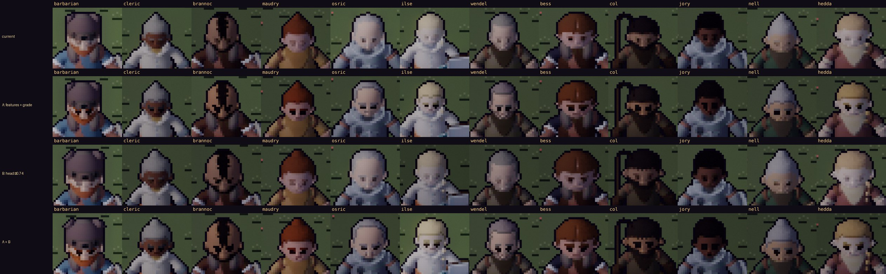
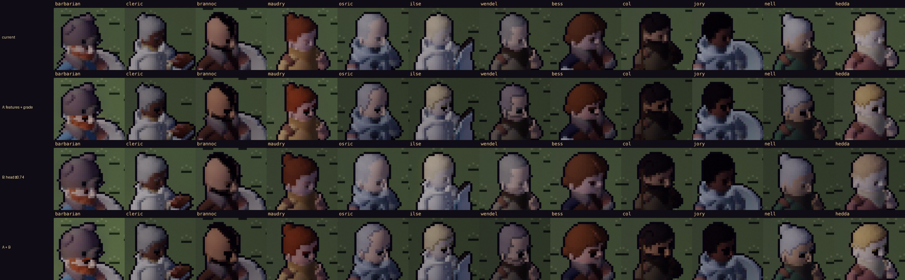
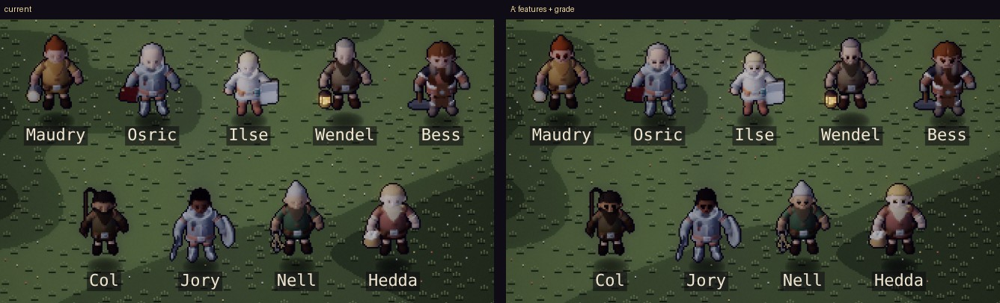

# Faces and heads in the world — options (art critic pass 7, proposal)

**Proposal, 2026-10-02. Not built:** the shipped atlases are unchanged. This pass used the Stage
(`?dev&scene=stage`, zoom 3) to look at every human head at in-game pixels. It found why faces
read blank, and prototyped three fixes on twelve actors. The bake knobs that made the prototypes
stay in the lab, off by default (see *Prototypes* below). A default bake is byte-identical to
the shipped atlases.

It covers the people with faces: the hero looks (the knight's visor and the hoods aside),
Brannoc and Thornwick's nine. It follows `art-critic-pass-6.md`; the window portraits (pass 4)
are a separate bake and already detailed.



*Front facing (dir 2), idle, by day, from the Stage at zoom 3. Each square is one in-game pixel.
Rows: current · A: features + grade · B: heads ×0.74 · A + B.*

## What's wrong

1. **The bake averages the faces away.** Each atlas pixel is the mean of 4 × 4 sub-samples, in
   ~linear light. That is good for cloth and armour edges, but a face's features are smaller than
   a pixel:
   - the atlas eye is a dark dot about a quarter of a pixel across;
   - the mouth is a stroke thinner than one;
   - a brow is about a pixel tall.

   Averaged with the skin around them, they become a slightly darker skin tone, then the despeckle
   pass smooths over what's left. **On the front idle cell, about 7 feature pixels per face are
   even half covered by a feature; the rest wash out.** That's why most faces read blank:
   Maudry, Osric, Ilse, Wendel, Nell and Hedda have no eyes at in-game size.
2. **Hair melts into skin.** Light hair on light skin (Ilse's straw, Osric's and Nell's grey,
   Hedda's blonde) sits within a few values of the face. With no line between them, the head
   reads as one pale blob.
3. **Faces are graded like clothes.** The world grade takes 34 % of the saturation and adds
   contrast, which suits steel and leather. It turns skin grey-pink and flattens the warmth that
   tells a face from a hood.
4. **Heads are small.** The heroic proportions shrink the head bone to 0.62. On the front idle
   cell a whole head, hair and beard included, is about **14–20 px wide and 16–19 px tall**. The
   face inside it is about 8 × 7.

## Options

| | Option | What it changes | Measured (front idle cell, 12 faces) | Cost | Risk |
|---|---|---|---|---|---|
| **A** | **Keep the features whole** (bake) | A pixel where an eye, brow or mouth covers ≥ 3 of its 16 sub-samples takes the feature's own colour instead of the average, and despeckle leaves it alone. | Feature pixels kept: median **18** a face, from about 7 (range 15–27 against 4–16). | Bake only. Same atlas sizes, no runtime cost. | Eyes become small dark blocks: at 2 × 2 px they read as doll-like. A2 tunes that. |
| **A2** | **A pixel-art eye** (bake, follows A) | The atlas eye becomes two tones: a dark iris and a light pixel beside or above it (white, or a catchlight). The mouth gets a stroke thick enough to keep one pixel. | Not yet prototyped. It needs the iris to win over the white when they share a pixel. | Bake only | Busy at the smallest heads; may want per-face tuning |
| **B** | **A face grade, and a hairline** (bake) | Skin, hair and features get a gentler grade (desaturation 0.12 rather than 0.34, contrast 1.1). Where hair meets skin, the hair's edge pixel darkens a step. A feature stays at least 35 % darker than the skin beside it. | Ilse, Osric, Nell and Hedda read hair, then face (see images) | Bake only | Faces slightly warmer than the rest of the figure (intended) |
| **C** | **Bigger heads** (proportions) | Head bone 0.62 → 0.74. | Head box +2 px each way: 16–22 px wide and 12–25 tall. Feature pixels kept with A: median **23** a face (+25 %). | One constant and a rebake of every human actor; portraits and figures change too. | Less heroic, more chibi. Changes every silhouette, and helmets and hats grow with it. |
| **D** | **More pixels per figure** | Figures 56 → 64–72 px (bigger in the world), or a separate higher-resolution actor layer in the renderer. | Not prototyped | Atlases +30–65 % (or 4× for a 2× layer); renderer work for the layer | Changes the game's scale against buildings, or its pixel-art consistency |
| **E** | **A closer look when it matters** (renderer) | The camera eases to 2× zoom while you talk to someone, using the Stage's integer zoom, so their face fills four times the pixels for the conversation. | Not prototyped | Small: the camera only | A zoom pop at every talk; needs easing and a setting |



*Three-quarter view (dir 1), the way people usually face you in the square. Rows as above.*



*At true in-game size (DPR 2). Left: current, mostly blank faces. Right: with A and B, every
face has two eyes, and pale hair separates from skin.*

## Recommendation

1. **Ship A + B now.**
   - They fix the actual fault (the bake throwing the faces away), not the head size.
   - They're bake-only, the same size on disk, and change nothing at runtime.
   - They help every human actor, the Redhand included.
2. **Then A2:** tune the eyes so they read as eyes, not dots, and give the mouth a chance.
   Judge it on the Stage.
3. **Decide C on the Stage after A2.**
   - With A, a bigger head adds about 25 % more face to read.
   - But it moves the whole cast toward chibi.
   - Recommended only if A + A2 still feel too small in play.
4. **Leave D for now;** E is a nice extra for conversations if you want it.

## Prototypes (how to reproduce)

The knobs live in the actor lab (`tools/actor-lab/lab.js`, `bake.cjs`). They're off unless set:

```bash
# A + B into a scratch tree (any folder), then look at it on the Stage
BAKE_OUT=/tmp/protoA/assets/actors BAKE_PROTO=features,grade node tools/actor-lab/bake.cjs npc_maudry npc_ilse …
BAKE_HEAD=0.74 …                         # C: the head bone's scale (default 0.62)
BAKE_PROTO=features,grade,stats …        # + the front idle cell's head box and feature counts, printed
```

- **Part tags.** `faces.js` now tags every face part (`userData.part`: skin, hair, eye, brow,
  mouth).
- **The extra pass.** The bake renders a part pass beside the albedo:
  - features keep their colour where they cover ≥ 3 of 16 sub-samples (`albParts`);
  - the grade softens on skin, hair and features (`grimPass`'s class map);
  - the hairline darkens (`faceLines`).
- **Viewing:** serve the scratch tree in place of `assets/actors` (the captures here did that),
  or give it the shape of a checkout and use the Stage's `cmp`.

## Decision needed

- **A + B:** ship? (Recommended.)
- **A2:** go ahead, judged on the Stage?
- **C (bigger heads):** decide after A2, or now?
- **E (talk close-up):** want it?
