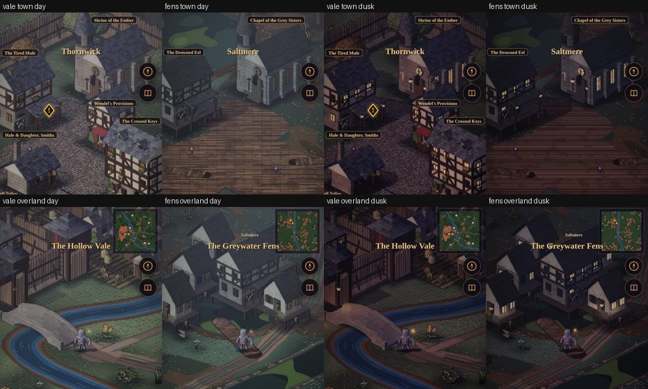
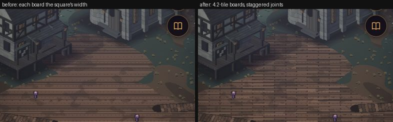
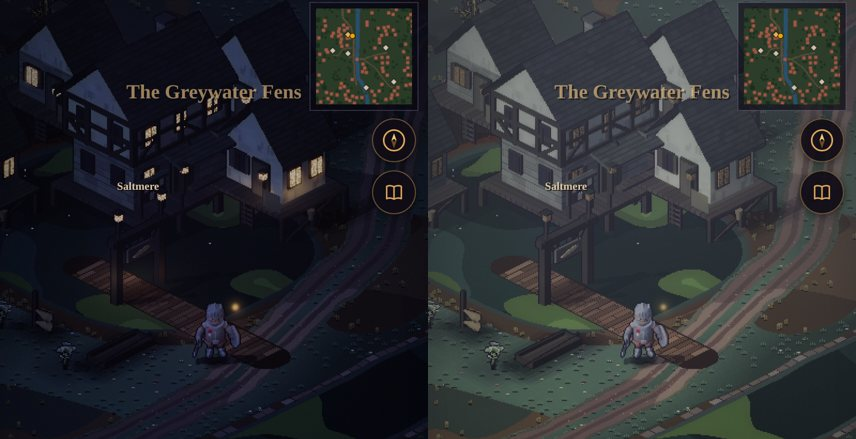
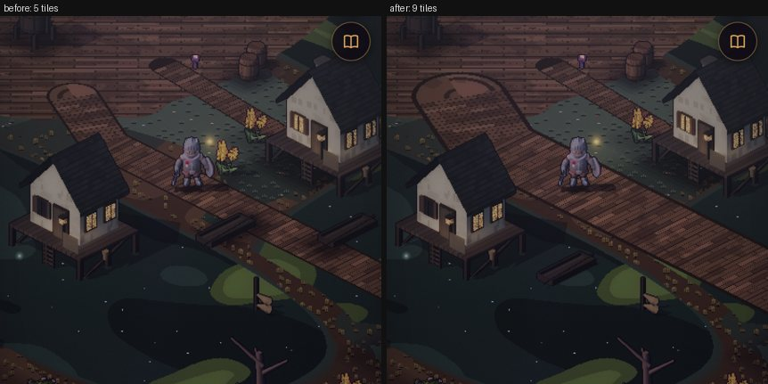
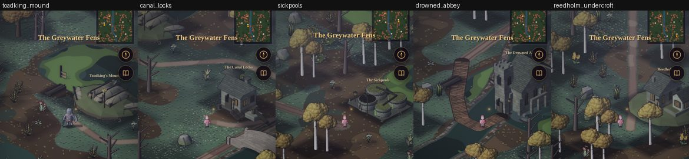
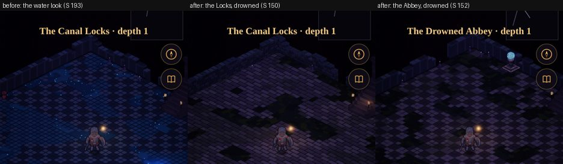
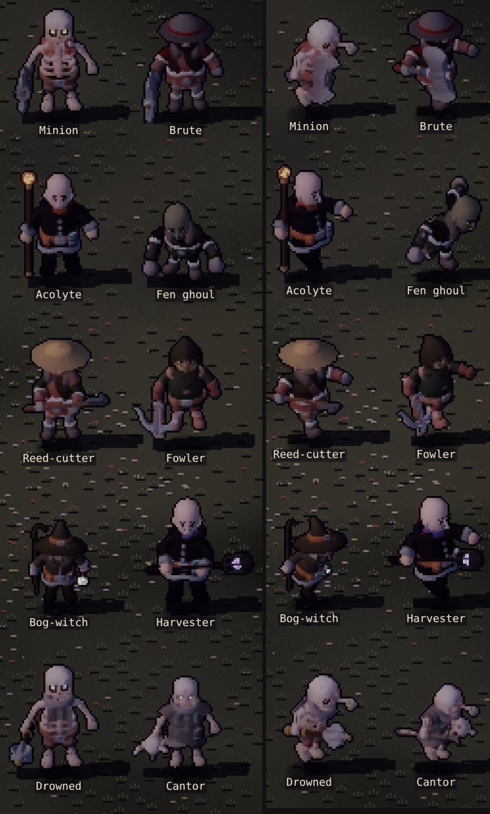
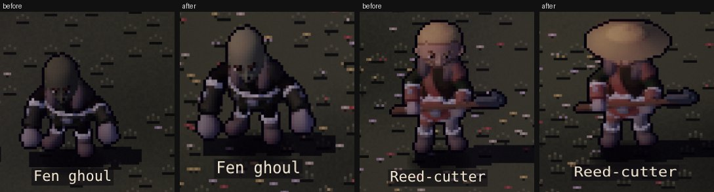

# The Fens: critic passes (M8)

**Status:** In progress (2026-10-04). Each M8 slice that adds art, words or quests ends with its pass here
([m8-plan.md](./m8-plan.md)); slice 12 gathers them. Captures are at in-game scale on a 390 × 844 phone, on the
manual clock (`?dev&manual&notitle&scene=…&region=…&tod=…`), measured on the world between the top HUD and the
service bar (12–62 % of the frame's height).

## Pass 1: art, slices 1–2 (the Fens overland and Saltmere)

### Measured

| Frame | Luma, Vale | Luma, Fens | Δ | Contrast (σ), Vale | Contrast (σ), Fens |
|---|---|---|---|---|---|
| Town, day | 71.8 | 65.5 | −9 % | 32.6 | 21.2 |
| Town, dusk | 41.0 | 34.9 | −15 % | 29.8 | 19.3 |
| Overland, day | 70.5 | 63.4 | −10 % | 24.9 | 25.5 |
| Overland, dusk | 39.6 | 35.5 | −10 % | 20.6 | 24.0 |

The Fens sit a tenth darker than the Vale, and Saltmere a third flatter: grey water and wet timber under the same
sky. That is the owner's direction (keep it dusky and gloomy), and the services, the hero and the boardwalks still
read at dusk. Nothing was brightened.

### Found and fixed in this pass

| Finding | Fix |
|---|---|
| Saltmere's service bar offered all five services; two exist | The bar is built from the world's services (`src/ui/townmenu.js`); the sim refuses the rest by name ("Saltmere has no inn", `heroes.js`, `smith.js`) |
| The reed beds were busy: a tuft on most tiles, the darkest tone at the peat's edge | Reed density 0.55 on a mere's fringe and 0.16 in the open, two tones lighter (`outdoorpaint.js` `marsh()`) |
| The canal read as a running river: the Vale's water with its flow streaks | Fens water is still bog with a duckweed sheen; the canal's banks are a broken stone kerb (`canal()`, `bank()`) |
| On the overland the hero arrived hidden behind Saltmere's stilt houses | The boardwalk comes in from the town's front (south-east), and the arrival stands on it (`FENS.salt + 16.5, 6.5`) |
| Saltmere's way out sat past the forest ring's hard edge | Moved inside it (x 136–146); the arrival at 128.5 |
| The square's planks each ran its full width, one board 40 tiles long | Boards 4.2 tiles long with staggered butt joints (`deck()`; the plaza's cross-axis coordinate in `groundAt`) |

The Vale paid for the canal road: it cut the south-west wood's clump, and the walked map's tree cover fell from
25.1 % to 24.9 % (the woods test asks for 25–35 %). Oaks now line the road's verges every 6 tiles, their crowns closing
over the wood's edge: **25.2 %**.

### Still open

- **Saltmere has nobody in it.** Its people come with Act II (slice 8): Mother Agnes at the chapel, the Drowned
  Eel's keeper, eel-men on the boardwalks.
- **Marsh-lights** (plan slice 2) move to slice 4: they want a drifting light the renderer has no path for yet,
  and the bog-witch's lantern needs the same thing.
- **At night the hero is drawn as a pink stand-in** after 120 manual frames, in the Vale too. It predates M8.
  Logged for a renderer pass, not fixed here.
- Saltmere's contrast (σ 21 against the Vale's 33) is the flat deck's. If the square reads as a floor rather than
  a place once its people stand on it, the next pass adds coiled rope, nets drying on rails and a moored punt to
  break it up.

### The owner's report: Saltmere's way in (2026-10-04)

From a phone at night: *"The building sits on top of the road and it isn't obvious for the entrance into Saltmere."*
Both were so. A stilt house stood on the canal road (41 road tiles under it), and the way in was a gap between the
tavern and another house at the end of a short diagonal boardwalk, with nothing marking it.

| Finding | Fix |
|---|---|
| A stilt house stood on the canal road | Saltmere's houses moved up-screen and west, behind and beside the boardwalk's end, clear of the road |
| Nothing marked the way in | The boardwalk runs straight in off the road to a **landing gate** (a new bake, `landing`: two piles with a lantern each, a beam, the town's board with an eel on it). The way in is through it, the name *Saltmere* stands over it, and you arrive on the boardwalk facing it |
| The same check found more | The Locks' hall stood over the canal road and Reedholm's track ran into the priory: both moved. A punt was moored on the Abbey's causeway. In the Vale, a rock and a stump stood on the barrows road and a stump on the camp track |

`test/town.test.mjs` now holds both lands to it, in three seeds: no road tile is blocked except at the end of the
road that leads there (Thornwick's gate, the lumber camp, the barrow's mound). Saltmere's way in is through the gate,
under its name. Both tests fail on the layout before the fix.

### The owner's report: Saltmere's boardwalk (2026-10-04)

*"The boardwalk entrance into the town square is too skinny."* It was 5 tiles wide (Thornwick's high street is 6),
and with a party of four on it it read as a plank. It's 9 now, a street's width, with the two punts moored at its
edges moved out into the mere. All 482 of its deck tiles between the square and the way out are open.

## Pass 2: art, slice 3 (the Fens' sites)

Five landmarks baked in code (`tools/actor-lab/buildkit.js`: `boathall`, `lockhall`, `vats`, `abbey`, `priory`; in
`town.json`'s Fens list, so the shared atlas and every existing footprint stay as they were), each with its way in
toward the camera and a lantern by it. Seen from each site's arrival, by day:

### Found and fixed in this pass

| Finding | Fix |
|---|---|
| The Toadking's hulls were the hall's darkest thing: a heap of lumps, no boats | Weathered silver-grey planking, paler than the mound; stem and stern posts; a lintel plank over the door |
| The Sickpools' vats showed stone tops: the green sat under their rims | The slime sits on the rims, and glows; Vat Seven, drained, shows black, with its ladder |
| The Undercroft's door was buried in Reedholm's rise | Lifted to ground level, with jambs and three steps down to it |
| The Abbey's way in stood in the flood, off the causeway's end | The causeway turns and comes straight up to the west door |
| The Locks and the Abbey used the water look: a saturated blue checker with glowing blue pools (saturation 193, against the Sunken Chapel's 143), and the two read the same | A new **drowned** look (`tilestyles.js`): grey dressed stone gone green in the joints, black-green standing water that gives no light, a rare glint. The Locks are flagstone (a new `sluice` theme), the Abbey temple-checker. Saturation 150 / 152, luma 18 / 17 (the Chapel 24) |

Every way in is reachable from the Fens' arrival in three seeds, and every arrival stands on open ground
(`test/sites.test.mjs`).

### Still open

- The Fens' trees are the Vale's birches, whose ochre crowns read round and cheerful here. Alder and willow, darker
  and lower, are for the slice-4 art pass.
- The Toadking's hall reads as a heap of boats from its arrival, but its crown on the boat-hook is three pixels
  wide. The boss pass (slice 6) can give it a flag.

## Pass 3: art, slice 4 (the Fens' own)

Seven new bakes, mirroring Ashbound roles. The two new silhouettes canon allows are the **fen ghoul** (the Barbarian,
hunched, long-armed, with a new lab knob, `frame`: extra reach and scale for chosen bones and a bend at the spine) and
the **bog-witch** (the Mage in sacking under a battered hat, with a crook and a marsh-light). The rest are recolours:
the **reed-cutter** and the **fowler** (Redhand, in fen colours), the **harvester** (an acolyte with violet trim and a
lantern-cage on a pole, the soul in it lit), and the **drowned brother** and **cantor** (Ashbound in grey habits with
weed on them, aqua eyes). Idle toward the camera (left) and walking (right) at 2× in-game scale, with the acolyte, the
brute and the minion for reference:

### Found and fixed in this pass

| Finding | Fix |
|---|---|
| The ghoul and the witch came out as the Knight: grey helm, gold band, red tabard | The new knob was first named `body`, which the lab already used for its body-kit mock-up. It's `frame` now |
| Both kept a red stripe from their base models | The swatches that carried it repainted: the Barbarian's leather and skin, every tile of the Mage's robe |
| The cantor wore the Skeleton Mage's red robe and hat | The robe repainted grey; the hat hidden |
| The ghoul was a dark lump: no face, the arms lost | Paler grey-green skin, wide eyes, the forearms 1.6× and the hands 1.45×: its knuckles reach its knees |
| The reed-cutter read as a hatless Redhand brute, close to the party's barbarian | A broad reed hat (`reedhat`): the Toadking's men now read at a glance |

**Marsh-lights** (moved here from slice 2) are in: `fx.wisps`, a pale green-white point with a halo, drifting over
each mere big enough to hold one, rising and fading on its own beat. They show as the lamps come up (dusk, night),
depth-tested like every effect, with nothing on the sim.

### Balance (room-level harness: fighter, rogue and cleric at the room's level, 300 s, seeds 1–4, waves)

| Site, level | Before (stand-ins) | After (the Fens' own) |
|---|---|---|
| Old Barrows L9 (reference) | 13, 13†, 14, 13 | (unchanged) |
| Toadking's Mound L9 | 13, 13†, 14, 13 | 11, 13, 10†, 13 |
| Canal Locks L10 | 11, 10†, 11, 10 | 11, 9†, 9†, 9 |
| Sickpools L11 | 12, 9†, 11†, 8 | 10†, 9†, 7†, 9 |
| Drowned Abbey L12 | 5†, 5†, 6†, 4† | 7†, 6†, 7†, 8† |

† defeated before 300 s. About a wave harder at the Mound, the Locks and the Sickpools (a bog-witch casts where a
crossbowman shot; the harvester is the elite where a brute or warrior was), two easier at the Abbey. The Fens' own each
stay within 15 % of their role's HP and ATK (`test/fens-foes.test.mjs`). The sites past level 10 are hard at level
whoever holds them: setting the numbers for 9–15 is slice 11's.

### Still open

- The harvester is the acolyte with a pole: canon says so, and the pole and its lit soul tell them apart, but only
  just at 56 px. If it's lost in a fight, a cowl is the next step.
- The drowned clergy's weed is too thin to read at 56 px; their grey habits and aqua eyes carry them.
