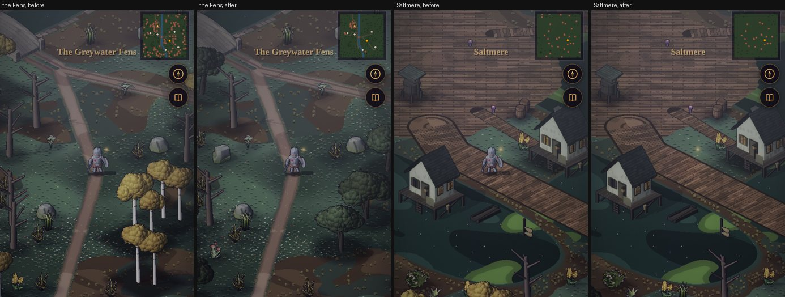
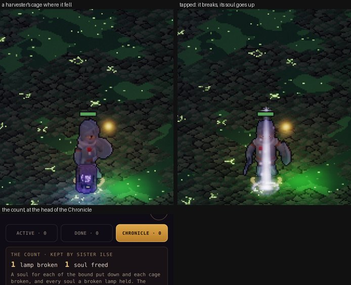

# The Fens: critic passes (M8)

**Status:** In progress (2026-10-04). Each M8 slice that adds art, words or quests ends with its pass here
([m8-plan.md](./m8-plan.md)); slice 12 gathers them. Captures are at in-game scale on a 390 × 844 phone, on the
manual clock (`?dev&manual&notitle&scene=…&region=…&tod=…`), measured on the world between the top HUD and the
service bar (12–62 % of the frame's height).

## Pass 1: art, slices 1–2 (the Fens overland and Saltmere)

### Measured

| Frame | Luma, Vale | Luma, Fens | Δ | Contrast (σ), Vale | Contrast (σ), Fens |
|---|---|---|---|---|---|
| Town, day | 71.8 | 65.5 | −9 % | 32.6 | 21.2 |
| Town, dusk | 41.0 | 34.9 | −15 % | 29.8 | 19.3 |
| Overland, day | 70.5 | 63.4 | −10 % | 24.9 | 25.5 |
| Overland, dusk | 39.6 | 35.5 | −10 % | 20.6 | 24.0 |

The Fens sit a tenth darker than the Vale, and Saltmere a third flatter: grey water and wet timber under the same
sky. That is the owner's direction (keep it dusky and gloomy), and the services, the hero and the boardwalks still
read at dusk. Nothing was brightened.

### Found and fixed in this pass

| Finding | Fix |
|---|---|
| Saltmere's service bar offered all five services; two exist | The bar is built from the world's services (`src/ui/townmenu.js`); the sim refuses the rest by name ("Saltmere has no inn", `heroes.js`, `smith.js`) |
| The reed beds were busy: a tuft on most tiles, the darkest tone at the peat's edge | Reed density 0.55 on a mere's fringe and 0.16 in the open, two tones lighter (`outdoorpaint.js` `marsh()`) |
| The canal read as a running river: the Vale's water with its flow streaks | Fens water is still bog with a duckweed sheen; the canal's banks are a broken stone kerb (`canal()`, `bank()`) |
| On the overland the hero arrived hidden behind Saltmere's stilt houses | The boardwalk comes in from the town's front (south-east), and the arrival stands on it (`FENS.salt + 16.5, 6.5`) |
| Saltmere's way out sat past the forest ring's hard edge | Moved inside it (x 136–146); the arrival at 128.5 |
| The square's planks each ran its full width, one board 40 tiles long | Boards 4.2 tiles long with staggered butt joints (`deck()`; the plaza's cross-axis coordinate in `groundAt`) |

The Vale paid for the canal road: it cut the south-west wood's clump, and the walked map's tree cover fell from
25.1 % to 24.9 % (the woods test asks for 25–35 %). Oaks now line the road's verges every 6 tiles, their crowns closing
over the wood's edge: **25.2 %**.

### Still open

- **Saltmere has nobody in it.** Its people come with Act II (slice 8): Mother Agnes at the chapel, the Drowned
  Eel's keeper, eel-men on the boardwalks.
- **Marsh-lights** (plan slice 2) move to slice 4: they want a drifting light the renderer has no path for yet,
  and the bog-witch's lantern needs the same thing.
- ~~**At night the hero is drawn as a pink stand-in**~~ Fixed (2026-10-04): it was the old paper doll, drawn until the
  hero's atlas loaded. The renderer is made before the save is restored, so the loading screen waited only for the
  default knight; any other hero loaded on its first frame. `ready` now waits for every member's own look, and the
  doll is gone (a figure whose atlas isn't in yet isn't drawn, as a companion wasn't). Browser check 15f.
- Saltmere's contrast (σ 21 against the Vale's 33) is the flat deck's. If the square reads as a floor rather than
  a place once its people stand on it, the next pass adds coiled rope, nets drying on rails and a moored punt to
  break it up.

### The owner's report: Saltmere's way in (2026-10-04)

From a phone at night: *"The building sits on top of the road and it isn't obvious for the entrance into Saltmere."*
Both were so. A stilt house stood on the canal road (41 road tiles under it), and the way in was a gap between the
tavern and another house at the end of a short diagonal boardwalk, with nothing marking it.

| Finding | Fix |
|---|---|
| A stilt house stood on the canal road | Saltmere's houses moved up-screen and west, behind and beside the boardwalk's end, clear of the road |
| Nothing marked the way in | The boardwalk runs straight in off the road to a **landing gate** (a new bake, `landing`: two piles with a lantern each, a beam, the town's board with an eel on it). The way in is through it, the name *Saltmere* stands over it, and you arrive on the boardwalk facing it |
| The same check found more | The Locks' hall stood over the canal road and Reedholm's track ran into the priory: both moved. A punt was moored on the Abbey's causeway. In the Vale, a rock and a stump stood on the barrows road and a stump on the camp track |

`test/town.test.mjs` now holds both lands to it, in three seeds: no road tile is blocked except at the end of the
road that leads there (Thornwick's gate, the lumber camp, the barrow's mound). Saltmere's way in is through the gate,
under its name. Both tests fail on the layout before the fix.

### The owner's report: Saltmere's boardwalk (2026-10-04)

*"The boardwalk entrance into the town square is too skinny."* It was 5 tiles wide (Thornwick's high street is 6),
and with a party of four on it it read as a plank. It's 9 now, a street's width, with the two punts moored at its
edges moved out into the mere. All 482 of its deck tiles between the square and the way out are open.

### Story pass 1: Saltmere's board (2026-10-04)

Saltmere's board posts the Fens' jobs in its own voice (`content/board/<template>.json`, `fens`): six posters per
template, all canon (Pim Rushlight, the Drowned Eel, the Grey Sisters, the Lantern Guild, and, new in world doc v1.22,
Saltmere's eel-men and its ferryman). Read against the tone rules (small stakes, wry, history found not told):

- **Kept:** Pim selling oil in every second line ("Lamp oil burns longer the deeper you go. That's not true, but buy
  some anyway"), the Eel's one free drink ("It's a small hall"), the ferryman's lost pole. Nobody is chosen; the
  Guild pays by the fight.
- **Checked:** no hook names the binding rolls or the Sisters' past. Act II tells that (world doc §3.2: "Nobody in
  Reedholm likes to say so"), so the Sisters' hooks speak only of the dead, and of praying.
- **Grammar:** `{site}` takes the site's name with *The* lowered ("the Canal Locks"); no line starts with it. A brief
  stays under 64 characters before the name goes in (the warden's was cut to "…, {floor} floor on").

## Pass 2: art, slice 3 (the Fens' sites)

Five landmarks baked in code (`tools/actor-lab/buildkit.js`: `boathall`, `lockhall`, `vats`, `abbey`, `priory`; in
`town.json`'s Fens list, so the shared atlas and every existing footprint stay as they were), each with its way in
toward the camera and a lantern by it. Seen from each site's arrival, by day:

### Found and fixed in this pass

| Finding | Fix |
|---|---|
| The Toadking's hulls were the hall's darkest thing: a heap of lumps, no boats | Weathered silver-grey planking, paler than the mound; stem and stern posts; a lintel plank over the door |
| The Sickpools' vats showed stone tops: the green sat under their rims | The slime sits on the rims, and glows; Vat Seven, drained, shows black, with its ladder |
| The Undercroft's door was buried in Reedholm's rise | Lifted to ground level, with jambs and three steps down to it |
| The Abbey's way in stood in the flood, off the causeway's end | The causeway turns and comes straight up to the west door |
| The Locks and the Abbey used the water look: a saturated blue checker with glowing blue pools (saturation 193, against the Sunken Chapel's 143), and the two read the same | A new **drowned** look (`tilestyles.js`): grey dressed stone gone green in the joints, black-green standing water that gives no light, a rare glint. The Locks are flagstone (a new `sluice` theme), the Abbey temple-checker. Saturation 150 / 152, luma 18 / 17 (the Chapel 24) |

Every way in is reachable from the Fens' arrival in three seeds, and every arrival stands on open ground
(`test/sites.test.mjs`).

### Still open

- ~~The Fens' trees are the Vale's birches~~ Done (2026-10-04): the Fens' own trees, baked in code
  (`buildkit.js`: `alder`, low and dark on two or three leaning stems; `willow`, a crooked trunk under a broad crown with
  fronds hanging round it; `carr`, alders crowded on a hummock), in the shared atlas with no existing footprint moved.
  The Fens overland, its forest ring and Saltmere's draw from them (`FENS_CLUSTER`, `FENS_SINGLE`) where they drew
  the Vale's birches and mixed groves, the same draws, the Fens' kinds; dead trees stay. The baked alder's dark root
  stool read as a ball at its foot and went.

  
- The Toadking's hall reads as a heap of boats from its arrival, but its crown on the boat-hook is three pixels
  wide. The boss pass (slice 6) can give it a flag.

## Pass 3: art, slice 4 (the Fens' own)

Seven new bakes, mirroring Ashbound roles. The two new silhouettes canon allows are the **fen ghoul** (the Barbarian,
hunched, long-armed, with a new lab knob, `frame`: extra reach and scale for chosen bones and a bend at the spine) and
the **bog-witch** (the Mage in sacking under a battered hat, with a crook and a marsh-light). The rest are recolours:
the **reed-cutter** and the **fowler** (Redhand, in fen colours), the **harvester** (an acolyte with violet trim and a
lantern-cage on a pole, the soul in it lit), and the **drowned brother** and **cantor** (Ashbound in grey habits with
weed on them, aqua eyes). Idle toward the camera (left) and walking (right) at 2× in-game scale, with the acolyte, the
brute and the minion for reference:

### Found and fixed in this pass

| Finding | Fix |
|---|---|
| The ghoul and the witch came out as the Knight: grey helm, gold band, red tabard | The new knob was first named `body`, which the lab already used for its body-kit mock-up. It's `frame` now |
| Both kept a red stripe from their base models | The swatches that carried it repainted: the Barbarian's leather and skin, every tile of the Mage's robe |
| The cantor wore the Skeleton Mage's red robe and hat | The robe repainted grey; the hat hidden |
| The ghoul was a dark lump: no face, the arms lost | Paler grey-green skin, wide eyes, the forearms 1.6× and the hands 1.45×: its knuckles reach its knees |
| The reed-cutter read as a hatless Redhand brute, close to the party's barbarian | A broad reed hat (`reedhat`): the Toadking's men now read at a glance |

**Marsh-lights** (moved here from slice 2) are in: `fx.wisps`, a pale green-white point with a halo, drifting over
each mere big enough to hold one, rising and fading on its own beat. They show as the lamps come up (dusk, night),
depth-tested like every effect, with nothing on the sim.

### Balance (room-level harness: fighter, rogue and cleric at the room's level, 300 s, seeds 1–4, waves)

| Site, level | Before (stand-ins) | After (the Fens' own) |
|---|---|---|
| Old Barrows L9 (reference) | 13, 13†, 14, 13 | (unchanged) |
| Toadking's Mound L9 | 13, 13†, 14, 13 | 11, 13, 10†, 13 |
| Canal Locks L10 | 11, 10†, 11, 10 | 11, 9†, 9†, 9 |
| Sickpools L11 | 12, 9†, 11†, 8 | 10†, 9†, 7†, 9 |
| Drowned Abbey L12 | 5†, 5†, 6†, 4† | 7†, 6†, 7†, 8† |

† defeated before 300 s. About a wave harder at the Mound, the Locks and the Sickpools (a bog-witch casts where a
crossbowman shot; the harvester is the elite where a brute or warrior was), two easier at the Abbey. The Fens' own each
stay within 15 % of their role's HP and ATK (`test/fens-foes.test.mjs`). The sites past level 10 are hard at level
whoever holds them: setting the numbers for 9–15 is slice 11's.

### Still open

- The harvester is the acolyte with a pole: canon says so, and the pole and its lit soul tell them apart, but only
  just at 56 px. If it's lost in a fight, a cowl is the next step.
- The drowned clergy's weed is too thin to read at 56 px; their grey habits and aqua eyes carry them.

## Pass 4: art and story, slice 5 (lamps, cages and the count)

### Art

| Finding | Fix |
|---|---|
| The cage (11 × 17 voxels) stood knee-high on the Sickpools' floor and read as a speck mid-fight | 15 × 23: a hooded iron cage on a floor ring, its soul a violet light inside, as tall as a hero's knee to hip |
| The capture's hero stood in front of it and hid it | (a capture matter: the cage is underfoot, never in the way; the renderer draws the hero over it, and the x-ray shows them through) |
| Breaking it showed nothing | The soul goes up in a pale violet column (`fx.rise`, the raise's own effect in the souls' colour); a lamp's breaking is a taller one over its keeper, and each bound foe it lays down sends up its own |

### Words

- **The toasts.** *"A harvester's cage falls with it · break it, and the soul inside goes free"* wrapped to two lines
  mid-fight; now *"A cage falls · tap it to free the soul in it."* Breaking one said *"0 freed"*: it spoke before the
  count did. The count is credited first now: *"The cage breaks · a soul goes free · 1 freed."*
- **The lamp's banner.** *"The Third Legion's standard-lamp breaks"*, then *"240 souls go free · its line lies
  down"*, or, on his echo's later visits, only *"its line lies down"*.
- **Ilse** (`ilse.ink`, *"You keep a count?"*, once anything's freed): *"Of the freed. 12 by my reckoning, and 1 lamp
  broken."* Then, with no lamp yet, how a lamp works and that its keeper won't let you near; with one, that you'll
  have felt the room go quiet. She closes: *"The empire kept a tally of everyone it bound. It seems fair to keep one of
  everyone let go. Nobody else will."* It's plain, and dry; the empire and the Rite are named only as she would.
- **The Chronicle's head.** *"A soul for each of the bound put down and each cage broken, and every soul a broken lamp
  held. The living never count: they were never bound."* World doc §7's own terms, in one line.

## Art pass: the Mere Tower's wardens (2026-10-05)

The owner: *"Do the art for the wardens."* Until now each warden wore its base kind's 56 px look. Now each has its own
bake at the bosses' 73 px (`tools/actor-lab/variants.json` W1–W10, `bake.json` `boss_doorward` … `boss_starroom`;
`node tools/capture/stage.mjs --group wardens`). The Tower's palette: blackened iron, lamp-glass blue, tarnished brass,
drowned grey; four are kept bound or drowned, as the Tower keeps what comes near it. Lineup: `docs/img/wardens.jpg`.

| Warden | Built on | What reads |
|---|---|---|
| The Doorward | Knight: helm, round shield, sword | a door-guard in black iron, a verdigris cloak |
| The Mudlark | Barbarian, bare-armed | mud-dark, a hoe and a basket of what the lake gave up |
| The Bellringer | Skeleton mage in a brass-tarnished habit | the bell's hammer and a lantern; brass eyes |
| The Lensman | Hooded rogue, heavy crossbow | lamp-glass blue, a pale grey face |
| The Hush | Skeleton rogue | all black, frost-white eyes |
| The Twins | Barbarian, great-axe | pale and dark in one figure |
| The Tower Hound | Barbarian, an axe | black-furred, pointed ears, a dark face |
| The Gatherer | Mage with the lantern-cage and a marsh-light | drowned teal, lamp-blue trim |
| The Watcher | Skeleton mage, the hat kept | black robe, amber eyes |
| The Star Room | Skeleton legionary, sword and shield | a night-blue cloak, star-pale eyes |

What the first bake got wrong, and what changed:
- **The Hush** wore the skeleton rogue's red hood and **the Star Room** its red cloak: the recolour had hit the wrong
  tiles of the shared skeleton texture. The cloth is tiles [7,1], [2,2] and [1,2] (the drowned cantor's robe uses the
  same); recoloured black and night blue, re-baked.
- **Eye glows** came from the templates (the Hush would have glowed ember-orange in the dark): frost for the Hush and
  the Star Room, window-amber for the Bellringer and the Watcher.
- **Faces:** six wore other foes' or heroes' faces (`test/foes.test.mjs` caught it: no foe wears a hero's face, and no
  two kinds share one). Each has its own preset now (`faces.json`: doorward … gatherer), Tower-grey; the Hound no
  longer reads as a green goblin.

Still open: the Twins don't yet read as *half pale, half dark* (the swatch tiles split by part, not by side); the
Mudlark's hoe stands straight up at idle; the Hound would read more beast-like with a hunch (the lab's `frame` knob).

## The way to the Mere Tower (2026-10-05)

The owner, at Saltmere at night: *"Its not obvious what to click on to get to the mere tower."* The way was a short
jetty off the boardwalk with a punt at its end and the name over it in the same plain text as any landmark's; nothing
said it was a place you could go, and at night the jetty was a dark smudge by the landing gate.

- **A ferry stage** (`tools/actor-lab/buildkit.js` `ferrystage`, `town.json` `fens_ferrystage_1`): an arch over the
  jetty's end, taller than the landing gate (12.7 against 8.85 tiles of sprite top), a lantern high on each post and
  one low, a black board painted with a pale tower hung square to the camera, and the bell you ring for Wenna.
- **The jetty** runs 11 tiles now (it was 3), under the arch, to a small pool of its own where the punt is moored; the
  way out to the Tower is just past the arch (`src/sim/outdoor.js` buildFens). No other footprint moved (the env bake's
  footprints compared before and after: 0 changed).
- **Its sign is a plaque** (`renderer.js` drawLabels, a label with `door`): gold-bordered, with a ›, kept on screen,
  hung at the arch's beam so it doesn't sit on Saltmere's own name. A tap on it (`renderer.doorAt`, at least 44 CSS px
  tall) walks the party there as the compass's row does (`goto` with the `site:mere_tower` row; a tap on the ground
  when the row isn't there).
- Checked: `test/tower.test.mjs` (the stage over the jetty's end, the sign on it, the compass row walks you out to the
  Tower); browser §21 (from the boardwalk at night the plaque is on screen; a tap walks you down the jetty and out).
  Before and after: `docs/img/mere-tower-way.jpg`.

## The Fens' bosses (2026-10-05)

The owner: *"Yes, do the Fens bosses."* Four bakes at the bosses' 73 px (`tools/actor-lab/variants.json` FB1–FB4,
`bake.json` `boss_toadking`, `boss_teague`, `boss_choir`, `boss_abbess`; two new held props, the boat-hook and the
choir-lamp, in `props.js`; faces `toadking` and `teague`), and the ground hazard drawn for the first time.
Lineup and the four fights: `docs/img/fens-bosses.jpg`.

| Boss | Built on | What reads |
|---|---|---|
| The Toadking | Barbarian, the chest grown 1.2 (the head held back) | fat, bald, cheerful, a captain's coat gone green with the mere, a boat-hook |
| Brother Teague | Mage, the harvesters' charcoal | a grey collar, a dark violet cape, his book of names and a pole; his lantern-cage drawn at his side |
| The Drowned Choir | Skeleton mage in a habit | a sister in sodden green-grey, her psalter open |
| The Abbess Below | Skeleton mage in a black habit | a pale wimple, her crozier and the choir-lamp, lit cold |

What the first looks got wrong, and what changed:
- **The Toadking** wore the reed-cutters' hat, and from every side the brim hid his face. In red with white trim he
  read as Santa. The hat's gone (he's bald), and the coat is a drowned teal.
- **Teague's cape** came out bright magenta: the swatch that dyes the harvesters' trim isn't the cape's. Tiles [2,1]
  and [2,2] are; dyed a dark violet.
- **The mud** was tinted toward the mire's own brown and vanished into its floor. A fresh patch was also drawn at 60 %
  of its size, under the figures standing in it. Now it's near-black with a pale wet rim, full size from the start,
  welling up over 0.4 s.
- **The water's** rippling sheen drew as neon stripes along the walls, and three tiles of flood in a hall fifty
  across was a strip nobody stood in. Now the water is a deep teal with sparse glints, and each bell takes it 12 % of
  the way to the middle (four bells: about three quarters of the floor).

Measured in the boss harness (the right party at the hall's level, three seeds): GDD §17. Every one falls 3 of 3.
Also measured: how much of the Toadking's fight the party spends in the mud. Melee in reach stayed in it, half the
fight (47–58 %). Now everyone steps out of a patch: 6–17 % for the fighter, 12–40 % for the others.

Still open: the Choir and the Abbess share the cantors' frame (a skeleton mage in a habit), told apart by colour and
what they hold; a hood or veil would help. The Toadking's white trim is still the barbarian's fur.

## Saltmere's inn (2026-10-05)

The owner: *"Saltmere needs an inn for party mgt."* Saltmere had only its tavern and chapel, so the bench, swaps,
rest and expeditions were refused there. **The Stilt House** is a new building (`tools/actor-lab/buildkit.js`
`stiltinn`, `town.json` `fens_stiltinn_1`). It's long and narrow on its piles, two storeys under one steep roof,
with a gallery and a bench along its front, two lanterns, a sign with a candle on it, a ladder to the water, and
bedding aired over the rail. It stands at the head of the square. The chapel moves 6 tiles west on its island to make
room, so the three stand 8+ tiles apart with every door in the square's frame (`test/town.test.mjs`). At first the
inn stood behind the chapel and under the compass buttons, and the move brought it out from behind both. The bar shows
Tavern, Inn and Temple; the inn's menu is any town's (rest, party and bench, expeditions). No other footprint changed
(the env bake compared before and after: 0). The square with the inn, and its menu: `docs/img/saltmere-inn.jpg`.

## Act II and Wren: the story and quest passes (2026-10-05)

The owner: *"proceed as recommended"* (Act II, with Wren). Six chapters, Saltmere's four people, Wren and her chain,
the Kindler once (world doc v1.29 §3.2, §5, §6; `content/quests/ch2_*`, `wren_*`; `content/dialogue/dace`, `pim`,
`orla`, `agnes`, `wren`, `kindler`, and Ilse's two new beats). The cast, baked: `docs/img/act2-cast.jpg`.

| Who | Built on | What reads |
|---|---|---|
| Dace Pike | Barbarian, an oilskin waistcoat | broad, a full brown beard, his book of who owes who in hand |
| Pim Rushlight | Rogue (hooded), oil-dark | thin, straw hair, a grin, a lit lantern |
| Sister Orla | Mage, grey habit and cape | young, cropped copper hair, angry brows, a scrubbing rag |
| Mother Agnes | Mage, dark habit | white hair in a bun, wrinkles, the Undercroft's keys |
| The Kindler | Mage, plain grey | ash hair, a kind smile, nothing in his hands |
| Wren | Rogue, tar-dark leathers, twin knives | a black braid, amber eyes, a smirk, an earring |

**Art.** The first bake gave Agnes the mage's staff, orb and all, which read as a wizard. She carries keys now: she
has kept the Undercroft locked for forty years. The Kindler's boots came out rust from the belt swatch, and are dark
now. Nobody new shares a silhouette with the Vale's people at in-game scale except Orla and Ilse, the two Grey Sisters,
which is deliberate; they differ in hair, prop and the habit's tone.

**Story pass** (voice, canon, tone):
- Every line is plain and small-stakes. Nobody explains the past. Orla says the binding prayer *out loud* because the
  world doc says she's the only Sister who will; Agnes says why she wouldn't. The binding rolls are argued over, not
  explained.
- The Kindler is sincere, never threatening: he's sorry about the Robed Stranger, asks the company to be kind to
  the lock-men, and leaves. His first answer was *"Somebody who used to keep a lamp"*. That hinted at a past the
  canon doesn't give him (a Lantern Guild man?), so it's now *"Somebody who lights lamps that have gone out"*.
- Wren's first draft gave her a brother lost in the Sickpools. That was new canon nobody had written, so she now
  says only what the world doc says: she owed the Cult, borrowed from the Toadking to pay them, and you've seen how
  that went.
- Ilse's turn-in names the buyer's mark as *a pair of scales over a pick*. That's new, so it went into the world
  doc first (v1.29 §6). The canal road leaves the Vale at its south edge, past the barrows, as the overland has it,
  not past the lumber camp as the first draft said.
- Every journal line fits the 160-character limit and every summary fits 240 (the schema checks both). Three
  `ready` and `done` lines were cut to the 120-character limit.

**Quest pass** (clear, reachable, walkable, paid):
- **Levels.** The first table had each chapter one level under the world doc's band (8, 9, 10, 11, 12, 13). That sent
  *The Rolls* to the Abbey's third floor (level 14) at level 12, two levels up, where the contract says a same-level
  party is worn down. Now the chapters open at the canon's bands, 8, 10, 11, 12, 13 and 14, each one under its hall,
  as Act I's are. Each pays a share of the level it's written for (0.35–0.55 of 9–15), plus a Fine (GDD §8).
- **Clear.** Each journal line names the site, the floor and the thing: *"the Sluice, the hall at the far end"*,
  *"only the harvesters who lead the others carry a full one"*, *"open two chests on the Abbey's third floor"*.
- **Walkable.** The compass leads across lands: out of town by the road, out of a dungeon by the stairs up, and along
  the overland to the other land's road. In a town it walks to whoever you're to talk to; in a dungeon, down to their
  floor and then to them. `test/act2.test.mjs` walks chapter 1 on the compass alone: Thornwick, the Vale, the canal
  road, the Fens, Saltmere, Dace, Toadking's Mound, the Boat Hall, Wren, and back to Dace.
- **No dead ends.** Freeing Wren before the chapter asks counts her word; hearing the Kindler before the Locks counts
  him (he's gone on the boat and won't be back); a boss who already fell counts, as in Act I. A chapter is never
  abandoned.
- **Hands in where you'd expect.** Each chapter goes back to whoever sent you, except *The Rolls* (to Mother Agnes,
  who wanted them) and *The Last Office* (to Ilse in Thornwick, who reads the ledger). Ready, the compass points at
  the taker, even in the other land.
- **Wren's chain** is hers to give, only while she's with you, and hers to take in from her card. *Settled* pays *The
  Receipt*, a ring (crit, dodge, attack), once.

Closed after (the owner: *"do the open items"*): *Settled* held the Abbey's first-floor hall, which is Brother
Teague's until he falls, so a company that took her chain before *The Bells* fought him for it. It now waits for *The
Bells*, and Wren says so (*"Once he's gone, I've a fire to light"*). Maudry and Osric each have a line for the Fens
and one for Act II's end: every conversation now reads `chapters_done`, how many chapters are handed in.

