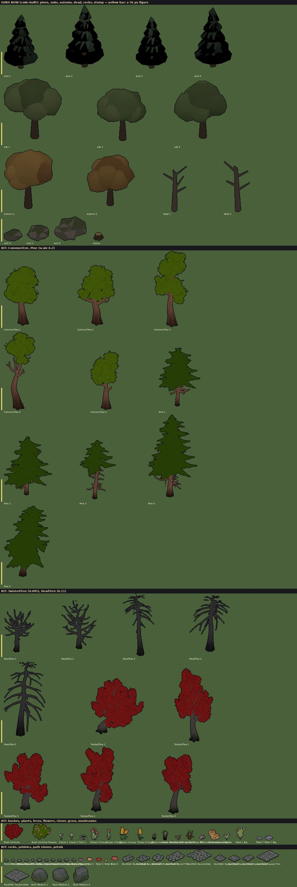
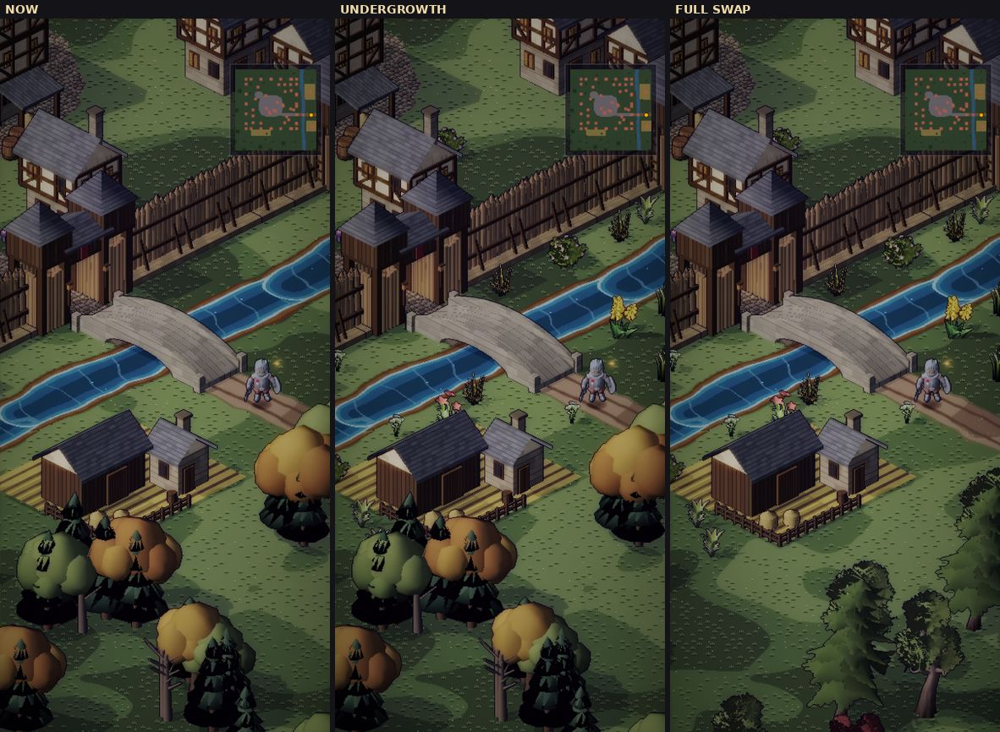
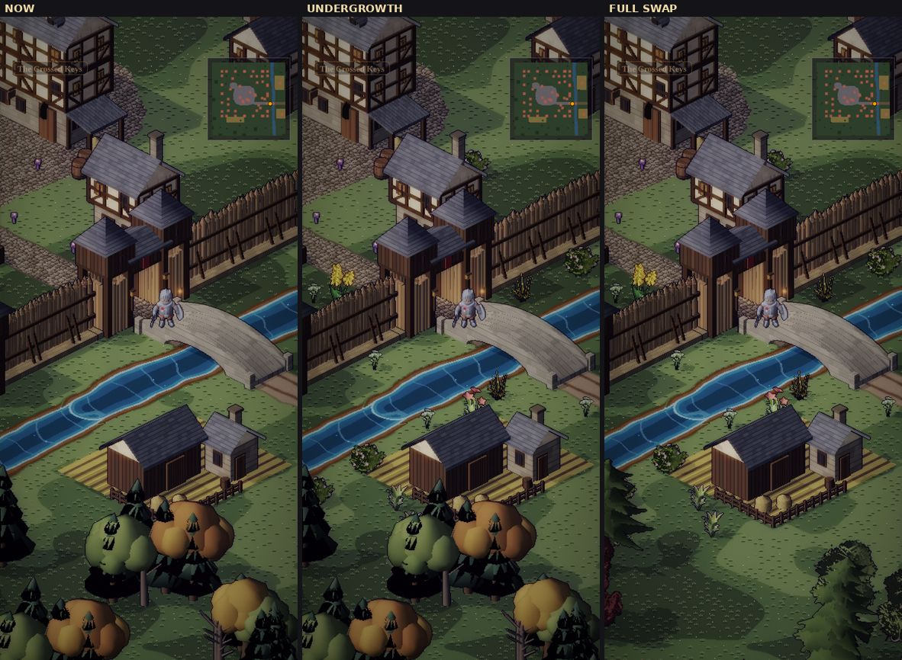
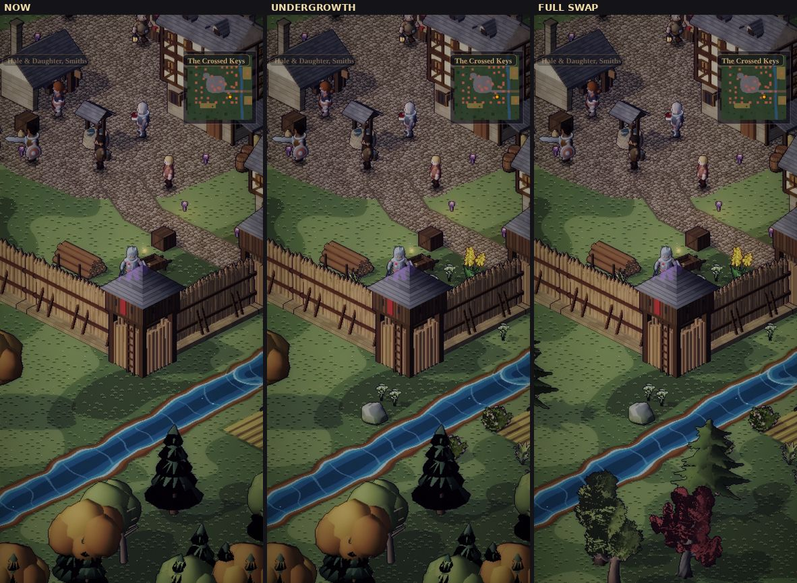
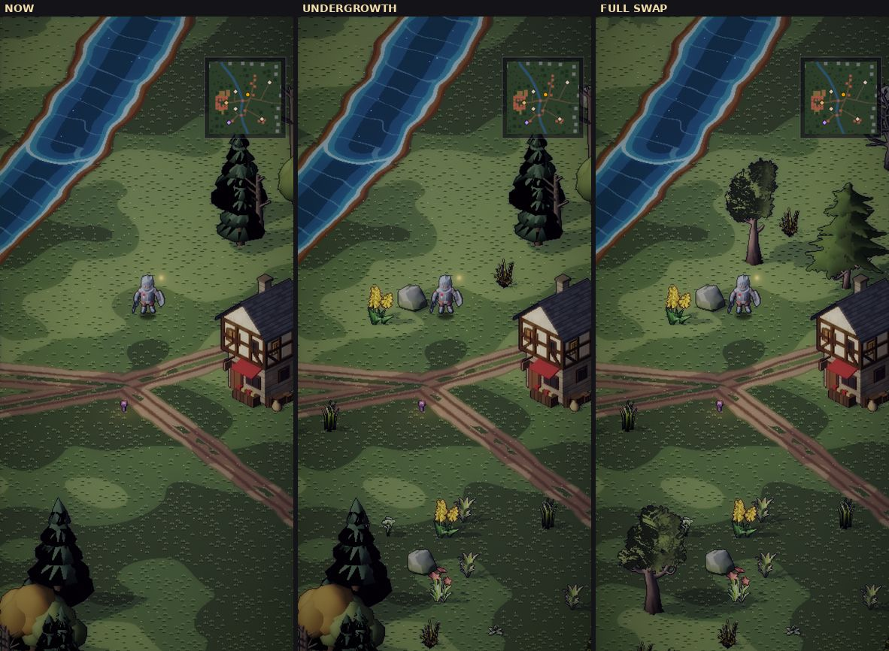
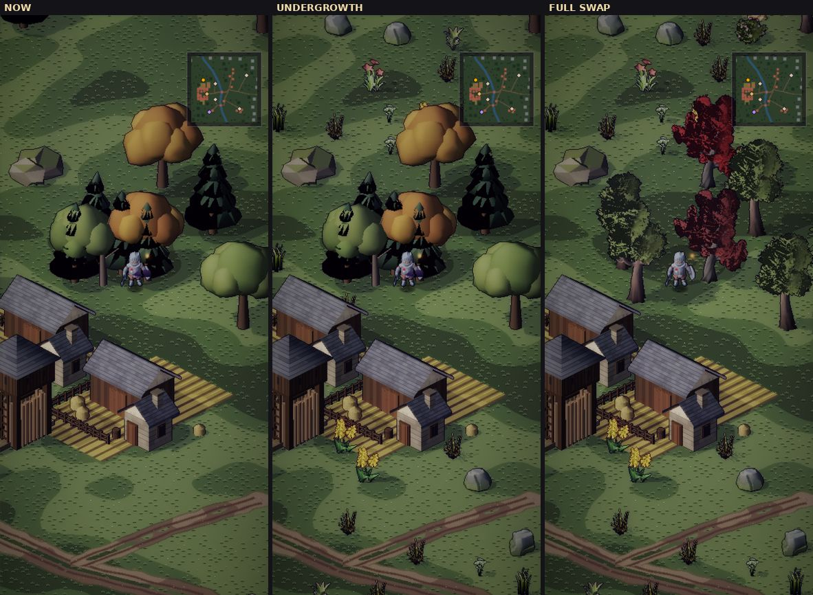

# The Stylized Nature MegaKit as landscaping (proposal)

**Proposal, 2026-10-03.** Should we use Quaternius' *Stylized Nature MegaKit* (CC0) to improve the town's and
the Vale's landscaping? Everything below was baked through our own environment lab and captured in the real
renderer, in a scratch checkout. Nothing in the game has changed yet.

## The pack

- **Licence:** CC0 1.0: free for any use, credit optional. The same as the KayKit characters.
- **What it holds:** 68 glTF models, uploaded in three parts:
  - **Trees:** 5 common broadleaf, 5 pines, 5 red "twisted" maples, 5 dead trees.
  - **Undergrowth:** bushes, ferns, plants, 4 grasses, flowers, clover, 2 mushrooms.
  - **Stone:** 3 rocks, 11 pebbles, 10 flat path stones, petals.
- **How it's built:**
  - Every model uses **cut-out materials**: alpha-masked leaf cards, petals and grass blades, double-sided,
    with vertex colours.
  - The leaves, bark and flowers are textures; the bark textures are 4–6 MB PNGs with normal maps.
- **Where it lives:** the sources stay out of git (`tools/actor-lab/models/nature/`, ignored like the KayKit
  models). Only baked atlases would ship.

## What the bake needed (done, in this change)

The lab's normal, depth-key, shadow, swatch and glow passes each drew every mesh with one material. A leaf
card would have baked as a solid quad into all of them.

`tools/actor-lab/envlab.js` now:
- gives each cut-out mesh its own copy of each pass, which drops the texels under its alpha cutoff;
- gives the albedo pass the same cutoff;
- loads a model from any path under `models/` (`gltf: 'nature/…'`).

The existing environment bakes are **byte-identical**: re-baking with this change left every atlas
unchanged in git.

## Every model at in-game scale

*Baked albedo, ×2, on grass. The top block is our own code-built trees, rocks and stump; the yellow bar is a
56 px figure. Below it are the kit's trees, undergrowth and stone, each family scaled to match ours: broadleaf
and pines 0.2, maples 0.085, dead trees 0.11, bushes 0.22, rocks 0.12, the rest 0.12–0.25.*

**Measured** (mean albedo of the baked sprites):

| | Ours (oak / pine) | The kit as delivered (common tree / pine) |
|---|---|---|
| Saturation | 0.24 / 0.13 | 0.76 / 0.75 |
| Lightness | 47 / 26 | 45 / 35 |

The kit's leaves are about **3× as saturated** as ours at the same lightness. Its ferns, plants and clover are
2–3× lighter. The prototype grades them in the bake to match:
- trees: desaturate 0.65, gain 0.6;
- undergrowth: desaturate 0.3–0.5, gain 0.45–0.6.

Two things about the delivered colours:
- **The maples' leaves are red by design.** The pack also ships white leaf textures for re-tinting.
- **`Bush_Common` wears the maples' red leaves too.** The prototype swaps it for the flowering bush.

## Two variants in the game

1. **Undergrowth:** our trees kept. The kit's bushes, ferns, plants, grass, flowers, clover, mushrooms and rocks
   are added where undergrowth grows:
   - the palisade's verges, in and out;
   - the stream's banks;
   - the gardens;
   - flower patches;
   - the front of a tree's foot.

   Never on the square. Flowers, grass, ferns and clover are walked through; bushes and rocks are solid.
   On its own random stream, so no tree, rock or house moves.
2. **Full swap:** the undergrowth, plus the kit's trees in place of ours: 3 broadleaf, 4 pines, 2 maples and 2
   dead singles, and 4 groves of 3–4 kit trees in one sprite (a new `group` bake option).

## The critique

**The undergrowth works.**
- The stream's banks, the palisade's foot and the meadows gain the small things a place has: tufts, ferns, a
  flowering bush, a stone. Before, there was bare grass between big trees.
- The kit's rocks are softer and more natural than ours, and sit well beside the houses.
- It's nearly free: 13 sprites, about 27,000 pixels, about **2 %** of the environment atlas.
- **Still wrong:**
  - The yellow flowers stand half a figure high: about a third too big.
  - The dark grass tufts read a little spiky against the grass.
  - Both are scale and grade knobs.

**The full swap clashes.**
- The broadleaf trees' leaf textures turn into pixel speckle at our size, even graded to our palette. They sit
  beside our clean, faceted houses and walls like pieces from another game.
- The red maples shout, even desaturated.
- It's expensive: 15 tree and grove sprites, about 636,000 pixels, **+47 %** of the environment atlas. The full
  set takes the atlas from 2.03 to 3.17 MB.
- **The exceptions:** the kit's **pines** (clean, layered silhouettes) and **dead trees** read well, and would
  add variety beside ours.

## Recommendation

1. **Adopt the undergrowth and the rocks:** the 13 small sprites, graded as in the prototype, with the flowers a
   third smaller. They'd go along the walls, the banks, the gardens, the trees' feet and flower patches in the
   meadows, in the town and on the overland.
2. **Keep our broadleaf trees and groves.** Leave the kit's broadleaf trees and maples out.
3. **Optional:** add the kit's **pines and dead trees** to our singles for variety, at about +15 % atlas.

## What it would take

- **Bake:**
  - `env.json` entries for the chosen sprites (`gltf: 'nature/…'`, scale and grade);
  - a fetch note: unzip the pack's glTF folder into `tools/actor-lab/models/nature/`.
- **Sim:** `src/sim/outdoor.js` gets an undergrowth pass:
  - the town's and the overland's density rules;
  - its own random stream, so nothing else moves;
  - nothing on the square, the roads or the sites' sightlines;
  - the flowers, grass and ferns walk-through.
- **Renderer:** the minimap leaves undergrowth off. The prototype first painted every tuft as a building dot.
- **Tests:**
  - town test 15d (no named person hidden) re-run;
  - nothing in the square's frame;
  - the walls still close;
  - the undergrowth's stream doesn't move existing placements.
- **Credits:** a line in `assets/CREDITS.md` (Quaternius, CC0).
- **Docs:** this proposal marked Implemented, with shipped before/after captures.

## Decisions

1. **The undergrowth and the rocks:** yes or no? *Recommended.*
2. **Trees:**
   - (a) none of the kit's, *recommended*;
   - (b) its pines and dead trees as extra variety;
   - (c) the full swap.
3. **The red maples:** leave them out (*recommended*), or a rare autumn accent?
