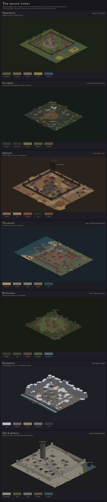

# The region towns: size, edge and ground

**Proposal, 2026-10-04; its questions answered by the owner the same day (see Decided).** The owner: *"Propose each region's town look, some a bit smaller with no wall, some larger
with stone walls. The ground can fit based on the map: dry dirt and arid, seaside with docks and a beach, low
mountain pass with some snow on the ground. Rocky outcrops."*

It follows [world-map-proposal.md](./world-map-proposal.md) §3, where every region gets one full town as the
player's base. Nothing here ships until the owner picks. Each town is built with its region's milestone.

*Drawn by `node tools/worldmap/towns.mjs` as block models, not bakes. Saltmere is drawn too, for the owner's
"swampy area is an option too". All of them are at one scale, so a small town
reads small. The camera looks from the south-east, so the top of each panel is the town's back (north and west).*

## What stays the same

The square doesn't change. [The town layout](./town-layout-proposal.md) found it by search, and
`test/town.test.mjs` holds every town to it:
- the five services (temple, tavern, shop, smithy, inn) and the well, in the same tiles;
- every door facing the well;
- the services 8+ tiles apart, all inside the hub frame;
- the camera's framing of the square.

The rules of the view don't change either:
- **tall at the back, low at the front**, so nothing stands in front of the square;
- **one way in**, the road into the high street;
- **the country stays outside**: the town has an edge, even where the edge isn't a wall.

A player who knows Thornwick's square knows every town's square. Everything round it changes.

## What changes

| Town | Region | Size | Edge | Ground | Its set pieces |
|---|---|---|---|---|---|
| **Thornwick** (shipped) | Emberfall | medium: 10 houses | timber palisade | meadow grass, farms | fields |
| **Saltmere** (waystation) | Emberfall: the Fens | **small**: 8 stilt houses | **no wall**: water all round | **bog water, peat and mud, reed beds, duckweed**; boardwalks | **houses on stilts**, the square a deck on piles, punts, eel traps, dead trees, marsh-lights |
| **Hollin Ford** (waystation) | the Greenwood | **small**: 3 longhouses and the barn | **no wall**: the fen river to the north, the oaks round the rest | **fen water, peat banks, reed beds**; forest floor | **the ford**'s stepping stones, Hollin Ford Barn (the dungeon site), alder and willow fen |
| **Ashgate** | the Reach | **large**: 16 houses in terraces | **slag-brick stone walls**, 10 towers | **dry, cracked earth and dust; red rock outcrops**; black slag | the pithead wheel over the gate, the Cinderworks' chimneys, slag heaps, the ore rails, a tailings pond |
| **Tollhaven** | the Tidemark | **large**: 12 houses and 4 warehouses | **stone walls on the landward sides**, the gate west on the Highmarch road; **the harbour north-east**, on the sea side | **beach sand, wet sand, dune grass; a salt marsh** along the north shore; quay stone | **the quay along the east, three jetties and moored boats**, two moles and the harbour chain, the beach south-east toward Gullwick |
| **Rookstead** | the Greenwood | **small**: 6 longhouses | **no wall**: a ring of standing stones | forest floor, moss, leaf litter; a grass clearing | the great oak, the moot-stone, skeps, the charcoal clamp; the wood close round |
| **Frosthold** | the Heights | **small**: 6 houses | **no circuit: the mountain pass is its wall** (decided). Crags behind, a drop in front, one wall across the road | **patchy snow over frozen dirt and tussock; rock outcrops and scree**; snowy pines | the north crags, the bell tower, the pass-wall, the frozen stream, the pilgrims' cairns |
| **The Lamphall** | Solmere | **largest**: 10 tenements and 4 roofless shells | **broken imperial stone walls**, with a breach | imperial flagstones with weeds in the joints; rubble; the Mere's mud flats | **the Great Beacon** over it all, the colonnade, the breach, the quay over the mud, the Mere Tower far out |

The ground area each town paints, against Thornwick's 170 × 145 tiles:

| Town | Tiles | Against Thornwick |
|---|---|---|
| Rookstead | 138 × 124 | −31 % |
| Saltmere | 146 × 128 | −24 % |
| Hollin Ford | 138 × 154 | −14 % |
| Frosthold | 160 × 148 | −4 % (the crags take a third of it) |
| Tollhaven | 216 × 174 | +52 % (a third of it is sea and salt marsh) |
| Ashgate | 202 × 176 | +44 % |
| The Lamphall | 204 × 190 | +57 % |

## The towns

### Thornwick, Emberfall (shipped)

The reference. It's a farming town with a timber palisade on an earth bank, thatch and timber-frame, fields outside
the gate (2026-10-04: the brook and its bridge before the gate are gone, the owner's call). Nothing else changes.

### Saltmere, the Greywater Fens: small, no wall, swamp

The owner: *"Swampy area is an option too."* The Fens are already the swamp on the map, so Saltmere, their
waystation, shows it. It's a stilt town in the bog a day from Thornwick.
- **Edge: none.** The water is all round it, and the only dry way in is **the boardwalk** along the old canal road.
- **Ground.**
  - **Bog water** everywhere, dark and still, with **duckweed** in green skins.
  - **Islands of peat and mud**, and **reed beds** standing in clumps.
  - The square is **a deck on piles**, plank instead of paving, in the same place and the same shape as every
    square. Boardwalks run off it to the houses.
- **Buildings.**
  - **Houses on stilts**: the Fens' rubble-and-plaster in its grey-green tones, slate roofs, raised a man's height.
  - As a waystation it has two services, standing where a town's tavern and temple stand: the *Drowned Eel*, with
    the Guild's board, and the Grey Sisters' chapel. (2026-10-05, the owner: "Saltmere needs an inn for party mgt")
    And a third, the inn: **the Stilt House**, at the head of the square (GDD v1.37).
  - The well is a rainwater cistern: nobody drinks the fen.
- **Set pieces.** Punts tied at the boardwalks, eel traps on stakes, stunted alders and dead trees, and
  **marsh-lights**, the pale wisps over the water at night. They are presentation only, and they never lead
  anywhere good.
- **Mood.** Fog, frogs and bitterns, the boardwalk's creak underfoot. Dusk comes early here.

### Ashgate, the Cinder Reach: large, slag-brick walls, arid

A mining town that pays well and doesn't ask.
- **Edge.** A curtain of black slag-brick, taller than Thornwick's palisade, with ten square towers. The gatehouse
  carries **the pithead wheel**, the first thing you see on the road.
- **Ground.**
  - Dry earth in rust and ochre, cracked in fine lines, with pans of pale dust.
  - **Red-brown rock outcrops** inside and out. The town was built round one in its back quarter.
  - Black slag along the rails and heaped outside.
  - No grass: a little olive scrub and dead thorn.
  - The brook becomes **a dry wash** of pale stones under the bridge.
- **Buildings.**
  - Black stone ground floors with plaster above, and rust-red slate roofs (the Reach's existing tones).
  - The miners' houses are **terraces**: long, low rows in the back quarters and below the high street.
  - Every window is lit orange.
- **Outside.**
  - The Cinderworks' three chimneys over the back wall, smoking.
  - Slag heaps, the ore rails along the approach, and a rust-coloured tailings pond.
- **Mood.** Dust on the wind, the shift-bell, the furnace glow behind the north
  wall at night.

### Tollhaven, the Tidemark: large, stone walls, the harbour north-east

The League's largest port, where even the harbour chain takes a toll.
- **Where it sits.** On the wall map Tollhaven is on the east coast, with the road from Highmarch and Brine Cross
  coming in from the west. So the town faces the same way (the owner):
  - **the gate is in the west wall**, where that road arrives;
  - **the harbour is on the north-east**, on the sea side, opposite the gate;
  - the coast road runs south past the beach to Gullwick.
- **Edge.** Grey stone walls with round towers on the three landward sides (north, west, south). On the sea side,
  the quay is the town's edge, and two moles close the harbour, with the chain between their towers.
- **What the camera sees.** North-east is the right of the screen. The harbour lies along the right of the town:
  the masts and the chain towers stand beyond the warehouses and the inn. The way in comes down from the top left,
  through the back wall's gate, so the camera's lead on the approach points down-screen, not left as in Thornwick
  (a per-town setting).
- **Ground.**
  - Brick and cobble in the town, and wet quay stone along the water.
  - **A salt marsh** along the north shore, between the north wall and the sea: mud, creeks, reeds and samphire.
    It's the swamp ground (below), salted.
  - **A beach** to the south-east, toward Gullwick: sand, a band of darker wet sand at the tide line, and dune grass
    on the rise behind it.
- **Buildings.**
  - Brick and tile in warm red-browns.
  - **Warehouses** along the quay, the Speaker's counting-house among them.
- **The water.**
  - **The quay** runs the length of the sea side, with **three wooden jetties** off it and boats tied up.
  - On the beach, boats are drawn up on the sand and nets are hung to dry.
- **Mood.** Fog and rain, gulls on every ridge, the chain's creak, rigging, curlews over the marsh. The water
  catches the lamps at night.

### Rookstead, the Greenwood: small, no wall

A clan steading inside a ring of standing stones, in a clearing the wood allows.
- **Edge: no wall.** **Fourteen standing stones** in a ring mark it, and the wood stands close outside them. The road
  comes in through the oaks over a log bridge.
- **Ground.**
  - Dark forest floor, moss and leaf litter under the trees.
  - Short grass in the clearing, and the square trodden to earth.
- **Buildings.**
  - **Longhouses** of oak with turf roofs and antlers on the gables, low and long.
  - The services keep their footprints but wear the same dress: turf roofs, the tavern a mead-hall (*The Antler*).
- **Set pieces.**
  - **The great oak** behind the temple, the biggest tree in the game.
  - **The moot-stone** beside the well.
  - Beehive skeps, woodpiles, and a smoking charcoal clamp outside the ring.
- **Mood.** Low mist between the trunks, lanterns hung in the branches, owls (the existing calls), wind in the leaves.
  It's the darkest town under the canopy, so its fires matter.

### Frosthold, the Pale Heights: small, the pass is its wall

A monastery turned fortress in a low mountain pass: pilgrims who never went home.
- **Edge: no circuit.** The pass closes it:
  - **the north crags** behind the town, tall, with snow on their heads, the backdrop to the square;
  - the mountainside behind the monastery;
  - in front (south), the ground **falls away to a frozen stream**: low rock and a drop, nothing that stands in front
    of the square;
  - **one stone wall across the pass road** with a gate and two towers, the only wall it needs.
- **Ground.**
  - **Patchy snow**, deeper on the north side of things, in the crags' lee and the shade of walls. It's thin on the
    trodden road, which shows frozen dirt.
  - Dry tussock grass between the patches.
  - **Rock outcrops and scree** everywhere, and dark pines with snow on them.
- **Buildings.**
  - Pale ashlar and plaster with steep blue-grey slate roofs (the Heights' existing tones).
  - **The bell tower** stands over the monastery chapel (the temple).
- **Outside.** **Pilgrims' cairns** along the road to the gate, and bells on posts.
- **Mood.** Snow and wind (the Heights' weather), bells on the hour, a colder, bluer night. The few lit windows are
  the warmest thing in the game.

### The Lamphall, Solmere: the largest, broken imperial walls

The Guild's house in the dead capital, and the square where every company meets.
- **Edge.** The empire's walls in pale dressed stone, twice Ashgate's height, with **a breach** in the north wall
  that nobody has mended. The east gate is an imperial arch.
- **Ground.**
  - Great imperial flagstones with weeds in every joint, and rubble.
  - Behind the north wall, **the Mere's mud flats**, where the lake was before it dropped twenty feet, and the water
    beyond.
- **Buildings.**
  - Tall tenements of four storeys, with grand stone below and patched timber above.
  - **Roofless shells** among them.
  - **A colonnade** of broken columns along the high street.
- **Set pieces.**
  - **The Great Beacon**, dark, standing over the Lamphall (the tavern): the tallest thing in any town, and the
    backdrop to the square.
  - The quay standing over the mud.
  - **The Mere Tower**, a black stump far out on the water.
  - The road west to the Bowl.
- **Mood.** Pigeons and echoes, braziers in the ruins at night, the Beacon's black shape against the sky.

### Hollin Ford, the Greenwood's waystation: small, no wall, a fen ford

Swamp, the second of the owner's three places for it. It's a ford on the Tithe Road where the Greenwood's slow river
spreads into fen.
- **Edge: none.** It's a steading on raised ground, with the river and its fen to the north and the oaks round the
  rest.
- **Ground.**
  - **Fen water** in a slow river, with **peat and mud** banks and **reed beds**: the swamp ground.
  - Forest floor and leaf litter on the dry side.
  - The square is trodden earth on the raised bank.
- **Buildings.** Turf-roofed longhouses like Rookstead's. The two services stand where a town's tavern and temple
  do: an alehouse with the Guild's board, and a shrine, both set up a step on the bank.
- **Set pieces.**
  - **The ford**: stepping stones across the river, up a track from the square.
  - **Hollin Ford Barn**, the dungeon site (*the Threshing Floor*), on the dry ground beside the steading.
  - Alder and willow fen along the water.
- **Mood.** Mist on the river, frogs, the barn's doors that won't stay shut.

### The waystations: small, no wall

Each region's other stops are **waystations** (world-map proposal §3): a tavern with the Guild's board and a
shrine. They have no smithy, inn or shop, and the board and the shrine stand where the tavern and temple stand in
a town.

| Waystation | Region | Its look |
|---|---|---|
| **Saltmere** | the Fens | drawn above: stilt houses over the bog, boardwalks for streets, eel traps |
| **Kell's Rest** | the Reach | the Assay's dusty depot under a dead volcano: sheds, wagons, red outcrops |
| **Brine Cross** | the Tidemark | a bridge-town: houses on the bridge itself, the river below |
| **Hollin Ford** | the Greenwood | drawn above: a ford across a fen river, a barn and a few houses among oaks |
| **The Frozen Hospice** | the Heights | a single hospice building and its yard at the foot of the Stair, deep snow |

## What it would take

**The town as data.** `buildTown` in `src/sim/outdoor.js` today takes the region's names and its building tones.
Each town would add a spec that `buildTown` reads, so a new town is data and not new code:
- **size:** the world's extent, the high street's length, the house list;
- **edge:** `palisade` (shipped), `stone` (the shipped curtain, towers and gatehouse), `ring` (standing stones),
  `pass` (crags, one wall across the road) or `harbour` (the quay and the moles);
- **ground:** the region's materials (below);
- **set pieces**, as placements, the way the farms and the bridge are now.

The sim lays these out, so the walkable world and the footprints come from the same place.

**New ground materials** in `src/render/outdoorpaint.js`, beside grass, dirt, cobble, mud and wheat. They follow
the same art rules: structure over noise, few tones, low-frequency normals.

| Material | Where | How it's drawn |
|---|---|---|
| **dry earth** | Ashgate, Kell's Rest | two tones, fine crack lines per cell, dust pans at low frequency |
| **slag** | Ashgate | black, with a little sparkle in the emissive (EMI alpha < 255, steady) |
| **sand**, **wet sand**, **shingle** | Tollhaven, Brine Cross | the wet band darker and with a little shine; shingle as pebble cells |
| **snow** | Frosthold, the Hospice | patches from noise, biased to the lee (north of anything solid); a little height |
| **forest floor** | Rookstead, Hollin Ford | loam, with litter and moss as low-frequency patches |
| **flagstones** | the Lamphall | large paver cells, with weeds in the joints by hash |
| **bog water**, **peat**, **reed bed**, **duckweed** | **Saltmere, Hollin Ford, and Tollhaven's salt marsh** (the owner) | still dark water with a faint sheen; peat as low lumps; reeds as upright tufts (the grass tuft, taller); duckweed as flat green patches on the water |

**New baked pieces** in `tools/actor-lab/buildkit.js` (never hand-edited, AGENTS.md):
- **Ashgate:** the pithead wheel, terraces, chimneys, slag heaps;
- **Tollhaven:** the quay, jetties (walkable decks, like the bridge), boats, warehouses, net racks, chain towers;
- **Hollin Ford:** the ford's stepping stones, the barn, alders and willows;
- **Saltmere:** stilt houses, the deck on piles, boardwalks (walkable decks, like the bridge), punts, eel traps, dead
  trees;
- **Rookstead:** longhouses, standing stones, the moot-stone, skeps, the charcoal clamp, the great oak;
- **Frosthold:** crags, the bell tower, cairns, and snow-capped variants of the shipped rocks and pines;
- **the Lamphall:** tenements, roofless shells, columns, rubble, imperial wall pieces, the Great Beacon.

The shipped rock clusters cover the outcrops, recoloured per region.

**Budget.**
- **Atlases.** Only the current region's town atlas loads. Each new one should stay within the shipped four's
  average (3.39 MB for four, about 0.85 MB each).
- **Ground.** The large towns paint 44–57 % more ground than Thornwick. The ground is painted per pixel, so measure
  the scene's load and frame time on a real phone before shipping the first of them (AGENTS.md: measure, don't
  guess).

**Tests.** `test/town.test.mjs` already runs for every region. With this:
- every rule above holds for every town (doors face the well, the services 8+ apart, every door in the frame);
- a walled town closes, with the way out only through the gate;
- an open town (the ring, the pass) has its exits only where its spec says;
- you wake in the square in every town.

**Captures.** Before and after for each town on the manual clock, by day and at dusk, kept dusky (the owner's art
direction).

## When

| Milestone | Town |
|---|---|
| M8 | **the Lamphall** (with the Solmere shell); **Saltmere** becomes the Fens' waystation |
| M9 | **Ashgate**, with the Reach |
| M11 | **Tollhaven**, with the Tidemark |
| M12 | **Rookstead**, with the Greenwood, and **Hollin Ford** |
| M13 | **Frosthold**, with the Heights |

The `?scene=town&region=` previews for `fens`, `reach` and `heights` stay until their towns are built.

## Decided

The owner (2026-10-04):
- **Walls per town are right:**
  - large and walled: Ashgate, Tollhaven and the Lamphall;
  - small and open: Rookstead, Frosthold and Saltmere;
  - Thornwick's timber palisade as shipped.
- **Frosthold's walls are the mountain pass:** crags behind, the drop in front, one wall across the road.
- **Tollhaven's harbour is on the north-east**, the sea side, as the town sits on the wall map, with the gate west,
  opposite it (drawn so above).
- **Swamp ground in three places:** Saltmere, Hollin Ford, and the salt marsh by Tollhaven.

## Still open

Nothing. The next step is building Ashgate with the Reach (M9).
