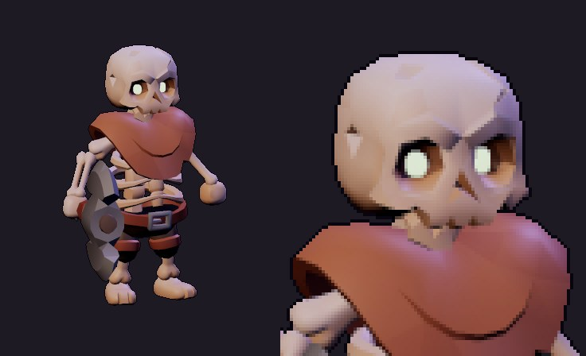
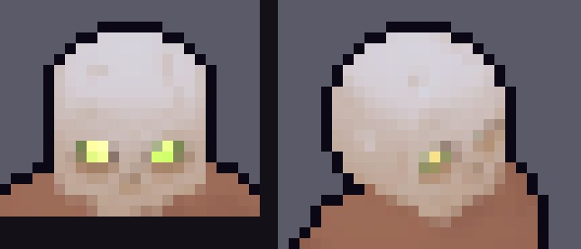
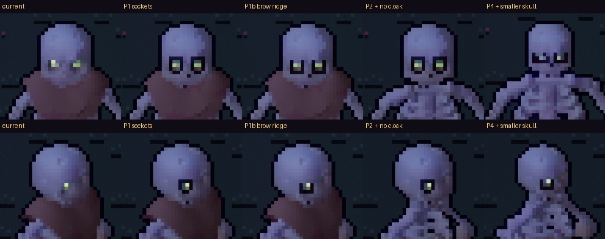
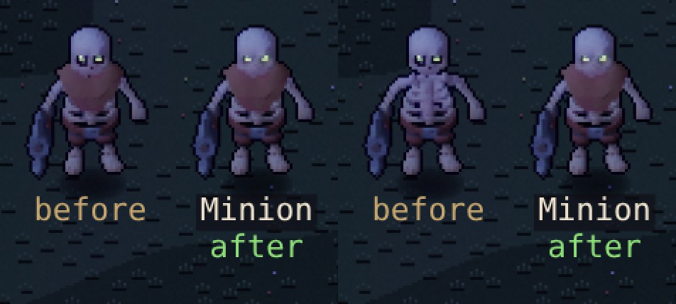

# The Ashbound minion's skull — evaluation and options (proposal)

**Proposal, 2026-10-02. Not built.** The shipped atlases are unchanged. This answers pass 9's still-wrong
item 3: the minion's skull "reads as a large white ball". The fix should keep it a **skull**, not
borrow the human face kit.

## What's wrong

*The KayKit minion at high resolution: deep orange-brown eye sockets around the glowing eyes, a nose
cavity, cheekbones, a separate jaw with teeth, cracks.*

*The same skull in the atlas (front idle cell, unlit albedo lifted ×1.5, 12× nearest). One square is
one in-game pixel.*

Measured on the front (dir 2) and three-quarter (dir 1) idle cells:

1. **Size isn't the problem.** The skull is 16 × 12 px from the front and 20 × 15 in three-quarter,
   22–25 % of the figure's height. That's no bigger than the human heads (14–20 px wide, pass 7).
2. **The sockets are averaged away.** The bake averages 4 × 4 sub-samples per pixel. The source's
   sockets are a mid orange-brown, and once averaged with the bone around them they become a faint
   tint of it.
   - **0 pixels** inside the skull are darker than 45 % of the bone (median bone luminance 135
     front, 129 three-quarter).
   - The glowing eyes survive as 2 × 1 px each from the front, and **one** pixel in three-quarter,
     sitting on light bone with nothing dark around them.
3. **The jaw is hidden.** The cloak's collar rides up over the jaw and teeth, so all that shows is the
   cranium: a dome with no jaw, like an egg.
4. **It's the only bare skull.** The warrior wears a helmet, the archer a hood, the mage a hat. The
   minion's skull is the largest flat, bright area among the Ashbound, so the eye goes to it, and it
   has no features.

The KayKit model has everything a skull needs. The bake throws away the dark parts, and the cloak
hides the jaw.

## Options

All prototyped on the minion in a scratch copy of the actor lab, judged on the Stage at zoom 3 and at
in-game size, by night (the barrows are dark).

*Front (top) and three-quarter (bottom), zoom 3, night. Left to right: current, P1, P1b, P2, P4.*

| | Option | What it changes | Measured (dark feature px, front / three-quarter) | Verdict |
|---|---|---|---|---|
| — | Current | — | **0 / 0** | An egg with two faint dots |
| **P1** | **A pixel skull** (bake rule) | Drawn from the model's own geometry: the `Eyes`, `Head` and `Jaw` meshes are tagged in a part pass. Each glowing eye's skull neighbours become a dark socket (near-black warm brown, `#22140f`), with a bone bridge kept between two sockets. A nasal notch goes two rows under the eyes' midpoint. A tooth row runs along the top of the jaw where it shows, alternating dark and bone. | 12 / 16 | Reads as a skull at once, but the full dark ring reads a little like square goggles |
| **P1b** | **P1, sockets open below** | The dark ring goes beside and below the eye, never above, so a bone brow ridge stays over each socket. | 4 / 13 | **Best skull.** Heavy brow, hollow sockets, the glow inside; no goggles |
| **P2** | **P1 + the cloak off** | The minion's cloak mesh is left off, so the jaw, teeth, spine and ribcage show. | as P1 | Unmistakably a skeleton; loses the cloak's colour |
| P3 | P2 + graded bone | Bone contrast 1.12 → 1.3, gain 0.62 → 0.56: aged, with a little form. | as P2 | Barely visible at this size; not worth a knob |
| P4 | P1b + a smaller skull | Head bone 0.62 → 0.52. | 8 / 16 | **Worse.** With fewer pixels across, the two sockets merge into one dark visor band |

*True in-game size (zoom 1, DPR 2), night. Left pair: P1b beside the current minion. Right pair: P2b
(P1b's sockets, no cloak) beside the current minion. The Stage labels the prototype "before".*

## Recommendation

1. **Ship P1b as the skeletons' "pixel skull"**, a skeleton-only rule like the face kit's A2 eyes.
   - **Sockets:** dark, open below with a bone brow ridge, the glowing eye inside.
   - **Nose:** a nasal notch.
   - **Teeth:** a tooth row wherever the jaw shows.
   - **Who gets it:** all five skeleton figures (minion, warrior, archer, mage and the Standard), but
     only where the skull is actually visible. Under the warrior's visor and the hoods it finds few
     pixels and changes little, which is right.
2. **Decide on the cloak (P2).** Without it the minion is the Ashbound's bare-bones rank: jaw, spine
   and ribs. That's the clearest "skeleton" read in the game, and it sets him apart from the
   helmeted, hooded and hatted ones by silhouette, not colour.
   - **The cost:** the minion's only colour, the rust cloak. At night he becomes a pale figure on
     a dark floor.
   - **Middle way:** keep the cloak but swap it for a lower, ragged shoulder cloth that clears the jaw.
     It's a new prop, a bigger job than leaving the mesh off.
3. **Don't shrink the skull (P4),** and skip the bone grade (P3).

## What it would take

- **Lab (`tools/actor-lab/lab.js`):**
  - a `skull` variant flag that tags the skeleton meshes by name (`*_Eyes`, `*_Head`, `*_Jaw`);
  - an `albSkull` rule beside `pixelFace` (about 40 lines: the scratch prototype);
  - a `hide` list of meshes, for P2.
- **Bakes:** the five skeleton actors, with no other actor touched. A default bake of everything
  else is byte-identical.
- **Cost:** atlas sizes unchanged (the same cells); no runtime change.
- **Test:** the front idle cell of each skull-bearing skeleton has dark socket pixels around its glow.
- **Docs:** an art critic pass entry with before and after on the Stage and in the barrows.

## Decision needed

- **P1b sockets for the skeletons:** ship? (Recommended.)
- **The minion's cloak:** off (P2), keep it, or a lower rag (a new prop)?
