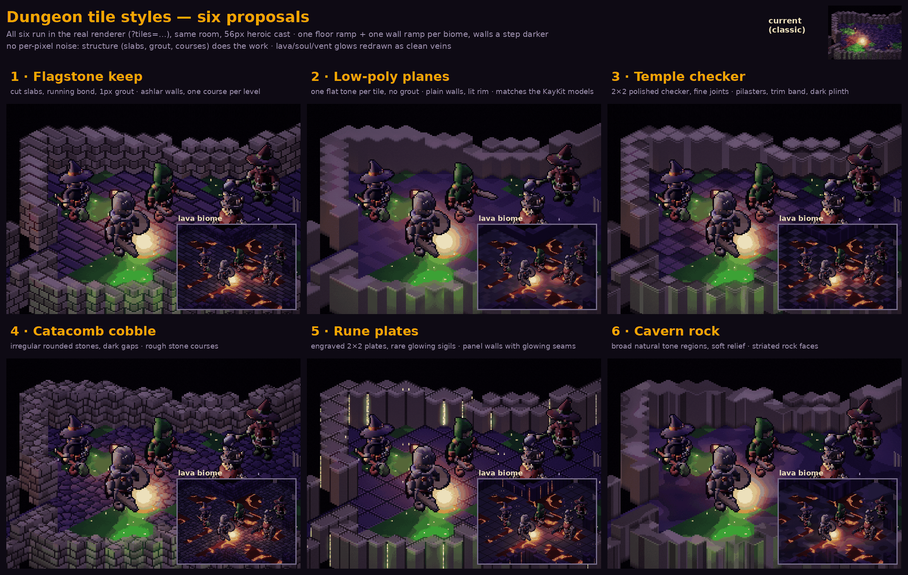
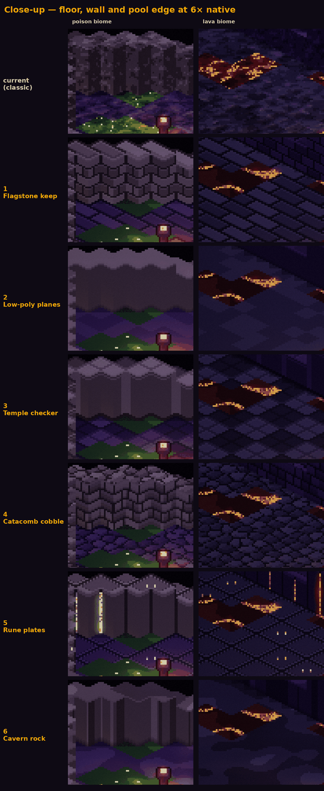

# Dungeon tile styles — six proposals

**Status: proposal (2026-09-28), awaiting a pick.** Goal: less colour and pixel noise,
with cleaner floor and wall tiles. All six are implemented in the real renderer
(`src/render/tilestyles.js`) and selectable with `?tiles=<key>`. Without the parameter
the game keeps today's look (`classic`) until one is chosen.



## What was noisy, and what changed

The classic painter in `renderer.js` picked **every pixel's** ramp step from fbm noise and
**every pixel's** normal from the noise gradient. That reads as grain, and the normal noise
sparkles under the Emberlit torch. Rooms also mixed several floor materials (soil, bone
and flesh together).

The structured styles:

- **Paint from structure, not noise.** Slabs, grout, courses and flat planes, computed from
  tile-local coordinates. Noise appears only per tile or per slab, never per pixel.
- **Use less colour.** One floor ramp (the biome's primary floor) and one wall ramp per biome.
- **Make walls a step darker than floors.** Wall caps stay lighter, so tops still read and
  the play space pops.
- **Use flat or low-frequency normals,** so lighting is smooth and never sparkles.
- **Calm the hazards.** Pools get two broad tones; lava and soul cracks become long calm
  veins; ember vents are one glowing core per tile; poison and water get at most one glint
  per tile instead of per-pixel glitter.



## The six

| # | key | floor | walls | feel |
|---|---|---|---|---|
| 1 | `flagstone` | cut slabs in a running bond, 1 px grout, bevelled edges | ashlar blocks, one course per elevation level | built keep; the most "dungeon" |
| 2 | `lowpoly` | one flat tone per tile, no grout | plain faces, lit rim, base shadow | the cleanest; matches the KayKit models |
| 3 | `temple` | 2×2 polished checker, fine joints | pilasters every 2 tiles, trim band, dark plinth | crypt or temple; very readable |
| 4 | `cobble` | irregular Voronoi stones, dark gaps, dome-lit | rough stone courses of varied width | catacomb; most texture |
| 5 | `runeplate` | engraved 2×2 plates, rare glowing sigils | panels whose seams sometimes glow | arcane forge; uses Emberlit emissives |
| 6 | `cavern` | broad natural tone regions, soft relief | striated rock faces, darker at the base | natural cave |

Styles can also be assigned **per biome** (e.g. cavern for desert and chasm, flagstone
for dread and poison) rather than picking one for everything. The painter is a
per-tile lookup, so mixing styles costs nothing.

## Preview

```
index.html?tiles=flagstone            # any key above; add &theme=lava|poison|desert|ember|chasm|dread
```
