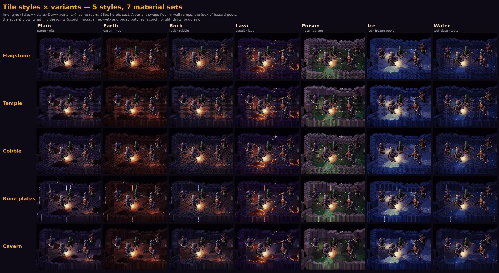
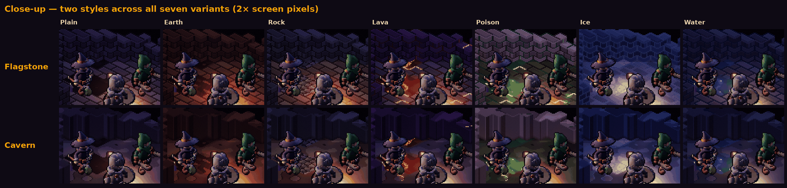

# Dungeon tile styles — 5 styles × 7 variants

**Status: `cobble` is the default (2026-09-28).** Goal: less colour and pixel noise, with
cleaner floor and wall tiles. Five structured styles are implemented in the real renderer
(`src/render/tilestyles.js`); each comes in seven material **variants**. Low-poly was
dropped. The game now renders **cobble** unless `?tiles=` picks another style;
`?tiles=classic` brings back the original per-pixel-noise look.



## Preview

```
index.html?tiles=flagstone&tv=ice      # style: cobble (default) | flagstone | temple | runeplate | cavern | classic
                                       # tv:    plain | earth | rock | lava | poison | ice | water
                                       # add &theme=dread|desert|poison|ember|lava|chasm for a different level
```

Without `tv`, each biome picks a default variant: dread → plain, desert → earth,
poison → poison, ember → lava, lava → lava, chasm → rock.

## The five styles

| key | floor | walls | feel |
|---|---|---|---|
| `flagstone` | cut slabs in a running bond, 1 px grout, bevelled edges | ashlar blocks, one course per elevation level | built keep; the most "dungeon" |
| `temple` | 2×2 polished checker, fine joints | pilasters every 2 tiles, trim band, dark plinth | crypt or temple; very readable |
| **`cobble`** (default) | irregular Voronoi stones, dark gaps, dome-lit | rough stone courses of varied width | catacomb; most texture |
| `runeplate` | engraved 2×2 plates, rare glowing sigils | panels whose seams sometimes glow | arcane forge; uses Emberlit emissives |
| `cavern` | broad natural tone regions, crevices between them, soft relief | striated rock faces, darker at the base | natural cave |

## The seven variants

A variant is a material set layered on any style. It swaps five things:

| key | floor / wall ramps | hazard pools look like | joints | broad patches | accent glow |
|---|---|---|---|---|---|
| `plain` | dressed stone / basalt | sunken black pits | — | — | violet |
| `earth` | packed earth / loam | glossy mud sumps | — | damp earth | ember |
| `rock` | warm weathered rock / cold crag | rubble heaps | — | — | soul |
| `lava` | basalt / obsidian | lava with calm glowing veins | scorched, a few live embers | scorch | lava |
| `poison` | blighted moss / bone | poison pools, ≤1 glint per tile | moss, rare glow | blight | poison |
| `ice` | packed ice / glacier | frozen pools with hairline cracks, rare frost glint | rime | snow drifts | frost *(new)* |
| `water` | wet slate / slate | clear dark water, ≤1 glint per tile | water-dark | mirror-flat puddles | aqua *(new)* |

- Pools are still the level's hazard tiles (impassable); only their look changes. Glowing
  pools (lava, poison, ice, water) also drive the hazard point lights in that colour.
- Joint glows only appear on floors. Wall faces take the joint colour but never its glow,
  which keeps walls calm.
- New palette ramps: `stone, earth, loam, rock, crag, moss, ice, glacier, frost, slate,
  tide, mud, pit`. New glows: `GLOW_ID` 7 frost and 8 aqua.



## What was noisy, and what changed

The classic painter in `renderer.js` picked **every pixel's** ramp step from fbm noise and
**every pixel's** normal from the noise gradient. That reads as grain, and the normal noise
sparkles under the Emberlit torch. Rooms also mixed several floor materials (soil, bone
and flesh together).

The structured styles:

- **Paint from structure, not noise.** Slabs, grout, courses and flat planes, computed from
  tile-local coordinates. Noise appears only per tile or per slab, or at very low
  frequency (patches, pools), never per pixel.
- **Use less colour.** One floor ramp and one wall ramp per variant.
- **Make walls a step darker than floors.** Wall caps stay lighter, so tops still read and
  the play space pops.
- **Use flat or low-frequency normals,** so lighting is smooth and never sparkles.
- **Calm the hazards.** Pools get two broad tones; lava becomes long calm veins, and glints
  are at most one per tile.

The original six-style proposal (including the dropped low-poly style) is kept for
reference: [six styles](./img/tiles/tile-styles-six.png) ·
[close-up](./img/tiles/tile-styles-closeup.png).

## Open

- Optionally assign other styles per biome on top of the cobble default. Styles and
  variants are per-tile lookups, so mixing costs nothing.
- Decide whether variants should become real level themes. Today a variant is visual
  only: an ice pool is still just impassable, not slippery.
