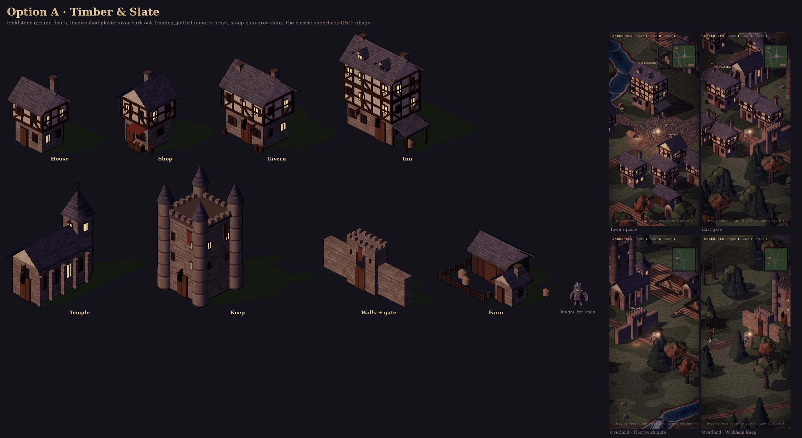
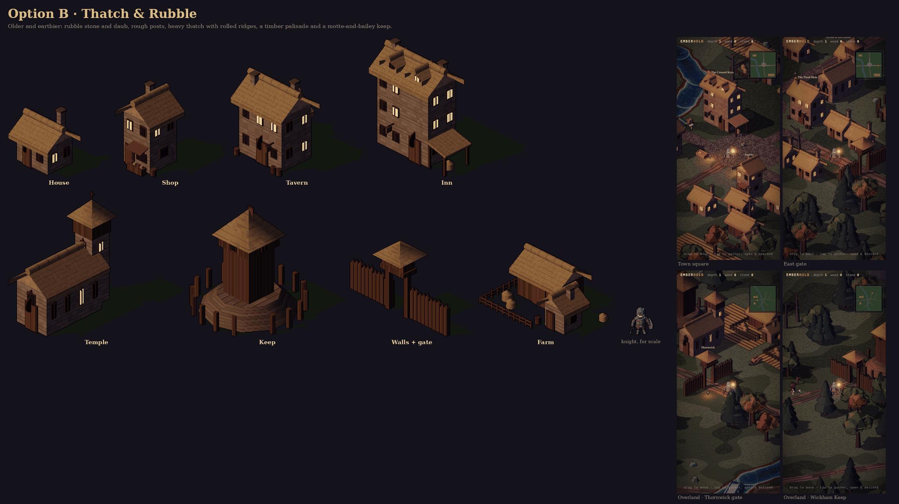
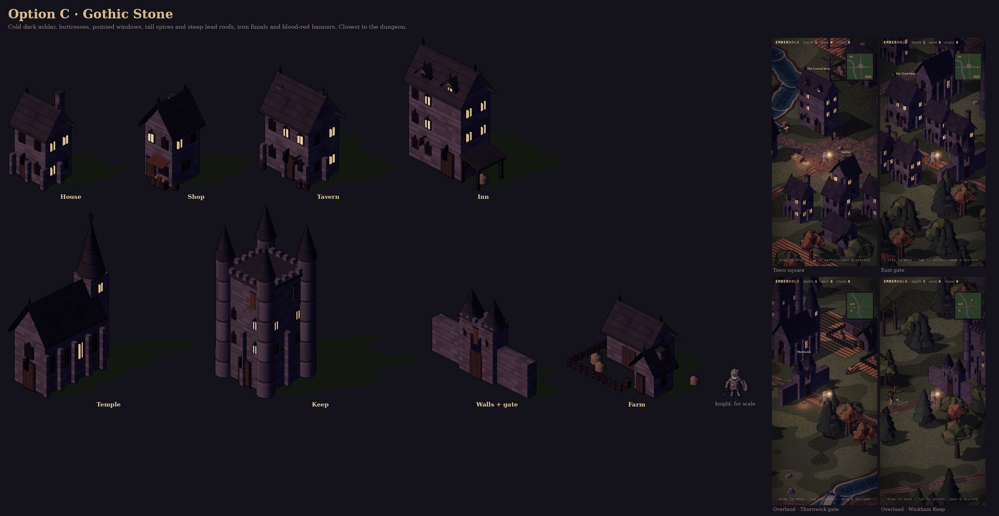
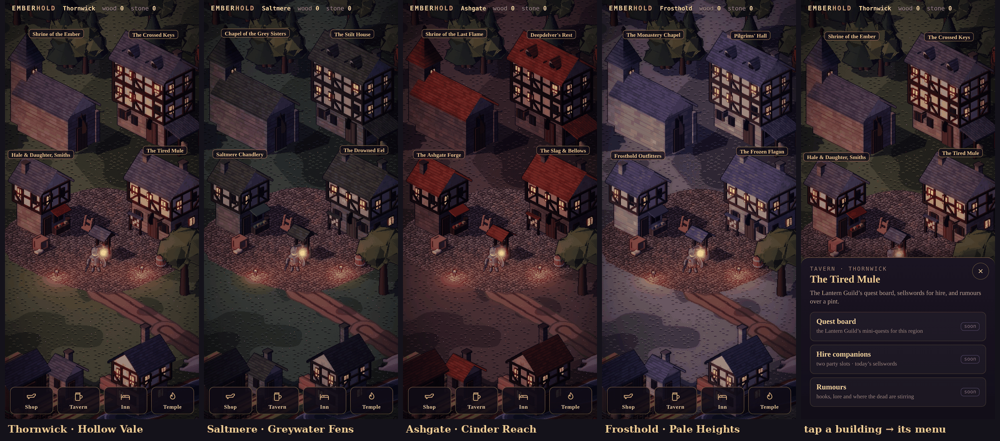
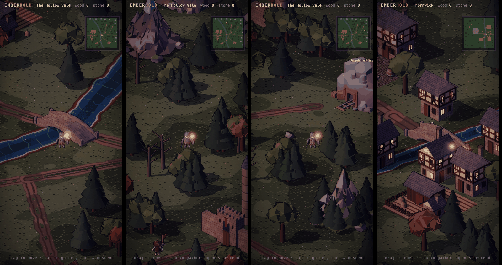

# Town & overland art — three options

**Status: decided (2026-09-28). Option A's shapes, toned per region.** Towns are hubs
(one per region). The four service buildings keep A's silhouettes everywhere, and each region
changes only tones and materials. See *Hub towns* below. The three original options are kept
for the record. The first town/overland prototype used
the KayKit Medieval Hexagon buildings as-is. Their bright, toy-like style didn't fit the
dungeon or an older, grim D&D feel. So the buildings (and trees) are now **our own
assets**: low-poly models authored in code (`tools/actor-lab/buildkit.js`), in three
art-direction options. They are baked through the same pipeline as the actors: albedo,
real normals, a per-pixel depth key, a sun shadow, and lit windows. The whole surface is
regraded towards the dungeon palette: olive-grey ground, violet dusk ambient, a low amber
sun.

Each option has the full set: **house, shop, tavern, inn, temple, keep, walls + gate,
farm**. None of them are enterable.





| | A · Timber & Slate | B · Thatch & Rubble | C · Gothic Stone |
|---|---|---|---|
| Walls | fieldstone ground floor, limewashed plaster over dark oak framing, jettied upper storey | rubble stone and daub, rough posts | cold dark ashlar, buttresses |
| Roofs | steep blue-grey slate | heavy thatch with rolled ridges | very steep lead, iron finials |
| Keep / walls | stone tower keep with turrets; crenellated curtain wall and gatehouse | motte-and-bailey: timber tower on a mound, palisade and gate tower | tall spired keep; curtain wall with spired gate towers |
| Feel | the classic paperback-D&D village | older, earthier, frontier | grim, closest to the dungeon |

## Preview

```
index.html?scene=town&bset=A        # the town of Thornwick, option A (B, C)
index.html?scene=overland&bset=C    # the Hollow Vale overland, option C
```

`?scene=` opens that scene fresh (it doesn't resume a save). Walk out of town by the east
gate to reach the overland. The Old Barrows' stairs lead down into the dungeon, and the
dungeon's first level has a way back up.

## How it's built

- `tools/actor-lab/buildkit.js` holds the building kit (walls, timber framing,
  gable/pyramid/cone roofs, windows, doors, chimneys, crenellations, buttresses, banners,
  signs, fences, hay) plus the trees (pine, broadleaf, autumn, dead, groves). Textures
  are procedural canvases (stone courses, plaster, planks, slate, lead, thatch).
- `tools/actor-lab/bake-env.cjs` bakes `env.json` into `assets/env/env.{alb,nrm,key}.png`
  plus footprints (`src/sim/envfoot.js`).
- `src/sim/outdoor.js` generates the town and overland: river and road polylines, plazas,
  fields, placed structures, collision, exits.
- `src/render/outdoorpaint.js` paints the ground per pixel (smooth banks and verges).
- The renderer has a depth buffer, so actors walk behind buildings, trees and walls. Anything
  hidden shows as a dim X-ray silhouette. This also fixes actors drawing over walls in the
  dungeon.

## Hub towns: same shapes, regional tones (decided)



- `?scene=town&region=vale|fens|reach|heights` previews each region's hub.
- The square is authored in screen terms for the portrait frame: temple and inn at the back,
  shop and tavern in the middle row, and the well on open flags in front. The camera eases
  onto a fixed framing inside the square (`world.hub`). The service bar and bottom-sheet
  menus live in `src/ui/townmenu.js`.
- Atlases: `assets/env/env.*` (shared: trees, rocks, props, bridge) plus
  `assets/env/town-<region>.*` (that region's buildings). Only the current region's atlas loads.
  Tones are in `STYLES.{vale,fens,reach,heights}` in `tools/actor-lab/buildkit.js`.

## Bridge, rocks and mountains (ours)



The KayKit bridge, rocks and mountains are replaced by `makeNature()` in
`tools/actor-lab/buildkit.js`:
- A humped stone bridge with a flattened arch and parapets. It has the same span and deck
  width, so the roads and the walkable deck are unchanged.
- Five faceted rock clusters, mossy on top.
- Five mountain massifs: a skirt, shoulder crags and a main peak, with scree at the base,
  snow above ~58 % of the height, and grass and pines on the lower slopes of three of them.

Sprite ids are unchanged (`bridge_0/90`, `rock_A…E`, `mountain_*`), so no layout changed.
