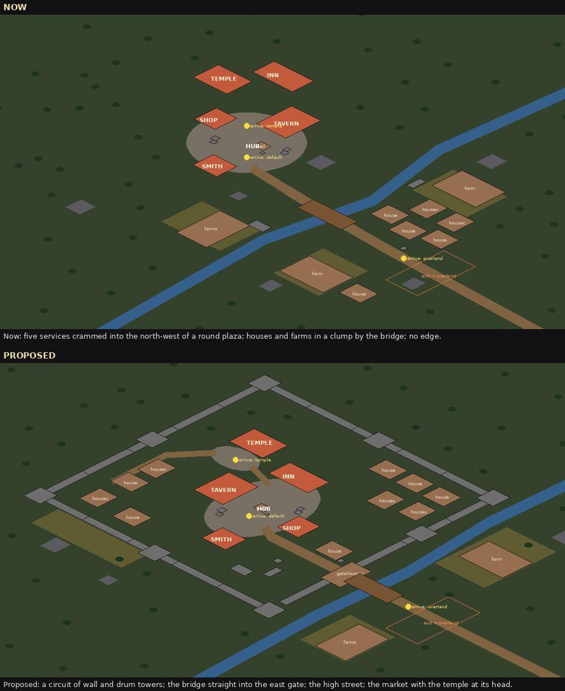
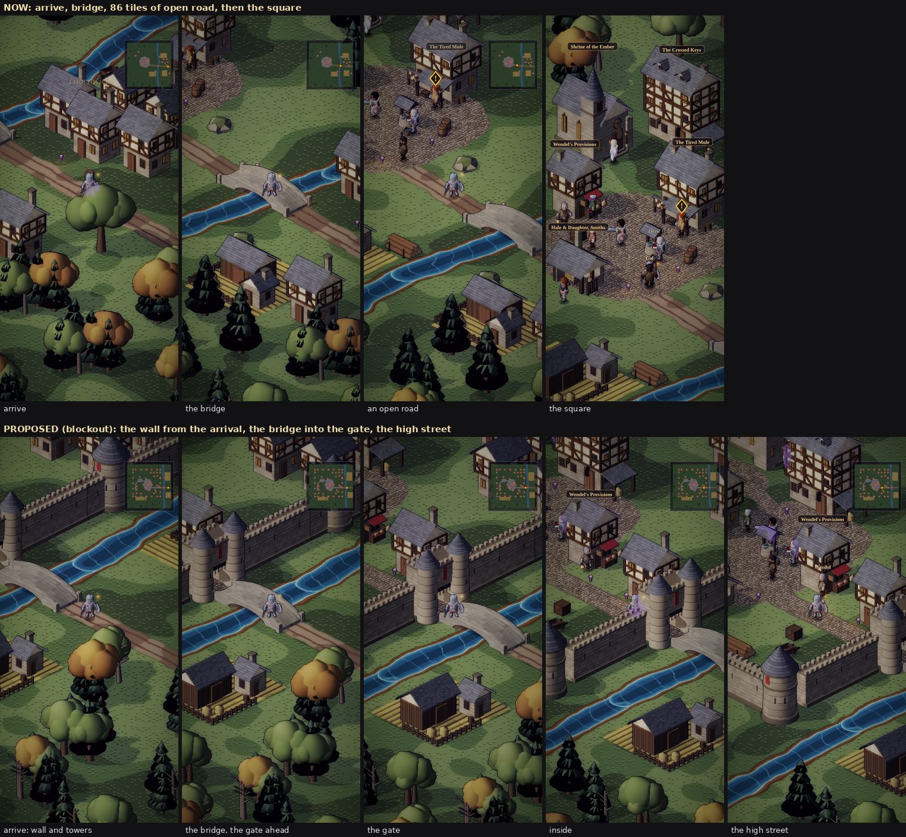
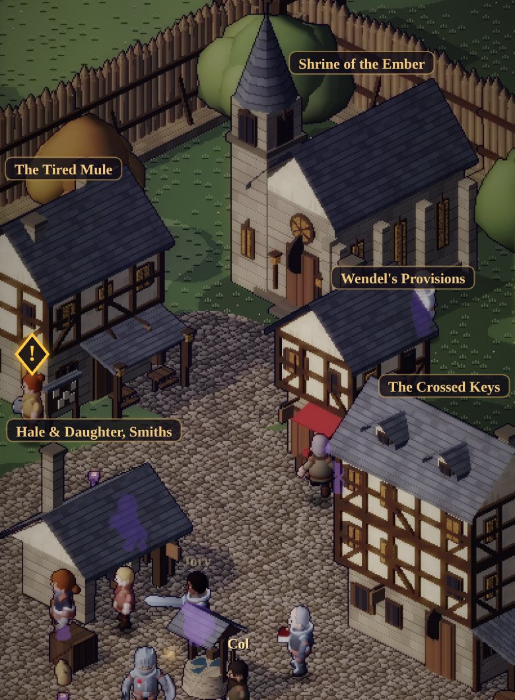
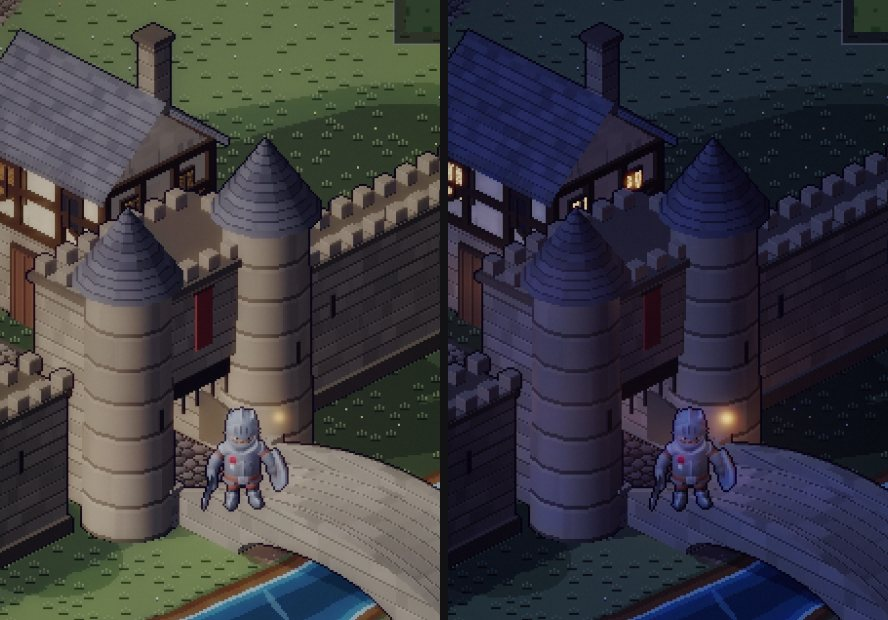
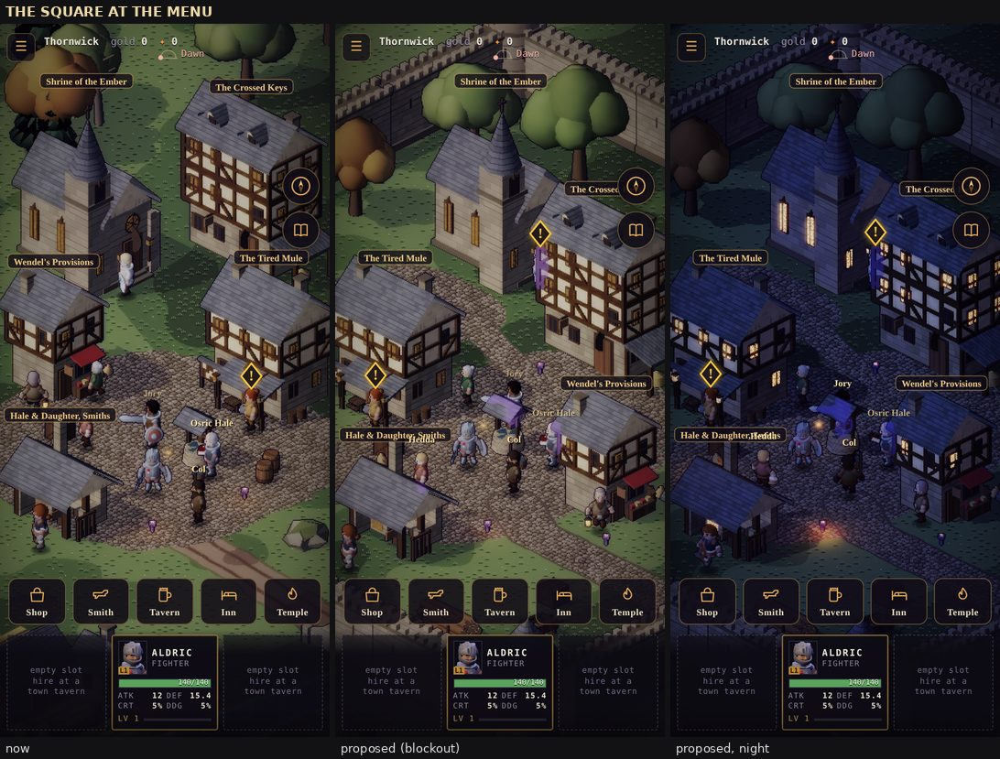
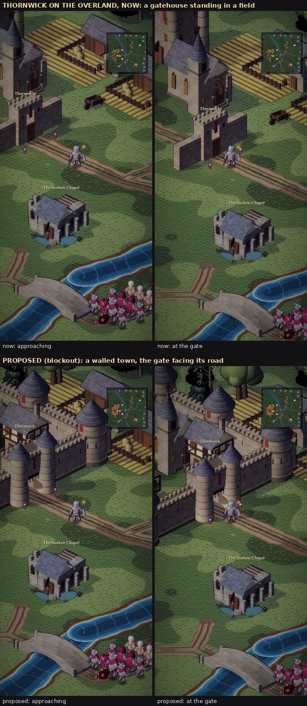
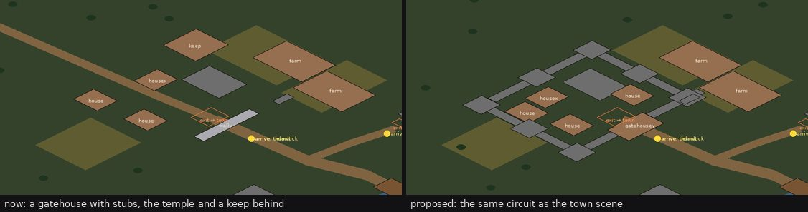
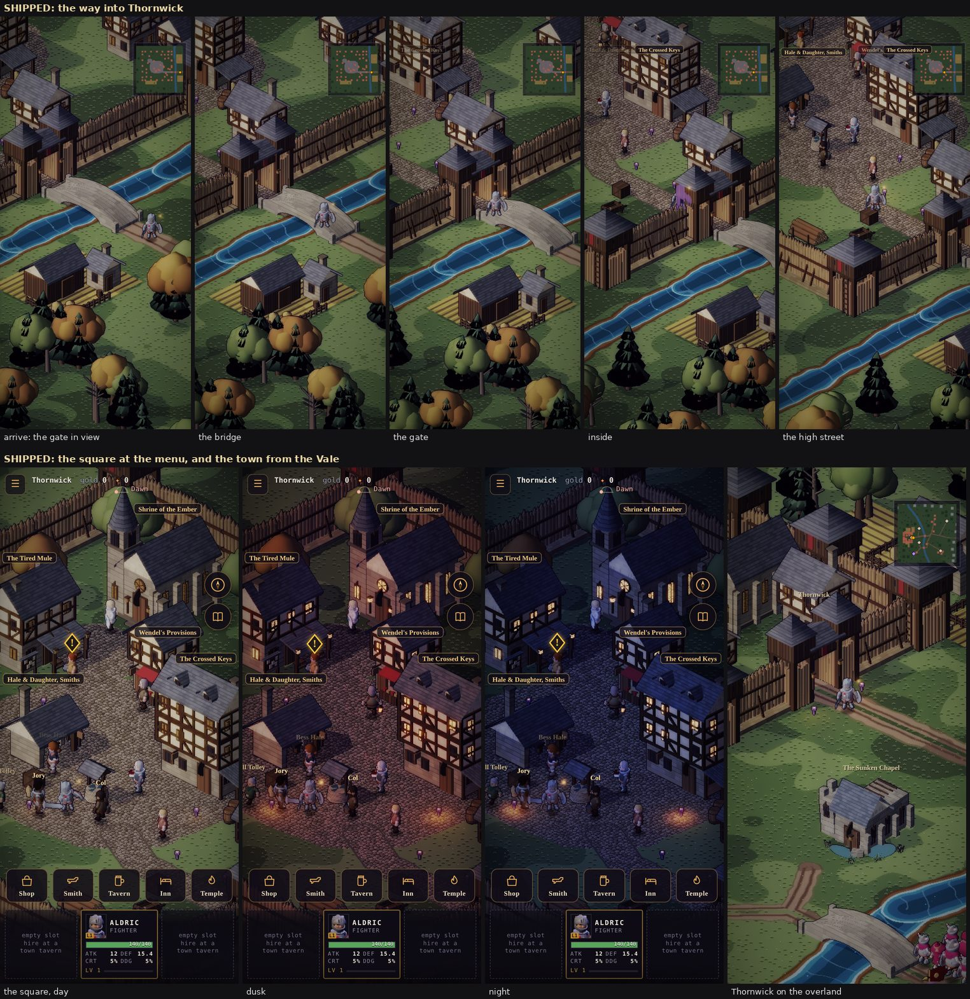

# The town: layout, walls and gates — review and replan (proposal)

**Implemented, 2026-10-03 (revision 2, approved).** See *Shipped* at the end. Proposed 2026-10-02. This review looks at the town scene and at
Thornwick on the overland the way an art critic would: the square, the way in, and the town's edge. It
proposes a replan that keeps the square as the menu and gives it more room.

**Revision 2** takes in your first decisions:
- **Thornwick's wall is timber.** It's a beginning town. The stone set waits for a later region's town.
- **The temple turns 90° clockwise,** and **every entrance faces the centre of the square.**
- **The camera leads toward the gate** on the approach.
- **The overland road west through Thornwick is dropped.**

Everything marked *blockout* was built and captured in the real renderer, in a scratch checkout:
- `buildTown` and the overland's Thornwick re-laid;
- rough wall pieces made in the buildkit and baked: a log palisade, a timber watchtower, a timber
  gatehouse, and the earlier stone set;
- two small renderer changes: the camera lead, and service plaques that stay on screen.

The pieces are stand-ins for the art, not the art. The layout's numbers are the part to judge.

The blockout's code is superseded by the shipped code (see *Shipped*).

## How it was measured

- **Plans:** every structure's footprint from `src/sim/envfoot.js`, drawn in screen orientation (iso,
  the camera's way round) for the town and for the overland around Thornwick.
- **Walk-ins:** in-game captures on the manual clock at 390 × 844, DPR 2. The overland road up to the gate,
  then the town scene from the arrival to the square.
- **The square at the menu:** the hub framing with the HUD and the services bar on, by day and by night.
- **Numbers:** these come from the layout, not from the pictures.
  - **The gaps between services:** the nearest distance from one footprint to another.
  - **Paving under buildings:** how much of the square's paving the footprints cover.
  - **Open paving in the hub frame:** the paved tiles inside the part of the frame you can see, between
    the HUD and the menu bar. That's ±25 tiles of *x − y* across, and from 93 above to 60 below the focus
    in *x + y*.
  - **Each service's screen offset** from the focus.

## What's wrong (ranked)

*Plans in screen orientation (the top of the image is the top of the screen). Red: the five services.
Grey: wall pieces and rocks. Yellow dots: arrivals. Orange box: the way out to the overland.*

1. **The town starts nowhere.** There is no edge, no wall and no gate in the town scene: 0 wall pieces.
   You arrive among five houses and two farms, cross a bridge, and walk **86 tiles of open road** to the
   square. Nothing on the way says you've entered a town. The houses (all six of them) stand *outside*
   the place they belong to, in a clump by the bridge. The farms and fields are mixed in among them,
   in front of the square.
2. **The square is crammed into one corner.**
   - The five services stand in the north-west half of a round plaza. The nearest gaps are 4.4 tiles
     (temple to inn), 6.9 (shop to tavern) and 9.0 (inn to tavern), where a building is about 13 tiles
     across.
   - The temple and the inn aren't on the square at all: they stand behind the shop and the tavern,
     **35 tiles from the well**.
   - Buildings cover 19 % of the paving. The round plaza is about as wide as the portrait frame, so it
     reads as a disc of paving the buildings sit on, not a square they face.
3. **On the overland, Thornwick is a gatehouse standing in a field.**
   - It's one gate piece with two stubs of wall, enclosing nothing, with the temple and a tall keep tower
     just behind it and houses on either side.
   - It says "walled town" from far off and "no walls" when you arrive, because the town scene has none.
     The two scenes contradict each other.
4. **There's no axis.** The road, the bridge, the square and the temple don't line up, so the eye has
   nowhere to go. On a phone, a single way in that ends on a landmark is the strongest composition
   available: it tells you where the heart of the town is before you reach it.

## The replan

### Rules for a town seen this way

1. **The frame is narrow and deep.** The portrait frame shows about 50 units of *x − y* across (25 tiles
   of a square's side) but about 150 units of *x + y* between the HUD and the menu bar.
   - So extra spacing has to go into **depth**, not width.
   - The services stagger left and right as they go down the frame.
   - Each sits within ±17 units of the centre, so its plaque fits on screen.
2. **Tall at the back, low at the front.** The camera looks from +x+y.
   - The town's back walls (north and west) show their inner faces as a backdrop behind the town.
   - The front walls (east and south) stand in front of it and occlude, so they're kept far from the
     square, where the menu bar covers them.
   - The houses sit at the back, with gardens and orchards at the front.
3. **A town has an edge, and the country stays outside it.** A wall circuit, one gate on the road, and
   the farms and fields outside the wall.
4. **One axis:** bridge → gate → high street → market → temple.

### Every entrance faces the square

*The square at in-game size, the HUD off. Every door is on the face toward the well:*
- *the temple's under its rose window, at the top of its steps;*
- *the shop's under its red awning, where Wendel stands;*
- *the inn's on its near face, at the bottom right;*
- *the tavern's under its porch, where Maudry stands;*
- *the smithy's open forge, toward the well.*

**The camera sees only two faces of a building:** the one toward screen bottom-left (+y) and the one
toward screen bottom-right (+x). So a door can face the square only if the building stands *up-screen*
of the square: north or west of the well. A service standing below the well would show the square its
back.

That rules out the first blockout's arrangement, where the shop and the smithy stood at the square's
foot. It also makes the square hard to fit on a phone:
- each service is about half the portrait frame wide;
- all five have to stand in an arc above the well;
- each must sit far enough to one side that the building in front doesn't hide its door.

**How the places were found.** I placed the five by a search, not by hand. Each candidate layout had
to pass every rule:
- the door faces the well (within 55°);
- the door isn't behind another service's sprite;
- the door is inside the hub frame;
- the services stand 7+ tiles apart (8.8 in the end);
- the square stays open for 10 tiles round the well.

**What it found:**
- Four services fit easily.
- The fifth fits only if service plaques may slide to stay on screen. The temple, tall and at the
  head, would otherwise put its plaque above the frame.
- So the blockout keeps service plaques on screen (a renderer change). This is the arrangement that
  matched the baked turns:

| | Left (door +x) | Centre | Right (door +y) |
|---|---|---|---|
| Head | | Temple (door +y: turned 90° clockwise) | |
| Upper | Tavern | Shop | |
| Front | Smithy | Well (the Watch) | Inn, by the high street |

The services keep the GDD's rule: **the same five buildings in the same places in every town**. Their
places change once, here.

### The plan (blockout)

| What | Where (tiles) | Note |
|---|---|---|
| **Wall circuit** | x 10–112, y 8–108 | Timber for Thornwick: a log palisade on an earth bank, 8 watchtowers (the corners and mid-runs), one gatehouse. 28 pieces |
| **Gate** | east wall, y 80 | Faces the road. The moat-stream runs under the east wall, and the bridge lands straight at the gate |
| **High street** | cobbled, x 112 → 84 along y 80 | One house on its north side. The inn stands at its head, on the square's corner |
| **Square** | the well at (66, 71); 48 × 44 cobbled | Open toward the camera and the high street |
| **Temple** | (34, 24), the head of the square | Its forecourt open to the square; the churchyard's trees behind it |
| **Tavern / Shop** | (29, 48) / (50, 41) | The upper pair |
| **Smithy / Inn** | (51, 67) / (73, 55) | The front pair |
| **Houses** | the north-east and west quarters, against the back walls | Backdrop, out of the services' way |
| **Outside** | farms and fields east of the wall (2026-10-04: the stream is gone) | The country |

### The way in (blockout)

From the overland you arrive on the road east of the gate.
1. **The arrival.** On the approach road the camera **leads toward the gate**, half the way from you to
   it. So the gate is in the frame from the moment you arrive. Before, it sat off the left edge until
   you'd walked a few steps.
   - The lead eases in and out like the square's framing, inside a zone along the road (`world.lead`).
2. **The bridge.** It lands at the gate, between two timber towers with their lanterns lit.
3. **The gate.** You pass between the open leaves, under the roofed fighting bridge.
4. **Inside.** The high street runs up to the square, with the inn at its head.
5. **The square.** The camera settles on the square, and the temple closes the view.

That's 30 tiles from the arrival to the gate and 32 tiles of street, where there were 86 tiles of open
road.

*The timber gatehouse at in-game size:*
- *two log-skirted towers with plank fighting boxes and slate caps;*
- *a roofed bridge over the way;*
- *the plank leaves standing open;*
- *a lantern each side, the town's banner.*

*The palisade runs off either side: logs of uneven height on an earth bank, with rails and raking props
on the town side.*

*The stone set from the first blockout (curtain, drum tower, gatehouse), kept for a later region's
town.*

### The square at the menu (blockout)

The square at the menu now has room. Every service stands round the well with clear ground between,
all five doors toward it. The temple stands where the eye ends, at the head of the square, in its
churchyard trees. The south wall sits under the menu bar.

Two services are cut by the frame's edges: about a third of the tavern (left) and of the inn (right).
Their doors and plaques stay in view. The plaques slide to stay on screen: the tavern's and inn's from
the side edges, the temple's from under the top HUD.

### Thornwick on the overland (blockout)

The same pieces make the same town in miniature: a box of palisade and watchtowers (38 × 44 tiles),
the gatehouse on the east wall facing its road, the temple's spire and four roofs inside. It stands
where the old gate stood, so the road, the exit and the arrival don't move.
- **The tall keep tower is gone.** It wasn't Thornwick's: Wickham Keep is its own site.
- **The road west through the town is gone** (decided). It led off the map.

### All four towns

Every region's town is built by the same `buildTown`, so Saltmere, Ashgate and Frosthold get the same
circuit and square.
- **Thornwick's pieces are timber.** The palisade, watchtower and gate are new build types in the
  buildkit, given to the vale's entries in `town.json`.
- **The other regions keep the stone set** in their own tones, for when their towns are built.
- The ids stay the same everywhere (`<region>_curtain_1` and so on), so `buildTown` doesn't care which
  set it gets.

## Before → after

| Measure | Now | Blockout (revision 2) |
|---|---|---|
| Entrances pointing at the square's centre (within 55°) | 4 of 5: the smithy's forge faces away (172°) | 5 of 5 (22–40°), and none behind another service |
| Nearest gap between two services | 4.4 tiles (temple–inn) | 8.8 (temple–shop) |
| Pairs of services closer than 8 tiles | 2 | 0 |
| Open paving in the hub frame | 939 tiles | 1385 (+47 %) |
| Paving under buildings | 19 % | 18 % |
| Inn: distance from the well to its nearest edge | 35.5 tiles (off the square) | 10.9 |
| Temple: distance from the well to its nearest edge | 34.7 (behind the shop) | 47.9 (at the head of the square, its forecourt joined) |
| Service plaques in the hub frame | 5 of 5 | 5 of 5 (three slid in from an edge) |
| Wall, tower and gate pieces in the town scene | 0 | 28 |
| Open road between the arrival and the town | 86 tiles, no edge | 30 tiles to the gate (in view on arrival), then 28 of street |
| Thornwick on the overland | a gatehouse in a field | a closed timber circuit, the gate on its road |
| Town atlas, vale | 0.69 MB | 0.96 MB (+0.27 MB) |

*Entrances now: the temple's and the inn's point toward the square, but from 35 tiles off it, behind
the shop and the tavern. In the first blockout, the temple's door was on the face the inn hid.*

## Still wrong in the blockout

1. **The temple is far from the well:** 48 tiles, at the head of the square. That's the price of all
   five doors facing the well in a portrait frame. It reads as the square's end, with its forecourt
   joined, but a party walking to it from the well has a way to go.
2. **The tavern and the inn are cut by the frame's edges** (about a third each). Their doors and plaques
   show.
3. **The townsfolk's spots need re-authoring.** They moved with the services; two stand on a service's
   step. Browser test 15d (≤ 5 % hidden) will need to pass again.
4. **The pieces are stand-ins.** The final pieces need work:
   - the palisade wants a gap patched with planks, and a walkway visible behind the logs on the town side;
   - the gate's leaves are plain;
   - the watchtowers want a ladder.
5. **The high street's south side is empty grass and garden.** That's on purpose: anything tall there
   would stand in front of the street. But it wants low dressing (a fence, a cart, a stall).

## What it would take

1. **Canon (the world doc first):** one line that Thornwick keeps a timber palisade with a gate on the
   road. That fits a farming town on the barrows road. Greyholt stays the Vale's *walled* (stone)
   market town.
2. **Art (buildkit + `town.json`):**
   - **Timber pieces for the vale:** palisade, palisade turned (y), watchtower, timber gate, timber
     gate turned (y). They're new build types (`palisade`, `watchtower`, `timbergate`).
   - **Their roofs carry the quarter-turn in the geometry.** A rotated mesh's box (which the bake
     measures for the footprint) came out √2 too wide.
   - **The stone set** stays for the other regions' towns.
   - **Turns:** the temple loses `faceX` (door on +y, 90° clockwise on screen). The tavern and the
     smithy gain it (door +x). The shop loses it (door +y).
   - **Bake:** `node tools/actor-lab/bake-env.cjs` regenerates the atlases and `src/sim/envfoot.js`.
   - **Measured cost:** the vale's town atlas grows from 0.69 to 0.96 MB. The old `wally` piece can go
     once the overland stops using it.
3. **Sim (`src/sim/outdoor.js`):**
   - `buildTown`: positions, the circuit, the cobbled high street, the market;
   - `o.hub`, `o.arrivals`, `o.exits`;
   - the overland's Thornwick;
   - the tree scatter: nothing on the walls' verge, orchards inside, woods beyond the back walls.
   - **Saves:** no save change. The layout is a pure function of the seed. A town position saved in the
     old layout that falls inside a wall or building already moves to the spawn on load
     (`core.js:581`), and anywhere else outside the walls is simply outside them.
4. **People (`src/sim/npcs.js`):** re-author the spots, then run test 15d and the town tests (`act1`,
   `bag`, `battle`, `npcs`, `travel`).
5. **Camera and UI (`src/render/renderer.js`):**
   - the hub focus;
   - **the approach lead:** `world.lead` = a zone along the road, the gate, and how far to lead (0.5).
     It eases in and out like the hub's framing;
   - **service plaques stay on screen** on the home screen: they slide in from the side edges and
     below the top HUD, and they show however far off they are.
6. **Tests (new):**
   - the circuit is closed: a flood fill from the square reaches the way out only through the gate;
   - every service's door is on a face the camera sees, toward the well;
   - every service's door is inside the hub frame;
   - no two services are closer than 8 tiles.
7. **Docs:**
   - the GDD's town section (§10): the square's new table, and the approach (houses inside the walls,
     farms outside);
   - an art critic pass with the shipped before and after;
   - this proposal marked Implemented.

## Decisions

**Decided (2026-10-02):**
- **Thornwick's wall:** timber; the stone set for a later town.
- **The temple:** turned 90° clockwise.
- **Entrances:** every one faces the square.
- **The camera:** leads toward the gate on the approach.
- **The overland road west through Thornwick:** dropped.

**Still open:**
1. **The layout as revised:**
   - the timber circuit;
   - the bridge into the gate;
   - the high street;
   - the five services round the well, all doors toward it.
2. **The temple's distance** (48 tiles from the well, at the head of the square). Alternatives:
   - keep it, the price of every door facing the well;
   - or let the temple's door face the square's axis rather than the well itself, which brings it
     about 10 tiles closer but turns its door partly away.

## Shipped

**What shipped (2026-10-03):**
- **The layout:** `buildTown` in `src/sim/outdoor.js` — the circuit, the gate, the high street, the square, the
  services' places and turns, the houses, `o.hub`, `o.lead` and the arrivals. Every region's town shares it.
- **The overland:** Thornwick walled in timber, with the road west through it dropped.
- **Wall runs:** `putWall` lays runs end to end. A run that stopped short had left a 4-tile gap beside the gate.
- **The pieces** (`tools/actor-lab/buildkit.js`, `town.json`):
  - timber `palisade`, `watchtower` (with a ladder) and `timbergate` for the vale;
  - stone `curtain`, `tower` and `gatehouse` for the other regions;
  - their roofs come from `hipRoof`, which keeps the bake's footprints true.
  - The temple is turned (door +y), the tavern and smithy face +x, the shop +y. The unused `wally` and
    unturned gate pieces are gone.
- **The renderer** (`src/render/renderer.js`):
  - the camera lead on the approach road;
  - service plaques kept on screen in the square: they slide in from the edges, below the top HUD and
    clear of the compass and journal buttons, and show however far off they are;
  - the shop's plaque sits on its own roof, off the temple's door.
- **The square's zone** reaches the temple's forecourt, so a wiped party wakes with the services bar up.
- **The townsfolk** (`src/sim/npcs.js`): every spot re-authored. All nine are 0 % hidden at every part of the
  day (browser test 15d), and each has room to stroll.
- **Canon:** world doc v1.17 (Thornwick's palisade). **Design:** GDD v1.15 (§10, the towns).

**Measured** (the shipped layout, against the town before):

| Measure | Before | Shipped |
|---|---|---|
| Entrances pointing at the well (within 45°) | 4 of 5 (the smithy's faced away) | 5 of 5 |
| Nearest gap between two services | 4.4 tiles | 8.8 |
| Open paving in the square's frame | 939 tiles | 1385 (+47 %) |
| Wall, tower and gate pieces in the town | 0 | 32 |
| Townsfolk hidden at any part of the day | 0 % | 0 % |
| Town atlases (all four regions) | 2.73 MB | 3.39 MB (+0.66 MB) |

**Tests:** `test/town.test.mjs`, for every region:
- the entrances face the well;
- the services stand 8+ tiles apart, with every door in the square's frame;
- the walls close, with the way out only through the gate (this one fails without `putWall`);
- you wake in the square;
- the camera lead;
- timber for Thornwick, stone elsewhere;
- Thornwick walled on the overland.
