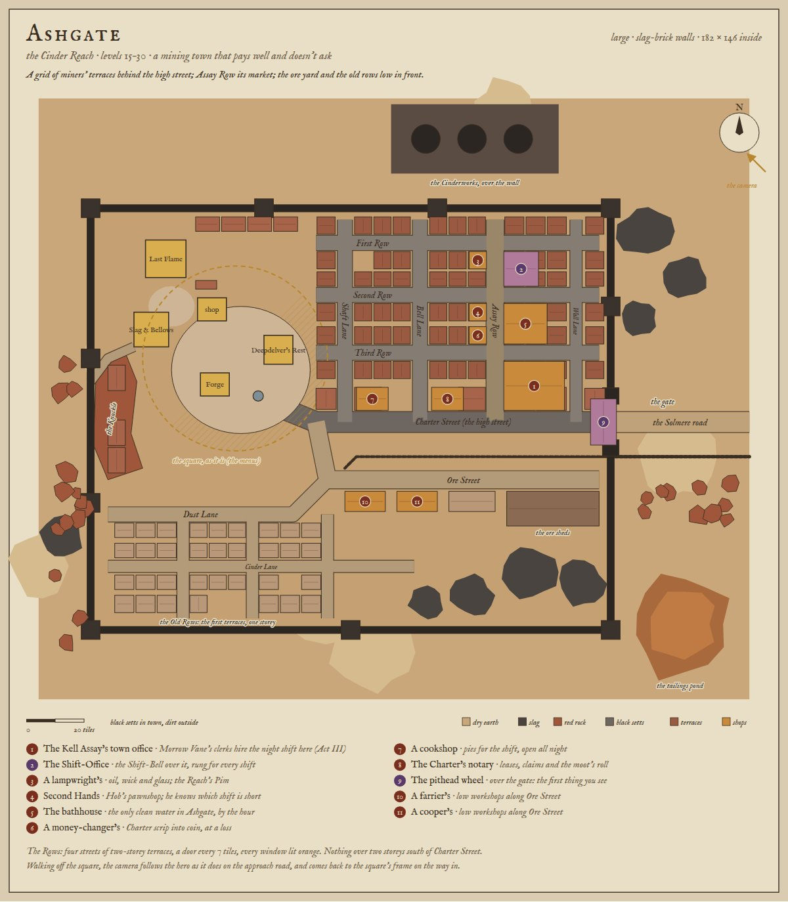
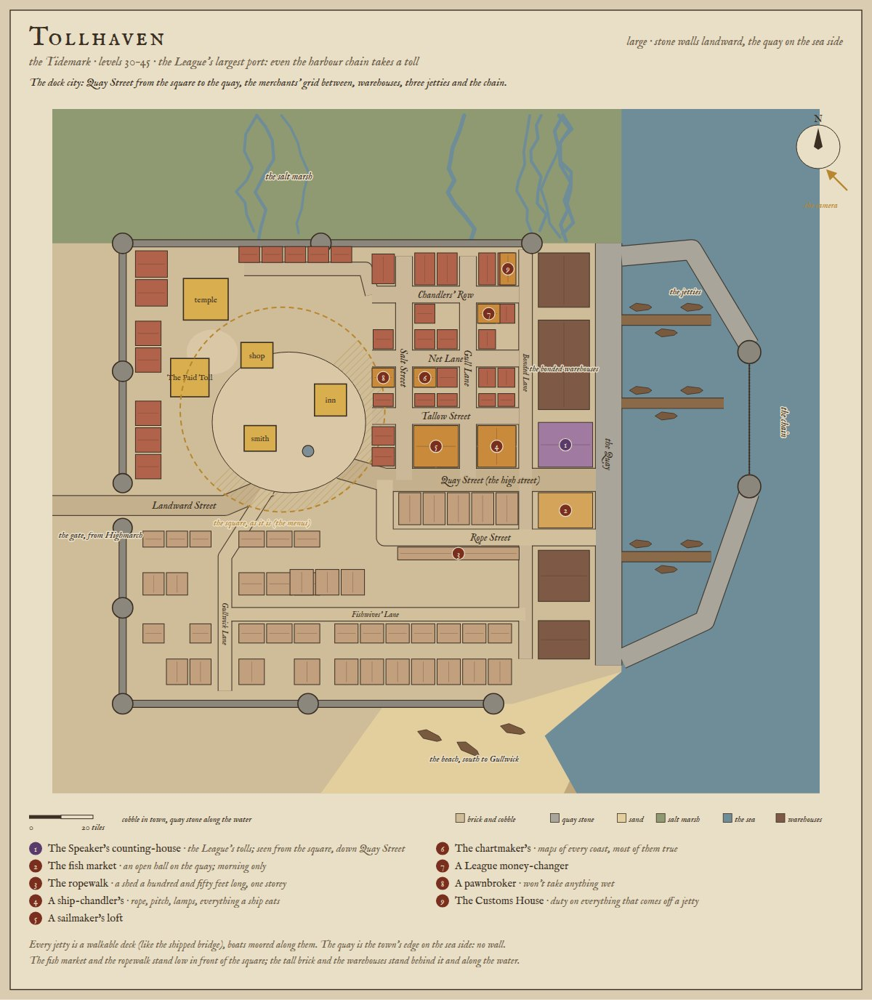
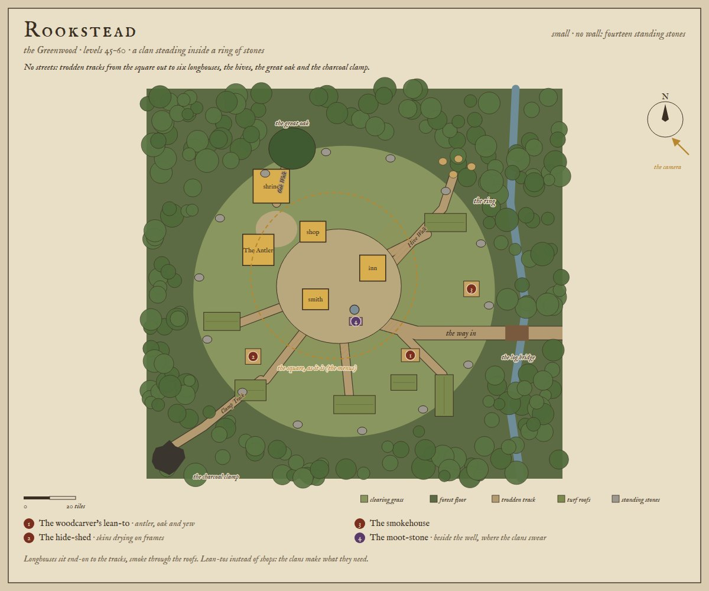
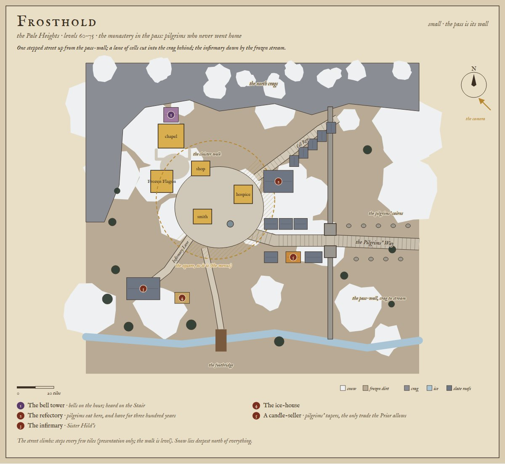
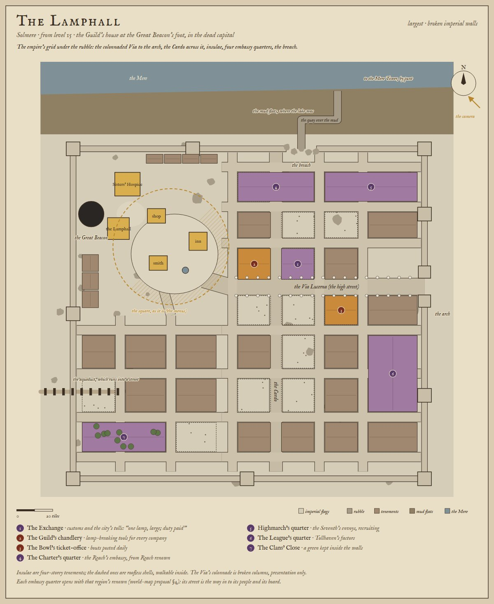
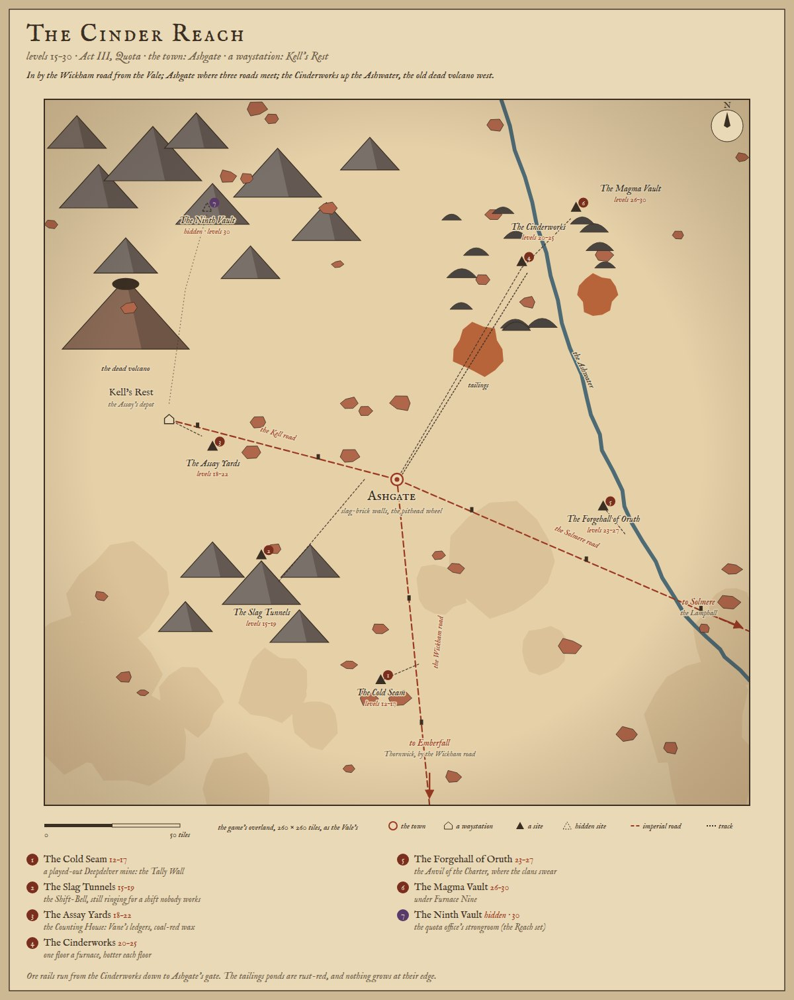
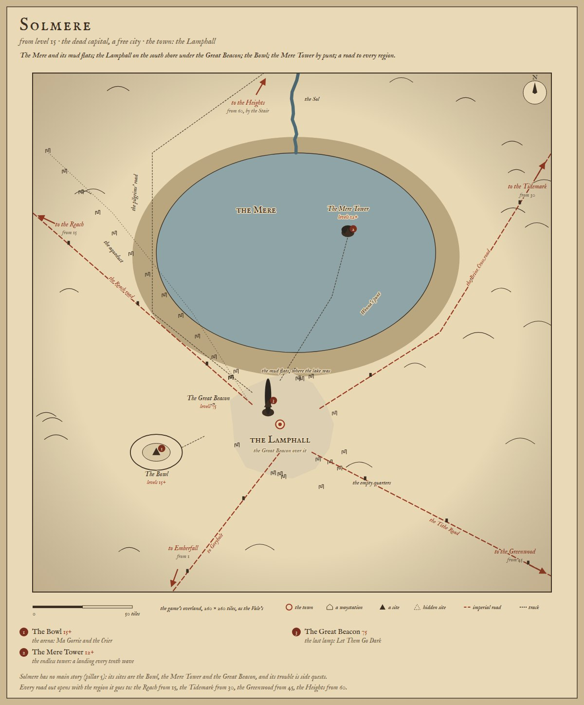
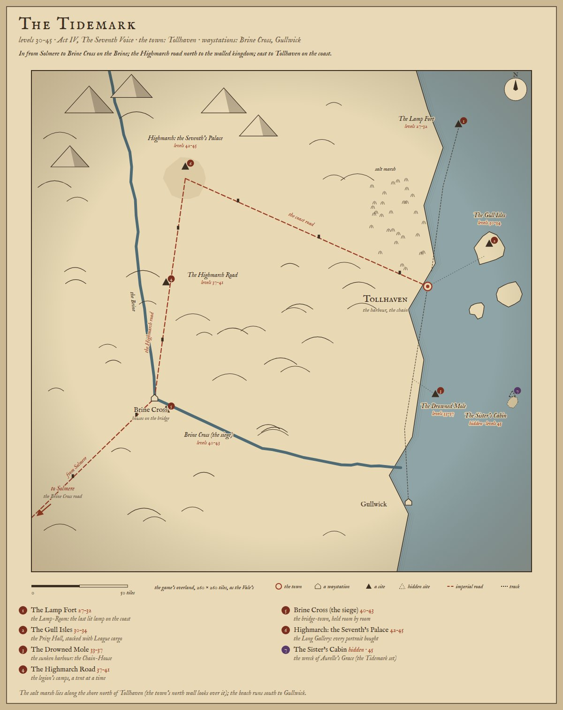
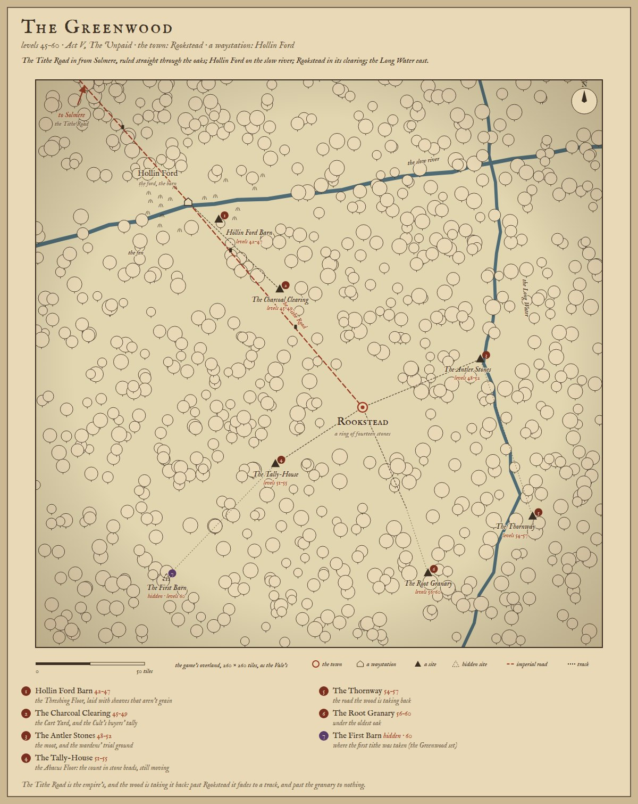
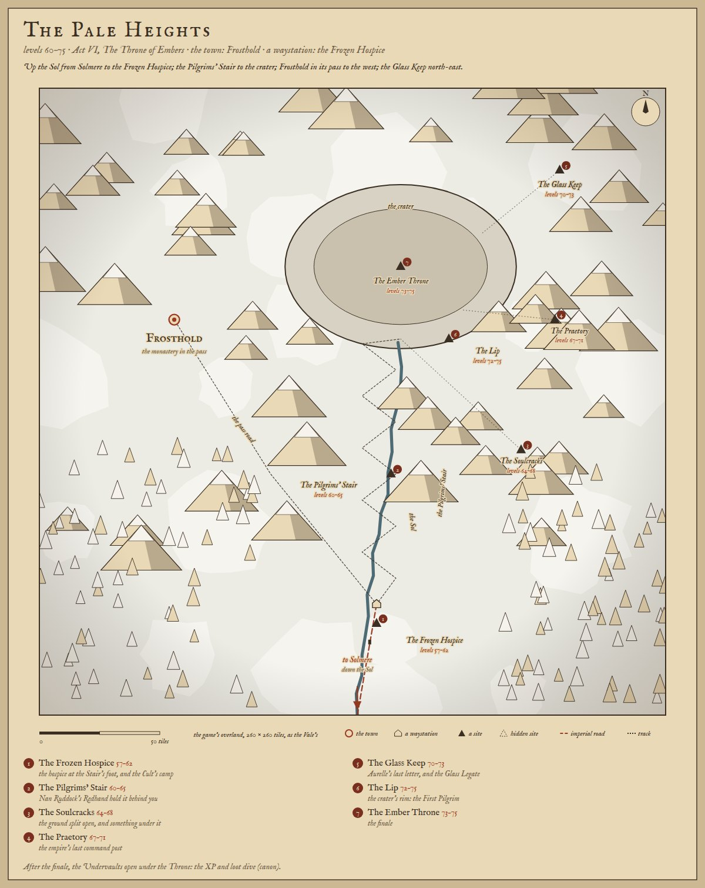

# The region towns' streets, and their overlands

**Proposal, 2026-10-10.** The owner: *"Design the other town layouts. Town square works well for the menu, but outside
of this there could be a few side streets and in the bigger towns, a grid with houses and shops. The city with the
dock, show me layout designs for each, and their respective overland maps."*

It builds on [region-towns-proposal.md](./region-towns-proposal.md) (each town's size, edge and ground, decided
2026-10-04) and [world-map-proposal.md](./world-map-proposal.md) §3–4 (each region's sites, people and roads). Nothing
here ships until the owner picks; each town is built with its region's milestone (M9 Ashgate, M11 Tollhaven, M12
Rookstead, M13 Frosthold; the Lamphall with the Solmere shell).

Drawn by `node tools/worldmap/streets.mjs` (the plans) and `node tools/worldmap/overlands.mjs` (the regions), as
sketches, not bakes. The plans are top-down, north up, all at one scale, in the game's own tiles.

## The rules every town keeps

1. **The square doesn't change.** The five services and the well stand in Thornwick's tiles in every town
   (`src/sim/outdoor.js buildTown`; `test/town.test.mjs` holds them to it), with every door facing the well. The
   menus stay where they are. On every plan the square is gold, and the camera's frame at it is the dashed circle.
2. **The streets start where the frame ends.** Walking off the square, the camera follows the hero, as it does on
   the approach road today (`o.lead`). Coming back in, it settles on the square's frame again. Nothing outside the
   square needs a menu.
3. **Low in front of the square.** The camera looks from the south-east, so the half of its frame in front of the
   square (hatched on the plans) holds one-storey buildings only: workshops, sheds, a fish market, a ropewalk. The
   tall streets (terraces, tenements, warehouses) stand behind the square or beyond the frame.
4. **One way in**, through the gate, as now. The towns keep their edges: walls, the quay, the ring, the pass.
5. **Grids for the large towns, lanes for the small.** Ashgate, Tollhaven and the Lamphall get a grid of streets
   with houses and shops. Rookstead and Frosthold get a few lanes or tracks. Saltmere (shipped) keeps its
   boardwalks.

## What stands in a street

| Kind | What it is | On the plans |
|---|---|---|
| **House** | Scenery. A door, lit windows at night, a doorstep (the shipped `dress` props). Terraces in Ashgate, brick in Tollhaven, tenements in the Lamphall. | red-brown blocks |
| **Shop** | A named shopfront with a sign: a lampwright, a ship-chandler, a pawnbroker. Recommended: it's **where a named person stands** (a quest-giver, a trial teacher, a board job's poster, a rumour), not a new menu. The five services stay the only menus. | orange, numbered |
| **Landmark** | Something you go and look at, or a quest goes to: the Shift-Office's bell, the Speaker's counting-house, the bell tower, the embassy quarters. | purple, numbered |
| **Low building** | Workshops, sheds, stalls: one storey, so they can stand in front of the square. | pale |

## Ashgate, the Cinder Reach (large, slag-brick walls)

- **The grid.** Four streets of miners' terraces behind Charter Street (the high street): First, Second and Third
  Row, crossed by Shaft Lane, Bell Lane, **Assay Row** and Wall Lane. Two storeys, a door every 7 tiles.
- **Assay Row** is the market street: the Kell Assay's town office on the corner (Act III's villain hires the night
  shift here), the Shift-Office under its bell, Hob's pawnshop, the bathhouse, a lampwright and a money-changer.
- **In front, low:** Ore Street's workshops, the ore sheds and the ore rails from the pithead wheel at the gate,
  slag heaps against the south wall, and the Old Rows: the first terraces, one storey.
- **Behind:** the Knuckle, the red outcrop the town was built round, and the Cinderworks' chimneys over the north
  wall.

## Tollhaven, the Tidemark: the dock city (large, stone walls landward)

- **Quay Street** (the high street) runs from the square straight down to the quay. At its foot, seen from the
  square, stands the **Speaker's counting-house**.
- **The waterfront:** the Quay runs the length of the sea side, stone, 8 tiles wide. The bonded warehouses back on
  to it, and **three jetties** run out with boats moored along them (walkable decks, like the shipped bridge). Two
  moles close the harbour, with the chain between their towers. The fish market is an open hall on the quay.
- **The merchants' grid** between the square and the warehouses: Chandlers' Row, Net Lane and Tallow Street,
  crossed by Salt Street, Gull Lane and Bonded Lane. It holds a ship-chandler, a sailmaker's loft, the chartmaker's,
  a League money-changer, a pawnbroker and the Customs House.
- **In front, low:** the ropewalk (a shed a hundred and fifty feet long), Rope Street's sheds, and the fishwives'
  lanes going down toward the beach.
- **In from Highmarch:** Landward Street comes in at the west gate and along the square's south side, as the
  region-towns proposal drew it. The salt marsh lies beyond the north wall, the beach south-east toward Gullwick.

## Rookstead, the Greenwood (small, a ring of stones)

- **No streets:** trodden tracks from the square out to six longhouses, the hives, the great oak (Oak Walk) and the
  charcoal clamp outside the ring. The way in crosses the stream by the log bridge.
- **Lean-tos, not shops:** the woodcarver's, the hide-shed and the smokehouse. The moot-stone stands beside the well.

## Frosthold, the Pale Heights (small, the pass is its wall)

- **One street:** the Pilgrims' Way, stepped, climbs from the pass-wall's gate to the square. The steps are
  presentation only: the walk is level.
- **Cell Row** climbs into the crag foot behind, with the monks' cells in steps. The refectory stands at its foot,
  the bell tower over the chapel, and the cloister walk round the forecourt.
- **Infirmary Lane** goes down to Sister Hild's infirmary and the ice-house, by the frozen stream and its footbridge.
- **The pass-wall** runs from the crags to the stream, with the pilgrims' cairns outside it.

## The Lamphall, Solmere (the largest, broken imperial walls)

- **The empire's grid**, still there under the rubble. The colonnaded **Via Lucerna** runs from the square to the
  imperial arch, and **the Cardo** crosses it. Four-storey insulae fill the blocks between, a third of them roofless
  shells (walkable inside).
- **Four embassy quarters:** the Charter's, Highmarch's, the League's, and the Clans' Close (a green kept inside the
  walls). Each opens with that region's renown (world-map proposal §4).
- **On the Via:** the Exchange (*"One lamp, large. Duty paid."*), the Guild's chandlery and the Bowl's ticket-office.
- **The breach** in the north wall leads to the quay over the mud flats, and on to Wenna's punt for the Mere Tower.
  The aqueduct runs into a street and stops.

## The overlands

Each region's overland is drawn at the game's own scale, 260 × 260 tiles, the Vale's. Each shows:
- its town and waystations;
- every site, with its levels and its room to remember;
- the imperial roads, with a dead beacon-tower every day's march;
- where each road leaves for the next region.

### The Cinder Reach (15–30)

In by the Wickham road from the Vale. Ashgate stands where it meets the Kell road and the Solmere road. The
Cinderworks are up the Ashwater with the Magma Vault under them, and the dead volcano rises over Kell's Rest.

### Solmere (from 15)

The Mere and its mud flats. The Lamphall stands on the south shore under the Great Beacon, with the Bowl west of the
walls and the Mere Tower out on the water. A road leaves for every region, each opening with its levels.

### The Tidemark (30–45)

In from Solmere to Brine Cross on the Brine. The Highmarch road runs north to the walled kingdom, and the coast road
runs east to Tollhaven. Along the coast: the Lamp Fort on its headland, the Gull Isles, the Drowned Mole and the
Sister's Cabin, hidden on its reef.

### The Greenwood (45–60)

The Tithe Road comes in from Solmere, ruled straight through the oaks, and fades past Rookstead. Hollin Ford sits on
the slow river, and the Long Water runs down the east.

### The Pale Heights (60–75)

Up the Sol to the Frozen Hospice, then the Pilgrims' Stair to the crater and the Throne. Frosthold sits in its pass
to the west, and the Glass Keep stands north-east.

## What it would take

- **The town as data** (region-towns proposal): each town's spec adds its streets, blocks and landmarks, the way it
  adds its edge and ground. `buildTown` lays them out, so the walkable world and the footprints come from one place.
- **Bakes** (`tools/actor-lab/buildkit.js`): a few house and shopfront variants a region, reused down a street.
  Ashgate's terraces are three or four bakes; the Lamphall's insulae and shells share the tenement kit. Signs are a
  small prop with the shop's glyph.
- **The camera off the square:** the shipped `o.lead` follow, extended to the town's streets, and the square's
  framing on the way back in. The square's view doesn't change.
- **Budget:** the large towns paint 44–57 % more ground than Thornwick (region-towns proposal), and a grid adds
  50–90 buildings. Measure load and frame time on a real phone before the first one ships (AGENTS.md: measure, don't
  guess).
- **Tests** (`test/town.test.mjs`): the square's rules for every town, as now. In addition:
  - every street is reachable from the square;
  - nothing over one storey stands in the hatched half of the frame;
  - the only way out is through the gate.

## Still open

1. **Shops: scenery with a person, or new counters?** Recommended: a shopfront is where a named person stands (quest,
   trial, rumour), and the five services stay the only menus, as the owner's note puts it. The other way would give
   a few shops one thing the region's shop doesn't sell. That's more UI, and it moves the menu off the square.
2. **Thornwick:** it could get the same treatment (two or three lanes behind the square: Maudry's back yard, Bess
   Hale's workshop, Nell Tolley's stable), or stay as the reference it is.
3. **The waystations** (Kell's Rest, Brine Cross, Hollin Ford, the Frozen Hospice) stay a single street each.
   Brine Cross's street is its bridge.
