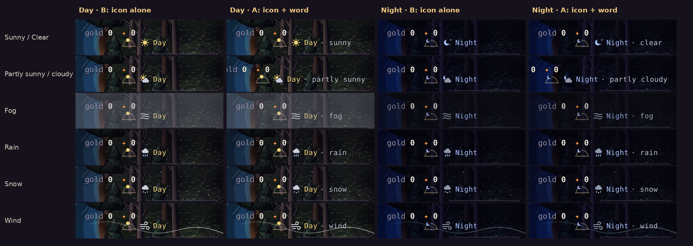
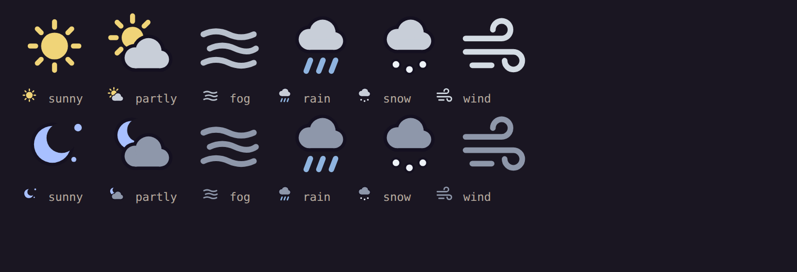

# The weather icon: a mockup

**Proposal, 2026-10-04.** The owner (2026-10-03): "next to the day time icon in the upper right is where an icon should
go for any current weather including a partly sunny or sunny state. Propose a mockup."

Nothing here ships until the owner picks. The icons are drawn in SVG, like the sky dial
(`src/ui/hud.js` `paintSky`). They're 16 × 14 CSS px, the dial's height. For these captures they were dropped into the
game's real top bar (the Vale at 390 px wide, DPR 3, with each weather held through `?dev&weather=`).

## The row, as it would look



The icon sits right after the dial, then the time-of-day word:

```
gold 0  ✦ 0
   ◠ ☀ Day            B: the icon stands for the weather word (recommended)
   ◠ ☀ Day · sunny    A: the icon and the word
```

**Recommendation: B.**
- The row stays as wide as it is now. Under A, "· partly sunny" and "· partly cloudy" add about 60 px. The row grows
  leftward and pushes the gold counter toward the place name (the second row of A above).
- No information rests on the icon alone:
  - Tapping the dial already says it in words: "Day · night in 12 min · rain, clearing in 9 min". It would add
    "sunny" or "partly sunny" too.
  - The screen reader label says it as well.
- The icon is the same height as the dial, and the dial's tap area (≥ 44 px) covers it.

## The icons



| State | Day | Night | When |
|---|---|---|---|
| **Sunny** / Clear | a sun (`#f0d478`, the dial's day colour) | a crescent moon and two stars (the dial's night blue) | a clear spell with no cloud |
| **Partly sunny** / Partly cloudy | the sun half behind a pale cloud | the moon half behind a grey cloud | a clear spell with cloud, and while a weather sets in or clears (see below) |
| **Fog** | three wavy lines, mist grey | the same, dimmer | fog |
| **Rain** | a cloud with three slanted blue drops | a grey cloud, the same drops | rain |
| **Snow** | a cloud with three white flakes | a grey cloud, the same flakes | snow |
| **Wind** | three gust lines, two of them curling (like the new streaks on screen) | the same, dimmer | wind |

- Every icon has a thin dark outline (the HUD's `#141020`), so it reads over grass, water and the night alike.
- The moon's bite is cut out (a mask), so the world shows through it, not a dark disc.

## "Sunny" and "partly sunny": where they'd come from

The weather (`src/sim/weather.js`, GDD §10.1) has clear, fog, rain, snow and wind. It has no cloud. Two ways to give
"partly sunny" a meaning:

1. **Split the clear spells** (recommended). Each 20-minute clear spell is sunny or partly sunny by the spell's own
   hash on the weather stream.
   - It's the same sky for everyone on a seed, like the rest of the weather.
   - The split would be about half and half in the Vale, sunnier in the Reach, cloudier in the Fens and the heights.
   - The few minutes while a weather sets in or clears (strength under 0.15, before its word shows) read as partly
     sunny too.
   - Optional, in the light: partly sunny takes about 6 % of the sun, and soft cloud shadows drift over the ground.
     It's within the owner's "not overly visually intrusive" and keeps the dusk.
2. **Only the ramps.** Clear is always sunny, and partly sunny is only the minutes a weather comes or goes. This is
   simpler, but you'd seldom see it.

Either way, it's a pure function of the seed and the clock. Nothing is stored, and the save doesn't change. Option 1
adds a field to `weatherAt` and a GDD §10.1 line.

## For the owner

1. **The row:** B (icon alone) or A (icon and word)?
2. **Partly sunny:** 1 (split the clear spells, with or without the light change and cloud shadows) or 2 (only while
   the weather turns)?
3. **The icons:** anything to change (the wind's curls, the moon, the colours)?
