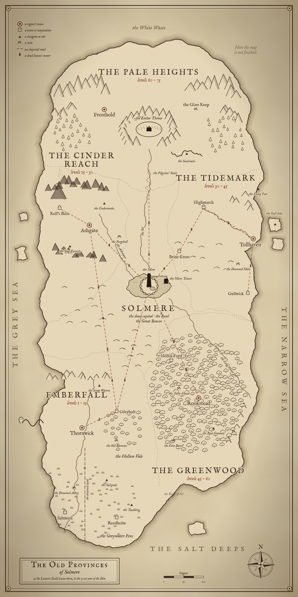

# The Old Provinces: a world beyond Emberfall

**Proposal, draft 10 (2026-10-04).** Draft 2 took in two critic passes, a game designer's and a D&D writer's (§10).
Draft 3 took the owner's answers to its questions (§10.3). Draft 4 makes the Voice a **lost sacred scroll**: anyone
who finds it and learns its chant can command the Ashbound. It also sets out the factions (§1.2) and the fuel (§1.3). Draft 5 takes the owner's plainer account of the fuel:
people are sacrificed, their souls feed the Ember, and their bodies rise as Ashbound, captives until someone frees
them. The review of that account is §10.4. Draft 6 makes five factions the story's drivers, each with a
storyline through every region: the Lantern Guild, the Cinder Cult, the Ashbound, the Grey Sisters and the
Redhand. The rest are minor players (§1.2). Draft 7 gives the Lantern Guild its purpose: the soul is held in a
**lamp**, and the Guild's members are sworn to break every lamp that holds the ashen captive and to let no new one be
lit (§1.1, §1.2, §4). Draft 8 takes the endless tower away from the Guild: the **Mere Tower** is older than the
empire, drowned under the Mere and found about forty years ago (§4.2). The Great Beacon stays the Guild's, and is
now a finite site after the Throne (§4.3). Throne-iron becomes **pale iron**, mined only from the Ember's crater; that
the two fell from the sky is hinted, never said (§1.1, §10.6). Draft 9: the Chronicle keeps a count of lamps broken and souls freed, a
leaderboard later (§1.3); the Bowl's shop stock is defined later (§4.1). Draft 10: the Tithewood is renamed **the
Greenwood**; the Great Beacon ships with the next region, a landing pair per release (§4.3); each region's town look
is proposed in [region-towns-proposal.md](./region-towns-proposal.md).
- The map is portrait.
- Each region has one full town, styled to the region: the player's base.
- The cap is 75, and the skills are as recommended.
- At the end it's always Lucan, the last Voice.
- The Bowl pays tokens for a future heirloom shop.
- The Mere Tower, the endless tower, can always be played offline.

It becomes canon when it lands in [emberfall-world.md](./emberfall-world.md) (canon first) and the
[GDD](./emberfall-gdd.md) (design).

The owner (2026-10-04):

> "Outline a world map like middle earth illustration style based on our world lore. We are just a smaller region
> thats part of a bigger fallen empire thats on a continent or island with other fragmented city states and
> kingdoms. Thornwick should cover up to level 15. Outline the other areas each covering the next 15 or 20 levels.
> … Thornwick and its main quest is the first to solve - the ashenborn dead. Other regions should have different
> mainline stories and quests. Outline the npcs and enemies found in each region. New skills to learn. Also the
> fallen empire city mentioned in lore is where players gather for the arena. Its a larger city but in somewhat
> disrepair. Also there is a dark tower where players can challenge wave after wave, no xp, but for a leader board
> and special loot. A boss at each 10th wave that drops rare items the first time defeated. Take a pass in this
> proposal with a game design and dnd writer critic pass…"

The "ashenborn dead" are the canon **Ashbound**, and this doc uses that name.

**Contents.**
- §1 The idea; §1.1 How the Ember works (the sacrifice, the lamps, the Ashbound, the Voice); §1.2 The factions;
  §1.3 The fuel
- §2 The map
- §3 The regions (Emberfall, the Reach, the Tidemark, the Greenwood, the Heights)
- §4 Solmere: the Bowl, the Mere Tower and the Great Beacon
- §5 New skills
- §6 Enemies and art
- §7 How it hangs together
- §8 Numbers and phasing
- §9 Canon and design changes
- §10 The critic passes
- §11 Still open

---

## 1. The idea

Emberfall was always "the forgotten backwater of a fallen empire" (world doc §1). This proposal draws the rest of
that empire.
- **The Old Provinces** are an island-continent, once the whole of the Solmere Empire.
- At its heart, on a lake, stands **Solmere**, the dead capital, where the court, the treasury and the clerks were.
- North of it, in a crater in the Pale Heights, burned the **Ember**, in its own palace: the **Ember Throne**. The
  empire ruled from Solmere and *burned* at the Throne.
- When the flame went out, the provinces broke apart into:
  - a mining charter;
  - a league of free ports and a would-be emperor;
  - clan woods that never wanted the empire.

Emberfall stays what it always was: the empire's **granary**, far from anything that mattered. The tone rule
stretches, but no further: the last quest is about **the fate of the Old Provinces, never the world**.

**Each region's main story is about one thing the Fall left behind,** each in a different key:
- **Emberfall:** the dead who kept their orders. A war-ghost story.
- **The Cinder Reach:** the forges that still need feeding. A company town.
- **The Tidemark:** the living who want the throne back. A war of succession.
- **The Greenwood:** the souls the empire took and never spent. Folk horror.
- **The Pale Heights:** the flame itself. A pilgrimage, and an ending.

**Five factions drive the story** through every region (§1.2): the **Lantern Guild**, the **Cinder Cult**, the
**Ashbound**, the **Grey Sisters** and the **Redhand Company**. Each region's own powers are minor players: in each
region somebody local is the villain of its act, with their own reasons. The Cult, the antagonist of the whole arc,
needs four things to light the Ember again (§1.1):
- **a spark**;
- **a vessel**;
- **a Voice**;
- **fuel**.

Each region shows the player one of them. The Cult doesn't win every time.

**Its preacher, the Kindler** (Master Corvane Vell, canon), is met long before the end:
- preaching from a Cult boat at the Canal Locks, around level 10;
- at the miners' burial in Ashgate, paying for the stones;
- at the would-be emperor's table.

### 1.1 How the Ember works: the sacrifice, the lamps, the Ashbound, the Voice

**In short** (the owner, drafts 5 and 7):
1. **The sacrifice.** The Ember is fed with people. Someone with a reason (the empire once, the Cult and its
   partners now) sacrifices a person with the **Binding Rite**, by the light of a **lamp** lit from the Ember.
2. **The lamp.** The rite tears the soul out and shuts it in that lamp. The lamp is the prison. It burns the soul
   slowly, a little at a time, and passes the burning on to the Ember, as a wick feeds a flame. The burning soul is
   the Ember's **fuel**.
3. **The Ashbound.** The body doesn't stay down. It rises, tied to its lamp, a **captive**: it can't die, can't
   rest, and serves. The Vale calls them **the ashen**.
4. **The Voice.** Whoever has learned the **Canticle** commands the Ashbound (below). Without a Voice they keep
   the last order they were given, forever.
5. **The freeing.** The tie runs from the body to the lamp, and cutting it at either end frees the soul.
   - **Break the body**, and that one soul goes free to rest. Putting one down isn't killing it. It's letting it
     go: canon's *"Putting them down is the only relief anyone has brought them."*
   - **Break the lamp**, and every soul in it goes free at once, and their bodies lie down wherever they stand.
     That's the Lantern Guild's work (§1.2).

**The Ember** is a flame that burns souls: not wood, not oil, souls. It was found in the crater a thousand years
ago, in a bed of pale iron, and the empire built the Throne around it and kept it fed.

**Where the Ember came from: only hinted.** For the writers, not the players: the Ember and the pale iron are
what's left of a star that fell, long before the empire, and made the crater. **No line in the game ever says
so.** It's left in the world to be noticed:
- **The crater** is a crater, and the iron is only in its walls.
- **The frost pattern** in cut pale iron is the pattern found in iron that fell from the sky.
- **The hedge-callers** never call it the Ember. Their old word for it is *the Guest*.
- **The Mere Tower** (§4.2), older than the empire, has the night sky carved over its door, with one star cut
  deeper than the rest and a line under it. Its Star Room has the same sky, and a hole where that star should be.
- **A rumour in the Heights:** *"The flame came down before it came up."* Nobody in Frosthold will say what it
  means.

It stays a hint. The tone rule (§1) wants the fate of the Old Provinces, never the world, and a falling star
explained would make the Ember a cosmic power. Left unexplained, it's just old, and strange, and nobody's fault.

**The Binding Rite** is the sacrifice.
- It's spoken over a living person by a lamp's light, and ends with an order: canon's *"Speak the order last. The
  bound keep the last thing they hear."*
- The empire called it duty: the tithe, the legion's oath, the foundry's shift. Some went willingly. Canon's
  chaplain prayed *"Bind them gently. Most of them volunteered."*
- The binding clergy (§3.1) spoke it, for six hundred years.

**Pale iron** is what the lamps are made of.
- It's mined from the walls of the crater in the Pale Heights where the Ember was found, and nowhere else. The
  empire carted it down to the Reach's foundries.
- It's heavier than iron should be, and it never rusts. Cut and etched, it shows a pattern like frost on a window.
- It's the only metal that holds the flame without burning through, and only soul-fire melts it. So every lamp
  the empire made cost souls to cast.

**The lamps** are where the souls are kept.
- **Every soul-lamp is pale iron.**
- **Every lamp was lit from the Ember**, and passed its burning back to it. The empire hung them wherever it bound
  people:
  - **standard-lamps**, one on each legion's standard, holding the legion (the Third Legion's is on the Standard in
    the barrows);
  - **choir-lamps**, in the binding clergy's chapels, holding the clergy who served them;
  - **furnace-lamps**, the foundries' furnaces themselves, holding their shifts;
  - **coast-lamps** and stern-lanterns, holding the fleet;
  - **tithe-lamps**, one in every granary, holding the tithe laid there;
  - **the beacons**, holding their signal corps, and carrying the Voices' orders by their light (§4).
- **When the Ember went out, every lamp went out with it.** The ties went slack, but the lamps held. A dark lamp is
  still a prison.
- **A lamp lit with soul-fire can't be broken.** Its light has to be put out first: its keeper beaten, its shard
  taken. A dark lamp breaks like old iron, if you can reach it. Most can't be reached: they're under water, in
  sealed barns, or guarded by their own bound, whose last order was to keep them. Canon's gate-warden wrote
  *"Keep the lamps lit."*

**The Ashbound** are what's left: a body, tied to a lamp that holds its soul, burning.
- They obey the last order they heard, and nothing else, unless a Voice gives them another.
- When the Ember went out on the night of the Fall, the ties went slack and the Ashbound dropped where they stood.
  They weren't freed. For three hundred years they lay captive in the dark: in barrows, under water, in barns.
- Now the Cult lights lamps again with shards, the ties pull, and they get up again.

**The spark** is an **ember-shard**: a sliver of a captive soul's light, cut out of an Ashbound like flint from a
stone.
- It holds a little flame without fuel, like a coal in a pocket.
- It's enough light to speak the Rite by, and enough to light a lamp, or a vessel.
- Near the bound, it stirs them.

**The vessel** is a new lamp, the greatest since the Throne's dark pit, which was the first: pale iron the size
of a cart, with room inside for the Ember itself. The Reach's foundries cast it (Act III), in soul-fire.

**The Voice** is anyone who has learned **the Canticle**, the lost sacred scroll.
- **The Canticle** is the chant the first binding clergy wrote when the Ember was found. It's long, in the old
  tongue, and must be sung exactly. It takes a season to learn.
- **Whoever learns it becomes a Voice, and commands the Ashbound.** A Voice's order goes over the last order the
  bound heard. Nothing else can change it, which is why the Sunken Chapel's chaplain, no Voice, wrote *"I cannot
  bind a second order over the first."*
- **A Voice commands. A Voice can't free.** Only breaking the tie does that.
- **The empire had six Voices**, the Voices of the Throne. They sang their orders into the Great Beacon at Solmere,
  and the beacon-light carried them to every province's Ashbound (§4).
- **The Canticle's last verse** speaks to the flame itself and tells it to stop. It takes the voice of whoever
  sings it.
- **Aurelle** was a Voice before she was an Empress. On the night of the Fall she sang the last verse herself.
- **It's lost.** That night she gave the scroll to her sister, the Lady **Livia**, who fled east with it on the
  flagship *Aurelle's Grace*. Livia came ashore in Highmarch with her children and a sealed box she told them never
  to open. The Cult has hunted it for three hundred years. **Lucan Varro opened the box** (Act IV).

**Why the Cult needs all four.** A spark in a vessel is a flame. Fuel keeps it lit. A Voice rules it, and with it
every Ashbound in the provinces stands up at once, waiting for orders. The Kindler believes that's a gift: the
tireless dead doing the work, so the living never starve again. He doesn't count the cost. The Ashbound pay it.

### 1.2 The factions

**Five factions drive the story** (the owner): the Lantern Guild, the Cinder Cult, the Ashbound, the Grey Sisters
and the Redhand Company.
- **Each has a storyline that runs through every region.** The region's main story is the stage, and these five are
  the plot.
- **Everyone else is a minor player:** the local power, ally or villain a region needs. Each matters in one region
  and is done when it's done.

**The storylines at a glance:**

| | Emberfall (I–II) | The Reach (III) | The Tidemark (IV) | The Greenwood (V) | The Heights (VI) |
|---|---|---|---|---|---|
| **The Lantern Guild** | Maudry's board hires the company; the Standard's lamp and the choir-lamp broken | Pennick's truth; Furnace Nine broken; the vessel gone a day ahead | Old Gannet breaks his own lamp, and Lucan's drowned lie down | the tithe-lamps broken, the carts tracked | holds the Great Beacon dark; breaks the vessel |
| **The Cinder Cult** | mines the spark | buys the vessel | courts the Voice | buys the fuel | lights the flame |
| **The Ashbound** | the Third Legion; the drowned clergy | the new-made at the furnaces | the drowned fleet; the Grace | the Unpaid in the granaries | the Praetorians; the faithful |
| **The Grey Sisters** | Ilse; the Abbey's binding rolls saved | the rolls name the dead | Maren reads them | the Unbinding is learned | the rolls opened to all |
| **The Redhand** | dig for the Cult; Garrow falls | Ruddock's Company guards the Assay | hired crossbows for Lucan | drive the fuel carts | turn, and hold the Stair |

#### The Lantern Guild

The sellswords' guild (canon), with a board in every town. Under the board, it's what's left of the empire's
lamp- and beacon-keepers, sworn to undo their own work (§4).

**Its story.** The keepers trimmed and tended the empire's lamps for six hundred years, and lit the beacons that
carried the Voices' orders. Most of them never asked what the lamps held. On the night of the Fall, **Mabry Cole**,
keeper of the Great Beacon, watched every lamp in Solmere go dark at once. Nobody came to stand the bound down. She
read the keepers' **lamp-book**, the empire's list of every lamp and what was shut in it, understood it, and tried
to break the Great Beacon's lamp with a keeper's hammer. Its signal corps threw her down the stair. She lived, and
the oath she wrote that winter is the Guild's:

> *"Every lamp we lit, we will break. No lamp will be lit again. Let them go dark."*

- **Mission: break every lamp that holds the ashen, and let no new one be lit.**
  - **Break the old lamps.** The Guild has worked down the lamp-book for three hundred years. It broke every lamp
    it could reach in its first century. The ones left are the hard ones: under water, in sealed barns, guarded by
    their own bound, or lost when a chapter of the Guild was lost.
  - **Stop new ones.** A lamp needs pale iron, cast in soul-fire, and a light: a shard, or the Ember. The Guild
    buys up old pale iron and sinks it in deep water. It watches every furnace that could melt it and every
    harvester who cuts shards. It pays a bounty on every Cult lantern-cage, because a cage is a new lamp, only a
    small one.
- **Its face and its purse.** The sellswords' guild is what everyone sees. It keeps the roads open, and every
  job's cut pays for the work under it. The ranks carry two meanings:
  - **in the tavern** (canon), a rank is the lamp a sellsword can carry: Wick, Lamp, Lantern, Beacon;
  - **in the Guild's own books**, a rank is the lamp a member has broken: a wick is a cage, a lamp is a granary's,
    a lantern is a legion's. Nobody has ever held Beacon in that sense, because nobody has broken a beacon. Mabry
    Cole tried.
- **Why it keeps quiet.** The lamp-book is a map of every captive and every lamp the Cult could relight. The Guild
  tells a member when the member has broken a lamp, and not before.
- **Hook:** Maudry's board in the Tired Mule. The company is a Guild company from its first job. When the Standard
  of the Third Legion falls, Maudry asks one question nobody else does: *"Was there a lamp on it? What became of
  it?"*
- **Objectives, region by region:**
  - **Emberfall:**
    - The Standard of the Third Legion carries the legion's lamp. When the Standard falls the lamp breaks with it,
      which is why the line on the road breaks (canon: *"With the Standard down the line breaks"*).
    - In the Drowned Abbey the Abbess Below keeps the choir-lamp trimmed: *keep the hours*. Breaking it lays the
      drowned clergy down.
    - At the end of Act II Maudry's letter to Solmere reports two lamps broken, and sends the company on.
  - **The Reach:** stop the casting.
    - In the Lamphall, Aldo Pennick enters the company on the Roll. It has broken two lamps, so it may know:
      **Pennick's truth** is the oath, Mabry Cole and the lamp-book.
    - Pale iron melts only in soul-fire, so the relit Cinderworks mean somebody is making lamps. Pennick sends
      the company west.
    - **Furnace Nine** is a furnace-lamp. Breaking it frees the night shift it holds: Tamsin Coalbrook's cousins,
      freed, not brought back.
    - The vessel is already on the road, a day ahead. The Guild learns what's coming.
  - **The Tidemark:** the lost lamp.
    - The Guild lost the coast's pages of the lamp-book long ago, when the Gull Fleet wiped out its Tidemark
      chapter. So when Lucan raises the drowned fleet at the Mole, Pennick knows only that their lamp is still
      whole, and has to work out where it is.
    - It's the coast-lamp at the Lamp Fort. **Old Gannet** has kept a light in it for sixty years because nobody
      told him to stop: he was a Wick when his master died, and nobody ever came. That's why Hesk's corsairs hit
      the Lamp Fort first: Lucan wants that lamp whole.
    - At the siege of Brine Cross, Gannet puts out his light and breaks the lamp himself, and Lucan's drowned
      crews lie down in the river: *"Sixty years. Somebody might have said."*
    - The Grace's stern-lantern lies in the Sister's Cabin, holding Livia's crew. Lucan won't recall them; the
      company can let them go.
  - **The Greenwood:** a tithe-lamp hangs in every granary, and the great lamp in the Root Granary. The Guild's
    roadmen track the Cult's carts, the boards fill with jobs to stop them, and every granary's lamp the company
    breaks frees its rows before the Cult can buy them.
  - **The Heights:**
    - While the company climbs, the Guild holds the Great Beacon, so a relit flame's orders can't be carried to
      the provinces.
    - The Praetory's guard-lamp holds the Empress's guard; breaking it frees them.
    - After Lucan's verse, the vessel is dark, and dark lamps break. **The company breaks the vessel**: the faithful
      bound into it go free, and the Kindler, last in, is freed with them.
- **Where it ends:** the flame is out and the vessel broken. No new lamp can be cast, because there's no soul-fire
  left hot enough to melt pale iron. The Guild opens the lamp-book to every company, beside the Sisters' rolls:
  the map of every lamp left to break. Then Pennick opens the Great Beacon to the company, and it breaks the last
  lamp on Mabry Cole's list (§4.3).
- **Its people:** Maudry Fenn, Aldo Pennick (Master of the Roll), Old Gannet, every tavern's board, and Mabry
  Cole, three hundred years dead, whose hammer hangs in the Lamphall.

#### The Cinder Cult

Zealots (canon) who believe the Ember was *stolen*, and the antagonist of the whole arc.

- **Mission:** relight the Ember with a Voice to rule it, and give the provinces back the tireless dead.
- **Hook:** the Robed Stranger dies with an ember-shard in his fist (Act I).
- **Objectives, region by region** (its four needs, §1.1):
  - **Emberfall:** **the spark**. It digs the Vale's captives up and cuts shards from them, and harvests the
    drowned clergy at the Abbey.
  - **The Reach:** **the vessel**, cast to its order by the Kell Assay in forges fed with sacrificed miners.
  - **The Tidemark:** **the Voice**. It courts Lucan, who learned the Canticle. He refuses, until he's beaten.
  - **The Greenwood:** **the fuel**, the granaries' captives, bought a cart at a time.
  - **The Heights:** the Throne. The four things together, and the faithful give themselves to the flame.
- **Where it ends:** at the Throne. The Kindler walks into the vessel last: *"Most of them volunteered."*
- **Its people:** the Kindler (met at the Canal Locks, at the Ashgate burial, at Lucan's table, and at the
  Throne), the Robed Stranger, Brother Teague, the furnace-priests, the harvesters and the buyers.

#### The Ashbound, "the ashen"

The sacrificed, risen as captives (§1.1). They're a faction because they're in every place the story goes, and
every region turns on them. They want nothing they can say.

- **Mission:** their last order, forever.
- **Hook:** the barrows road on the first evening: *"They just stand there. Facing north."*
- **Their orders, region by region:**
  - **Emberfall:** *hold the road until relieved* (the Third Legion); *keep the hours* (the drowned clergy).
  - **The Reach:** *work the shift*: the new-made at the furnaces, and Oruth, their forgemaster.
  - **The Tidemark:** *hold station until recalled* (the Grace); the drowned fleet, who obey Lucan.
  - **The Greenwood:** *collect the tithe* (the Reeve and his tallymen); the Unpaid, waiting in rows.
  - **The Heights:** *guard the Empress* (the Praetorians); *muster at the lamp* (the Beacon's signal corps).
- **Where it ends:** the burning stops at the Throne. The captives already made stay captive until someone puts
  them down or breaks their lamp, and every one is freed. The company frees them region by region, and in the
  post-game the Undervaults, the Great Beacon and the lamp-book hold the rest.
- **The player's part:** the relief that never came.

#### The Grey Sisters

Healers and archivists (canon), and heirs of the empire's binding clergy (§3.1): their mothers spoke the Rite and
kept the rolls of everyone they bound.

- **Mission:** keep the records. Their quiet aim: make up for what their mothers wrote in them.
- **Hook:** Sister Ilse in Thornwick's Shrine, and the Chronicle she keeps for the company.
- **Objectives, region by region:**
  - **Emberfall:** Ilse copies what comes up out of the barrows. In the Fens, the company saves the Drowned Abbey's
    **binding rolls** from the Cult, and Mother Agnes wants them locked in the Reedholm Undercroft.
  - **The Reach:** the rolls name the foundry crews the empire bound, and Ilse begins to read them against Agnes's
    word.
  - **The Tidemark:** Sister Maren, chaplain on Tollhaven's quays, reads Reedholm's copy first. She learns that
    one line of it sent the Kindler to Lucan, and joins the company (cleric).
  - **The Greenwood:** the Sisters learn the **Unbinding**, the rite that breaks the tie and frees the soul, from
    the hedge-callers they always called superstitious (the cleric's skill, §5): *"Your Sisters bound them. You
    can learn to let go."*
  - **The Heights:** Sister Hild keeps Frosthold's infirmary for the climb.
- **Where it ends:** the Sisters open the Undercroft and publish the rolls: the name of everyone their mothers bound,
  where they lie, and which lamp holds them. Beside the Guild's lamp-book, it's the map of every captive left to
  free.
- **Their people:** Sister Ilse, Mother Agnes, Sister Maren, Sister Hild.

#### The Redhand Company

Deserters turned bandits (canon), in the iron kettle hats they deserted in, with a band of the Company's red. They
are the Cult's hired hands across the provinces: coin is coin.

- **Mission:** loot, and to be left alone. In practice, whoever pays. The robes' coin comes in coal-red wax with a
  thumbprint in it.
- **Hook:** the Tithe Mill, Act I's first chapter.
- **Objectives, region by region:**
  - **Emberfall:** they dig at the Sunken Chapel for the robes' coin. Captain Garrow falls at Wickham Keep, and
    Brannoc walks out (canon). **Nan Ruddock**, Garrow's quartermaster, takes the Company and the Cult's contract
    with it.
  - **The Reach:** Ruddock's Company guards the Kell Assay's yards, and escorts the vessel's dray out on the
    Solmere road.
  - **The Tidemark:** hired crossbows in Lucan's legion (canon: "recurring later as hirelings").
  - **The Greenwood:** they drive the Cult's fuel carts out of the wood. At the Charcoal Clearing Ruddock finds out
    what's under the sacking: somebody's grandparents.
  - **The Heights:** the Company turns. Ruddock and what's left of the Redhand hold the Pilgrims' Stair against
    the Cult while the company goes up. Brannoc is with them, if he's in the party.
- **Where it ends:** the Redhand stand down, with nothing to show for it but the Stair. Ruddock: *"First job we
  ever did for free. Don't tell anyone."*
- **Their people:** Captain Garrow, Nan Ruddock, the sergeants, and Brannoc, who got out first.

#### The minor players

Each matters in one region and is done when that region is done.

| Region | Minor player | What it is | Its part |
|---|---|---|---|
| Emberfall | **Lord Pellam's Watch** (canon) | Greyholt's underpaid militia | Osric's bounties; comic relief, occasionally brave |
| Emberfall | **The hill goblins** (canon) | the Scrag Warren | Hedda's hens |
| The Reach | **The Deepdelver Charter** (canon) | the dwarf-folk miners' charter | Dagny's moot, the night shift, Oruth; the Slagborn sold the lease |
| The Reach | **The Kell Assay** | a human assay house at Kell's Rest | Act III's villain: Morrow Vane sells the night shift and casts the vessel |
| The Tidemark | **The Tidemark League** | the free ports | Hester Quaile; Brine Cross; the Gull Fleet broken |
| The Tidemark | **The Kingdom of Highmarch** | Lucan's march-kingdom | Act IV's war; Lucan, the Seventh Voice |
| The Greenwood | **The hedge-callers and the clans** (canon) | the old courtesies | Grandmother Yew, Moth, Thane Ivo; the granaries opened |
| The Heights | **The Monks of Frosthold** | pilgrims who never went home | the hospice, the barracks' keys, Lucan's keepers |
| Solmere | **The Peace Wardens** | a name the Guild hides behind | the Dim Peace |

### 1.3 The fuel: what it is, where it's found, how it's used

**What it is.** The souls of sacrificed people, shut in lamps by the Binding Rite and burned into the Ember. Every
soul feeding the flame belongs to an Ashbound somewhere, a captive. **The fuel and the Ashbound are the same
people.**

**How it's made.**
- A person is sacrificed with the Rite, by a lamp's light.
- The soul is shut in the lamp and starts to burn.
- The body rises, Ashbound, and serves.
- The Cult has two cheaper ways:
  - **relight an old lamp** with a shard. Its Ashbound, left over from the empire, wake with it, and its souls burn
    for the new flame;
  - **carry the soul itself**: drawn out of an Ashbound as a wisp, it rides in a **lantern-cage**, a small new
    lamp, to the vessel.

**How much.**
- One soul keeps a flame the size of the Throne's lit for about a day.
- The empire tithed its provinces in people to keep it fed. Canon: *"Furnace nine requires eleven more souls per
  week to meet quota."* The Vale paid *"two hundred and forty"* in a year, and they became the Third Legion.
- The Kindler needs about a year's tithe to keep a new flame lit long enough for a Voice to wake the provinces.

**Who does it, and where.** The sacrificers are always people with a reason, a ledger and a quota:

| Where | Who is sacrificed | By whom | Their lamp | What the player finds |
|---|---|---|---|---|
| Emberfall, then | the Vale's tithe, the Third Legion; the clergy who drowned at their office | the empire | the Standard's lamp; the Abbey's choir-lamp | captives under the barrows road and in the Abbey, stirred by the Cult's digging; it cuts shards from them (the spark) |
| The Reach, now | miners off the night shift | the Kell Assay sells them, and the Cult's furnace-priests sacrifice them by shard-light in the forges that cast the vessel | Furnace Nine | the shift that doesn't come up, and new Ashbound at the furnaces |
| The Tidemark, then | the imperial fleet's crews | the empire | the Lamp Fort's coast-lamp; the Grace's stern-lantern | the drowned, who stand up for Lucan |
| The Greenwood, then and now | three hundred years of the clans' tithe, Ashbound lying in rows in the granaries; and the living the Reeve takes for the count | the empire, then the Tithe-Reeve; the Cult buys the captives a cart at a time | a tithe-lamp in every granary; the Root Granary's great lamp | the largest store in the provinces, and the cheapest |
| The Heights, then | the Empress's guard | the empire | the Praetory's guard-lamp | the Praetorians, who obey only a Voice |
| The Throne, at the end | the Cult's own faithful | themselves | the vessel | they take the Rite in the vessel's light and walk in. *"Most of them volunteered."* They rise as Ashbound in the last fight. |

**How it plays.**
- **Every Ashbound you put down is freed:** its tie breaks and its soul goes to rest.
- **Cages:** the Cult's harvesters and buyers carry fuel as wisps in lantern-cages, and a boss's cages shield it.
  Break a cage, and the soul inside goes free and the Cult has that much less.
- **Lamps:** a lamp is a site's set piece, in its last room: the **lamp-room**, held by its keeper (a boss, or
  the lamp's own bound). It's the end of the site, so it never skips the fighting before it.
  - A lit lamp can't be struck. Beat its keeper and its light goes out.
  - Then break it: every Ashbound tied to it lies down, in the room and all over the site. It's a room cleared by
    the story, not by the fight.
  - Every lamp broken is a Guild job paid, and a line in the Chronicle. The Guild's rank, in its own books, is the
    biggest lamp the company has broken.
  - It's one rule in the sim (a lamp is an object with a list of the foes tied to it), and the boss system
    already has "break what shields him". See §8.
- **The Greenwood's count:** the more of the granaries you free before the Root Granary, the less fuel reaches the
  Throne. The story still ends the same.
- **At the Throne:** the flame grows in phases as the faithful feed it, and the newly bound faithful come at you.
  Lucan's last verse stops the flame, so nothing is fed to it again.
  - The Ashbound already made don't go free with it: they stay captive until someone puts them down or breaks
    their lamp.
  - With the flame out, the vessel is dark, and the company breaks it: the faithful go free.
  - That's the companies' work in the post-game: the lamps left in the lamp-book, the Undervaults' deep captives,
    and the Great Beacon's bound signal corps (§4.3).

**The count** (the owner, draft 9). The Chronicle keeps two numbers for the company, as Ilse would, and they become
a leaderboard later:
- **Lamps broken:** every lamp, from a Cult cage to the vessel. A cage is a small lamp, so it counts. The Chronicle
  shows the set-piece lamps by name under the number (*the Standard's · the choir-lamp · Furnace Nine …*).
- **Souls freed:**
  - one for every Ashbound put down, and one for every cage broken;
  - for a lamp, the souls still in it, a number set in its content (the Standard's lamp holds what's left of the
    Third Legion's 240).
  - Living foes (the Redhand, the Cult, the Seventh's Own), beasts and the Mere Tower's kept things don't count.
    They were never bound.
- **Where it shows:** at the head of the Chronicle tab (*"Lamps broken: 7 · Souls freed: 3,412"*). Ilse remarks on
  it, and Pennick reads it when the company comes to the Lamphall.
- **Fair play.**
  - The counts are two integers on the game slot, added to only by sim rules: a foe of the bound family put down,
    a cage broken, a lamp broken. No command sets them.
  - They're durable: in the snapshot, with a save-version bump and a migration.
  - The migration credits a save that has already beaten the Standard with that lamp and its souls, worked out
    from the chapter's quest state, so nobody loses Act I.
- **The leaderboard, later: *the Freed*.** It's written only by the replay validator, from verified play, like
  the Wall.
  - It ranks souls freed, per bracket and per season, with an all-time column. Lamps broken is shown beside it.
  - Unlike the Wall, it rewards time put in, not holding power. That suits it: it's the company's devotion, and a
    long offline season counts in full once it's verified.
  - It waits for the validator (M6), like the Wall. The Chronicle shows the counts from the day they ship.

---

## 2. The map

The Lantern Guild's own wall map, drawn **portrait**, the shape of a phone held upright (the owner):
- ink on parchment, hills in hatching, woods in little crowns;
- the imperial roads ruled straight, with a dead beacon-tower every day's march;
- the island running north to south, from the Heights to Emberfall;
- the corners left blank, because nobody has been. Source:
`tools/worldmap/draw.mjs` (seeded; `node tools/worldmap/draw.mjs` redraws it, with an SVG beside the JPG).

| | Where | Levels | Hub | Main story |
|---|---|---|---|---|
| **Act I–II · Emberfall** (the Hollow Vale and the Greywater Fens) | the south, at the island's foot | **1–15** | **Thornwick** | *Until Relieved*: the Ashbound dead |
| **Act III · The Cinder Reach** (the Deepdelver Charter) | the black hills of the north-west | **15–30** | **Ashgate** | *Quota*: the forges relit, and who feeds them |
| **Solmere**, the dead capital (a free city) | the centre, on the Mere | from 15 | **the Lamphall** | the Bowl (arena), the Mere Tower (the endless tower) and the Great Beacon (the Guild's); side quests only |
| **Act IV · The Tidemark** (the free ports, and the kingdom of Highmarch) | the north-east coast | **30–45** | **Tollhaven** | *The Seventh Voice*: a would-be emperor's war |
| **Act V · The Greenwood** (the clan woods) | the south-east | **45–60** | **Rookstead** | *The Unpaid*: the tithe the empire never collected |
| **Act VI · The Pale Heights and the Ember Throne** | the north, round the crater | **60–75** | **Frosthold** | *The Throne of Embers*: the finale |
| After the finale | under the Throne, and in Solmere | 75 | — | the Undervaults (canon: the XP and loot dive), the Great Beacon (★ *Let Them Go Dark*, §4.3) and the Mere Tower (the leaderboard, §4.2) |

**The route** goes round the capital: Emberfall, north up the Wickham road into the Reach, across to Solmere, out
to the coast, down into the wood, and last north up the Pilgrims' Stair.
- **Every region opens at the previous region's finale.** Maudry Fenn sends the company on after Act II, with a
  letter to the Guild in Solmere (*"Don't let them make you pay for the stairs"*).
- **Every region's first two sites overlap the last band by about three levels.** So a company can finish one
  region's story or start the next one's grind, and choose where to farm.
- **Renown** opens a region's side content and its embassy quarter in Solmere. It's no longer a gate on the road.

---

## 3. The regions

**One full town per region: the player's base** (the owner). Each town's size, edge and ground are proposed in
[region-towns-proposal.md](./region-towns-proposal.md). Each has the same five services in the same places
(GDD §10: the tavern with the Guild's board, the inn, the smith, the shop and the temple), round a square with the
region's trouble on the board. Each is built and lit in the region's own way, so arriving in one feels like
arriving somewhere new.

| Region | Town | Its look | Its square |
|---|---|---|---|
| Emberfall | **Thornwick** (shipped) | a farming town: timber palisade on an earth bank, thatch and timber-frame | the well; Maudry's *Tired Mule* |
| The Reach | **Ashgate** | a mining town in black stone and iron: slag-brick walls, chimneys, a pithead wheel over the gate, every window lit orange | the Charter's anvil; *The Slag & Bellows* |
| The Tidemark | **Tollhaven** | a harbour town in brick and tile on stone quays, a chain across the harbour mouth, gulls on every ridge | the Speaker's counting-house; *The Drowned Eel*'s sister house, *The Paid Toll* |
| The Greenwood | **Rookstead** | a clan steading: longhouses of oak and turf inside a ring of standing stones, smoke through the roofs | the moot-stone; a mead-hall for a tavern, *The Antler* |
| The Heights | **Frosthold** (canon) | a monastery turned fortress: grey stone, snow on everything, bells | the cloister; *The Frozen Flagon* |
| (Solmere) | **the Lamphall** | the capital's ruin, the Guild's mother-house at the Beacon's foot | the city square where every company meets (§4) |

Other places in a region are **waystations**: a tavern, a board and a shrine, and no smith or inn. Examples are
Saltmere in the Fens, Kell's Rest, Brine Cross, Hollin Ford and the Frozen Hospice. A Homeward Scroll still takes
you to the nearest town.

Each region below has the same parts:
- what it is;
- its main story, six chapters (★, as now);
- six or more sites, the first overlapping the previous band, plus a hidden one;
- three **rumours** (one of them false) and one **room** to remember;
- its people;
- its enemies and bosses;
- its Chronicle set.

Its skills are in §5.

### 3.1 Emberfall: levels 1–15 · Acts I–II · *Until Relieved*

**What it is.** As canon has it: the Hollow Vale's farms and barrows (1–8), and south of them the Greywater Fens
(8–15), round the drowned imperial canal.
- **Thornwick** is the town and the base, to 15 (the owner), and its chapters and board run that far.
- **Saltmere**, the stilt town, is the Fens' waystation: the *Drowned Eel* with its board, the Grey Sisters'
  chapel, and Pim's chandlery. It's a day from Thornwick by the canal road.

**The Grey Sisters, explained.**
- The Drowned Abbey belonged to the order the Grey Sisters came out of: the imperial **binding clergy**, who bound
  the tithe for the Throne. *"Bind them gently. Most of them volunteered."* was their prayer (Vale set, the Sunken
  Chapel).
- The Sisters keep records because their mothers kept the **binding rolls**. Nobody in Reedholm likes to say so.

**Act I, *Smoke over the Vale*** (shipped, 1–9): the Tithe Mill, Wickham Keep and Garrow, the Sunken Chapel and the
Robed Stranger, the Standard of the Third Legion. The road opens and the carts run. (Draft 7 adds one thing to
shipped content: the Standard carries the legion's lamp, which breaks when it falls, and Maudry asks after it.)

**Act II, *The Drowned Abbey*** (8–15):
1. ★ *Fog on the Canal* (8–10). In Saltmere, **Wren** (canon) owes the Cult money and knows where its boats go at
   night.
2. ★ *The Locks* (10–11). At the Canal Locks a Cult boat is moored, and a man in its bows is preaching to the
   eel-fishers about a fire that was *stolen*. He's courteous, sincere and doesn't fight. That's the Kindler, and
   he won't give his name yet.
3. ★ *The Sickpools* (11–12). The Cult is draining the imperial vats. What's at the bottom is the fen dead, kept
   from rotting by whatever the empire brewed there.
4. ★ *The Bells* (12–13). The **Drowned Abbey**. The binding clergy drowned at their office when the canal broke
   on the night of the Fall. **The Abbess Below** still keeps the hours under the water, and keeps the choir-lamp
   trimmed. The Cult has put a shard in it, and the drowned clergy are getting up.
5. ★ *The Rolls* (13–14). The Cult isn't burning the Abbey's records. It's **stealing** the binding rolls: where
   every tithe was laid, and what became of the Canticle on the night of the Fall. You save what's left and carry
   it to Reedholm.
6. ★ *The Last Office* (14–15).
   - The Abbess falls, and Sister Ilse lays the province's shards side by side. Each one was cut from a bound soul's
     last light, struck from a legion or a choir like flint. The Cult wasn't raising the dead. It was mining them.
   - The Abbey's Cult ledgers name a buyer: the **Kell Assay** in the Reach. It pays in coal-red wax with a
     thumbprint in it, the same as the Paymaster's Box.
   - The choir-lamp goes dark with her, and the company breaks it. The choir stops singing.
   - **The win:** the dead of the province are put down, and the records are safe.
   - **The cost, found later:** the rolls you saved are copied at Reedholm, and the Kindler reads the copy. One
     line sends him east (*"The Canticle went with the Lady Livia on the Grace"*). Another sends him into the
     Greenwood, to the granaries.

**Sites.**

| Site | Levels | What it is, and its room to remember |
|---|---|---|
| The Vale's six sites | 1–9 | shipped |
| **Toadking's Mound** (canon name) | 8–11 | a fen-folk bandit chief's island of stolen boats. *The Boat Hall*: forty hulls on their sides, and something living in each |
| **The Canal Locks** | 9–12 | the lock-keepers' halls. *The Sluice*: the bound lock-men lie in it in rows, still holding their windlasses |
| **The Sickpools** | 10–13 | the imperial vats. *Vat Seven*: drained, with a ladder down into what's left |
| **The Drowned Abbey** | 12–15 | three floors into the water. *The Choir*: the stalls are full, and the singing comes up through the floor |
| **The Reedholm Undercroft** (hidden: the Fens set) | 15 | the binding clergy's copy-room. Mother Agnes of Reedholm has kept it locked for forty years |

**Rumours.**
- "The Toadking's got a boat for every tooth he's lost." (True.)
- "The Abbey bells ring on their own at the dark of the moon." (True: the Abbess keeps the hours.)
- "Saltmere eels are fat this year because of what's in the canal." (False. Pim Rushlight started it to sell oil.)

**People.**
- **Wren** (canon): a smuggler who owes the Cult money, and the Fens' found companion (rogue).
- **Pim Rushlight:** a fen-folk halfling, chandler of Saltmere. He sells lamp oil cheaper than Wendel and wants
  Wendel told.
- **Mother Agnes of Reedholm:** the Sisters' prioress. She knows what the binding rolls are and would rather the
  Undercroft stayed shut. She doesn't want Ilse reading them either.
- **The Toadking:** fat, cheerful, and armed with a boat-hook.
- **Brother Teague:** the Cult's harvester at the Abbey, the Robed Stranger's superior. Unlike the Stranger, he
  gives his name.

**Enemies.**
- Fens (canon):
  - Cult acolytes and **harvesters** (a lantern-cage on a pole);
  - **fen ghouls**;
  - Ashbound rogues;
  - **bog-witches**;
  - the Toadking's **reed-cutters**.
- **Bosses:**
  - the Toadking (new: slowing mud he calls up);
  - Brother Teague (existing: "break the cage that heals him");
  - **the Abbess Below** (new: each bell raises the water, which slows the party and takes the floor's edges).
- **Region boss:** **the Drowned Choir** (canon), the Abbess's choir as a repeatable echo, met after her fall.

**Chronicle: the Fens set.** About the night the canal broke.
- *"Gates three and four untended since the second watch. The bound lock-men are lying in the sluice. The water is
  coming up the chapel steps."*
- The last fragment: *"We kept the hours. The water kept us."*

### 3.2 The Cinder Reach: levels 15–30 · Act III · *Quota*

**What it is.** Black hills of slag west of the capital, and the imperial foundries in them (canon §3.3, its
levels moved).
- **The Deepdelvers** held the seams under an imperial charter and ran the foundries. They never asked what the
  furnaces burned.
- **Hub: Ashgate** (canon).
- **Kell's Rest**, under a dead volcano (canon landmark), is the **Kell Assay**'s depot. The Assay took its name
  from the place.

**Act III, *Quota*.** Who pays to make a fire burn, and with what?
1. ★ *The Cold Shift* (15–18). Ashgate is booming; the Cinderworks are relit and hiring. Men on the night shift in
   the Slag Tunnels don't come up.
2. ★ *The Burial* (18–20). The miners' funeral. A courteous stranger pays for every stone. The company may know the
   face from the Canal Locks.
3. ★ *The Assay* (20–23). The relit works belong to the Kell Assay, which bought the lease from the Slagborn clan.
   Its factor, **Morrow Vane**, is polite, pays well, and keeps a ledger with a column headed *quota*.
4. ★ *The Charter Moot* (23–26). The clans meet in the **Forgehall of Oruth** to decide whether to take Vane's coin.
   **Oruth the Forgemaster** (canon) wakes in the heat, the empire's bound forgemaster and the clans' own ancestor,
   and goes back to work as ordered. The moot ends in a fight, with Oruth on the wrong side of it.
5. ★ *Furnace Nine* (26–28). The Cinderworks' last furnace, and a furnace-lamp: soul-fire hot enough to melt
   pale iron. Vane has fed it miners at the Cult's rate: *"eleven more souls per week"* (canon). Vane falls, the
   furnace's light goes out, and the company breaks it. The night shift goes free: Tamsin's cousins, freed, not
   brought back. Nothing will be cast in the Reach again.
6. ★ *The Cast* (28–30). The **Magma Vault**.
   - The furnaces were casting a **vessel**: a lamp the size of a cart, with room inside for a flame.
   - The furnace-priests have it on a dray, going north-east by the Solmere road, with Nan Ruddock's Redhand
     riding escort.
   - **The loss:** you reach the Vault a day late.
   - **The trace:** in Solmere an Exchange customs stub reads *"One lamp, large. Duty paid."*

**Sites.**

| Site | Levels | Its room to remember |
|---|---|---|
| **The Cold Seam** | 12–17 | a played-out Deepdelver mine: *the Tally Wall*, a hundred years of shift-marks scratched in the rock |
| **The Slag Tunnels** | 15–19 | *the Shift-Bell*, which still rings for a shift nobody works |
| **The Assay Yards** (Kell's Rest) | 18–22 | *the Counting House*: Vane's clerks, Vane's ledgers, and a strongroom of coal-red wax |
| **The Cinderworks** | 20–25 | one floor per furnace, hotter each floor |
| **The Forgehall of Oruth** | 23–27 | *the Anvil of the Charter*, where the clans swear |
| **The Magma Vault** | 26–30 | under Furnace Nine |
| **The Ninth Vault** (hidden: the Reach set) | 30 | the imperial quota office's strongroom (canon loot: *of the Ninth Vault*) |

**Rumours.**
- "The Assay pays double for the night shift." (True. Nobody asks why.)
- "Oruth's hammer still rings in the Forgehall." (True, once the forges are lit.)
- "The Slagborn sold their own grandmothers to the Assay." (False: they sold the lease. The grandmothers come up in
  the Greenwood.)

**People.**
- **Charter-Reeve Dagny Coalbrook:** a Deepdelver, head of the moot. Short-tempered, honest, broke. She gives the
  chapters.
- **Tamsin Coalbrook:** her niece, a mage-smith, and the Reach's found companion (mage). She wants her cousins back
  from the night shift.
- **Morrow Vane:** the Assay's factor, and the act's villain. He's never cruel and never in a hurry. He believes
  every soul has a price, and pays it.
- **Gunnar Slagg:** headman of the Slagborn, who sold the lease. He's ashamed of it, and drinks.
- **Hob:** an Ashgate fixer who knows which shift is short.

**Enemies.**
- Canon: forge-wights, cinder hounds, Ashbound warriors, Cult furnace-priests.
- New, at most two new silhouettes (§6):
  - **Assay guards**: recoloured humans in Kell livery, and Ruddock's Redhand on the yards' gates;
  - **Slagborn renegades**: recoloured Deepdelvers;
  - **slag haulers**: a new silhouette.
- **Bosses:**
  - the Foreman (existing: Skarn's adds, called up by the Shift-Bell);
  - **Oruth** (new: molten seams on the floor; uses the ground-hazard system, §8);
  - **Morrow Vane** (existing: the Stranger's raise; he buys a fallen guard back every 20 s).
- **Region boss:** **Furnace Nine** (canon).

**Chronicle: the Reach set.** Canon: *"Furnace nine requires eleven more souls per week to meet quota."* The last
fragment: *"The charter is renewed for another hundred years. The Deepdelvers did not ask what the furnaces burn.
We did not tell them."*

### 3.3 The Tidemark: levels 30–45 · Act IV · *The Seventh Voice*

**What it is.** The east coast: the **Tidemark League** of free ports, and inland the walled kingdom of
**Highmarch**, once the empire's eastern march.
- **Hub: Tollhaven**, the League's largest port, where even the harbour chain takes a toll.
- Towns: **Brine Cross** (a bridge-town on the Highmarch road) and **Gullwick**.

**Act IV, *The Seventh Voice*.** A war, between reasonable-sounding people.
1. ★ *Letters of Marque* (30–33). The Gull Fleet's corsairs raid League shipping under Highmarch commissions. The
   **Lamp Fort**, Old Gannet's coast light, is the first place they hit. They want its lamp whole, and nobody yet
   knows why.
2. ★ *The Admiral's Ledger* (33–35). In the Gull Isles, **Admiral Hesk**'s books show who pays: Highmarch.
3. ★ *The Claim* (35–38).
   - **Lucan Varro of Highmarch** signs himself **Lucanus, the Seventh Voice** (his mother called him Luke). He
     means to march on the capital and be crowned in it.
   - The empire had six Voices; he says he's the seventh, and he is.
   - The Varros descend from the Lady Livia's household, and kept her sealed box in their chapel for three hundred
     years, as she told them, unopened. Lucan opened it. It held the **Canticle**, and he spent four years
     learning it.
   - At the Drowned Mole he sings, and the drowned crews of the imperial fleet stand up out of the water and fall
     in. *"The empire was never a bloodline. It was a voice."*
4. ★ *The Road West* (38–41). Lucan's legion marches:
   - living soldiers drilled to the old manuals;
   - the drowned crews he commands;
   - hired Redhand crossbows (canon: the Redhand "recurring later as hirelings").

   You raid its camps on the Highmarch road.
5. ★ *Brine Cross* (41–43). The bridge-town that blocks his road, held room by room.
   - Pennick has worked out where the drowned fleet's lamp is: the Lamp Fort's. Old Gannet, told at last, puts out
     the light he has kept for sixty years and breaks the lamp.
   - Lucan's drowned crews lie down in the river, mid-assault. The League holds, and so do you.
6. ★ *The Seventh's Palace* (43–45). You storm Highmarch. Lucan is beaten, not killed.
   - In his study are letters from **the Kindler**, who has dined at Lucan's table all year.
   - What the Kindler offered: a relit Ember, with a Voice to rule it. With it, every bound soul in the provinces
     stands up at once, waiting for the seventh Voice's orders.
   - Lucan wanted the empire, not its kitchen fire, and refused. Beaten, he sees that the furnace is the only road
     to the empire he wanted. *"I wanted the empire, not its kitchen fire. It seems they were the same room."*
   - He walks north to the Heights himself. The Cult never takes him.
   - **The win:** the war ends and the League stands.
   - **The cost:** the only Voice in the provinces is on the Pilgrims' Stair, with the Canticle in his coat.
   - The Kindler found him through the binding rolls you saved (Act II). Sister Maren, who read the copy first,
     has carried that since.

**Sites.**

| Site | Levels | Its room to remember |
|---|---|---|
| **The Lamp Fort** | 27–32 | *the Lamp-Room*, the last lit lamp on the coast, defended |
| **The Gull Isles** | 30–34 | *the Prize Hall*: a fort's great hall stacked with League cargo |
| **The Drowned Mole** | 33–37 | the sunken imperial harbour. *The Chain-House*: the harbour chain, and the officer who closes it |
| **The Highmarch Road** | 37–41 | the legion's camps, a tent at a time |
| **Brine Cross** | 40–43 | the siege |
| **The Seventh's Palace** | 42–45 | *the Long Gallery*: three hundred years of Solmere portraits, all of them bought |
| **The Sister's Cabin** (hidden: the Tidemark set) | 45 | the wreck of *Aurelle's Grace*, and its stern-lantern, which holds Livia's crew |

**Rumours.**
- "Lucan can make the drowned walk." (True.)
- "The Gull Fleet's admiral has a commission from a king." (True.)
- "There's a ship off the Mole that never comes in." (True: the Grace.)

**People.**
- **Hester Quaile:** Speaker of the League, harbourmistress of Tollhaven. She counts everything twice and gives the
  chapters.
- **Sister Maren:** a Grey Sister, chaplain on Tollhaven's quays, and the Tidemark's found companion (cleric). She
  read Reedholm's copy of the binding rolls first, and wishes she hadn't.
- **Old Gannet:** keeper of the Lamp Fort and the Guild's oldest member. He keeps the light because nobody told him
  to stop. When somebody does, he breaks the lamp himself: *"Sixty years. Somebody might have said."*
- **Lucan Varro, "Lucanus, the Seventh Voice":** handsome, educated and sincere. A tragedy who thinks he's a
  history.
- **Admiral Grell Hesk:** a corsair with a commission, and proud of it.
- **The Kindler:** at Lucan's table, the third time you meet him.

**Enemies.**
- **Highmarch legionaries** (the Seventh's Own): recoloured humans with a shield wall (new: *formation*, a front
  rank that halves damage from the front).
- **Redhand crossbowmen** (canon art, hired).
- **Gull Fleet corsairs**: boarders and harpooners, recoloured.
- **War-hounds** (the shared quadruped, §6).
- **Siege engineers**, who build a ballista mid-fight if they're let (new: a structure that's a target).
- **Drowned sailors**: Ashbound of the imperial fleet, under Lucan's orders, recoloured.
- **Bosses:**
  - **Admiral Hesk** (new: harpoons pull a member out of the formation);
  - the Mole's **Harbourmaster** (existing: "break the chain that shields him");
  - the Seventh's Champion (existing);
  - **Lucan** (existing: his guard must fall before he can be reached).
- **Region boss:** **The Grace**, the flagship's bound crew, holding station off the Mole "until recalled". It's the
  Tidemark's mirror of the Third Legion, and comes in on a spring tide.
  - Lucan could recall it, and won't: *"Livia's crew. Let them rest."*

**Chronicle: the Tidemark set.** Letters from the Empress to her sister Livia, from girlhood to the year before the
Fall. They build to the reveal without giving it away.
- *"Father let me hold the Canticle today. It is only a scroll. It weighs more than a scroll."*
- *"You are to marry a march-lord and live by the sea. I envy you the sea."*
- The last fragment: *"Take the Grace. Take the children. Take the box from my chapel, and never open it."*

### 3.4 The Greenwood: levels 45–60 · Act V · *The Unpaid*

**What it is.** The great wood and the hill-clans of the south-east, which the empire conquered and **tithed**, in
grain and in souls. The clans call it **the Greenwood**; the empire's maps called it the Tithe Forest, and the
clans burned the maps.
- The Vale paid its share, as canon's Tithe Ledger has it: *"Souls, two hundred and forty."* That's the Third
  Legion's muster of two hundred and forty bound. The Vale's tithe became its legion.
- The clans' tithe never became anything. The empire's reeves sacrificed them at the barns by shard-light, and their
  souls went to feed the Ember. Their bodies, Ashbound, were laid in **tithe-granaries**, barns under the oaks, in
  rows like sheaves, with a reeve and a ledger, to wait for the carts to the works.
- On the night of the Fall the ties went slack, the bound dropped where they lay, and no carts came.
- The clans sealed the barns because they couldn't bear to open them. They call what's inside their grandparents.
- **The hedge-callers** (canon §4) learned their trade here first. This is the old country of the cup by the
  hearth.
- **Hub: Rookstead**, a clan steading inside a ring of standing stones. Landmarks: **Hollin Ford**, and the **Tithe
  Road**, the imperial road ruled straight through the oaks and now half swallowed.

**Act V, *The Unpaid*.** Folk horror, quiet and unkind.
1. ★ *Arrears* (45–48). Since the forges were relit, the bound in the barns have stirred, and so has their reeve.
   The **Tithe-Reeve** is the empire's collector, bound to his ledger. He's collecting again, and the clans are
   three hundred years in arrears. He takes the living to make up the count.
2. ★ *Charcoal and Coin* (48–50). In the charcoal burners' clearing, a clan that's short of grain has been selling
   its grandparents to the Cult, a cart at a time. The Cult doesn't steal here. It buys.
   - The carters are Redhand. Nan Ruddock lifts the sacking off a cart, and doesn't drive another.
3. ★ *The Moot of Antlers* (50–53). At the stones, the clans, the hedge-callers and the wood's own wardens decide
   what to do. The clans want the barns opened and their dead let go.
4. ★ *The Tally* (53–55). The **Tally-House**, where the empire kept the count: its tallymen, Ashbound clerks in
   chains. The Reeve has counted the Cult's buyers as *arrears* and collected them, with their carts.
5. ★ *The Thornway* (55–57). The Tithe Road through the deep wood, and the wardens who won't let it be used again.
6. ★ *Paid in Full* (57–60). The **Root Granary** under the oldest oak: the Reeve, the count, and the Unpaid.
   - The Reeve keeps the granary's great tithe-lamp lit with a shard he took from a Cult buyer. Beaten, his light
     goes out, and the company breaks the lamp. The Unpaid lie down in their rows, every tie broken at once, and
     the clans bury their grandparents.
   - Every granary whose lamp the company broke on the way (Hollin Ford, the Threshing Floor, the First Barn) is
     already empty when the Cult's carts come for it.
   - **Mostly a win.** The carts the clan sold are already gone, and they're the only fuel the Cult has (§1.3).
     It's a few hundred souls against the year's tithe it needed: enough to light a flame, not to keep it.

**Sites.**

| Site | Levels | Its room to remember |
|---|---|---|
| **Hollin Ford Barn** | 42–47 | *the Threshing Floor*, laid with sheaves that aren't grain |
| **The Charcoal Clearing** | 45–49 | *the Cart Yard*, and the Cult's buyers' tally |
| **The Antler Stones** | 48–52 | the moot, and the wardens' trial ground |
| **The Tally-House** | 51–55 | *the Abacus Floor*: the count kept in stone beads the size of fists, still moving |
| **The Thornway** | 54–57 | the road the wood is taking back |
| **The Root Granary** | 56–60 | under the oldest oak |
| **The First Barn** (hidden: the Greenwood set) | 60 | where the first tithe was taken, and a hedge-caller's grave |

**Rumours.**
- "The barns are full of gold the empire left." (False. They're full of grandparents.)
- "The Reeve can't count past what's in his ledger." (True, and it matters.)
- "There's an elf at the stones who's older than the barns." (True.)

**People.**
- **Grandmother Yew:** the eldest hedge-caller of Rookstead, who gives the chapters. If Col taught the company, she
  calls the player "the carter's friend".
- **Moth:** a hedge-caller's boy, small and serious, and the Greenwood's found companion (shaman). His great-great-
  grandmother is in the Root Granary.
- **Thane Ivo of the Antlers:** the clans' war-leader. He'd burn the Tally-House with the tallymen in it.
- **Lirien:** an elf, and as canon has it, passing through. She comes every seventy years to see whether the barns
  are open yet, because she'd like to see the empire put one thing right. She teaches nothing until the doors come
  down.
- **The Tithe-Reeve:** the empire's collector, bound to his ledger.

**Enemies.**
- **Tallymen**: Ashbound clerks, a recolour with chains and ledgers. They mark a target, and the marked member takes
  more.
- **Barn-wights**: the stirred tithe, rising off the threshing floors (the ghost look, §6).
- Cult **buyers**, and the Redhand who drive their carts (canon art).
- **Thorn-wardens**: the wood's own (one new silhouette).
- **Wolves** and **boars** (the shared quadruped).
- **Bosses:**
  - the Reeve's Clerk (existing: marks);
  - **the Green Warden** (new: roots that hold a member in place);
  - the Tally (existing: adds, a clerk per bead);
  - **the Tithe-Reeve** (existing: "break what shields him": each soul he's collected is a shield, and each cage you
    open strips one).
- **Region boss:** **The Unpaid**, the granary's host as one. It's beaten, not killed: it lies down.

**Chronicle: the Greenwood set.** The tithe from the clans' side: tally-sticks, a reeve's diary, hedge-callers'
charms. The last fragment, cut into a tally-stick: *"Hide the little ones in the hay. The carts take what is
counted."*

### 3.5 The Pale Heights and the Ember Throne: levels 60–75 · Act VI · *The Throne of Embers*

**What it is.** As canon §3.4–3.5 has it, its levels moved: the frozen passes round the crater where the Ember was
found, and the flame's palace in it.
- **Hub: Frosthold**, the monastery turned fortress.

**Act VI, *The Throne of Embers*.**
1. ★ *The Frozen Hospice* (60–62). The pilgrims' hospice at the foot of the Stair, and the Cult's camp around it.
   The vessel's dray is in the yard. Lucan isn't.
2. ★ *The Pilgrims' Stair* (62–65). Up the Stair after him, with the Cult on it. Halfway up, Nan Ruddock's
   Redhand turn and hold the Stair behind you, Brannoc with them if he's in the party.
3. ★ *The Soulcracks* (65–68). The canyon the Fall split open. What the Ember burned is down there, as light in the
   rock.
4. ★ *The Praetory* (68–71). The Empress's bound guard, still at their posts in the palace barracks. Their
   guard-lamp hangs in the barracks chapel. Brother Cobb, a Praetorian's grandson, has the key, and he lets the
   company break it.
5. ★ *The Glass Keep* (71–73). **The Glass Legate** (canon) guards Aurelle's last letter, the reveal:
   *"I was a Voice before I was an Empress. Tonight I sang the last verse. It took my voice, as it was always going
   to. Forgive me. They will call it the Fall. Let them. — A."* (Its last three sentences are canon's.)
6. ★ *The Throne of Embers* (73–75). In the Throne, the Kindler sets the vessel in the dark pit with the spark in
   it, the fuel beside it, and Lucan standing by: the four things together.
   - **The fight is in phases.** The fuel is too little, so between phases the Cult's faithful take the Rite and
     walk into the vessel, one rank at a time. The flame grows, and they come back out Ashbound.
   - Beaten, the Kindler walks in last: *"Most of them volunteered."*
   - **It's always Lucan** (the owner: one ending, so every player's world is the same one, for multiplayer).
     - He sings the Canticle's last verse, the one Aurelle sang: *stop*.
     - It takes the voice that sang it. Lucan never speaks again. He stays at Frosthold as a lay brother and sweeps
       the Stair.
     - The Canticle goes into the dark with the flame. There will be no more Voices.
     - The player's part is getting him there, and holding the Throne while he does it.
   - **The last lamp.** With the flame out, the vessel is dark, and dark lamps break. The company breaks it, and the
     faithful bound in it lie down free, the Kindler with them. With Furnace Nine and the vessel gone, there's no
     soul-fire left hot enough to melt pale iron, so no new lamp can be cast, and with the Ember out, a lamp lit
     with a shard has nothing left to feed. The Guild's oath holds for the new lamps. The old ones are in the
     lamp-book, and the last on Mabry Cole's list, the Great Beacon's, is the post-game's first job (§4.3).
   - The Throne's vaults open to everyone: the **Undervaults**, canon's endless dive.
   - Canon's darker ending, keeping the flame, is dropped, so that there's one world.

**Sites.**

| Site | Levels |
|---|---|
| the Frozen Hospice | 57–62 |
| the Pilgrims' Stair | 60–65 |
| the Soulcracks | 64–68 |
| the Praetory | 67–71 |
| the Glass Keep (canon) | 70–73 |
| the Lip (the crater's rim: the First Pilgrim, canon region boss) | 72–75 |
| the Ember Throne | 73–75 |

**Rumours.**
- "The Glass Keep has no door." (True: you go in through the Soulcracks.)
- "The monks of Frosthold were pilgrims who never went home." (True.)
- "The flame was never lit at all." (False, and the Cult hangs men for saying it.)
- "The flame came down before it came up." (Unanswered. The monks change the subject.)

**People.**
- **Prior Anselm of Frosthold:** gives the chapters, and has buried more pilgrims than he's fed.
- **Sister Hild:** Frosthold's infirmarian, who teaches the cleric's last skill.
- **Brother Cobb:** a monk who was a Praetorian's grandson and keeps the barracks' keys.
- **The Glass Legate.**
- **Lucan.**
- **The Kindler.**
- **The First Pilgrim.**

**Enemies.**
- Canon: Ashbound mages and elite legions, frost revenants, the Cult's inner circle.
- **Praetorians**: the Empress's bound guard, recoloured elites.
- **The glass-touched**: pilgrims fused with the crater's glass (a new look, the one new silhouette here).
- **Snow-wolves**: the shared quadruped.

**Chronicle: the Heights set** (canon's Glass Keep fragments), ending with Aurelle's.

---

## 4. Solmere, the dead capital (from 15): the Bowl, the Mere Tower and the Great Beacon

**What it is.** The empire's capital on the Mere, where the court sat, the treasury counted and the clerks wrote the
orders the Throne's flame carried out. It was built for half a million people. About twenty thousand live there now,
in the best of the ruins.
- Every successor state wants it, so none can have it. **The Dim Peace**, signed in the 41st year of the Dim out of
  exhaustion, says no crown may hold Solmere.
- It's kept, in name, by **the Peace Wardens**. In fact it's kept by **the Lantern Guild**, whose mother-house, **the
  Lamphall**, stands at the foot of the Great Beacon.
- **It's in disrepair, honestly:**
  - whole quarters are empty;
  - the aqueduct runs into a street;
  - the Solmeres' town palace is a tenement with very good ceilings;
  - the Grand Archive is half burned and half lived in;
  - the **Exchange** is shut: *the sign says* Reopening. *It has said so for two hundred and sixty years.*
  - the Mere is twenty feet lower than the city was built for, and the quays stand over mud.

**The beacons, and the Guild's guilty history.**
- The flame was in the Heights, and the orders came from Solmere. A chain of beacon-towers carried them by
  beacon-light, from the Great Beacon to every province's bound.
- The empire's **keepers** lit them, and tended every other lamp in the empire too (§1.1). The Lantern Guild is
  what's left of the keepers, and its ranks are their lamps: **Wick, Lamp, Lantern, Beacon**.
- On the night of the Fall the lamps went dark, so no *stand down* could reach anyone. That's why the Last Dispatch
  was never sent, and why a gate-warden wrote *"Keep the lamps lit."*
- That night **Mabry Cole**, keeper of the Great Beacon, read the lamp-book and understood what the keepers had
  been keeping. She tried to break the Beacon's lamp, and its signal corps threw her down the stair. Her oath is
  the Guild's: *"Every lamp we lit, we will break. No lamp will be lit again. Let them go dark."* Her hammer hangs
  over the Lamphall's board.
- The Guild keeps the roads now, and breaks lamps under cover of it. It doesn't talk about why (§1.2).

**What's here** (a social hub: the "large city where players gather" from GDD §1, pillar 7):
- **The Lamphall.** The Guild's mother-house: the company's arrival (Maudry's letter), a city-wide board, and the
  square where companies meet. The Master of the Roll is **Aldo Pennick**.
- **The Bowl** (§4.1), **the Mere Tower** (§4.2) and **the Great Beacon** (§4.3).
- **The embassy quarters**: the Charter's, Highmarch's, the League's and the clans'. Each opens with that region's
  renown, and each has its own errands.
- **The Grey Sisters' Hospice**: the temple.
- **Solmere's own trouble** (side quests only, never a main story, pillar 5):
  - the aqueduct, which the Charter and Highmarch both bid to repair, for the water rights;
  - the gangs in the empty quarters;
  - a Highmarch envoy recruiting;
  - the Archive's lost wing;
  - the customs stub for a large lamp.

### 4.1 The Bowl: the arena

**What it is.** The imperial *Circus of the Sun*, where bound dead fought for crowds. Half its tiers have fallen in,
and the other half are full every feast-day. It's run by **Ma Gorrie**, who takes the bets, and **the Crier**, an
Ashbound herald who still calls the bouts. *"He called my grandmother's bouts. Calls them better than I do. Leave
him be."*

**How it plays.** As canon plans (GDD §12; dev plan M10/M12): **async party against party first, live later.**
- **A bout:** your company (hero and two) against another player's company, as it stood at their last verified
  sync, run in the same sim. It's replayed and validated like everything else that's shared.
- **Fair matches:**
  - the server picks opponents;
  - one attempt per pairing per day, so a bout can't be re-rolled with a different stance;
  - your own account's companies are never in your pool;
  - levels are evened within a **bracket** (15–29, 30–44, 45–59, 60–75): both sides fight at the bracket's top.
- **Arena coefficients:** crowd control lasts half as long against companies (*Rite of Truce*, *Drowned Whisper*).
- **Offline, the Bowl still has a ladder:** **written rival companies**, each with a name and a manner, and a
  tavern table you can see them at. For example: *the Widow Brack's Three*; *the Coalbrook Boys*; *Hesk's
  Cousins*.
- **Rewards: marks of the Bowl** (the owner).
  - These are tokens won in bouts and kept on the company. They buy from **the Bowl's heirloom shop**, which
    comes later. **What it sells is defined later** (the owner, draft 9); the idea is the named arms of the
    empire's champions, each with its line of history, such as *The Crier's Bell* — "He called the bout. He'll
    call yours."
  - Marks come only from **verified** bouts, at most a set number a day, with a season bonus by standing.
  - An arena heirloom is **no stronger than a boss's heirloom of its level**. The Bowl is another road to the best
    gear, not a shorter one, and the PvE paths keep their worth.
  - Titles, the season's banner over the company's tavern table and Bowl tabards come on top.
- **Later (M12):** live 1v1 and 3v3, and the Heroic raids gathering in the Lamphall.

### 4.2 The Mere Tower: the endless tower

**What it is.** A tower older than the empire, found after it fell. Nobody built it that anyone knows of, and
nobody runs it.
- **How it was found.** The empire dammed the Sol to make the Mere for its capital, eight hundred years ago, and
  drowned the valley under it. If its surveyors saw a tower in that valley, they didn't write it down, or the page
  burned with the Archive.
- After the Fall nobody kept the dam's sluices. In the 262nd year of the Dim, about forty years ago, a dry summer
  and a broken sluice let the Mere down twenty feet, and a tower stood up out of the water, black and wet, a
  long row from the quays.
- **What it is like.** From the shore it's a stump of black stone a hundred feet high. Inside, the stair goes up for
  much longer than that. Nobody has found the top. The stone isn't any stone the Deepdelvers know, and they've
  stopped being asked.
- **Over its door** the night sky is carved, the old constellations the hedge-callers still use, with one star
  cut deeper than the rest and a line under it (§1.1).
- **What's in it.** The Tower is full, of what nobody knows at first. On the low landings it's things like the
  provinces' own: the dead, wolves, men who look like Redhand. Higher up it's older things. The Grey Sisters' guess
  is that the Tower takes in whatever comes near it and keeps it. The first scavengers who rowed out that summer
  are on its landings now.
- **Who holds it: nobody.** The Dim Peace says no crown may hold Solmere, and forgot the Mere.
  - **Wenna Pike**, the Mere's ferrywoman, rows companies out to the door for a fee, and back if they come back.
  - The Grey Sisters keep a book of everyone who goes in.
  - The companies keep **the Wall**: each scratches its mark into the stair-wall at the highest landing it held.
    *There are a lot of marks at the tenth landing, and a lot of crossings-out.*
- **The Lantern Guild** has nothing to do with it. It isn't a lamp and holds no captives. Pennick doesn't like it,
  and can't say why.

**The rules** (the owner's, made to hold up):
- **No XP.** The Tower teaches nothing. Outside XP, it can never be the place to level, and the regions stay the
  way to grow.
- **It pays.** Gold and cinders each wave, rising with the wave (pillar 3: waves pay for their danger), within the
  economy's budget. Its loot is below.
- **It can always be played offline** (the owner). It's the same sim, offline or on, like every site (GDD §12):
  the loot and the waves are the same, and a climb made offline counts once it syncs and its replay is verified.
- **The climb.**
  - Each wave is harder than the last: **+6 % a wave, compounding**, from a table (deterministic, like
    `XP_TABLE`).
  - A new kind of foe joins at every tenth: the provinces' own first, then every region's mix, then the Tower's
    older things.
  - It starts at the company's level, and a run ends when you leave or are beaten.
  - **Landings, every tenth wave:** leave there and you keep everything. If you're beaten, you keep what you'd won
    up to the last landing.
- **The Wall** (the leaderboard).
  - It counts the **highest wave held in a live, verified climb**, per bracket and per season.
  - **The flame clock:** a climb has a time limit, like the Rifts', on the sim's own clock, online or off. The Wall
    measures holding power, not hours, so a longer premium offline window can't buy standing (pillar 8).
  - Each season's waves are seeded **per season**, the same for everyone.
  - The Wall is written only by the replay validator (AGENTS.md, architecture §10).
- **Before the validator exists** (M6), the Tower still plays in full. The Wall fills in once climbs can be
  verified.

**The wardens.** A warden holds every tenth landing. The **first time a hero's company beats one, in a bracket, it
drops that warden's heirloom**:
- at the bracket's top item level;
- for a class in the party (Rare and above always fits the party, GDD §8);
- once per game slot, per bracket.

After that a warden drops ordinary Tower loot. Each warden is tagged with the mechanic it reuses or the one thing it
adds. The low wardens are things the Tower kept since it was found; the high ones were there before.

| Wave | Warden | Mechanic | First kill (one of, for the party's classes) |
|---|---|---|---|
| 10 | **The Doorward**: a stone figure that stood inside the door before anyone came | new: *front*, half damage from the front (the Seventh's Own's formation) | *The Doorward's Latch* (shield) · *Doorward's Bar* (staff) |
| 20 | **The Mudlark**: the first scavenger to row out, the summer the Mere fell, with a pot of pitch and a torch | the ground-hazard system (§8): burning pitch, which the party steps out of | *Mudlark's Apron* (armour, any class) |
| 30 | **The Bellringer**: the Tower has bells nobody hung | existing: adds, a rank on each bell | *The Ringing Iron* (mace) · *Bell-Rope* (belt) |
| 40 | **The Lensman**: a glass-grinder from the Archive, who went up to look at the carvings | new: *reflect*, one spell in four comes back at its caster (the autocast learns to hold) | *The Lensman's Glass* (off-hand) |
| 50 | **The Hush** | new: *snuff*, one buff gone every 2 s | *Snuffer* (dagger) · *Hush-Blade* (sword) |
| 60 | **The Twins** | new: *pair*, kill them within 5 s of each other or the other rises again (the party hits the healthier twin) | *The Pair* (rings) |
| 70 | **The Tower Hound**: it was a dog once | existing: hunts the lowest-HP member (the shared quadruped) | *Houndsmaster's Lead* (bow) · *Collar of the Hound* (amulet) |
| 80 | **The Gatherer**: what the Tower uses to take things in | existing: adds, pouring in until he falls | *Gatherer's Horn* (amulet) |
| 90 | **The Watcher**: older than the empire, at a slit window, watching the sky | existing: enrage, the longer he's kept from the window | *Watcher's Hood* (helm) |
| 100 | **The Star Room** | the room itself: a dome with the night sky cut into it and a hole where one star should be. The dark under the hole draws on whoever stands nearest (ground hazard) | *Hole in the Sky* (cloak; a dark shimmer on the figure) |

Past wave 100 the stair goes on, and the wardens come round again, harder, with nothing new to drop. That's for the
Wall.

**Tower loot.**
- Between wardens the Tower drops **tower-found** pieces: the canon *Kindled* affix pool (world doc §10.1) with the
  Tower's name on it (*"Still warm. Nobody knows from what."*) and a faint pale glow on the figure.
- They replace a room's Fine roll inside the loot budget (dev plan §2.7); they don't add to it.
- A tower-found piece is no stronger than a Rare.

### 4.3 The Great Beacon: the last lamp

**What it is.** The imperial beacon-tower over the Lamphall, which sent the Throne's orders to the provinces. It's
the Lantern Guild's, and it isn't endless: ten landings and a lamp-room. It has been dark for three hundred years,
but it isn't empty.
- Its garrison was the empire's **signal corps**, bound to the Beacon's own lamp and quartered landing by landing,
  under one order: *muster at the lamp*. Every night they climb to the lamp-room, as ordered, and every morning
  they're back on their landings.
- **It's the one lamp the Guild has never broken**, the first on Mabry Cole's list. The Guild holds the door.
- **Act VI:** while the company climbs to the Throne, the Guild holds the Great Beacon, so a relit flame's orders
  can't be carried to the provinces (§1.2).

**It ships with the next region** (the owner, draft 10): it opens with the Reach (M9), and grows a stage with every
region after.
- **Opening (M9, the Reach).** After *Pennick's truth* in the Lamphall (Act III), Pennick lets the company up the
  stair. *"Every one you put down on that stair is one Mabry didn't have to. Mind the fifth landing."* It's a Guild
  job the company can come back to: put the corps down, a landing at a time. Every one counts in souls freed.
- **A landing pair per region.** Each region's release opens the next two landings, and their corps fight at that
  band's level. The site is finite: ten landings and a lamp-room.

| Release | Landings | Levels | What's new |
|---|---|---|---|
| M9, the Reach | 1–2 | 15–30 | the door opens to the company; the corps |
| M11, the Tidemark | 3–4 | 30–45 | the keepers' quarters: Mabry Cole's copy of the lamp-book's lost Tidemark pages |
| M12, the Greenwood | 5–6 | 45–60 | **the Signalman** on the fifth (existing: adds, pouring in until he falls) |
| M13, the Heights | 7–8 | 60–75 | the stair where Mabry Cole fell; the Act VI hold |
| M14, after the Throne | 9–10 and the lamp-room | 75 | ★ *Let Them Go Dark* |

- **The lamp-room stays shut until the Throne.** The Last Keeper holds it, and the Guild won't try him while the
  Cult has a flame anywhere: a Voice with a relit Ember could stand a freed corps up again on its own stair.

**★ *Let Them Go Dark*** (75, after the Throne). The Guild's last job, and the end of its oath.
- With the Ember out and the vessel broken, Pennick takes Mabry Cole's hammer down from over the board and gives
  it to the company.
- **The last landings and the lamp-room:** the signal corps' last ranks, then **the Last Keeper** in the lamp-room
  (existing: enrage, his order to keep the lamp lit and nothing else).
- **The lamp.** Beaten, the Keeper lets the lamp go out. The company breaks it with Mabry Cole's hammer, and the
  whole corps lies down at once, on every landing.
- **The reward:** *Mabry's Hammer* (mace, an heirloom), and the company is the first **Beacon** in the Guild's own
  books (§1.2). Pennick: *"She'd have wanted to do it herself. She'd have settled for you."*

---

## 5. New skills

**What exists:** each class has abilities at levels 1, 6 and 12, taught by Thornwick's trials (the 12s by level until
M8), and a passive at 20 (GDD §5). The pillar is *skills are earned*: each one unlocks at a level and is learned from a
trial, with a named teacher and a quest.

**This proposal:**
- **One new active per class per region**, about three levels into the band: **18, 33, 48, 63**.
- **At the trial the company chooses between two.** "Many ways to play" comes from the choice, not the count.
- **A second passive at 40.** It changes how the class plays, and never touches gold.
- **The loadout.** From the fifth active (level 33) a member carries **four** into a fight (Skills tab); the rest
  wait in the book.
- **A free skill-point respec** at any temple, so points never sit stranded in benched skills.
- **The rules for every skill:**
  - it states its **autocast test** (when the AI casts it);
  - it reuses an existing effect or adds one at most;
  - one "can't drop below 1 HP" effect exists in the game (the cleric's *Lifeline*), and no skill adds another.

Each cell below gives two options: the first and the second.

| Class | The Reach (L18) · teacher | The Tidemark (L33) · teacher | The Greenwood (L48) · teacher | The Heights (L63) · teacher |
|---|---|---|---|---|
| **Fighter** | **Anvil Stance** (6 s: melee on you takes 20 % back; *test:* 2+ melee foes on you) / **Shoulder Charge** (knock the nearest caster down 1 s; *test:* a caster within 4 tiles) · *Dagny Coalbrook* | **Hold the Bridge** (the party behind you takes 25 % less for 6 s; *test:* 3+ foes in front) / **Boarding Rush** (charge the farthest foe; *test:* an archer out of reach) · *Hester's sergeant, Brine Cross* | **Thornhide** (5 s: whoever hits you bleeds; *test:* 3+ on you) / **Taunt the Wood** (pull every foe in 4 tiles onto you; *test:* an ally below 40 %) · *Thane Ivo* | **Hold Fast** (8 s: the party +40 % DEF, but slowed; *test:* the party below 50 % on average) / **Praetor's Cut** (2.4× through the front rank; *test:* a formation) · *Brother Cobb* |
| **Rogue** | **Slag Pot** (a burning patch, the ground-hazard system; *test:* 3+ clustered) / **Cut the Strap** (−30 % DEF 6 s on an elite; *test:* an elite or boss) · *Hob* | **Mark for the Fleet** (the party's crits on the mark +20 %; *test:* the focus target) / **Harpoon** (pull a caster to you; *test:* a caster out of reach) · *Old Gannet* | **Fade into the Thorn** (drop aggro; reappear behind the farthest caster; *test:* below 40 % HP) / **Twice-Bitten** (Venom spreads on a kill; *test:* 3+ foes) · *Lirien* | **Glasswalk** (blink through a foe, the next strike crits; *test:* a foe below 30 %) / **Lampblack** (2 s: foes in 3 tiles miss; *test:* 3+ on you) · *the Prior's lay brother* |
| **Mage** | **Slagstorm** (a growing burning field; *test:* 4+ clustered) / **Quench** (freeze one foe solid 3 s; *test:* an elite on an ally) · *Tamsin Coalbrook* | **Storm-glass** (a bolt that jumps to 3 more; *test:* 3+ foes) / **Undertow** (pull a knot together; *test:* 3+ spread within 5 tiles) · *Hester's harbour mage, Mistress Fane* | **Wildfire** (fire that spreads foe to foe; *test:* 3+ foes in contact) / **Rimebark** (a ward that slows whoever strikes it; *test:* an ally under melee) · *Grandmother Yew, reluctantly* | **Last Light** (3.5×, costs half your MP; *test:* a boss below 40 %) / **Glass Prism** (split a firebolt into 3; *test:* 3+ foes) · *Prior Anselm* |
| **Cleric** | **Hallowed Ground** (a circle that mends allies in it; *test:* 2+ allies hurt and close) / **Censure** (an elite deals −25 % for 6 s; *test:* an elite on an ally) · *Ashgate's shrine-keeper, Old Brannagh* | **Rite of Truce** (living foes in a room stand still 3 s; *test:* 4+ living foes; arena: 1.5 s) / **Ward of the Quay** (absorb 25 % of max HP on the party; *test:* the party below 70 %) · *Sister Maren* | **Unbinding** (2× to the bound and the Unpaid, a mend for each hit; *test:* 2+ bound foes) / **Last Rites Remembered** (the slain rise faster at a shrine; *passive-like, always on*) · *Grandmother Yew* (*"Your Sisters bound them. You can learn to let go."*) | **Requiem** (a party heal, and one downed ally stands; *test:* an ally downed) / **Vigil** (MP to the party over 8 s; *test:* the party's MP below 30 %) · *Sister Hild* |
| **Shaman** | **Ash Totem** (drains every foe near it; *test:* 3+ within 3 tiles) / **Ember Breath** (Spirit Drain stacks twice as fast for 6 s; *test:* a boss) · *the Slagborn's wise-woman, Mother Coke* | **Drowned Whisper** (a knot turns on itself 2 s; *test:* 3+ clustered; arena: 1 s) / **Tide-Song** (the party's regen doubled 8 s; *test:* a long fight, 60 s+) · *Old Gannet* | **Call the Unpaid** (three spirits fight 10 s; *test:* 3+ foes) / **Rootbind** (hold one foe 3 s; *test:* a foe on the healer) · *Grandmother Yew* | **Breath of the Heights** (the party's MP back; *test:* the party's MP below 30 %) / **First Pilgrim's Charm** (Hex lasts until the target dies; *test:* a boss) · *the First Pilgrim's grave-keeper* |

**The passives at 40** (from the region's trial-giver):
- **Fighter, *Old Soldier*:** the front rank: +10 % DEF for each ally behind you.
- **Rogue, *Wolf's Patience*:** crits from range don't draw aggro.
- **Mage, *Bright Mind*:** a crit refunds the spell's MP.
- **Cleric, *Psalter*:** heals also clear a slow.
- **Shaman, *Hedge Lore*:** a hexed foe that dies passes the hex on.

**The Healer** (canon's future class) is **deferred.** With the shaman shipped and *Hallowed Ground* and *Requiem*
here, a third healer has no job yet. If it comes back, it gets its own row and its own job: cleanses and wards.

---

## 6. Enemies and art

**At most two new silhouettes a region.** Everything else is a recolour of what the bake already has: the KayKit
adventurers, the skeletons and the goblins.

| Region | New silhouettes | Recolours and reuse |
|---|---|---|
| Emberfall (Fens) | fen ghoul, bog-witch | Cult harvesters (acolytes), reed-cutters (Redhand), drowned clergy (Ashbound) |
| The Reach | slag hauler, forge-wight | Assay guards, Slagborn (humans), furnace-priests (Cult), cinder hounds (the quadruped) |
| The Tidemark | (none: all human) | legionaries, corsairs, engineers (humans), drowned sailors (Ashbound), war-hounds (the quadruped) |
| The Greenwood | thorn-warden | tallymen (Ashbound), barn-wights and the Unpaid (the ghost look the Fallen already have), wolves and boars (the quadruped) |
| The Heights | glass-touched | Praetorians (Ashbound elites), frost revenants (Ashbound recolour), snow-wolves (the quadruped) |
| Solmere: the Mere Tower and the Great Beacon | (none) | the Tower: every region's mix, and wardens from recolours and the quadruped; the Beacon: the signal corps (Ashbound) |

**One quadruped rig** carries every hound, wolf and boar, and the Tower Hound. It's the one new rig in this
proposal.

---

## 7. How it hangs together

**One question, five answers.** The Fall left the provinces its debts, and each region pays one.

| Region | What the Fall left | Who wants it | What it shows the player | How it ends |
|---|---|---|---|---|
| Emberfall | the dead, still under orders | nobody: they just stand there | **the spark**: the Cult is mining the dead | a win, with a cost found later (the copied binding rolls) |
| The Reach | the forges, still needing fuel | the Kell Assay, for profit | **the vessel** | a loss, a day late, though Furnace Nine is broken and nothing more is cast |
| The Tidemark | the throne, still empty | Lucan, for a crown | **the Voice**: whoever learns the Canticle | a win, and a man who walks north on his own |
| The Greenwood | the tithe, still uncollected | the Reeve, for the count | **the fuel**: bought, not stolen | mostly a win: too little fuel got out |
| The Heights | the flame | the Kindler, for faith | it all comes together | Lucan sings the last verse, and loses his voice |

**The Chronicle builds the reveal across the map:**
- **the Vale:** the dead were tithed;
- **the Fens:** the Sisters' mothers bound them;
- **the Reach:** the forges burned them;
- **the Tidemark:** the Empress held the Canticle, and sent it away;
- **the Greenwood:** the tithe was *counted*;
- **the Heights:** she told it to stop.

The Chronicle grows from about 45 fragments to about **60**: ten per region and set.

**Nobody is a chosen one** (world doc §9).
- A Voice is learned, not born: anyone who finds the Canticle and learns it. Lucan is the one who found it and
  wanted it.
- The player is a company of sellswords with good boots.

**The callbacks are planned:**
- the coal-red wax: the Paymaster's Box, then the Abbey, then the Assay;
- the binding rolls: the Abbey, then Reedholm's copy, then the Kindler, then Maren;
- Col's grandmother, and Grandmother Yew;
- "until relieved": the Third Legion, then the Grace, and nothing else, so the phrase keeps its weight;
- "most of them volunteered": the Sunken Chapel, then the Throne;
- the lamps: the Gate-Warden's *"Keep the lamps lit"*, Maudry's question about the Standard, the Abbess trimming
  the choir-lamp, Pennick's truth and Mabry Cole's *"Let them go dark"*, Gannet putting out his light, the vessel
  broken, and last of all the Great Beacon's, with Mabry Cole's hammer.

**The Lantern Guild's thread** is the one that runs under the others. In every region the company breaks the lamp
at the heart of that region's trouble: the Standard's, the choir's, Furnace Nine, Gannet's, the Root Granary's, the
Praetory's and the vessel, and after the Throne the Great Beacon's. Each region's main story is someone's ledger, and the Guild's lamp-book is the one ledger
that's being paid off.

---

## 8. Numbers and phasing

**The cap is 75: five bands of 15.** The game designer's estimates, from `XP_TABLE` ×3 and the measured L6 trio, are
hours of pure fighting; real play is about 2–3× that.

| Band | Fighting hours | Sites | Chapters |
|---|---|---|---|
| Emberfall 1–15 | ~2.5 | 6 shipped + 5 | 8 (Acts I–II) |
| The Reach 15–30 | ~5.4 | 6 + hidden | 6 |
| The Tidemark 30–45 | ~6.5 | 6 + hidden | 6 |
| The Greenwood 45–60 | ~6.5 | 6 + hidden | 6 |
| The Heights 60–75 | ~6.5 | 7 | 6 |

**The prerequisites, before any band past 30:**
- **The XP a level goes linear above 30**, about 26 minutes of fighting a level, so the late bands don't swell.
- **Stats compound, from tables.** Today enemy stats grow linearly (×(1 + 0.14 (L − 1))), so above 30 one level
  stops mattering: a room three up is +41 % HP at L6, but +15 % at L30 and +9 % at L60. The fix:
  - foes, classes and items move to a **compounding integer table** (deterministic, like `XP_TABLE`);
  - the room premium is capped;
  - the smoke contract (GDD §7.1) extends to levels 15, 30, 45, 60 and 75.
- **One ground-hazard system**, with the party's AI stepping out of it. Slag Pot, Slagstorm, the Mudlark, Oruth,
  the Star Room and the Abbess's water all use it.
- **One lamp rule** (§1.3): a lamp is an object in a site's last room with the list of foes tied to it. While its
  keeper stands it can't be struck; once broken, every foe on its list lies down. It's deterministic, needs no new
  stream, and reuses the boss system's "break what shields him".
- **The tables are seeded where they must be.** Each region's minor sites fill out between its six main ones, as
  GDD §10 already allows.

**Phasing** (the dev plan's milestones):

| Milestone | What |
|---|---|
| **M8** | **the count** in the Chronicle (lamps broken, souls freed; the Standard credited by migration); **the Fens** to 15 (Act II), and Saltmere's waystation; **a Solmere shell**: the Lamphall, and the Mere Tower, played offline, with no Wall yet. A capped player has an endgame loop before new regions come. |
| **M9** | **the Reach** (Act III) and **Ashgate**; **the Great Beacon's** first landings (§4.3); the stat rescale; the first skill tier (L18); the cap to 30 |
| **After M6's validator** | the Mere Tower's Wall and seasons; the Freed (souls freed); the Bowl's marks |
| **M10** | **the Bowl**, async, with its written rivals; the heirloom shop after it |
| **M11–M14** | one region per milestone (the Tidemark, the Greenwood, the Heights and the Throne), each with its town and the Great Beacon's next landings, raising the cap each time |

---

## 9. Canon and design changes this needs

**World doc** (a canon pass, before any content):
1. **The Old Provinces.** The empire was the island. Emberfall is its south-west province, the Vale and the Fens,
   and the empire's granary (§2 now says "mines and granaries"). The Reach, the Heights and the Throne are
   neighbouring lands (§3 now puts all four regions in one province).
2. **The tone rule** (§1): "the fate of the Old Provinces, never the world".
3. **Solmere and the Throne.** Solmere was the capital: the court, the treasury and the orders. The Throne was the
   flame's palace in the crater.
4. **The beacons and the Guild.** The Throne's orders went out by beacon-light. The Lantern Guild is what's left of
   the empire's keepers, and its ranks are their lamps. When the lamps went dark, no stand-down reached anyone.
   - **The Guild's oath** (Mabry Cole's): break every lamp that holds the ashen, and let no new one be lit. *"Let
     them go dark."* The sellswords' guild is its face and its purse.
   - **The lamp-book**: the keepers' list of every lamp and what it holds.
   - Canon's ranks keep their tavern meaning; in the Guild's own books a rank is the lamp a member has broken.
   - **The Great Beacon** holds the signal corps, bound to its lamp; the company breaks it after the Throne.
5. **The Mere Tower** is older than the empire. The empire drowned it under the Mere without a word in the
    Archive, and it stood up out of the water about forty years ago, when the dam's sluice broke. Nobody built it
    that anyone knows of, and nobody holds it.
6. **Pale iron** is mined only from the crater's walls, where the Ember was found. Where the two came from is
    hinted, never said (§1.1).
7. **The Canticle and the Voices** (§1.1).
   - The binding is done by the Rite, by a lamp's light.
   - The command belongs to a **Voice**: anyone who learns the Canticle, the lost sacred scroll. The empire had
     six Voices.
   - The last verse stops the flame and takes the singer's voice. Aurelle sang it.
   - The scroll went east with the Lady Livia, and Lucan Varro learned it.
   - No bloodline.
8. **The Grey Sisters** came out of the imperial binding clergy. The Drowned Abbey was theirs.
9. **The Vale's tithe became the Third Legion** (240 = 240). The clans' tithe lay in the granaries.
10. **The sacrifice** (§1.1, §1.3).
   - The Ember is fed with sacrificed people. The Binding Rite shuts each soul in a **lamp** of pale iron, lit
     from the Ember, which burns it slowly into the flame. The body rises Ashbound, tied to the lamp: a captive
     that can't rest and serves.
   - Breaking the body frees its soul; breaking the lamp frees every soul in it. A lit lamp must be put out first.
     A Voice commands the Ashbound but can't free them.
   - Pale iron melts only in soul-fire. Every lamp went dark at the Fall, and held.
   - **The shipped Standard** gains a lamp: the legion's, broken when it falls. That's why the line breaks
     (canon §3.1 already says it does). One line for Maudry asking after it.
   - The Cult's four needs are spark, vessel, Voice and fuel, and its faithful are the last of the fuel.
   - Canon §4's "the empire's bound dead" stays true, and gains the why: they were sacrificed to feed the flame.
   **The ending:** always Lucan's *stop*, and the darker *keep the flame* ending (§6) dropped, for one shared world.
   **Saltmere** becomes a waystation (§3 now says each region has one town).
11. **Acts I–VI by region** (§6 now has four acts).
12. **Level bands:** the Reach 15–30, the Heights 60–75, the Throne at 73–75. New: the Tidemark 30–45, the
    Greenwood 45–60.
13. **New names.**
    - Places: the Old Provinces, the Mere, the Dim Peace, the Lamphall, the Bowl, the Great Beacon, the Mere Tower, the Tidemark,
      Tollhaven, Highmarch, Brine Cross, Gullwick, the Greenwood, Rookstead, Hollin Ford, the Tithe Road.
    - People: the Lady Livia, Nan Ruddock, Lucan Varro, Hester Quaile, Sister Maren, Old Gannet, Admiral Grell Hesk, Dagny and Tamsin
      Coalbrook, Morrow Vane, Gunnar Slagg, Hob, Old Brannagh, Mother Coke, Grandmother Yew, Moth, Thane Ivo,
      Lirien, Prior Anselm, Sister Hild, Brother Cobb, Mother Agnes, Pim Rushlight, Brother Teague, Aldo Pennick,
      Ma Gorrie, the Crier, Mabry Cole, Wenna Pike.
    - Things: the lamp-book; soul-lamps (standard-, choir-, furnace-, coast- and tithe-lamps); pale iron; the Wall.

**GDD:**
- the cap 30 → 75;
- XP linear above 30;
- compounding stat tables;
- the skill tiers, the loadout and the respec;
- one ground-hazard system;
- the Bowl and the Mere Tower rules;
- regions gated by the previous finale, with renown opening side content;
- one full town per region, with waystations;
- the Bowl's marks and its heirloom shop (power capped at a boss heirloom's; its stock defined later);
- the count (lamps broken, souls freed) and its leaderboard, the Freed.

**Dev plan:** §8's phasing, and the content budget, rescaled.

---

## 10. The critic passes

Two critics read draft 1 against the world doc, the GDD, the dev plan and AGENTS.md: a game designer and a D&D
writer. Here is what they found, and what draft 2 did about it. The tables keep the names of the time: until draft
8 the endless tower was the Great Beacon, and the leaderboard was the Roll (§10.6).

### 10.1 The game designer

| # | Finding | Severity | What changed |
|---|---|---|---|
| 1 | Linear stat growth: above 30, one level stops mattering (+41 % HP for a room three up at L6, +9 % at L60) | High | compounding stat tables and a capped premium before any band past 30; the smoke contract at 15–75 (§8) |
| 2 | The bands get longer where content gets thinner (the Heights: 4 sites for 20 levels, ~14 h of fighting) | High | the cap is 75 and every band 15; XP linear above 30; 6+ sites and 6 chapters a band |
| 3 | The Beacon was easier than a normal room (+1 % a floor) and could be climbed offline, so premium bought standing | High | +6 % a wave, compounding; the Roll counts only live, verified, timed climbs; offline = step out at the landing; seeded per season (§4.2) |
| 4 | The tower's loot broke the rarity targets (every company gets an heirloom at 15) | High | first kills once per game slot per bracket, at the bracket's top level, for the party's classes; beacon-lit replaces the Fine roll; gold and cinders per wave |
| 5 | The Arena was a Rare vendor and an exploit target (re-rolls, alt feeding, CC) | High | standing only; server-picked opponents, one try a pairing a day, own account excluded, levels evened, arena CC halved, an offline ladder of written rivals (§4.1) |
| 6 | The scope was several M5s; new rigs for every beast | High | at most two new silhouettes a region; one quadruped rig; the ghost look for spirits; phased one region per milestone (§6, §8) |
| 7 | Too many skills, overlapping; three "can't die" effects; no autocast rules | Medium | one active per class per region, a choice of two; every skill states its autocast test; one 1-HP effect in the game (§5) |
| 8 | A dead gap from 12 to 25; the loadout didn't bite until 35; stranded points; gold passives | Medium | skills at 18/33/48/63; the loadout from the fifth active; a free temple respec; passives change play, none touch gold |
| 9 | The Healer row was empty and a third healer had no job | Medium | deferred (§5) |
| 10 | The gates contradicted each other (Guild rank vs the sellswords' ranks; Solmere opening on a promotion made in Solmere) | Medium | one gate: the previous finale; renown opens side content and embassies (§2) |
| 11 | Saltmere as a waystation broke GDD §10 and added dead travel | Medium | Saltmere stays a full hub; the owner's line read as Emberfall's story to 15 (§3.1, question 1) |
| 12 | Some boss mechanics were unreadable or contradicted the rules (room swaps, 20 snuffs a second, the Twin Lamps, the Unpaid skipping the front line) | Medium | each boss tagged with an existing mechanic or one new one; snuff every 2 s; a "hit the healthier twin" rule; the Unpaid fight in formation |
| 13 | The route was one line, and Solmere was empty offline | Medium | each region's first sites overlap the last band; the Bowl's written rivals |
| 14 | Three endless leaderboards and two affix pools | Low | the Beacon is the leaderboard, the Undervaults the after-cap dive; beacon-lit is the Kindled pool |
| 15 | Every region ended with the Cult escaping with its prize | Low | the endings vary (§7) |
| 16 | Some teachers were letters, places or bosses; `XP_TABLE` stops at 60 | Low | every trial has a named NPC; the table is extended in §8's prerequisites |

### 10.2 The D&D writer

| # | Finding | Severity | What changed |
|---|---|---|---|
| 1 | The scale broke "the empire's mines and granaries" and "the fate of the province" | High | Emberfall is the granary; "the fate of the Old Provinces, never the world" (§1, §9) |
| 2 | Two palaces: the Throne in the crater and the Solmeres' palace in Solmere; the Beacon carrying a light that was in the Heights | High | Solmere was the court; the Throne the flame's palace; the beacons carried **orders**, which explains the unsent Dispatch and "keep the lamps lit" (§4) |
| 3 | "The Ember answers only to Solmere blood" contradicted "whoever tends it can bind the dead", and came near a chosen one | High | *(draft 4: replaced by the owner's Canticle, §1.1)* anyone binds by its light; the flame obeys the voice it was taught (the Binding Rite: "the bound keep the last thing they hear"); the blood is common (§3.3, §9) |
| 4 | The Tidemark letters gave away the Glass Keep's reveal at level 45 | High | the letters only hint ("the flame knows our voices"); "one last order" moved to the Glass Keep |
| 5 | Every region ended "what the Cult took", four losses in a row; the Cult burning records it needed | High | varied endings; the Cult *steals* the genealogies, and the copy you save is the one the Kindler reads |
| 6 | The Kindler first met at level 41 | High | met at the Canal Locks (~10), the Ashgate burial (~19) and Lucan's table |
| 7 | The tithe logic didn't hold; the Greenwood repeated the Abbey's harvest | High | the Vale's 240 tithed became the Third Legion; the clans' bound lay in the granaries; the Cult *buys*; the Reeve collects the buyers as arrears |
| 8 | The act numbering broke; the vessel's route and how it crossed Solmere | Medium | Acts I–VI by region; the vessel goes north-east by the Solmere road; the customs stub |
| 9 | The Grey Sisters tangled (drowned, yet alive); the Abbess and the Choir the same boss; the Healer given to the wrong Sister | Medium | the binding clergy; the Abbess the story kill and the Choir her echo; the Healer deferred; Mother Agnes the one who'd keep the Undercroft shut |
| 10 | Lucan's syllable gag didn't work; "Ninth" was overloaded; his turn had no hook; the Empress's Cabin held letters *to* her sister | Medium | *Lucanus* ("his mother called him Luke"); *the Seventh*; the bound legions obey a Solmere voice; the Sister's Cabin |
| 11 | The finale took the choice from the player; the Kindler gave himself before he was beaten | Medium | the player chooses whose voice (Lucan's or Maren's) and what it says; the faithful walk in between phases, the Kindler last |
| 12 | The Beacon "drawing" the Ashbound contradicted what they are; 100 floors too grand | Medium | the signal corps, ordered to muster at the lamp; waves on the stair, not floors |
| 13 | "Until relieved" used three times | Medium | kept for the Third Legion and the Grace; ★ *The Last Office*; the fighter's *Hold Fast* |
| 14 | Name clashes (the Tallyman and the tallymen; the Glasswright and the Glass Legate; beacon-light three ways; the Kell Assay and Kell's Rest) | Medium | the Crier; the Lensman; *Lampblack*; the Assay's depot at Kell's Rest, which stays a landmark |
| 15 | Lirien a fixed warden, when canon's elves pass through | Low/Medium | she comes every seventy years to see if the barns are open, and teaches nothing until they are |
| 16 | No D&D texture: rumours, rooms, quarrels | Medium | three rumours a region (one false), a room to remember a site, the aqueduct quarrel in Solmere |
| 17 | "Trade later" winked at the player | Low | *"The sign says Reopening. It has said so for two hundred and sixty years."* |
| 18 | "It was for the fire" explained instead of being found; the Chronicle total | Low | *"Hide the little ones in the hay. The carts take what is counted."*; about 60 fragments |
| 19 | Saltmere's change needed canon first | Low | Saltmere stays a hub, so no change |

**What both critics said to keep:**
- the spine, and the Cult as a buyer rather than the local villain;
- Morrow Vane;
- Oruth going back to work as ordered;
- the Reeve taking the living to make up the count;
- Old Gannet keeping the light because nobody told him to stop;
- the Dim Peace;
- the palace "with very good ceilings";
- the herald nobody has the heart to put down;
- the Grace "until recalled";
- the Guild's ranks named for the beacons;
- the landing wager;
- a leaderboard written only by the validator;
- the arena async first;
- *"We kept the hours. The water kept us."*

---

### 10.3 The owner's answers (draft 3)

| Question | The owner | What changed |
|---|---|---|
| The map | "more elongated and taller to fit mobile portrait mode" | redrawn portrait (1200 × 2400), the island north to south |
| Thornwick to 15; Saltmere | "Each region can have a full town, different styling but its the players base" | one full town per region, each styled to it (§3); Saltmere and the rest are waystations |
| The cap | "Level cap 75 for now" | as draft 2 |
| The skills | "Go with your skills recommendation" | as draft 2 (§5) |
| The finale's voice | "At the end its always Lucan so its consistent for multiplayer" | always Lucan's *stop*, and it costs him his voice; the darker ending is dropped (§3.5) |
| The Bowl's rewards | "Arena is special tokens that the user can use for a future special arena shop of heirlooms" | marks of the Bowl, and a future heirloom shop. Both critics wanted standing only, so the guard is: verified bouts only, a daily cap, and no heirloom stronger than a boss's of its level (§4.1) |
| The Voice (draft 4) | "Change it to a sacred lost scroll where anyone who finds it and learns the chant becomes a Voice who can command the ashen" | the Canticle and the Voices (§1.1); no bloodline anywhere; Lucan is the seventh Voice; the last verse ends the flame and takes the singer's voice |
| The factions and the fuel (draft 4) | "Clarify … the major factions, and their mission, hook and objectives. And clarify the Fuel, what is it exactly and how is it found and used" | §1.2 (twelve factions: mission, hook, objectives, stance); §1.3 (fuel is bound souls: what, how much, where, how the Cult gets it, how it plays) |
| The fuel (draft 5) | "people are sacrificed by nefarious actors and extract their souls to feed the Ember, turning the sacrifices into Ashenbound … Ashbound are captives and not able to rest. Forever servants. Until someone undoes it and frees them" | §1.1 and §1.3 rewritten to it, with the review in §10.4 |
| The factions (draft 6) | "the Lantern guild, cinder cult, ashbound, grey sisters and redhand being the major factions and story lines" | §1.2: the five, each with a mission, a hook, objectives in every region and an ending; a table of the five storylines by region; the Redhand carried through every act under Nan Ruddock, Garrow's quartermaster; everyone else a minor player, in one table |
| The Lantern Guild (draft 7) | "Enhance the Lantern Guild purpose story, its members seek to destroy those lamps that hold souls captive as the Ashen, as well as to prevent new ones" | souls are held in **lamps** (§1.1); the Guild's story, oath, mission, ranks and secrecy (§1.2); a lamp broken in every region; Mabry Cole and the Great Beacon (§4); one lamp rule (§1.3, §8); reviewed in §10.5 |
| The tower and the iron (draft 8) | "The endless tower wasn't built or run by the lantern guild. It was built before the empire, only recently discovered or rediscovered after the solemere empire fell … Throne-iron isn't a good name. How about iron mined near where the ember was found. Perhaps the iron and the ember are a remnant of a meteor that fell from the sky long ago.. only hinted at" | the Mere Tower (§4.2) and the Great Beacon as the Guild's own finite site (§4.3); pale iron and the hints (§1.1); reviewed in §10.6 |
| The count and the shop (draft 9) | "Yes keep a count of lanterns broken and souls freed.. future leaderboard item. The arena token shop items can be defined later" | the count in the Chronicle, credited only by sim rules, and its future leaderboard, the Freed (§1.3, §8); the shop's stock deferred (§4.1, §11) |
| The Greenwood, the Beacon, the towns (draft 10) | "Not Tithewood, call it greenwood. The great beacon site lets ship it with the next region. Propose each regions town look, some a bit smaller with no wall, some larger with stone walls…" | renamed throughout and on the map; the Great Beacon opens with the Reach (M9), two landings a region, the lamp-room after the Throne (§4.3); the towns in their own proposal |
| The tower offline | "Tower can always bee played offline" | always playable offline. The Wall stays fair through the flame clock (a time limit on the sim's clock) and verification on sync (§4.2) |

### 10.4 The owner's account of the fuel, reviewed (draft 5)

The owner's account: *people are sacrificed by nefarious actors, who extract their souls to feed the Ember; the
sacrifices become Ashbound; a Voice controls the Ashbound; the Ashbound are captives, unable to rest, forever
servants, until someone undoes it and frees them.*

**What it does well.**
- **It's simple.** One sentence explains the fuel, the enemy and the stakes.
- **The villains are people.** Every sacrificer in it has a ledger and a reason: the empire's tithe, the Assay's
  quota, the Reeve's count, the Cult's faith. That keeps the tone rule: the dead are trouble, and the living are
  the cause.
- **The Ashbound become sympathetic.** Each one the party fights was somebody, and putting it down frees it. Canon
  already says it (*"the only relief anyone has brought them"*), and it gives the grind a reason as well as a
  reward.
- **It fits every line the Chronicle already has:**
  - the tithe of *"two hundred and forty"*;
  - the muster roll's *"two hundred and forty bound … there are never absences"*;
  - *"most of them volunteered"*;
  - the quota of *"eleven more souls per week"*.

**What it left open, and what draft 5 does.**

| # | The gap | Draft 5 |
|---|---|---|
| 1 | If the soul is taken out and burned, what's left in the Ashbound, and how is it a captive? | The Rite **ties** the soul to the flame rather than taking it away. The soul burns slowly, a little at a time, and stays tethered to its body. Fuel and captive are the same person (§1.1). |
| 2 | What undoes it? A "free everyone" button would end the game's enemy and the post-game. | **Breaking the body breaks the tie**, one at a time: putting one down, or a cleric's *Unbinding*. A Voice commands but can't free. The finale stops the burning, so no one is sacrificed again; it doesn't free those already made. That's the companies' work, and the Undervaults' and the Beacon's reason. |
| 3 | Canon: when the Ember went out at the Fall, the Ashbound dropped. Were they freed? | No. The ties went slack and they lay captive for three hundred years. That's why the Cult can stir them, re-tie them to a new flame and use them as cheap fuel. |
| 4 | "Nefarious actors": who, region by region? | The empire (the tithe, the legion, the foundries, the guard); the Kell Assay (it sells the night shift); the Cult's furnace-priests and harvesters; the Tithe-Reeve (a captive himself, still collecting); and the Cult's faithful, at the end, on themselves (§1.3's table). Lucan isn't one: he commands the drowned, but he refused the furnace. That keeps him tragic, not monstrous. |
| 5 | The tone rule: no cosmic horror. Eternal captivity edges toward it. | It's kept human-scale. The horror is in ledgers and quotas, the townsfolk talk about it plainly (*"They just stand there"*), and there's always something to do about it: put them down. |
| 6 | The name: "Ashenbound". | Canon is **Ashbound**. The folk word, "the ashen", is in. |
| 7 | Can the player become a Voice? Can the player sacrifice? | No and no. The Canticle is Lucan's, and it goes into the dark with the flame. The player frees; the player never binds. |

### 10.5 The Lantern Guild's purpose, reviewed (draft 7)

The owner's ask: *the Guild's members seek to destroy the lamps that hold souls captive as the ashen, and to
prevent new ones.*

**What it does well.**
- **The Guild gets a reason to exist beyond hiring.** It was the company's employer and a guilty history. Now it's
  the one faction working to undo the empire: the Cult wants the flame back, the Sisters want to make amends on
  paper, and the Guild breaks things.
- **The name finally means something.** A *lantern* guild that breaks lamps; ranks named for lamps; a gate-warden's
  *"Keep the lamps lit"* that turns out to be the order the bound obey to guard their own prison.
- **It gives every region a second win** beside its main story, so even the Reach's loss ends with Furnace Nine
  broken.
- **It pays off characters already planned:** Maudry, Pennick, Old Gannet (who "keeps the light because nobody told
  him to stop", now the Guild's own Third Legion), Tamsin's cousins and Brother Cobb.

**What it raised, and what draft 7 does.**

| # | The question | Draft 7 |
|---|---|---|
| 1 | If souls are in lamps, what's the Ember? | The mother flame. The lamps are where souls are held; each one burns its souls into the Ember, as a wick feeds a flame (§1.1). Fuel, sacrifice and Voice are unchanged. |
| 2 | Doesn't breaking a lamp free too many at once, and empty the game? | Lamps are set pieces at the end of a site, held by a keeper who has to be beaten first. Most lamps are lost, sunk, sealed or guarded, and the Guild's first century broke every easy one. Breaking one is a site's ending, never a shortcut through it. |
| 3 | Why hasn't the Guild finished in three hundred years? | It needs the lamp-book and the rolls together, and it lost pages of the book with a chapter. The rest are guarded by their own bound. The Cult's shards make it urgent again: a lit lamp can't be broken. |
| 4 | Why the secrecy? | The lamp-book is a map the Cult would kill for. A member learns the oath after breaking a lamp: the company in the Lamphall (Act III). |
| 5 | Canon's Standard already breaks the line when it falls. | The lamp is why. It's one line of new dialogue for Maudry on shipped content, flagged in §9. |
| 6 | Isn't "prevent new ones" done once the Ember is out? | Not quite. The vessel is the last new lamp and has to be broken; then no soul-fire is left to cast pale iron, and a shard-lit lamp has no flame to feed. The old lamps stay in the lamp-book for the post-game. |
| 7 | The tower is endless; does the Guild ever break the Great Beacon's lamp? | *(Draft 8: the endless tower is now the Mere Tower, §4.2.)* Yes: the Great Beacon is a finite site after the Throne, and the company breaks its lamp (§4.3). |
| 8 | Tone: is a secret order of lamp-breakers a chosen-one story? | No. They're tired road-folk paid by the job, and the company is hired before it's told. Gannet is the Guild at its most human: an old man nobody told. |

### 10.6 The tower and the iron, reviewed (draft 8)

The owner: the endless tower wasn't the Guild's; it's older than the empire and was found after the Fall. Throne-iron
becomes iron mined where the Ember was found, and the two are the remnant of a star that fell, only hinted.

**What it fixes.**
- **Why the tower is endless.** As the Great Beacon it was an imperial building with a known garrison, so "endless"
  needed excuses (the corps climbing every night, a lamp too big to break). The Mere Tower is older than anyone's
  records and nobody knows its top, so endlessness is simply what it is.
- **The Guild's story gets an ending.** With the endless tower gone from the Great Beacon, the Beacon's lamp can be
  broken. The oath ends where it started, with Mabry Cole's hammer, and the company becomes the Guild's first
  Beacon.
- **The name.** "Throne-iron" named the metal after a building made from it. "Pale iron" names it after the place
  it's dug, as miners would, and it sits beside the Pale Heights without explaining anything.

**What it raised, and what draft 8 does.**

| # | The question | Draft 8 |
|---|---|---|
| 1 | Where is the tower, and how was it missed for eight hundred years? | In the Mere at Solmere, so the arena and the tower share the hub. The empire flooded its valley to make the lake, and the Mere hid it until the dam's sluice failed, about forty years ago. |
| 2 | Who runs it, if not the Guild? | Nobody. A ferrywoman rows companies out; the Sisters write down who goes in; the companies keep the Wall themselves. The leaderboard is renamed **the Wall**, because "the Roll" is the Guild's book of members. |
| 3 | What's in it, and why? | Unexplained, on purpose. The Sisters' guess: it takes in whatever comes near and keeps it. Low wardens are people it kept since it was found; high ones were there before. |
| 4 | Its wardens were all beacon-themed. | Re-themed, with the same mechanics: the Mudlark, the Hush, the Twins, the Tower Hound, the Gatherer, the Watcher and the Star Room. The Signalman and the Last Keeper move to the Great Beacon. |
| 5 | How much should the star be hinted? | Five hints at most (§1.1): the crater, the frost pattern in the iron, the hedge-callers' word *the Guest*, the carved sky with one star missing, and one rumour. No line ever says it. Explained, it would make the Ember cosmic and break the tone rule. |
| 6 | Does the tower tie into the Ember? | Only by the carving: its builders watched the sky, and one star in it is missing. That's all. |

## 11. Still open

1. **Each town's look:** proposed in [region-towns-proposal.md](./region-towns-proposal.md) (draft 10), for the
   owner's pick.

**Deferred by the owner, not open:** the Bowl's heirloom shop, what it sells and at what price, is defined later
(after M10).
