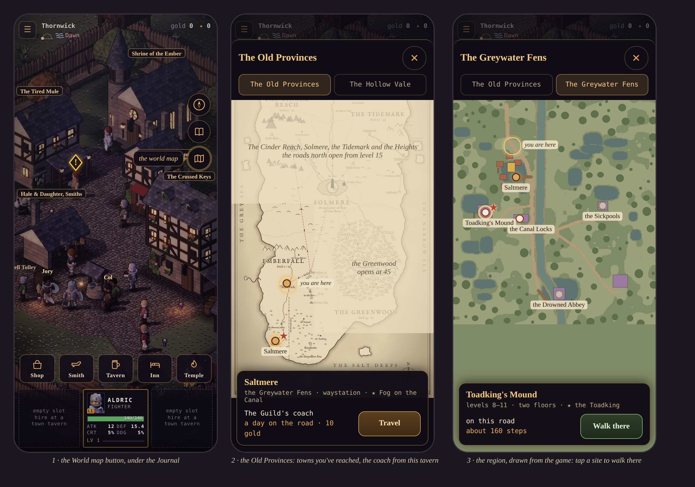

# The world map, and the Guild's coach between regions

**Proposal, 2026-10-10. Nothing built yet.** The owner asked: *"Ok now how will we implement the world map and fast
travel between regions? I'd like a world map button below the journal button."*

Mockup: [worldmap-mockup.html](./worldmap-mockup.html), rendered over the real HUD to
[img/worldmap/mockup.jpg](img/worldmap/mockup.jpg). It shows three frames, each 390 × 844 (a phone, CSS px).



It builds on:
- [world-map-proposal.md](./world-map-proposal.md): the regions, their towns and waystations, the roads;
- [town-streets-proposal.md](./town-streets-proposal.md): the minimap backgrounds (`tools/worldmap/minimap.mjs`);
- the wall map: `tools/worldmap/draw.mjs` → `img/world/old-provinces.jpg`.

## 1. The button

A round 44 px **World map** button, the fourth in the right-hand column, directly under the Journal:

| Button | `top` | Source |
|---|---|---|
| Compass | `calc(var(--hud-l1, 30px) + 122px)` | `src/ui/compass.js` |
| Journal | `+ 174px` | `src/ui/journal.js` |
| **World map** | **`+ 226px`** | `src/ui/worldmap.js` (new) |

- It uses the Journal button's style: a dark disc, a gold rim and a gold line icon (a folded map).
- `aria-label="World map"`. Like every overlay, it swallows `pointerdown`, `touchstart` and `mousedown`.
- It sits at the same right edge as the column (`--safe-r`), so the landscape safe area holds.
- It shows everywhere: in town, on the overland, and in a dungeon (where it only shows the map; see §3).

## 2. The map window

A full sheet, like the Journal's, with ✕ (44 px) and two tabs.

### Tab 1: the Old Provinces (frame 2)

The wall map (`old-provinces.jpg`, 1200 × 2400), scrolled so the land you're in sits in view.

- **Fog** covers every land that isn't open, with one line saying when it opens: *"the roads north open from
  level 15"*, *"the Greenwood opens at 45"*. The wall map's own unfinished edges read as fog already.
- **Pins:**
  - A town or waystation **you've reached** is lit. One you haven't reached is drawn but not lit.
  - "You are here" rings your current town (or your region's, when you're out on the road).
  - The **tracked quest** puts a ★ by the town whose land it leads to. The compass already knows that land
    (GDD v1.40: it leads across lands).
- **Tapping a lit pin** opens a card with:
  - the town's name and its land;
  - what it is (a town, or a waystation with tavern, inn and temple);
  - the ★ quest, if there is one;
  - the coach and its fare (§4), and **[Travel]**.
- The pin positions come from `draw.mjs`'s `PLACES`, moved into shared data (`src/data/worldmap.js`) that the tool
  and the UI both import. The map and its pins can't drift apart.

### Tab 2: the region you're in (frame 3)

The region's bare minimap (`minimap-<scene>.png`, drawn from the sim at 4 px a tile, with the origin in its
`.json`), scaled to the sheet's width.

- **Pins:** the town, every site, and the region's road exits. They come from the same rows the compass lists
  (`travel.js destinations()`), so they show only what the compass would.
  - A site you haven't entered is hollow. A site that isn't revealed yet (`siteOpen`) is greyed and says so.
  - The tracked quest's site gets the ★.
- **"Here"** is placed at `((x − x0) × 4, (y − y0) × 4)`, scaled.
- **Tapping a pin** opens a card with the levels, the floors, the boss, the steps, and **[Walk there]**. Walk there
  pushes the same `goto` (or `journey: 'delve'`) the compass pushes, then closes the map. There is no new sim
  path.
- **In town or in a dungeon**, the tab shows the region's overland with "here" on the town or the site's
  entrance. Walk there is offered only on the overland. In town it reads *"take the road out first"*.

## 3. The Guild's coach (fast travel)

The world doc already has the Guild running the roads (expeditions are "the Guild's road work", GDD §6.3). The
coach is their service: a seat on a cart that goes between the towns they keep a tavern in.

**The rules, as recommended:**

1. **Where you board:** the **tavern in a town or a waystation**, from the square. The world map's [Travel] only
   works there. Out in the field the card says *"the coach leaves from a tavern"*. Getting home from the field is
   the Homeward Scroll's job (GDD §8), and it stays worth carrying.
2. **Where it goes:** any town or waystation **you've reached on foot**, in a land that's open. The first visit is
   always a walk, so a region's road and its trouble (GDD §10, *The region's trouble*) are never skipped.
3. **The fare:** **10 gold a day of road** (the graph below). That's a token, not a cost: a level-6 party banks
   367 gold in its first 276 s in a same-level room (`roomlv.mjs 600 6 6 0,2`, seed default). The fare is there so
   the coach reads as a service you pay for, not a teleport.
4. **The time:** **instant in the sim.** A card shows *"A day on the Guild's coach…"* for about two seconds while
   the scene loads (presentation only). The clock, the weather and the time away don't move. Skipping time would
   mean a sim rule for the clock, and a day of nothing happening, for no gain.
5. **The company comes along.** The party travels as it is: wounded stays wounded, and Fallen stays Fallen. The
   temple is at the other end too.
6. **Not mid-fight, not Fallen.** The coach leaves from the square, and nobody fights there.

**The coach roads (days):**

| From | To | Days | Fare |
|---|---|---|---|
| Thornwick | Saltmere | 1 | 10 |
| Thornwick | the Lamphall | 3 | 30 |
| the Lamphall | Ashgate · Kell's Rest | 2 · +1 | 20 · 30 |
| the Lamphall | Brine Cross · Tollhaven · Gullwick | 2 · +2 · +1 | 20 · 40 · 50 |
| the Lamphall | Hollin Ford · Rookstead | 1 · +2 | 10 · 30 |
| the Lamphall | the Frozen Hospice · Frosthold | 2 · +1 | 20 · 30 |

- A trip's days are the shortest path on this graph, and the fare is 10 gold a day of that path.
- Today only the first row exists: the Vale and the Fens, Thornwick and Saltmere. Each region adds its rows with
  its milestone (M9 onward). The Lamphall is the hub because every road in the world doc runs through Solmere.

## 4. The sim

**One new command:**

```js
sim.commands.push({ type: 'coach', to: 'saltmere' });   // a town id from COACH (src/sim/coach.js)
```

`src/sim/coach.js` (new, `// @ts-check`) holds:
- `COACH`: the towns, each with its land and scene;
- `ROADS`: the graph above;
- `days(from, to)`: the shortest path, a plain BFS over the arrays (deterministic, no floats).

It validates in this order. A refused command does nothing but emit `refused` with the reason:

| Check | Refused with |
|---|---|
| `to` is a known town, and not the one you're in | (silently ignored) |
| in a town's or waystation's square (`world.kind === 'town'`, the hero in `world.hub`'s frame) | *"The coach leaves from the tavern"* |
| no battle running, and the hero isn't down or Fallen | (silently ignored) |
| `to`'s land is open (`landOpen`) | *"The road there is shut"* |
| `to` is in `state.reached` | *"You haven't been there yet"* |
| gold ≥ fare | *"The fare is N gold"* |

**When it goes:**
- take the fare from the gold;
- set the region to the destination's land;
- `travel('town', 'coach', null, land)`: an arrival named `coach`, by the tavern, in each town's spec;
- emit `coach { from, to, days, fare }`.

The UI shows the card on `coach` and waits for `levelChanged`.

**What the sim remembers:**
- `state.reached`: the towns you've stood in. It's a `Set` of town ids, added to when `travel` lands in a town.
  It's saved as an array.
- **Save v28:**
  - add `reached` to `snapshot()` / `restore()` and bump `SAVE_VERSION` to 28;
  - the migration `reachedFor(data)` gives every save `thornwick`;
  - it adds `saltmere` when the save's region is `fens`, or when any Fens site is in `sitesEntered` (you can't get
    there without passing the town's road). This errs toward a saved player keeping what they've walked.

**Fair play:** the coach only moves you and costs gold. It grants nothing, so a replay is unaffected beyond its own
command. The smoke test records one coach trip in its session and adds tamper cases:
- a coach to a town not reached;
- one with too little gold;
- one from the overland.

Each must leave the hash where it was.

## 5. The UI

| File | What |
|---|---|
| `src/ui/worldmap.js` (new) | the button, the sheet and its two tabs, the pins, the cards. Keyed Preact (no full re-renders under a finger: the cards hold a press by town id). Text only, never HTML. |
| `src/data/worldmap.js` (new) | the wall map's `PLACES`, the lands' fog rectangles and their lines. `draw.mjs` imports it. |
| `src/ui/townmenu.js` | the tavern menu gets a row, *"The Guild's coach"*, that opens the map on the Old Provinces tab |
| `src/ui/compass.js` | none: the region tab reads `destinations()` the same way |
| `assets/maps/` | `old-provinces.jpg` and the bare `minimap-*.png` + `.json`, copied from `docs/img/` by `minimap.mjs` / `draw.mjs` (a flag, `--assets`), so the game never loads from `docs/` |

The sheet has no per-frame redraw. It reads state when it opens, and on `levelChanged`, `coach` and
`questTracked`.

## 6. Tests

- `test/coach.test.mjs` (node:test):
  - every refusal above does nothing;
  - a trip takes exactly the fare and lands at the `coach` arrival;
  - `days` is symmetric and matches the table;
  - `reached` grows on arrival;
  - snapshot/restore round-trips `reached`.
- `test/save.test.mjs`: v27 → v28, both ways the Fens can be shown, and a v27 Vale-only save.
- `smoke-test.mjs`: the recorded trip and the three tamper cases.
- `tools/browser` run:
  - the World map button sits under the Journal, 44 × 44, overlapping nothing (the same check the sky dial has);
  - opening the map on the overland and tapping a site starts a walk;
  - the coach from Thornwick's tavern lands on Saltmere's square, 10 gold lighter.

## 7. Slices

1. **The button and the region tab.**
   - Ship `worldmap.js` with the region tab only (minimap, pins from `destinations()`, Walk there).
   - Add the assets flag to `minimap.mjs`.
   - No sim change.
2. **The Old Provinces tab.**
   - Move the shared `PLACES`, and add the fog and lit pins.
   - Until slice 3, every pin is read-only.
3. **The coach.**
   - `coach.js`, the command, `state.reached` and save v28.
   - The tavern row and the card.
   - Tests and smoke.
   - GDD §10 gets the coach rules; AGENTS.md gets the `--assets` flags.
4. **Each new region** adds its towns to `COACH`/`ROADS`, its minimap, and its fog lifting, with its milestone.

Slices 1 and 2 are a day's work each and change no numbers. Slice 3 is the only one that touches the sim and the
save.

## 8. Open questions for the owner

1. **Where the coach leaves from:** a tavern only (recommended), or anywhere the map is open? Anywhere would make
   the Homeward Scroll nearly pointless, and would skip the walk back out of a dungeon.
2. **The fare:** 10 gold a day (recommended, a token), free, or scaled with level so it stays a cost? Measured: a
   level-6 party makes 367 gold in under five minutes of fighting, so even 30 gold for Thornwick to the Lamphall is
   small.
3. **Time:** instant with a card (recommended), or does the day pass (the sky dial jumps a day, and the weather
   rerolls)?
4. **Unreached towns:** drawn but dim (recommended), or hidden until you reach them?
